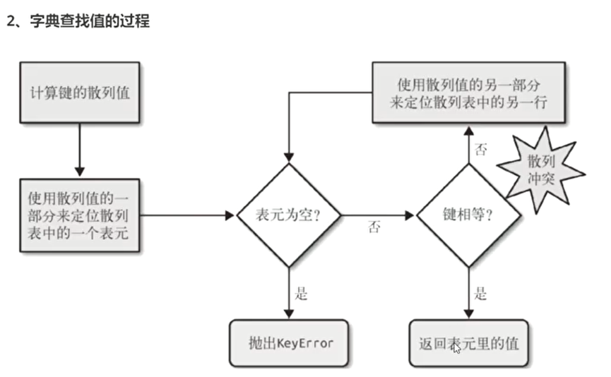
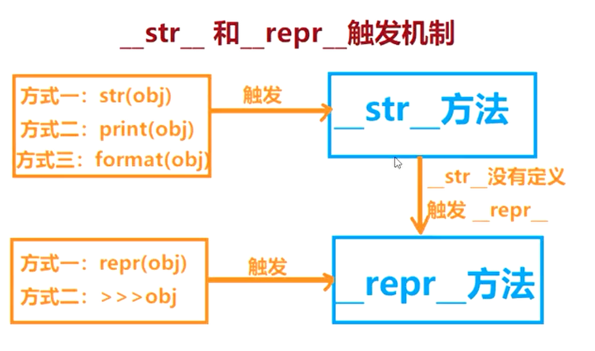
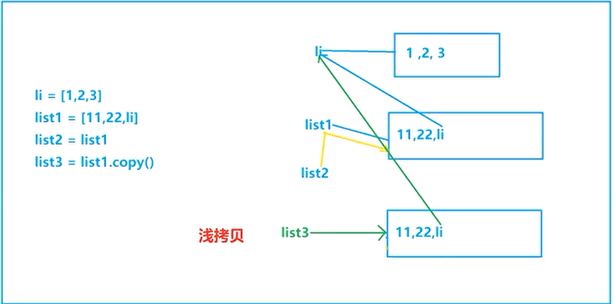
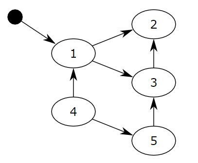

# 1.python高阶

## 1. 虚拟环境&代码规范

### 1.1. 虚拟环境
- 生成pip list: `pip freeze > xxx.txt`
- 批量安装: `pip install -r xxx.txt`
#### 1.1.1. virtualenv安装

1.`pip install virtualenv`

2.安装虚拟环境安装包 `pip install virtualenvwrapper-win`

3.创建一个存放虚拟环境文件的目录

4.配置文件目录环境变量\(WORKON\_HOME\)

#### 1.1.2. Virtualenv使用

`workon`列出所有的虚拟环境

`workon [name]`进入指定的虚拟环境

`deactivate`退出当前的虚拟环境

`mkvirtualenv [name]`创建虚拟环境

`rmvirtualenv [name]`删除虚拟环境

#### 1.1.3. Pipenv在虚拟环境中安装模块或者包\(也要配置WORKON\_HOME环境变量\)

1. `pipenv install` 包名\(注意点在当前项目路径下执行以上命令\)通过-dev指明只安装在开发环境中\(开发环境是你当前开发的环境，生产环境是上线部署的实际环境\)

2. `pipenv install--dev requests`安装包记录是在\[dev-packages\]部分

3. 在安装时，指定`--dev`参数，则只安装`[dev-packages]`下的包;若安装时不定指定--dev参数，只会安装`[packages]`包下面的模块。

4. 卸载虚拟环境的模块包 `pipenv uninstall 包名`\(会删除相关依赖\)

5. 查看安装包及依赖关系 `pipenv graph`

6. 生成requirements.txt文件`pipenv lock -r --dev > requirements.txt`

7. 通过requirements.txt恢复环境`pipenv install -r requirements.txt`

#### 1.1.4. Pipenv其他使用

`pipenv install` 若文件夹内无pipfile&pipfile.lock则创建，若有则恢复

`pipenv --rm`删除虚拟环境

`pipenv --where`列出本地工程路径

`pipenv --venv`列出虚拟环境路径

`pipenv --py`列出虚拟环境的Python可执行文件

`pipenv graph`查看包依赖

`pipenv lock`生成lock文件

`pipenv --rm`删除虚拟环境

`pipenv –shell`进入虚拟环境

`exit`退出虚拟环境

#### 1.1.5 `python -m venv 虚拟环境名` \(推荐\)

1. 在linux系统中需要安装`apt-get install python3.x-venv` 如果存在多个版本的python需要指定具体版本
2. 创建虚拟环境 `python -m venv xxxx`
3. 进入虚拟环境: `. ./虚拟环境path/bin/activate`
4. 退出虚拟环境: `deactivate`


### 1.2. 代码规范

#### 1.2.1. python代码规范

- pep8(python代码样式规范)
    - 文档地址(中文)：https://blog.csdn.net/ratsniper/article/details/789548522
- pep257(Python文档字符串相关的约定)
    - 文档地址：https://github.com/qiuxiang/pep/blob/master/peps/257.md
- pep20(python的禅宗)
    - 文档地址：https://www.python.org/dev/peps/pep-0020/


#### 1.2.2. 规范举例

1. 行缩进：tab键\(4个空格\)
   * 1. 隐式行连接缩进：
        * i. 对齐
        * ii. 层级缩进
        * iii. \
2. 单行字符限制：
   * 1. 所有行限制的最大字符数为79。
   * 1. 没有结构化限制的大块文本\(文档字符或者注释\)，每行的最大字符数限制在72。
3. 空行：
   * 1. 顶级函数和类的定义之间有两行空行。
   * 1. 内部的函数定义之间有一行空行
4. 源文件编码方式：
   * 1. Python核心发布中的代码应该始终使用UTF-8\(python2中默认是ASCII编码\)
   * 1. Python3中不应有编码声明。

## 2. 数据类型

### 2.1. 元组和列表

#### 2.1.1 运行时间

```python
import timeit


def func():  # 可调用对象
    for i in range(10):
        i += 1


aaaa = '("1", "2", "3")'  # 字符串
res = timeit.Timer(aaaa).timeit(100)  # 字符串或者是可调用对象
print(res)
res = timeit.timeit(func)
print(res)
```

#### 2.1.2. 命名元组

namedtuple是tuple的子类,继承tuple的相关属性,具备tuple的不变性

`collections.namedtuple(typename, field_names, verbose=False, rename=False)`

* typename：元组名称
* field\_names: 元组中元素的名称

```python
from collections import namedtuple

# 创建命名元组对象User
User = namedtuple("User", ["gender", "age"])
print(type(User))  # <class 'type'>
# 实例化User对象为user
user = User("male", "22")
print(user)  # User(gender='male', age='22')
print(type(user))  # <class '__main__.User'>
print(user.gender)  # male
print(user.age)  # 22
print(user[0])  # 支持使用索引
print(len(user))  # 可查询长度
print(isinstance(user, tuple))
print(isinstance(user, User))
```

#### 2.1.3. 集合

集合最大的作用是用来去重

```python
se = set()  # <class 'set'>
se1 = {1, 2, 3, 1, 2, 3, 4}  # {1, 2, 3, 4}
se1.add(5)  # 集合中加入单个元素
se1.update((4, 5, 6))  # 批量加入可迭代对象(元组、列表等)
se1.remove(3)  # 移除指定元素
se1.add((3, 4))
se2 = se1.copy()
se1.remove((3, 4))
se2.clear()  # 清除所有元素
print(se2)  # set()
print(se1)  # {1, 2, 4, 5, 6}
# 2. 集合最大的作用是用来去重 例如：
lis = [1, 2, 3, 4, 1, 2, 3]
lis = list(set(lis))  # [1, 2, 3, 4]
```

### 2.2. 字典＆集合的原理&应用

#### 2.2.1. 散列类型的存储过程

- 字典的原理\(hash map\)：
    - 创建两个列表，一个列表存key 一个存value，对字典的key进行hash,通过运算后得到的数值为该key和value的列表下标

- 集合的原理\(hash set\):
    - 创建一个列表，对元素进行hash，通过运算后得到的数值为元素在列表的下标

#### 2.2.2. 字典查找值的过程：

  

  数值类型 1.数值 2.序列：字符串、列表、元组\(有序的\) 3.散列：字典、集合\(无序，3.7版本字典可按添加顺序\)

#### 2.2.3. 判断是否是可变类型方法

1. 可变类型，不可进行HASH 
2. 不可变类型，可以进行HASH
3. 可变类型，不可以存入集合 `se = set().add([1, 2])`
4. 不可变类型，可以存入集合

#### 2.2.4. 性能分析：

* 从时间上比较：集合&lt;字典&lt;元组&lt;列表
* 从空间上比较：字典&gt;集合&gt;列表&gt;元组

### 2.3. 推导式

#### 2.3.1. 列表推导式

```python
li2 = [i for i in range(10)]
print(li2)  # [0, 1, 2, 3, 4, 5, 6, 7, 8, 9]
```

#### 2.3.2. 字典&集合推导式

```python
dic2 = {i: i**i for i in range(10)}
print(dic2)  # {0: 1, 1: 1, 2: 4, 3: 27, 4: 256, 5: 3125, 6: 46656, 7: 823543, 8: 16777216, 9: 387420489}

set1 = {i for i in range(10)}
print(s)  # {0, 1, 2, 3, 4, 5, 6, 7, 8, 9}
print(type(s))  # <class 'set'>
```

#### 2.3.3. 生成器表达式

```python
generator = (i for i in range(10))
print(generator)  # <generator object <genexpr> at 0x00000227C589D9A8> 省空间
```

```python
import timeit
import sys


def func3():
    return ({(1, j): (i, j) for j in range(1, 1000000 )} for i in range(2, 1000000 ))


print(timeit.timeit(func3))  # default运行：1000000 耗时：0.7313135000000001
print(sys.getsizeof(func3))  # 136


def func2():
    for i in range(2, 1000000 ):
        dic3 = {}
        for j in range(1, 1000000 ):
            dic3[(1, j)] = (i, j)
        yield dic3


print(timeit.timeit(func2))  # default运行：1000000 耗时：0.18357479999999993
print(sys.getsizeof(func2))  # 136


def func1():
    li = []
    for i in range(2, 1000):
        dic3 = {}
        for j in range(1, 1000):
            dic3[(1, j)] = (i, j)
        li.append(dic3)
    return li


print(timeit.timeit(func1, number=100))  # 22.8726639
print(sys.getsizeof(func1))  # 136
# 3. 生成器表达式耗费的时间大于通过for循环+yield的方法。
# 4. 通过列表的方法储存过大的数据会造成 memory过大，
# 5. 而且耗时非常大，仅运行100次便远远大于生成器运行1000000的时间
```

## 3. 迭代器和生成器

### 3.1 生成器

第一次不能使用`send`

```python
def func():
    for i in range(10):
        send = yield i  
        print(send)  # xixi   none   haha   none


a = func()
# a.send("")  不允许在初次使用send  报 TypeError
print(next(a))         # timer: 0   step: 1. 到yield i     2. return i
print(a.send("xixi"))  # timer: 1   step: 1. send="xixi"   2. print  3. 再遍历到到yield i  4. return i
print(next(a))         # timer: 2   step: 1. send=None     2. print  3. 再遍历到到yield i  4. return i
print(a.send("haha"))  # timer: 3   step: 1. send="haha"   2. print  3. 再遍历到到yield i  4. return i
print(next(a))         # timer: 4   step: 1. send=None     2. print  3. 再遍历到到yield i  4. return i
```

#### 3.1.1. 用处

生成器并不会一下子把所有的数据全部生成出来，生成器中保存的只是一个生成数据的相关算法，并不会把所有的数据都生成出来，只是在我们需要数据的时候，用生成器去生成一条数据就可以了，这样的话就为什么节约了大量的内存空间。

### 3.2. 迭代器

```python
li = [1, 2, 3, 4]  # 能用for循环遍历的为可迭代对象
li = iter(li)  # 将可迭代对象转为迭代器  __iter__ 方法
print(li)  # 迭代器对象，<list_iterator object at 0x000001D625598F60>
print(next(li))  # __next__ 方法
```

#### 3.2.1. 迭代协议

1. 迭代协议
   1. 迭代协议：一种是包含iter方法的，另一种是包含getitem方法的\(比如str对象就没有iter方法，但是一样能够迭代\)，只要对象中包含了这两种方法的任意一种，那么这个对象就可以进行迭代操作，也就是实现了迭代协议。
   2. 迭代器协议：
      * 实现了迭代器协议的对象\(实现方式：对象内部定义了一个iter\(\)方法\)
      * 对象实现了next方法
      * next方法返回了某个数值\(当然一般情况下，我们需要的是返回这个对象的特定的数字，并且按照一定的顺序进行依次返回\)
      * next方法需要在值取完的时候，抛出stopIteration的错误信息。
   3. 可迭代对象：只要内部实现了迭代协议的就是一个可迭代对象\(可迭代对象可以进行相关的迭代操作，比如for循环，map函数等等\)

### 3.3. 生成器和迭代器的区别：

* 生成器属于迭代器的一种，如何区分迭代器和生成器？
  * 1、生成器相比迭代器多了三种方法：send\(\)，close\(\)，throw\(\)

    * `send()`方法，发送数据
    * `close`方法：关闭生成器
    * `throw`方法：`generator.throw(Exception，"Method throw called！")` 主动引发错误

    生成器&lt;迭代器&lt;可迭代对象\(可以理解为从左到右的继承关系\)

```python
# 生成器
generator = (i for i in range(10))
# 迭代器
li = [1, 2, 3, 4, 5]
iterator = iter(li)
# 可迭代对象, 能用for循环遍历的为可迭代对象
lis = [x for x in range(10)]
```

## 4. 函数进阶

### 4.1. 递归函数

```text
递归函数：在函数中调用函数自身，我们把这样的函数叫做递归函数
递归边界：退出递归的终止条件
使用注意点：递归函数一定要编写终止条件，否则将产生无限递归(死循环)
递归在5200+时会栈溢出
```

```python
import sys


sys.setrecursionlimit(3000)  # default 递归计算层数为1000，修改为3000
```

```python
def func1(n):  # 乘阶
    if n == 1:  # 递归临界点
        return 1
    else:
        return n * func1(n-1)  # 函数中调用自身

print(func1(10))  # 10*9*8*7*6*5*4*3*2*1 = 3628800
```

**习题**

_一：实现斐波那契数列数列，输入一个数列的位置数，返回斐波那契数列相应位置的值斐波那契数列\[1，1，2，3，5，8，13，21，34....\]，第一个数是1，后面的数等于前两个数相加的结果_

```python

```

_二、有一对兔子，第三个月其每个月都生一对兔子，小兔子长到第三个月后每个月又生一对兔子\(意味着生长期为2个月\)，假如兔子都不死，问每个月的兔子总数为多少？_

```python

```

_三、小明有100元钱打算买100本书，A类书籍5元一本，B类书籍3元一本，C类书籍1元两本，请用程序算出小明一共够多少种买法？\(面试笔试题\)_

```python

```

### 4.2. 纯函数

#### 4.2.1. 纯函数的概念

简单来说，一个函数的返回结果只依赖于它的参数，并且在执行过程里面没有副作用，我们就把这个函数叫做纯函数。

#### 4.2.2. 纯函数的3个原则

1. 变量都只在函数作用域内获取，或者作为函数的参数传入
2. 不会产生副作用\(side effects\)，不会改变被传入的数据或者其他数据\(全局变量\)
3. 相同的输入保证相同的输出

   ```python
   def func(x):
    return x * x
   ```

#### 4.2.3. 函数的副作用

副作用是指函数被调用，完成了函数既定的计算任务，但同时因为访问了外部数据，尤其是因为对外部数据进行了写操作，从而一定程度地改变了系统环境

### 4.3. 匿名函数

#### 4.3.1. 内置函数

`filter(object, iterable)` 过滤器

```python
def func(n):
    return n < 10


def func1(n):
    return True


def func2(n):
    return False


li = [1, 3, 5, 44, 20, 3, 7]
# 当return结果为true时，才会保存列表值
print(filter(func, li))  # <filter object at 0x000002E311EE4160>  
print(list(filter(func, li)))  # [1, 3, 5, 3, 7]
print(list(filter(func1, li)))  # [1, 3, 5, 44, 20, 3, 7]
print(list(filter(func2, li)))  # []
```

`map()`

```python
def func(n):
    return n < 10


li = [1, 3, 5, 44, 20, 3, 7]
# 将迭代对象的数据一个个传入函数中
print(map(func, li))  # <map object at 0x000002E311EE40B8>  
print(list(map(func, li)))  # [True, True, True, False, False, True, True]
```

**zip\(\)**

```python
li = [1, 3, 5, 44, 20, 3, 7]  # index = 7

tup2 = (1, 3, 5, 7, 412, 452, 745)  # index = 7

tup3 = (14, 512, 51252, 5734, 2134)  # index = 5
# 将N组可迭代对象进行组合，生成索引等同迭代对象中最小索引
print(zip(li, tup2, tup3))  # <zip object at 0x0000025E3C9A0FC8>  
print(list(zip(li, tup2, tup3)))  # [(1, 1, 14), (3, 3, 512), (5, 5, 51252), (44, 7, 5734), (20, 412, 2134)]


a = zip(range(10), range(10), range(3), range(5))  # 具备迭代能力
print(list(a))
# [(0, 0, 0, 0), (1, 1, 1, 1), (2, 2, 2, 2)]
```

**三元表达式**

```python
a = 100
if a > 100:
    print("hahah")
else:
    print("=====")


print("hahah") if a > 100 else print("=====")
# 左边为true时操作，右边为false时操作
```

#### 4.3.2. 匿名函数&内置函数

```python
li = [1, 3, 5, 44, 20, 3, 7]

tup2 = (1, 3, 5, 7, 412, 452, 745)

tup3 = (14, 512, 51252, 5734, 2134)

print((lambda n: n < 5)(3))  # True
res = lambda n: n < 5
print(res(3))  # True

print(list(filter(lambda n: n < 5, li)))  # [1, 3, 3]
print(list(map(lambda i, j: i+j > 5, li, tup3)))  # [True, True, True, True, True]
```

#### 4.3.3. 匿名函数&推导式

```python
res1 = [(lambda n: n + 1)(i) for i in range(10)]
print(res1)  # [1, 2, 3, 4, 5, 6, 7, 8, 9, 10]
res2 = (lambda n: n + 1)
print(res2(50))  # 51
```

### 4.4. 偏函数

_偏函数是将所要承载的函数作为partial\(\)函数的第一个参数，原函数的各个参数依次作为partial\(\)函数后续的参数，除非使用关键字参数_

```python
from functools import partial


def func(n, x):
    return n + x


fun = partial(func, 30)  # 将func函数的第一个参数固定为30
print(fun(20))  # 50
print(fun(10))  # 相当于func(30, 10)  --> 40
print(func(30, 10))  # 40
fun = partial(lambda n, x: n + x, 10)  # 将匿名函数首个参数固定为10
print(fun(5))  # 15
print(fun(3))  # 相当于 (lambda n, x: n + x)(10, 3)  13
print((lambda n, x: n + x)(10, 3))  # 13
```

### 4.5. 闭包

* 条件一：函数中嵌套函数
* 条件二：外层的函数返回内存嵌套函数名
* 条件三：内层嵌套函数有引用外层的一个非全局变量

```python
def func(num):  # num为内层嵌套函数引用外层的一个非全局变量
    def a():  # 函数中嵌套函数
        print(num)
    return a  # 外层的函数返回内存嵌套函数名

b = func(30)  # 实现数据锁定，提高稳定性
print(b)  # <function func.<locals>.a at 0x0000029D16B67F28>
b()  # 30
print(b.__closure__)  # (<cell at 0x00000153685407C8: int object at 0x00007FFFDB79D7C0>,) 元组,存着之前传入的30(非全局变量)
```

### 4.6. 装饰器

* 开放封闭原则\(面向对象原则的核心\)
  * 开放封闭原则：软件实体应该是可扩展，而不可修改的。也就是说，对扩展是开放的，而对修改是封闭的。
* 装饰器的作用：在不更改原功能函数内部代码，并且不改变调用方法的情况下为原函数添加新的功能。
* 装饰器的应用场景：
* 登录验证
* 函数运行时间统计
* 执行函数之前做准备工作
* 执行函数后清理功能

#### 4.6.1. 实现一个装饰器

```python
def login(func):
    u = "asdf"
    p = "1234"

    def check():
        if u == input("账号") and p == input("密码"):
            func()
        else:
            print("error")

    return check


@login  # index = login(index)
def index():
    print("进入系统")


index()  # # index() = login(index)()
```

**注意：使用装饰器时应该使用wraps，否则装饰后的函数名将为装饰器的名字**

```python
from functools import wraps


def decorator1(func):
    # @wraps(func)
    def decorate1(*args, **kwargs):
        print("我是装饰器前")
        res = func(*args, **kwargs)
        print("我是装饰器后")
        return res

    return decorate1


def decorator2(func):
    @wraps(func)  # @functools.wraps(func)的作用就是保留原有函数的名称和docstring
    def decorate1(*args, **kwargs):
        print("我是装饰器前")
        res = func(*args, **kwargs)
        print("我是装饰器后")
        return res

    return decorate1


@decorator1
def a():
    pass


@decorator1
def b():
    pass


@decorator2
def c():
    pass


@decorator2
def d():
    pass


print(a.__name__)  # decorate1
print(b.__name__)  # decorate1
print(c.__name__)  # c
print(d.__name__)  # d
```

#### 4.6.2. 有参数的装饰器

```python
def update(func):
    user = "asdf"
    pw = "1234"

    def check(u, p):
        if user == u or pw == p:
            print("user or password repeat")
        else:
            func(u, p)
    return check

@update
def index(u, p):
    print("update account {}".format(u))
    print("update password {}".format(p))

index("asdf", "123")
```

#### 4.6.3. 通用装饰器

```python
def upgrade(func):
    def tips(*args, **kwargs):
        func(*args, **kwargs)
    return tips

@upgrade
def index():
    print("进入系统")

@upgrade
def update(u, p):
    print("update account {}".format(u))
    print("update password {}".format(p))

index()
update("asdf", "1234")
```

#### 4.6.4. 装饰器装饰类

```python
def upgrade(func):
    def tips(*args, **kwargs):
        print("这是类装饰器")
        return func(*args, **kwargs)  # 函数装饰器为运行函数，类装饰为实例化类并返出实例化对象

    return tips


@upgrade
class ThisIsClass:

    def __init__(self, a, b):
        self.a = a
        self.b = b

    def func(self, msg):
        print(self.a)
        print(self.b)
        print(msg)


cla = ThisIsClass("hahah", "======")
print(cla)  # <__main__.ThisIsClass object at 0x0000028C224F8F60>
cla.func("这是类里面的功能")
```

#### 4.6.5. 多重装饰器

**从下到上装饰, 从上到下执行\(包围\)**

```python
def decorator_01(func):
    def inner_01():
        print('This is inner_01')
        func()
        print('This is inner_01')

    return inner_01


def decorator_02(func):
    def inner_02():
        print('This is inner_02')
        func()
        print('This is inner_02')

    return inner_02

# 从下到上装饰, 从上到下执行(包围)
@decorator_02  # decorator_02(func) -->  decorator_02(decorator_01(func))  
@decorator_01  # func = decorator_01(func)
def func():
    print('This is func')


func()
"""
This is inner_02
This is inner_01
This is func
This is inner_01
This is inner_02
"""
```

#### 4.6.6. 类装饰器

利用`__call__`方法,使类对象可以调用`class()`

```python
class Test:
    def __init__(self, func):
        self.func = func

    def __call__(self, *args, **kwargs):
        print("装饰器1")
        self.func(*args, **kwargs)
        print("装饰器2")

@Test  # func1 = Test(func1)  此时是个类对象
def func1(s):
    print(f"被装饰{s}")


func1("参数")  # 相当于 Test(func1)("参数")
```

#### 4.6.7. 内置装饰器

```python
class MyTest:

    def __init__(self, a=5):
        self.a = a

    @classmethod  # 类方法  实例和类都可以调用
    def add(cls):  # cls: 类本身
        print("类方法")

    def sub(self):
        print("实例方法")

    @staticmethod  # 静态方法  实例和类都可以调用
    def pre():
        print("静态方法")

    @property  # 只读实例属性
    def vars(self):
        print("类属性")
        return "haha"

    @property
    def a4(self):
        pass

    @a4.getter  # 设置了这个的话,访问a4 则访问这个方法
    def a4(self):
        print("getter")
        return self.a

    @a4.setter  # 读取a4
    def a4(self, num):
        print("setter")
        self.a = num

    @a4.deleter  # 删除a4
    def a4(self):
        print("delete")
        del self.a


MyTest.add()
MyTest.pre()
MyTest().add()
MyTest().pre()
MyTest().vars

m = MyTest()
m.a4  # 5
m.a4 = 6
m.a4  # 6 
del m.a4
```

#### 4.6.8. 作业

**1.闭包的三个条件**

```python
1. 函数内部内嵌有另一个函数
2. 函数外部返回内部函数名
3. 内嵌函数引用外部函数的变量
```

**2.定义一个装饰器用于函数运行计时器**

```python
import time
def func1(func):
    def func2(*args, **kwargs):
        start_time = time.time()
        func(*args, **kwargs)
        print("用时:{:.5f}".format(time.time() - start_time))
    return func2

@func1
def func3(ha):
    print(ha)

func3("djasasasldkadsklkals")
```

**3.编写装饰器,为多个函数加上认证功能,读取文件中的信息**

```python
import json


"""{"user": "haha","password": "1234","token": false}"""
with open("./data.json", mode="r+") as f:
    data = json.load(f)


print(data)
def status(func):
    def check(*args, **kwargs):
        if not data["token"]:
            u = input("username")
            p = input("password")
            if data.get("user") == u and data.get("password") == p:
                data["token"] = True
                func(*args, **kwargs)
            else:
                print("username or password is error!")
        else:
            func(*args, **kwargs)

    return check


@status
def index():
    print("进入系统")


@status
def login():
    print("进入登录")


@status
def update():
    print("进入修改")


index()
login()
update()
```

## 5. 面向对象

### 5.1. 魔术方法\(魔术方法,特殊方法\)

#### 5.1.1 `__new__`方法

```python
class MyTest:

    def __new__(cls, *args, **kwargs):
        print("这个是new方法")
        return super().__new__(cls)  # 如果不return父类的__new__ 将无法实例化

    def __init__(self):
        print("这个是构造方法")

 
print(MyTest())
```

#### 5.1.2. 单例模式\(`__new__`, 装饰器, 模块调用, 元类等\)

```python
class MyTest:
    instance = None

    def __new__(cls, *args, **kwargs):
        print("------这是个单例模式类-----")
        if not cls.instance:
            print("首次实例化类")
            cls.instance = super().__new__(cls, *args, **kwargs)  # 将首次实例化的对象存为类属性
            return cls.instance
        else:
            print("返回首次实例化类")
            return cls.instance

    def __init__(self):
        print("这个是构造方法")


a = MyTest()  # 首次实例化类
b = MyTest()  # 返回首次实例化类
print(id(a))  # id(a) == id(b)
print(id(b))  # 该方式依旧会调用init构造函数
```

#### 5.1.3. `__str__`方法和`__repr__`方法



```python
class MyTest:
    instance = None

    def __new__(cls, *args, **kwargs):
        if not cls.instance:
            print("实例化对象")
            cls.instance = super().__new__(cls, *args, **kwargs)
            return cls.instance
        else:
            print("返回首个对象")
            return cls.instance

    def __init__(self):
        print("这里是构造函数")

    def __call__(self, *args, **kwargs):
        print("-----call-----")

    def __str__(self):
        return "这是个__str__魔法方法"

    def __repr__(self):
        return "这是个__repr__魔法方法"


MyTest()
MyTest()
print(id(MyTest()))
print(id(MyTest()))

print(str(MyTest()))  # 这是个__str__魔法方法
b = "{}".format(MyTest())
print(b)  # 这是个__str__魔法方法
print(MyTest())  # 这是个__str__魔法方法

print(repr(MyTest()))  # 这是个__repr__魔法方法
```

#### 5.1.4. `__call__`方法

```python
class MyTest:

    def __init__(self):
        print("这里是构造函数")

    def __call__(self, *args, **kwargs):
        print("-----call-----")

my =  MyTest()
my()  # __call__函数在实例化对象像函数一样调用时触发
```

#### 5.1.5. 上下文管理器

上下文管理器的概念：上下文管理器是一个Python对象，为操作提供了额外的上下文信息。这种额外的信息，在使用with语句初始化上下文，以及完成with块中的所有代码时，采用可调用的形式。

```python
class MyOpen:

    def __init__(self, file, mode, encoding="utf8"):
        self.file = file
        self.mode = mode
        self.encoding = encoding

    def __enter__(self):
        print("上下文管理器")
        self.f = open(self.file, self.mode, encoding=self.encoding)
        return self.f

    def __exit__(self, exc_type, exc_val, exc_tb):
        print("使用完毕，关闭上下文")
        print(exc_type)  # 若出现错误，就会有错误类型  # <class 'AttributeError'>
        print(exc_val)  # 若出现错误，就会有错误值  # '_io.TextIOWrapper' object has no attribute 'name5'
        print(exc_tb)   # 若出现错误，就会有错误地址  # <traceback object at 0x000001D2801B0B48>
        self.f.close()


with MyOpen("./data.json", "r") as f:
    print(f.read())  # {"user": "haha"}
    f.name5
```

_小知识_

* `r`:以只读方式打开文件。文件的指针将会放在文件的开头。这是**默认模式**。
* `rb`: 以二进制格式打开一个文件用于只读。文件指针将会放在文件的开头。这是默认模式。
* `r+`: 打开一个文件用于读写。文件指针将会放在文件的开头。
* `rb+`:以二进制格式打开一个文件用于读写。文件指针将会放在文件的开头。
* `w`:    打开一个文件只用于写入。如果该文件已存在则将其覆盖。如果该文件不存在，创建新文件。
* `wb`:    以二进制格式打开一个文件只用于写入。如果该文件已存在则将其覆盖。如果该文件不存在，创建新文件。
* `w+`:    打开一个文件用于读写。如果该文件已存在则将其覆盖。如果该文件不存在，创建新文件。
* `wb+`:以二进制格式打开一个文件用于读写。如果该文件已存在则将其覆盖。如果该文件不存在，创建新文件。
* `a`:    打开一个文件用于追加。如果该文件已存在，文件指针将会放在文件的结尾。也就是说，新的内容将会被写入到已有内容之后。如果该文件不存在，创建新文件进行写入。
* `ab`:    以二进制格式打开一个文件用于追加。如果该文件已存在，文件指针将会放在文件的结尾。也就是说，新的内容将会被写入到已有内容之后。如果该文件不存在，创建新文件进行写入。
* `a+`:    打开一个文件用于读写。如果该文件已存在，文件指针将会放在文件的结尾。文件打开时会是追加模式。如果该文件不存在，创建新文件用于读写。
* `ab+`:以二进制格式打开一个文件用于追加。如果该文件已存在，文件指针将会放在文件的结尾。如果该文件不存在，创建新文件用于读写。

#### 5.1.6. 算术运算的实现

```python
class MyTest:

    def __init__(self, data):
        self.data = data

    def __add__(self, other):
        return self.data + other.data

    def __sub__(self, other):
        return self.data.replace(other.data, "")


a = MyTest("haha1234")
b = MyTest("asd123456")

print(a+b)
c = MyTest(a+b)
print(c-a)
```

#### 5.1.7. 习题

**第一题：通过装饰器实现单例模式，只要任意一个类使用该装饰器装饰，那么就会变成一个单例模式的类。**

```python
def decorator(cls):
    instance = {}

    def func(*args, **kwargs):
        if cls in instance:  # 判断cls这个key是否在字典里面
            print("1111111")
            return instance.get(cls)
        else:
            instance[cls] = cls(*args, **kwargs)
            print("22222222")
            return instance[cls]
    return func


@decorator
class Test:

    def __init__(self):  # 该方式有个问题,不支持同一个类有不同初始化参数
        pass


a = Test()
b = Test()
print(a is b)  # True
```

**第二题：通过类实现一个通用的装饰器，既可以装饰函数也可以装饰器类，既可以装饰器有参数的，又可以装饰器无参数的**

```python
class Test:

    def __init__(self, func):
        self.func = func

    def __call__(self, *args, **kwargs):
        print("这是个装饰器开始1")
        self.func(*args, **kwargs)
        print("这是个装饰器结束2")


@Test
def fun(n):
    print("我是func")
    print(n)


@Test
class MyTest:

    def __init__(self, name):
        self.name = name
        print(self.name)


fun("sadasdsa")
MyTest("我是class")
```

**第三题：请描述`__new__`、`__str__`、`__repr__`、`__call__`分别在什么情况下会被触发！**

```text
__new__:会在实例化对象时在__init__之前调用
__str__:str()、print()、format()方法时调用,一般该方法面向程序员,若子类未定义,则找父类__str__
__repr__:repr()方法,一般该方法面向用户.如果类中未定义__repr__则找父类定义的__str__
__call__:将实例化对象调用时触发, 等同class()()
```

**第四题：用上下文管理器实现数据库连接**

```python
import pymysql


class ConnectSQL:

    def __init__(self, host, user, pw, port=3306):
        self.host = host
        self.user = user
        self.pw = pw
        self.port = port


    def __enter__(self):
        self.con = pymysql.connect(host=self.host, user=self.user, password=self.pw, port=self.port)
        self.cur = self.con.cursor()
        return self.cur

    def __exit__(self, exc_type, exc_val, exc_tb):
        print("使用完毕，关闭上下文")
        print(exc_type)  # 若出现错误，就会有错误类型  # <class 'AttributeError'>
        print(exc_val)  # 若出现错误，就会有错误值  # '_io.TextIOWrapper' object has no attribute 'name5'
        print(exc_tb)   # 若出现错误，就会有错误地址  # <traceback object at 0x000001D2801B0B48>
        self.cur.close()
        self.con.close()


with ConnectSQL(host="", user="", pw="") as f:
    f.execute("SELECT * FROM `india_appbackend_test`.`v_codes` ORDER BY id desc LIMIT 3;")
print(f.fetchall())
```

**第五题：通过装起实现单例模式，任意一个类被改装饰器装饰都会变成单例模式**

```python
def modes(funcs):
    f = {}

    def mode(*args, **kwargs):
        if funcs in f:
            return f[funcs]
        else:
            f[funcs] = funcs(*args, **kwargs)
            return f[funcs]

    return mode


@modes
class MyTask_1:

    def __init__(self):
        print("这是个构造函数")
```

### 5.2. 多态

#### 5.2.1. 面向对象三大特征

1. 封装
2. 继承
3. 多态:指的是一类事物有多种形态，一个抽象类有多个子类，不同的子类对象调用相同的方法，产生不同的执行结果

#### 5.2.2. 多态

* 多态的意义：开放封闭原则
  * 对于一个变量，我们只需要知道它是Base类型，无需确切地知道它的子类型，就可以放心地调用run\(\)方法，\(调用方只管调用，不管细节\)
  * 当需要新增功能，只需要新增一个Base的子类实现run\(\)方法，就可以在原来的基础上进行功能扩展，这就是著名的“开放封闭“原则：
    * 对扩展开放：允许新增Base子类；
    * 对修改封闭：不需要修改依赖Base类型的run\(\)等函数

#### 5.2.3. 菱形继承

新式类采用C3算法,广度优先查找

```python
class A:

    def __init__(self):
        print("这里是A")


class B(A):
    def __init__(self):
        print("这里是B")
        super().__init__()


class C(A):
    def __init__(self):
        print("这里是C")
        super().__init__()


class D(B, C):
    def __init__(self):
        print("这里是D")
        super().__init__()


d = D()  #  D B C A
print(D.mro())  # [<class '__main__.D'>, <class '__main__.B'>, <class '__main__.C'>, <class '__main__.A'>, <class 'object'>]
```

#### 5.2.4. 鸭子类型

鸭子类型概念：

* 它并不要求严格的继承体系，关注的不是对象的类型本身，而是它是如何使用的，一个对象只要“看起来像鸭子，走起路来像鸭子”，那它就可以被看做是鸭子。

鸭子类型的体现：

* 静态语言：对于静态语言\(iava，C\#\)来讲上面传入的对象必须是Base类型或者它的子类，否则，将无法调用run\(\)方法。

    动态语言：对于动态语言python来讲，上面传入的并不一定要是Base类型，也可以是其他类型，只要再内部实现一个run\(\)方法就行了，这就是鸭子类型的体现。

### 5.3. 数据和自省

#### 5.3.0 反射

1. `getattr(object, name, default)` 获取object中的属性和函数, 运行时先运行default\(若有\)
2. `setattr(object, name)`

#### 5.3.1. 私有属性

类属性分为两种：公有属性和私有属性

* 私有属性定义：
  * 单下划线：`_attr` 都可以访问 都可以继承
  * 双下划线：`__attr` 对外不能直接访问，对外改了名字:`_class__attr` 可以继承

```python
class My:
    a = 300
    _b = 500
    __c = 700

    def __init__(self):
        print(self.a)  # 300
        print(self._b)  # 500
        print(self.__c)  # 700


w = My()
print(w.a)  # 300
print(w._b)  # 500  可以被实例对象访问
# print(w.__c)  AttributeError: 'My' object has no attribute '__c'  对外无法访问
print(My.a)  # 300
print(My._b)  # 500  可以被类直接访问
# print(My.__c)  AttributeError: type object 'My' has no attribute '__c'  对外无法访问
print(My.__dict__)  # {'_My__c': 700}  从该方法中可得__c 对外被改名为 _My__c
print(w._My__c)  # 实例对象可以访问_My__c
print(My._My__c)  # 类可以访问_My__c


class Boy(My):

    def __init__(self, name):
        print(self.a, self._b)
        # print(self.__c)  # AttributeError: 'boy' object has no attribute '_boy__c'
        print(self._My__c)
        self.name = name
        print(self.name)


b = Boy("cainiao")
print(b.a)
print(b._b)
# print(b.__c)  # AttributeError: 'boy' object has no attribute '__c'
print(Boy.a)
print(Boy._b)
# print(boy.__c)  # AttributeError: type object 'boy' has no attribute '__c'

print(b._My__c)  # 实例对象可以访问_My__c
print(Boy._My__c)  # 类可以访问_My__c
```

#### 5.3.2. `__dict__`

* 储存
  * 类返回类属性和方法
  * 实例对象返回与实例相关得属性和方法
  * 子类相较父类少存很多属性，需要用时访问父类，省内存，优化性能

```python
class A:
    _a = 30
    __b = 40
    e = 50

    def __init__(self):
        self.c = 20
        print(self._a)  # 30
        print(self.__b)  # 40
        print(self.e)  # 50


class B(A):
    g = 99

    def __init__(self):
        super().__init__()
        self.d = 40
        print(self._a)  # 30
        # print(self.__b)  # AttributeError: 'B' object has no attribute '_B__b'
        print(self._A__b)  # 40 从__b改名为_A__b


# 类返回类属性和方法
print(A.__dict__)  # {'__module__': '__main__', '_a': 30, '_A__b': 40, 'e': 50, '__init__': <function A.__init__ at 0x7f886fccc170>, '__dict__': <attribute '__dict__' of 'A' objects>, '__weakref__': <attribute '__weakref__' of 'A' objects>, '__doc__': None}

# 子类相较父类少存很多属性，需要用时访问父类，省内存，优化性能
print(B.__dict__)  # {'__module__': '__main__', 'g': 99, '__init__': <function B.__init__ at 0x7f0d824ae3b0>, '__doc__': None}

# 实例对象返回与实例相关得属性和方法
print(A().__dict__)  # {'c': 20}
print(B().__dict__)  # {'c': 20, 'd': 40}
```

#### 5.3.3. 内置属性`__slots__`

* `__slots__`不影响类,`__slots__`限制的是实例对象的属性
* `__slots__`定义的属性仅对当前类实例起作用，对继承的子类是不起作用的,
* 除非在子类中也定义`__slots__`，这样，子类实例允许定义的属性就是自身的`__slots__`加上父类的`__slots__`。
* 若有slots则不会自动生成dict属性

```python
class My:
    __slots__ = ["name"]  # 限制实例对象的属性
    age = 30

    def __init__(self, name, dsa):
        self.name = name
        self.dsa = dsa
        print(self.name)
        print(self.age)


# my = My("hahah", "sadas")  # 构造函数中只能传在slots中声明的变量  AttributeError: 'My' object has no attribute 'dsa'
# my.haha = "sadsa"  # 只能直接声明在slots中声明的变量 AttributeError: 'My' object has no attribute 'haha'

class Me:
    __slots__ = ["name"]  # 限制实例对象的属性
    age = 30

    def __init__(self, name):
        self.name = name

me = Me("hahah")
print(Me.__dict__)  # slots不影响类
# print(me.__dict__)  # 若有slots则不会自动生成dict属性 AttributeError: 'Me' object has no attribute '__dict__'
```

#### 5.3.4. 自定义属性访问\(仅能用于实例\)

* `__getattr__`获取属性时，若无该属性报AttrError则触发该方法\(相当于AttrError的异常捕获\)，该方法一定要返回或报AttrError
* `__getattribute__`获取属性时触发该方法
* `__setattr__`给对象设置属性时触发
* `__delattr__`删除属性时触发

```python
class My:
    age = 18
    def __init__(self):
        pass

    def __getattr__(self, item):
        print("获取属性时，若无该属性报AttrError则触发该方法")  # 该方法一定要返回或报AttrError
        super().__getattribute__(item)

    def __getattribute__(self, item):
        print("获取属性时触发该方法")
        return super().__getattribute__(item)

    def __setattr__(self, key, value):  # 给对象设置属性时触发
        print(key)  # 属性名
        print(value)  # 属性值
        if key == "age":
            pass
        else:
            super().__setattr__(key, value)

    def __delattr__(self, item):  # 删除属性时触发
        print("删除属性时触发")
        super().__delattr__(item)
m = My()
m.name = "haha"
print(m.name)
del m.name
m.age=19
print(m.age)  # 18
print(m.name1)  # 先触发getattribute后触发getattr  AttributeError: 'My' object has no attribute 'name1'
```

#### 5.3.5. 描述器

描述器是一个具有"绑定行为"的对象属性，该对象的属性访问通过描述器协议覆盖：`__get__()`,`__set__()`和`__delete__()`

如果一个对象定义这些方法中的任何一个，它被称为一个描述器

* `object.__get__(self，instance，owner)`

  获取属主类的属性\(类属性访问\)或者该类的一个实例的属性\(实例属性访问\)。owner始终是属主，instance是属性访问的实例，当属性通过owner访问时则为None。

  这个方法应该返回\(计算后\)的属性值，或者引发一个AttributeError异常。

* `object.__set__(self，instance，value)`

  设置属主类的实例instance的属性为一个新值value。

* `object.__delete__(self，instance)`

  删除属主类的实例instance的属性。

```python
class Myield:  # 描述器

    def __get__(self, instance, owner):  # 访问属性时触发
        print(instance)  # <__main__.Me object at 0x000001EE5DD140F0>  属性访问的实例对象
        print(owner)  # <class '__main__.Me'>  属主(类)
        return self.value

    def __set__(self, instance, value):  # 设置属性时触发
        print(instance)
        print(value)  # 设置属性的值
        self.value = value

    def __delete__(self, instance):  # 删除属性时触发
        print(instance)
        self.value = None


class Me:  # 属主类

    name = "zhangsan"
    age = Myield()  # 如果一个对象定义这些方法中的任何一个，它被称为一个描述器
    #  ↑属主类实例

m = Me()
# print(m.age)  # 未设置属性,报错Attribute
m.age = 5
print(m.age)  # 5
del m.age
print(m.age)  # None
```

**利用描述器做ORM模型数据库工具**

```python
class StringField:
    self.value = None

    def __init__(self, length):
        self.length = length

    def __get__(self, instance, owner):
        return self.value

    def __set__(self, instance, value):
        if isinstance(value, str):
            if len(value) <= self.length:
                print(len(value))
                self.value = value
            else:
                raise ValueError("传参为{}长度,设置为{}长度，长度错误".format(len(value), self.length))
        else:
            raise TypeError("传参为{},非str类型，".format(type(value)))

    def __delete__(self, instance):
        self.value = None


class DB:
    id = StringField(10)


d = DB()
d.id = "dasdasd"
d.id = "dasdasdasdas"  # ValueError
#  d.id = 5555  # TypeError
```

#### 5.3.6. ORM模型介绍

* O\(objects\)：类和对象。
* R\(Relation\)：关系，关系数据库中的表格。
* M\(Mapping\)：映射。

**ORM框架的功能：**

* 建立模型类和表之间的对应关系，允许我们通过面向对象的方式来操作数据库。
* 根据设计的模型类生成数据库中的表格。
* 通过方便的配置就可以进行数据库的切换。

**mysql常用数据类型：**

* 整数：int，bit
* 小数：decimal\(decimal表示浮点数，如decimal\(5，2\)表示共存5位数，小数占2位\)
* 字符串：varchar，char\(char不可变长度，varchar可变长度\)
* 日期时间：date，time，datetime
* 枚举类型\(enum\)

**ORM模型中对应的字段\(下面为django的ORM模型中选取的几个字段\)类型描述**

* BooleanField布尔字段，值为True或False。
* CharField\(max\_length=最大长度\)字符串。参数max\_length表示最大字符个数。
* IntegerField整数

### 5.4. 元类

* type的类型是什么？
  * type的类型也是type
* 什么是元类？
  * Python中的任何新式类以及Python3中的任何类都是type元类的一个实例。函数type实际上是一个元类。type就是Python在背后用来创建所有类的元类
* 注意区分元类和继承的基类：
  * type：是元类所有的类都是通过type所创建出来的
  * object：顶层的基类，所有类的继承顶层父类都是object
* `type(name，bases，dcit)`调用type\(\)：
  * name：指定类名称，将成为该类的name属性。
  * bases：指定继承类的基类元组，将成为该类的bases属性。
  * dict：指定包含类主体定义的名称空间字典，将成为该类的dict属性。

#### 5.4.1. 旧式类VS新式类

* python3 全都默认继承object 都为新式类

#### 5.4.2. 类型\(Type\)和类\(Class\)

* `type`: 所有的对象都是`type`的实例化
* `object`: 所有类的基类都是object
* `tpye`是`object`的子类
* `object`是`tpye`的实例
* type实例化自己
* 两大关系: 1.实例关系type  2.继承关系object


#### 5.4.3. 使用type动态定义类

我们说class的定义是运行时动态创建的，而创建class的方法就是使用type\(\)函数。

* 要创建一个class对象，type\(\)函数依次传入3个参数： 1. class的名称； 2. 继承的父类集合，注意Python支持多重继承，如果只有一个父类，别忘了tuple的单元素写法； 3. class的方法名称与函数绑定.
* 通过type\(\)函数创建的类和直接写class是完全一样的，因为Python解释器遇到class定义时，仅仅是扫描一下class定义的语法，然后调用type\(\)函数创建出class。
* 正常情况下，我们都用class Xxx...来定义类，但是，type\(\)函数也允许我们动态创建出类来，也就是说，动态语言本身支持运行期动态创建类，这和静态语言有非常大的不同，要在静态语言运行期创建类，必须构造源代码字符串再调用编译器，或者借助一些工具生成字节码实现，本质上都是动态编译，会非常复杂。

```python
def func():
    print("这是一个func方法")


attrs = {"name": "pp", "age": 123, "func": func}
MyClass = type("MyClass", (object,), attrs)  # 这是个类
```

#### 5.4.4. 自定义元类

* metaclass，直译为元类，简单的解释就是：
  * 当我们定义了类以后，就可以根据这个类实例化，所以：先定义类，然后实例化。
* 但是如果我们想创建出类呢？
  * 那就必须根据metaclass创建出类，所以：先定义metaclass，然后创建\(实例化\)类。
  * 连接起来就是：先定义metaclass，然后创建\(实例化\)类，最后实例化对象。
  * 在万物皆对象的python中,metaclass也是对象,实例化出类,类实例化出类对象

**按照默认习惯，`metaclass`的类名总是以Metaclass结尾，以便清楚地表示这是一个metaclass：** 

metaclass是类的模板，所以必须从`type`类型派生.

当我们传入关键字参数metaclass时，魔术就生效了，它指示Python解释器在创建MyList时，要通过`Metaclass.__new__()`来创建，在此，我们可以修改类的定义，比如，加上新的方法，然后，返回修改后的定义。

* `__new__(cls, name, bases, attrs)`方法接收到的参数依次是：
  * `cls`当前准备创建的类的对象；
  * `name`类的名字；
  * `bases`类继承的父类集合；
  * `attrs`类的方法集合。

#### 5.4.5. ORM模型的实现思路

```python
class Field:  # 数据类型基类

    def __init__(self, name, column_type):
        self.name = name
        self.column_type = column_type

    def __str__(self):
        return f"<{self.__class__.__name__}: {self.name}: {self.column_type}>"


class StringField(Field):  # 字符串类型

    def __init__(self, name, length):
        self.length = length
        super().__init__(name, f"<varchar>({self.length})")

    def __set__(self, instance, value):
        if isinstance(value, str):
            if len(value) <= self.length:
                self.value = value
            else:
                raise ValueError("字数太长啦")
        else:
            raise TypeError("类型错误哦")

    def __get__(self, instance, owner):
        return self.value

    def __delete__(self, instance):
        self.value = None


class ModelMetaClass(type):  # 定义元类

    def __new__(mcs, name, bases, attrs):
        if name == "BaseModel":
            return super().__new__(mcs, name, bases, attrs)
        mapping = {}
        name = name.lower()
        for k, v in attrs.items():
            if isinstance(v, Field):
                mapping[k] = v
        for k in mapping.keys():
            attrs.pop(k)
        attrs["__mapping__"] = mapping
        attrs["__table__"] = name
        return super().__new__(mcs, name, bases, attrs)


class BaseModel(metaclass=ModelMetaClass):  # 模型基类

    def __init__(self, **kwargs):
        for k, v in kwargs.items():
            setattr(self, k, v)

    def save(self):
        column = []
        value = []
        for k, v in self.__mapping__.items():
            column.append(v.name)  # 相当于StringField("user", 10).name, 如果不设置名字可以用 k 替代
            value.append(getattr(self, k))
        sql = f"insert into {self.__table__}{tuple(column)} values {tuple(value)};"
        print(sql)


class User(BaseModel):

    user = StringField("user", 10)
    password = StringField("password", 10)


u = User(user="xiaoming")
u.password = "asdfgh"
u.save()
```

## 6. 内存管理

### 6.1. 对象引用

#### 6.1.2. 内置函数is和id

```text
is: 相同内存地址的变量比较时返回True，否则会False
id：查看变量的内存地址
```

#### 6.1.3. 数据的可变性

* python的基本数据类型
  * 可变类型为：list，dict，set
  * 不可变类型为：数值类型，字符串，元组

### 6.2. 小整数池和intern机制


#### 6.2.1. 小整数池

```text
Python自动将-5~256的整数进行了缓存，当你将这些整数赋值给变量时，并不会重新创建对象，而是使用已经创建好的缓存对象。
python会将一定规则的字符串在字符串驻留池中，创建一份，当你将这些字符串赋值给变量时，并不会重新创建对象，而是使用在字符串驻留池中创建好的对象。
其实，无论是缓存还是字符串驻留池，都是python做的一个优化，就是将-5-256的整数，和一定规则的字符串，放在一个池(容器，或者字典)中，无论程序中那些变量指向这些范围内的整数或者字符串，那么他直接在这个池中引用，言外之意，就是内存中创建一个。
优点：能够提高一些字符串，整数处理人物在时间和空间上的性能；需要值相同的字符串，整数的时候，直接从池里拿来用，避免频繁的创建和销毁，提升效率，节约内存。
```

#### 6.2.2. intern机制

并非全部的字符串都会采用intern机制。仅仅包括**下划线、数字、字母**的字符串才会被intern，当然不能超过20个字符。因为如果超过20个字符的话，解释器认为这个字符串不常用，不用放入字符串池中。

### 6.3. 深浅拷贝

 

* 直接赋值：其实就是对象的引用\(别名\)。
* 浅拷贝\(copy\)：拷贝父对象，不会拷贝对象的内部的子对象。
* 深拷贝\(deepcopy\)： copy 模块的 deepcopy 方法，完全拷贝了父对象及其子对象。

```python
import copy


li = [1, 2, 3]
li1 = [1, 2, 3, li]
li2 = li1
li3 = li1.copy()
li4 = copy.deepcopy(li1)

# 直接赋值
print(li2 is li1)  # True

# 浅拷贝
print(li3 is li1)  # False
# 浅拷贝嵌套的子对象
print(li3[3] is li)  # True  

# 深拷贝
print(li4 is li1)  # False
# 深拷贝嵌套的子对象
print(li4[3] is li)  # False
```

### 6.4. 垃圾回收和GC模块

**Python中，垃圾回收机制主要是以引用计数为主要手段，以标记清除和分代回收机制作为辅助手段实现的。**

#### 6.4.1 垃圾回收

[垃圾回收](https://www.cnblogs.com/TM0831/p/10599716.html)

**引用计数**

```text
指将资源(可以是对象、内存或磁盘空间等等)的被引用次数保存起来，当被引用次数变为零时就将其释放的过程。
```

**PyObject:**

1. python里每一个东西都是对象，它们的核心就是一个结构体：PyObject
2. PyObject是每个对象必有的内容，其中ob\_refcnt就是做为引用计数。当一个对象有新的引用时，它的ob\_refcnt就会增加，当引用它的对象被删除，它的ob\_refcnt就会减少
3. 优点
   * 简单实时,一旦没有引用，内存就直接释放了。不用像其他机制等到特定时机。实时性还带来一个好处：处理回收内存的时间分摊到了平时。
4. 缺点
   * 维护引用计数消耗资源,会造成循环引用导致无法回收,造成内存泄露
   * 存在相互引用的可能

     ```python
     list1 = []
     list2 = []
     list1.append(list2)
     list2.append(list1)
     # list1与list2相互引用，如果不存在其他对象对它们的引用，list1与list2的引用计数也仍然为1，所占用的内存永远无法被回收，这将是致命的。
     ```

**标记清除**


```text
首先初始所有对象标记为白色，并确定根节点对象(这些对象是不会被删除)，标记它们为黑色(表示对象有效)。
将有效对象引用的对象标记为灰色(表示对象可达，但它们所引用的对象还没检查)，检查完灰色对象引用的对象后，将灰色标记为黑色。
重复直到不存在灰色节点为止。最后白色结点都是需要清除的对象。
```

 

```text
在上图中，可以从程序变量直接访问块1，并且可以间接访问块2和3。程序无法访问块4和5。第一步将标记块1，并记住块2和3以供稍后处理。第二步将标记块2，第三步将标记块3，但不记得块2，因为它已被标记。扫描阶段将忽略块1，2和3，因为它们已被标记，但会回收块4和5。

标记清除算法作为Python的辅助垃圾收集技术，主要处理的是一些容器对象，比如list、dict、tuple等，因为对于字符串、数值对象是不可能造成循环引用问题。Python使用一个双向链表将这些容器对象组织起来。不过，这种简单粗暴的标记清除算法也有明显的缺点：清除非活动的对象前它必须顺序扫描整个堆内存，哪怕只剩下小部分活动对象也要扫描所有对象。
```

* 主要用于容器对象:比如list、dict、tuple等
* 缺点:清除非活动的对象前它必须顺序扫描整个堆内存，哪怕只剩下小部分活动对象也要扫描所有对象。

**分代回收**

```text
分代回收策略着眼于提升垃圾回收的效率。研究表明，任何语言，任何环境的编程中，对于变量在内存中的创建/销毁，总有频繁和不那么频繁的。比如任何程序中总有生命周期是全局的、部分的变量，而在垃圾回收的过程中，其实在进行垃圾回收之前还要进行一步垃圾检测，即检查某个对象是不是垃圾，该不该被回收。当对象很多，垃圾检测将耗费大量的时间而真的垃圾回收花不了多久。对于这种多对象程序，我们可以把一些进行垃圾回收频率相近的对象称为“同一代”的对象。垃圾检测的时候可以对频率较高的“代“多检测几次，反之，进行垃圾回收频率较低的“代“可以少检测几次。这样就可以提高垃圾回收的效率了。至于如何判断一个对象属于什么代，python中采取的方法是通过其生存时间来判断。如果在好几次垃圾检测中，该变量都是reachable的话，那就说明这个变量越不是垃圾，就要把这个变量往高的代移动，要减少对其进行垃圾检测的频率。
```

## 7. 并发和性能

### 7.1. 并发和并行

* 并发和并行：
  * 并发：指的是任务数多余cpu核数通过操作系统的各种任务调度算法，实现用多个任务“一起“执行\(实际上总有一些任务不在执行，因为切换任务的速度相当快，看上去一起执行而已\)
  * 并行：指的是任务数小于等于cpu核数，即任务真的是一起执行的
* 同步：是指线程在访问某一资源时，获得了资源的返回结果之后才会执行其他操作\(先做某件事，再做某件事\)，
* 异步：与同步相对，是指线程在访问某一资源时，无论是否取得返回结果，都进行下一步操作；当有了资源返回结果时，系统自会通知线程。

### 7.2. 线程

线程作为调度和分配的基本单位

#### 7.2.1. threading模块介绍

python的thread模块是比较底层的模块，python的threading模块是对thread做了一些包装的，可以更加方便的被使用

* 创建线程对象：`threading.Thread(target=func)`
  * 参数target指定线程执行的任务\(函数\)

**Thread类提供了以下方法：**

| 方法 | 说明 |
| :--- | :--- |
| run\(\) | 用以表示线程活动的方法 |
| start\(\) | 启动线程活动 |
| join\(\[time\]\) | 设置主线程会等待time秒后再往下执行，time默认为子线程结束，多个子线程之间设置的值会叠加 |
| is\_alive\(\) | 返回线程是否活动的 |
| getName\(\) | 返回线程名。 |
| setName\(\) | 设置线程名。 |
| threading.current\_thread\(\) | 返回当前执行的线程。 |
| threading.enumerate\(\) | 返回正在运行的所有线程\(list\)。正在运行指线程启动后、结束前，不包括启动前和终止后的线程。 |
| threading.activeCount\(\) | 返回正在运行的线程数量 |

* join\(\)方法：
  * 主线程默认是不会等待子线程，子线程执行子线程的任务，主线程执行主线程的
  * join方法可以设置主线程等待的时间
  * 多个子线程同时使用join设置的时间会叠加
  * 线程参数传递：args、kwargs

#### 7.2.2. 多线程实现多任务

1、使用Thread类来创建线程

_实现一：创建子线程对象_

```python
import threading
import time


def func(name, age):
    a = 0
    for i in range(10000000):
        a += i
    time.sleep(5)
    print(threading.current_thread())
    print("学生{}，年龄{}".format(name, age))


args = {"name": "哈哈", "age": 123}
args1 = {"name": "bibilili", "age": 123241}
thread_1 = threading.Thread(target=func, kwargs=args)  # 可以在创建线程对象时 设置线程名
thread_2 = threading.Thread(target=func, kwargs=args1)
thread_1.start()  # 启动线程
thread_2.start()
thread_1.setName("Thread-1")  # 设置thread_2线程名
thread_2.setName("Thread-2")  # 设置thread_2线程名
print(thread_1.getName())  # 获取thread_1线程名
print(thread_2.getName())  # 获取thread_2线程名
print(thread_1.is_alive())  # 返回thread_1线程对象是否活跃，活跃为True
print(thread_2.is_alive())  # 返回thread_2线程对象是否活跃，活跃为True
print(threading.active_count())  # 返回当前活跃线程总数
print(threading.current_thread())  # 返回当前线程的对象， 在子线程就返回子线程， 在主线程就返回主线程  <_MainThread(MainThread, started 17020)>
print(threading.enumerate())  # 返回当前所有活跃的线程对象(含主线程) [<_MainThread(MainThread, started 17020)>, <Thread(Thread-1, started 20644)>, <Thread(Thread-2, started 25216)>]
thread_1.join()  # 等待thread_1线程
thread_2.join()  # 等待thread_2线程
```

_实现二：继承threading.Thread类，重写run方法_

```python
import threading
import time


class thread_custom(threading.Thread):

    def __init__(self, name, age):
        super().__init__()  # 一定要在第一行调用父类的__init__方法，否则 AssertionError: Thread.__init__() not called
        self.name = name
        self.age = age

    def run(self):
        a = 0
        for i in range(10000000):
            a += i
        time.sleep(5)
        print(threading.current_thread())
        print("学生{}，年龄{}".format(self.name, self.age))
        super().run()


# 启动方式一
# a = 1
# for i in range(10):
#     a += 1
#     t = thread_custom("haha", a)
#     t.start()

# 启动方式二
list(map(lambda x: x.start(), [thread_custom("haha", 10) for i in range(10)]))  # map默认为迭代器, 不运行程序
```

#### 7.2.3. 多线程-共享全局变量

```python
import threading

a = 1


# 线程共用内存空间
def add_number(n):
    global a
    for i in range(n):
        a += 1
    print(a)


thread_1 = threading.Thread(target=add_number, args=(100,))
thread_2 = threading.Thread(target=add_number, args=(100,))
thread_1.start()  # 101
thread_2.start()  # 201
# 若子线程运行时间极短，在其余子线程未启用之前，计算可能不会出错
thread_3 = threading.Thread(target=add_number, args=(1000000,))
thread_4 = threading.Thread(target=add_number, args=(1000000,))
thread_3.start()  # 1142565
thread_4.start()  # 1363054
# 理论上a应该为 2000001
```

**如果多个线程同时对同一个全局变量操作，会出现资源竞争问题，从而数据结果会不正确**

若只需局部变量那么引入多线程内自带局部变量函数, ```threading.local()``便可实现

#### 7.2.4. 同步&互斥锁

**同步**

```text
同步就是协同步调，按预定的先后次序进行运行。“同”字从字面上容易理解为一起动作，其实不是，“同”字应是指协同、协助、互相配合。如进程、线程同步，可理解为进程或线程A和B一块配合，A执行到一定程度时要依靠B的某个结果，于是停下来，示意B运行；B执行，再将结果给A；A再继续操作。
```

**互斥锁**

```text
线程同步能够保证多个线程安全访问竞争资源，最简单的同步机制是引入互斥锁。
互斥锁为资源引入一个状态：锁定/非锁定。
某个线程要更改共享数据时，先将其锁定，此时资源的状态为“锁定”，其他线程不能更改直到该线程释放资源，将资源的状态变成“非锁定”，其他的线程才能再次锁定该资源
互斥锁保证了每次只有一个线程进行写入操作，从而保证了多线程情况下数据的正确性
```

**threading模块中定义了Lock类，可以方便的处理锁定：**

* _创建锁_: `mutex=threading.Lock()`
* _锁定_: `mutex.acquire()`
* _释放_: `mutex.release()`

```python
import threading


lock = threading.Lock()
lock.acquire()
lock.release()
```

* 注意：
  * 如果这个锁之前是没有上锁的，那么acquire不会堵塞
  * 如果在调用acquire对这个锁上锁之前它已经被其他线程上了锁，那么此时acquire会堵塞，直到这个锁被解锁为止
* 上锁解锁过程
  * 当一个线程调用锁的acquire\(\)方法获得锁时，锁就进入“locked“状态。
  * 每次只有一个线程可以获得锁。如果此时另一个线程试图获得这个锁，该线程就会变为“blocked“状态，称为“阻塞"，
  * 直到拥有锁的线程调用锁的release\(\)方法释放锁之后，锁进入“unlocked"状态。
  * 线程调度程序从处于同步阻塞状态的线程中选择一个来获得锁，并使得该线程进入运行\(running\)状态。

**总结**

* 锁的好处：
  * 确保了某段关键代码只能由一个线程从头到尾完整地执行
* 锁的坏处：
  * 阻止了多线程并发执行，包含锁的某段代码实际上只能以单线程模式执行，效率就大大地下降了
  * 由于可以存在多个锁，不同的线程持有不同的锁，并试图获取对方持有的锁时，可能会造成死锁

```python
# 实现获取多线程运行函数的返回值
import threading


class Thread(threading.Thread):

    def __init__(self, group=None, target=None, name=None,
                 args=(), *, daemon=None, **kwargs):
        self.target = target
        self.args = args
        self.kwargs = kwargs
        self.result = None
        super().__init__(group, target, name, args, kwargs, daemon=daemon)

    def run(self):  # 继承修改run函数
        try:
            self.result = self.target(*self.args, **self.kwargs)
        finally:
            del self.target, self.args, self.kwargs
        return

    def get_result(self):  # 新增获取返回值的方法
        return self.result


a = 1
lock = threading.Lock()


def func(*args):
    global a
    for i in args:
        lock.acquire()
        a += 1
        lock.release()
    return a


t1 = Thread(target=func, args=range(1000000))
t2 = Thread(target=func, args=range(1000000))
t1.start()
t2.start()
t1.join()
t2.join()
print(t1.get_result())
print(t2.get_result())
```

#### 7.2.5. 死锁

在线程间共享多个资源的时候，如果两个线程分别占有一部分资源并且同时等待对方的资源，就会造成死锁。 尽管死锁很少发生，但一旦发生就会造成应用的停止响应。下面看一个死锁的例子

```python
import threading

a = 0


def func():
    global a
    for i in range(100000000):
        lock1.acquire()
        lock2.acquire()
        print("=========1========")
        a += 1
        lock2.release()
        lock1.release()
    print(a)


def func1():
    global a
    for i in range(100000000):
        lock2.acquire()
        lock1.acquire()
        print("========2===========")
        a += 1
        lock1.release()
        lock2.release()
    print(a)

# 当lock1被func拿且lock2被func1拿时，func拿不到lock1，func1拿不到lock2 导致无限等待 产生死锁
lock1 = threading.Lock()
lock2 = threading.Lock()
t1 = threading.Thread(target=func)
t2 = threading.Thread(target=func1)
t1.start()
t2.start()
```

#### 7.2.6. GIL全局解释器锁\(扩展\)

1. GIL：全局解释器锁。每个线程在执行的过程都需要先获取GIL，保证同一时刻只有一个线程可以执行代码。
2. GIL并不是Python的特性,它是在Python解析器\(CPython\)时所引入的一个概念,因为CPython是大部分环境下默认的Python执行环境
3. 线程释放GIL锁的情况：在IO操作等可能会引起阻塞的system call之前，可以暂时释放GlL，但在执行完毕后，必须重新获取GIL. Python 3.x使用计时器\(执行时间达到阈值后，当前线程释放GIL\)或Python2.x 采用tickets计数达到100
4. Python使用多进程是可以利用多核的CPU资源的。

* **问题一：python单线程和多线程分别来完成工作，到底哪个快？**
  * io密集型：涉及到网络、磁盘IO的任务都是IO密集型任务，这类任务的特点是CPU消耗很少，任务的大部分时间都在等待IO操作完成\(因为lO的速度远远低于CPU和内存的速度\)
  * cpu密集型：cpu密集型也称为计算密集型，任务的特点是要进行大量的计算，消耗CPU资源，比如计算圆周率、对视频进行高清解码等等，全靠CPU的运算能力

### 7.3. 队列


```text
Python的Queue模块中提供了同步的、线程安全的队列类，包括：FIFO(先入先出)队列Queue LIFO(后入先出)队列LifoQueue，优先级队列PriorityQueue，这些队列都实现了锁原语，能够在多线程中直接使用。可以使用队列来实现线程间的同步。
初始化Queue()对象时(例如：q=Queue())，若括号中没有指定最大可接收的消息数量，或数量为负值，那么就代表可接受的消息数量没有上限
```

| 方法 | 说明 |
| :--- | :--- |
| Queue.qsize\(\) | 返回当前队列包含的消息数量 |
| Queue.empty\(\) | 如果队列为空，返回True，反之False |
| Queue.full\(\) | 如果队列满了，返回True，，反之False |
| Queue.get\(self，block=True，timeout=None\) | 获取队列，block表示队列无任务时是否等待，timeout表示等待多少秒 |
| Queue.put\(self，item，block=True，timeout=None\) | 写入队列，block表示队列满任务时是否等待，timeout表示等待多少秒 |
| Queue.get\_nowait\(\) | Queue.get\(False\) |
| Queue.put\_nowait\(item\) | Queue.put\(item，False\) |
| Queue.task\_done\(\) | 向队列发送一个信号，表示该任务消费完毕 |
| Queue.join\(\) | 等到队列中所有的任务消费完毕之后，再继续，否则一直等待 |

#### 7.3.1. FIFO\(先入先出\)队列Queue

```python
import queue


q = queue.Queue()  # FIFO(先入先出)队列
for i in range(3):
    q.put(i)
    print(i)

print('=============")

for j in range(3):
    print(q.get())

"""
0
1
2
=============
0
1
2
"""
```

#### 7.3.2. LIFO\(后入先出\)队列LifoQueue

```python
q = queue.LifoQueue()  # LIFO(后入先出)队列
for i in range(3):
    q.put(i)
    print(i)

print("==========")

for j in range(3):
    print(q.get())

"""
0
1
2
==========
2
1
0
"""
```

#### 7.3.3. 优先级队列PriorityQueue

```python
q = queue.PriorityQueue()  # 优先级队列
for i in range(3):
    print((i, i))
    q.put((i, i))  # (priority number, data)

print("==========")

for j in range(3):
    print(q.get())

"""
(0, 0)
(1, 1)
(2, 2)
==========
(0, 0)
(1, 1)
(2, 2)
"""
```

#### 7.3.4. 生产者消费者模式实现

作业： 1. 用一个队列来存储商品 2. 创建一个专门生产商品的线程类，当商品数量少于50时，开始生产商品，每次生产200个商品 休息一秒 3. 创建一个专门消费商品的线程类，当商品数量大于10时就开始消费，，循环消费，每次消费3个 少于10休息两秒 4. 创建一个线程生产商品 5. 5个线程消费商品

方案一:

```python
import threading
import queue
import time

q = queue.Queue()


class Producer(threading.Thread):

    def func(self):
        q.put("商品{}".format(q.qsize() + 1))
        print("生产数；", q.qsize())

    def run(self):
        while True:
            if q.qsize() < 50:
                for i in range(200):
                    self.func()
                time.sleep(1)


class Consumer(threading.Thread):

    def func(self):
        print("消费数：", q.get())
        q.task_done()

    def run(self):
        while True:
            if q.qsize() > 10:
                for i in range(3):
                    self.func()
            else:
                time.sleep(2)


if __name__ == '__main__':
    p = Producer()
    p.start()
    for i in range(5):
        Consumer().start()
```

方案二:

```python
import threading
import queue
import time


q = queue.Queue()


def production():  # 生产
    while True:
        if q.qsize() < 50:
            for i in range(200):
                q.put(str(i))
                time.sleep(1)


def consumption():  # 消费
    while True:
        if q.qsize() > 10:
            for i in range(3):
                q.get()
        else:
            time.sleep(2)


producer = threading.Thread(target=production, name="producer").start()
consumer = [threading.Thread(target=consumption, name=f"consumer{x}").start() for x in range(5)]
```

### 7.4. 进程

进程：一个程序运行起来后，代码所用到的资源称之为进程，它是操作系统分配资源的基本单元。

#### 7.4.1. 进程介绍

进程的状态

* 工作中，任务数往往大于cpu的核数，即一定有一些任务正在执行，而另外一些任务在等待cpu进行执行，因此导致了有了不同的状态
* 就绪状态：运行的条件都已经满足了，正在等在cpu执行
* 执行状态：cpu正在执行其功能
* 等待状态：等待某些条件满足，例如一个程序sleep了，此时就处于等待态


#### 7.4.2. 进程、线程对比


  功能

* 进程，能够完成多任务，比如在一台电脑上能够同时运行多个软件
* 线程，能够完成多任务，比如一个QQ中的多个聊天窗口定义的不同
* 进程是系统进行资源分配和调度的一个独立单位.
* 线程是进程的一个实体，是CPU调度和分派的基本单位，它是比进程更小的能独立运行的基本单位.线程自己基本上不拥有系统资源，只拥有一点在运行中必不可少的资源\(如程序计数器，一组寄存器和栈\)，但是它可与同属一个进程的其他的线程共享进程所拥有的全部资源.
* 调度：线程作为调度和分配的基本单位，进程作为拥有资源的基本单位；
* 并发性：不仅进程之间可以并发执行，同一个进程的多个线程之间也可并发执行；
* 拥有资源：进程是拥有资源的一个独立单位，线程不拥有系统资源，但可以访问隶属于进程的资源。进程所维护的是程序所包含的资源（静态资源）， 如：地址空间，打开的文件句柄集，文件系统状态，信号处理handler等；线程所维护的运行相关的资源（动态资源），如：运行栈，调度相关的控制信息，待处理的信号集等；
* 系统开销：在创建或撤消进程时，由于系统都要为之分配和回收资源，导致系统的开销明显大于创建或撤消线程时的开销。但是进程有独立的地址空间，一个进程崩溃后，在保护模式下不会对其它进程产生影响，而线程只是一个进程中的不同执行路径。线程有自己的堆栈和局部变量，但线程之间没有单独的地址空间，一个进程死掉就等于所有的线程死掉，所以多进程的程序要比多线程的程序健壮，但在进程切换时，耗费资源较大，效率要差一些。

优缺点

* 线程和进程在使用上各有优缺点：线程执行开销小，但不利于资源的管理和保护；而进程正相反。

#### 7.4.3. multiprocessing模块

```python
import os
import multiprocessing
from multiprocessing import Process

a = 0


def func():
    global a
    for i in range(1000000):
        a += 1
    print(os.getpid())  # 获得进程pid
    print(a)
    print(multiprocessing.cpu_count())
    print(multiprocessing.current_process())


if __name__ == '__main__':
    p = Process(target=func)
    print(p.name)  # 获得进程名
    p.name = "hahaha"
    print(p.name)
    p.start()
    print(p.is_alive())
    print(p.pid)  # 获取进程pid
    p.join()
    print("运行结束")
    print(p.is_alive())
    p = Process(target=func)
    p.start()
    p.kill()
    p.terminate()  # 杀死子进程，并不做任何清理
```

#### 7.4.4. 进程间通信-Queue

```text
Python multiprocessing.Queue()和 queue.Queue区别
Queue.Queue是进程内非阻塞队列。
multiprocess.Queue是跨进程通信队列。
多进程前者是各自私有，后者是各子进程共有。
Process之间有时需要通信，操作系统提供了很多机制来实现进程间的通信。

进程中Queue的使用
可以使用multiprocessing模块的Queue实现多进程之间的数据传递，Queue本身是一个消息列队程序，首先用一个小实例来演示一下Queue的工作原理：在父进程中创建两个子进程，一个往Queue里写数据，一个从Queue里读数据：
注意点进程之间的queue要当做参数传进去(不共享全局变量)。
```

```python
# 进程中不共享全局变量
import os
from multiprocessing import Process

a = 0


def func():
    global a
    print(os.getpid())
    for i in range(1000000):
        a += 1
    print(a)  # 1000000


def func1():
    global a
    print(os.getpid())
    for i in range(1000000):
        a += 1
    print(a)  # 1000000


if __name__ == '__main__':  # 子进程会将当前module中所有代码引到另外module中运行，所以一定要用main方法，否则会无限递归引用(现在好像不会了)
    p1 = Process(target=func)
    p2 = Process(target=func1)
    print(p1.name)
    print(p2.name)
    p1.start()
    p2.start()
```

```python
# 通过multiprocessing模块中的Queue可以用于进程间的通信
import os
from multiprocessing import Process, Queue

a = 0


def func(q):
    global a
    print(os.getpid())
    for i in range(10000):
        a += 1
        q.put(a)


def func1(q):
    global a
    print(os.getpid())
    for i in range(10000):
        a = q.get()
    print("=============", q.qsize())


if __name__ == '__main__':
    q = Queue()
    p1 = Process(target=func, args=(q,))
    p2 = Process(target=func1, args=(q,))
    print(p1.name)
    print(p2.name)
    p1.start()
    p2.start()
```

#### 7.4.5. 进程池Pool

```text
当需要创建的子进程数量不多时，可以直接利用multiprocessing中的Process动态成生多个进程，但如果是上百甚至上千个目标，手动的去创建进程的工作量巨大，此时就可以用到multiprocessing模块提供的Pool方法。

初始化Pool时，可以指定一个最大进程数，当有新的请求提交到Pool中时，如果池还没有满，那么就会创建一个新的进程用来执行该请求；但如果池中的进程数已经达到指定的最大值，那么该请求就会等待，直到池中有进程结束，才会用之前的进程来执行新的任务，请看下面的实例：
```

* Pool常用方法：
  * `apply`: 同步提交，直接返回结果
  * `apply_async(func[,args[,kwds]])`：使用非阻塞方式调用func\(并行执行，堵塞方式必须等待上一个进程退出才能执行下一个进程\)，args为传递给func的参数列表，kwds为传递给func的关键字参数列表；
  * `close()`：关闭Pool，使其不再接受新的任务；
  * `join()`：主进程阻塞，等待子进程的退出，必须在close或terminate之后使用；
  * `terminate()`：不管任务是否完成，立即终止；

```python
import os
import time
import multiprocessing
from multiprocessing import Pool, Manager


def func():
    print("====={}=====".format(os.getpid()))
    print("====={}=====".format(multiprocessing.current_process().name))  # 获取进程名
    print("=={}==".format(multiprocessing.current_process().pid))  # 获取进程pid
    time.sleep(0.5)


def func1(vlaue):
    print("====异步进程====={}".format(multiprocessing.current_process().name))  # MainProcess
    print(vlaue)


if __name__ == '__main__':
    pool = Pool()  # 默认为运行电脑的逻辑核心数
    # q = Manager().Queue()
    for i in range(12):
        pool.apply_async(func, callback=func1)  # callback作用是子线程中任务执行完便会通知主线程执行func1
    pool.close()  # 关闭进程池入口
    pool.join()  # 等待进程都执行完

    pool1 = Pool()
    res = pool1.map(func1, range(12))
    pool1.close()
    pool1.join()
    print(res)  # 子进程的返回值(list) [None, None, None, None, None, None, None, None, None, None, None, None]

    pool2 = Pool()
    res = pool2.map_async(func1, range(12))
    pool2.close()
    pool2.join()
    print(res)  # 子进程的返回值对象
    print(res..get())  # 获得List
```

```python
from functools import partial
import multiprocessing
from multiprocessing import Pool, Manager


def func(value, n):
    for i in range(n):
        value += 1
    return value


def callback(value):
    print(value)
    # return "callback"


if __name__ == '__main__':
    with Pool() as pool:  # 支持采用上下文模式
        iter1 = (i for i in range(10))
        iter2 = ((i, i) for i in range(10, 20))

        res = pool.apply_async(func=func, args=(10, 1000000), callback=callback)
        res1 = pool.map_async(partial(func, 1), iter1, callback=callback)
        res2 = pool.starmap_async(func, iter2, callback=callback, error_callback=lambda v: print(v))

        pool.close()
        pool.join()
        print(res1.get(), 1)
        print(res2.get(), 2)
        print(res.get(), 3)

    with Pool() as pool:
        iter1 = (i for i in range(10))
        iter2 = ((i, i) for i in range(10, 20))

        res4 = pool.map(partial(func, 1), iter1)  # 不支持 多参数, 要用偏函数规避
        res5 = pool.starmap(func, iter2)  # 支持多参数

        print(res4, 4)
        print(res5, 5)
```

#### 7.4.6. 进程池中的Queue

三种Queue区别:

* `queue.Queue` 常用与多线程间的通信
* `multiprocessing.Queue` 用于多进程间的通信
* `multiprocessing.Manager.Queue` 用于进程池的通信

```python
from multiprocessing import Pool, Manager


def work_1(q):
    n = 0
    while n < 10000:
        q.put(n)
        n += 1
    return q


def work_2(q):
    n = 0
    while not q.empty():
        q.get()
        q.task_done()
        n += 1
    print(n)


if __name__ == '__main__':
    q = Manager().Queue()
    p = Pool()
    p.apply_async(work_1, args=(q,))
    p.apply_async(work_2, args=(q,))
    p.close()
    p.join()
```

#### 7.4.7. 分布式多进程

```python
# master.py
import random, time, queue
from multiprocessing.managers import BaseManager

# 发送任务队列
task_queue = queue.Queue()
# 接受任务队列
result_queue = queue.Queue()


# 从BaseManager继承
class QueueManager(BaseManager):
    pass
    # def __init__(self, address=None, authkey=None, serializer='pickle', ctx=None):
    #     super().__init__(self, address, authkey, serializer, ctx)


# 将队列都注册到网络上
QueueManager.register("get_task_queue", callable=lambda: task_queue)
QueueManager.register("get_result_queue", callable=lambda: result_queue)
# 设定端口和秘钥
manager = QueueManager(address=('', 5000), authkey=b'abc')
# 启动Queue
manager.start()
# 获得通过网络访问的Queue对象
task = manager.get_task_queue()
result = manager.get_result_queue()
# 放几个任务进去:
for i in range(10):
    n = random.randint(0, 10000)
    print('Put task %d...' % n)
    task.put(n)
# 从result队列读取结果:
print('Try get results...')
for i in range(10):
    r = result.get(timeout=10)
    print('Result: %s' % r)
# 关闭
manager.shutdown()
print("master exit")
```

```python
# worker.py
import time, sys, queue
from multiprocessing.managers import BaseManager

# 创建集成BaseManger的类
class QueueManager(BaseManager):
    pass


# 由于是获取网络上的Queue,所以只要提供名字
QueueManager.register("get_task_queue")
QueueManager.register("get_result_queue")

# 连接到master服务器
master_server_addr = '127.0.0.1'
print('Connect to server %s...' % master_server_addr)
# 端口和验证码要跟master一致
m = QueueManager(address=(master_server_addr, 5000), authkey=b'abc')
# 从网络连接
m.connect()
# 获取Queue的对象
task = m.get_task_queue()
result = m.get_result_queue()
# 从task队列取任务,并把结果写入result队列:
for i in range(10):
    try:
        n = task.get(timeout=1)
        print('run task %d * %d...' % (n, n))
        r = '%d * %d = %d' % (n, n, n*n)
        time.sleep(1)
        result.put(r)
    except queue.Queue.Empty:
        print('task queue is empty.')
# 处理结束:
print('worker exit.')
```

#### 7.4.8. 管道pipe（拓展）

* 通过multiprocessing.Pipe\(\[duplex\]\)会返回\(conn1, conn2\)一对Connection对象，代表一个管道的两个端。
* Pipe\(\)有duplex参数，如果duplex参数为True\(默认值\)，那么这个管道是全双工模式，也就是说conn1和conn2均可收发。duplex为False，conn1只负责接受消息，conn2只负责发送消息。
* send和recv方法分别是Connection对象的发送和接受消息的方法。例如，在全双工模式下，可以调用conn1.send发送消息，conn1.recv接收消息。如果没有消息可接收，recv方法会一直阻塞。如果管道已经被关闭，那么recv方法会抛出EOFError。

Connection对象方法主要有：

* `send(obj)` 将一个对象发送到连接的另一端，可以用 recv\(\) 读取。发送的对象必须是可以序列化的，过大的对象 \( 接近 32MiB+ ，这个值取决于操作系统 \) 有可能引发 ValueError 异常。
* `recv()` 返回一个由另一端使用 send\(\)发送的对象。该方法会一直阻塞直到接收到对象。 如果对端关闭了连接或者没有东西可接收，将抛出 EOFError 异常。
* `close()` 关闭连接对象。当连接对象被垃圾回收时会自动调用。
* `poll([timeout])` 返回连接对象中是否有可以读取的数据。如果未指定 timeout ，此方法会马上返回。如果 timeout 是一个数字，则指定了最大阻塞的秒数。如果 timeout 是 None  ，那么将一直等待，不会超时。

```python
from multiprocessing import Process, Pipe


def work1(p):
    n = 0
    while n < 10:
        p.send("book-{}".format(n))
        n += 1
    p.close()


def work2(p):
    while p.poll():
        print(p.recv())


if __name__ == '__main__':
    conn1, conn2 = Pipe(duplex=False)  # 接收, 发送
    print(conn1, conn2)
    P1 = Process(target=work1, args=(conn2,))
    P2 = Process(target=work2, args=(conn1,))
    P1.start()
    P2.start()
    P2.join()
```

#### 7.4.9. 进程锁\(拓展\)

待补充

### 7.5. 协程

#### 7.5.1.什么是协程？

* 协程是python个中另外一种实现多任务的方式，只不过比线程更小占用更小执行单元（理解为需要的资源）。为啥说它是一个执行单元，因为它自带CPU上下文。这样只要在合适的时机，我们可以把一个协程切换到另一个协程。只要这个过程中保存或恢复CPU上下文那么程序还是可以运行的。
* 通俗的理解：在一个线程中的某个函数，可以在任何地方保存当前函数的一些临时变量等信息，然后切换到另外一个函数中执行，注意不是通过调用函数的方式做到的，并且切换的次数以及什么时候再切换到原来的函数都由开发者自己确定

#### 7.5.2. 协程和线程差异

* 在实现多任务时，线程切换从系统层面远不止保存和恢复CPU上下文这么简单。操作系统为了程序运行的高效性每个线程都有自己缓存Cache等等数据，操作系统还会帮你做这些数据的恢复操作。所以线程的切换比较耗性能。但是协程的切换只是单纯的操作CPU的上下文，所以一秒钟切换个上百万次系统都抗的住。

#### 7.5.3 用yield实现简单协程思路

无法程序间互相切换,仅供参考

```python
def func_sum1():  # 计算总数
    count = 0  # 使用次数
    _sum = 0
    b = func_sum2()
    next(b)
    while True:
        count += 1
        print(count, "=======")
        total = yield _sum
        b.send(100)
        _sum += total


def func_sum2():  # 计算总数
    _sum = 0
    while True:
        total = yield _sum
        _sum += total


f = func_sum1()
print(next(f))  # 此处也可做成装饰器
print(f.send(30))
print(f.send(50))
```

#### 7.5.4. greenlet

greenlet类的常用方法

* `init(run=None, parent=None)`: 运行的函数, 指定协程的父类
* `switch(*args, **kwargs)`: 在greenlet间切换, 接收init时指定函数的返回值, 传指定函数的参数
* `getcurrent(*args, **kwargs)`: 获取当前协程的对象
* `parent`: 属性, 根协程树对象

```python
import greenlet


def test1(x, y):
    print(id(greenlet.getcurrent()), id(greenlet.getcurrent().parent))  # 140495087588816 140495087588640
    z = gr2.switch(x + y)  # 只有在再次切换回来时会继续往下执行
    print('back z=========', z)


def test2(u):
    print(u)
    print(id(greenlet.getcurrent()), id(greenlet.getcurrent().parent))  # 140495087588992 140495087588640
    return 'hehe'


gr1 = greenlet.greenlet(test1)
gr2 = greenlet.greenlet(test2)
print(id(greenlet.getcurrent()), id(gr1), id(gr2))  # 140495087588640, 140495087588816, 140495087588992
print(gr1.switch("hello", " world"), 'back to main')  # hehe back to main
print(gr1.dead)  # 被挂起
print(gr2.dead)
gr1.switch("可以传参哦")  # 相当于yield, 在切换出去的地方继续执行, 并且可以继续传参
```

#### 7.5.5. gevent

linux系统可能需要装:`sudo apt-get install python3.x-dev`

```python
from gevent import monkey
monkey.patch_all()  # 一定要放在monkey的下面
import requests
from datetime import datetime
import gevent


def f(url):
    print('time: %s, GET: %s' % (datetime.now(), url))
    resp = requests.get(url)
    print('time: %s, %d bytes received from %s.' % (datetime.now(), len(resp.text), url))


gevent.joinall([
        gevent.spawn(f, 'http://www.jianshu.com/'),
        gevent.spawn(f, 'http://www.baidu.com/'),
        gevent.spawn(f, 'http://www.zhihu.com/'),
])
```

遇到需要进行IO的操作时,会切换其他协程运行

```text
time: 2020-09-07 14:26:01.826232, GET: http://www.jianshu.com/
time: 2020-09-07 14:26:01.827847, GET: http://www.baidu.com/
time: 2020-09-07 14:26:01.828606, GET: http://www.zhihu.com/
time: 2020-09-07 14:26:01.856875, 2381 bytes received from http://www.baidu.com/.
time: 2020-09-07 14:26:02.154510, 584 bytes received from http://www.jianshu.com/.
time: 2020-09-07 14:26:06.954941, 170 bytes received from http://www.zhihu.com/.
```

```python
import gevent


def func(n):
    a = 0
    for i in range(n):
        a += 1
        print(gevent.getcurrent())
        gevent.sleep(0)  # 遇到阻塞时会切换其他协程
    return a


li = []
for j in range(3):
    t = gevent.spawn(func, 5)  # param: 调用的方法名, 调用方法所需参数
    t.name = f"Greenlet-{j}"
    li.append(t)
# t.join()
gevent.joinall(li)
```

### 7.6. 进程、线程、协程对比

```text
请仔细理解如下的通俗描述:
有一个老板想要开个工厂进行生产某件商品（例如剪子）
他需要花一些财力物力制作一条生产线，这个生产线上有很多的器件以及材料这些所有的为了能够生产剪子而准备的资源称之为：进程

只有生产线是不能够进行生产的，所以老板的找个工人来进行生产，这个工人能够利用这些材料最终一步步的将剪子做出来，这个来做事情的工人称之为：线程

这个老板为了提高生产率，想到3种办法：
1.在这条生产线上多招些工人，一起来做剪子，这样效率是成倍增长，即单进程多线程方式
2.老板发现这条生产线上的工人不是越多越好，因为一条生产线的资源以及材料毕竟有限，所以老板又花了些财力物力购置了另外一条生产线，然后再招些工人这样效率又再一步提高了，即多进程多线程方式
3.老板发现，现在已经有了很多条生产线，并且每条生产线上已经有很多工人了（即程序是多进程的，每个进程中又有多个线程），为了再次提高效率，老板想了个损招，规定：如果某个员工在上班时临时没事或者再等待某些条件（比如等待另一个工人生产完课道工序之后他才能再次工作），那么这个员工就利用这个时间去做其它的事情，那么也就是说：如果一个线程等待某些条件，可以充分利用这个时间去做其它事情，其实这就是：协程方式
```

简单总结: 1. 进程是资源分配的单位 2. 线程是操作系统调度的单位 3. 进程切换需要的资源很最大，效率很低 4. 线程切换需要的资源一般，效率一般（当然了在不考虑GIL的情况下） 5. 协程切换任务资源很小，效率高 6. 多进程、多线程根据cpu核数不一样可能是并行的，但是协程是在一个线程中所以是并发

### 7.7. 作业

#### 7.7.1. 10000个请求，使用开启2个进程，进程中开启3线程，线程中开启5个协程来处理

```python
import time
import threading
from multiprocessing import Pool, Manager
import gevent
import queue


def request(q):  # 假设发送请求
    i = 0
    while not q.empty():
        try:
            q.get(timeout=1)
        except queue.Empty:
            pass
        else:
            i += 1
        finally:
            gevent.sleep(0.00)
    print("协程请求数：", i)


def func_association(n, q, tname):  # n个协程
    for y in range(n):
        aname = tname + "_association_{}".format(y)
        print("启动协程{}".format(aname))
        g = gevent.spawn(request, q)
    g.join()


def func_threading(n, q, pname):  # n个线程
    for x in range(n):
        tname = pname + "_thread_{}".format(x)
        t = threading.Thread(target=func_association, args=(5, q, tname))
        print("进入线程{}".format(tname))
        t.start()
    t.join()
    return pname+"======"


def func_process(n, q):  # n个进程
    args = ((3, q, "process_{}".format(v)) for v in range(n))
    with Pool() as pool:
        pool.starmap_async(func=func_threading, iterable=args,
                           callback=lambda v: print(v), error_callback=lambda v: print(v))
        pool.close()
        pool.join()


if __name__ == '__main__':
    st = time.time()
    q = Manager().Queue()
    for i in range(1000):  # 假设10000个请求任务数队列
        q.put(i)
    print("队列数量：", q.qsize())
    func_process(3, q)
    print("运行结束：", q.qsize())
    print("耗时:", time.time() - st)
```

## 正则表达式

### 常用语法

| 语法 | 说明 | 示例 |
| :--- | :--- | :--- |
| \d | 匹配一个数字 | '00\d'可以匹配'007' |
| \w | 匹配一个字母或数字 | '\w\w\d'可以匹配'py3' |
| \* | 表示任意个字符（包括0个） |  |
| + | 表示至少一个字符 |  |
| ? | 表示0个或1个字符 |  |
| {n} | 表示n个字符 | \d{3}表示匹配3个数字，例如'010' |
| {n,m} | 表示n-m个字符 | \d{3,8}表示3-8个数字,例如'1234567' |
| \s | 匹配一个空格（也包括Tab等空白符） | \s匹配' ' |
| ^ | 从字符串开头进行匹配 |  |
| $ | 从字符串末尾进行匹配 |  |
| ?! | 不包含 | \(\(?!\[A-Z\]\).\)\*$匹配ASDFASasdasdsa中的asdasdsa |

```python
import re

s = r"^(\d{3})\-(\d{3,8})$"
res = re.match(s, "010-12345")
print(res)  # <re.Match object; span=(0, 9), match='010-12345'>
print(res.group())  # 010-12345
print(res.group(0))  # 010-12345
print(res.group(1))  # 010
print(res.group(2))  # 12345
print(res.groups())  # ('010', '12345')

a1 = 'as fds, dsa; t'
p1 = r'[\s\,\;]+'
print(re.split(p1, a1))  # ['as', 'fds', 'dsa', 't']

a2 = '1234012000'
p2 = r'(\d+)([0]+)'
print(re.match(p2, a2).groups())  # ('123401200', '0')
p2 = r'(\d+?)([0]+)$'
print(re.match(p2, a2).groups())  # ('1234012', '000')
# 预编译
r = re.compile(p2)
print(r)  # re.compile('(\\d+?)([0]+)$')  对象
print(r.match(a2).groups())
```

推荐`pip install exrex`该库功能更加强大

```python
import exrex

# getone 获取随机一个
p = r'966\d{7}'
value = exrex.getone(p)
print(value)


# generate 生成器, 遍历所有符合的数据
x = 0
for i in exrex.generate(p):
    print(i)
    x += 1
    if x > 3:
        break

# count 存在符合的数据总数
print(exrex.count(p))

# 在区间内随机数字
print(exrex.randint(3, 10))

# 随机选择
li = [1, 2, 3, 4, 5]
print(exrex.choice(li))
```

## datetime模块

```python
import re
from datetime import datetime, timedelta, timezone
import time

t = time.time()
print(t)
print(time.strftime("%Y-%m-%d"))  # 2020-09-07
print(datetime.now())  # 2020-04-23 17:34:16.708902
d = datetime(2020, 1, 20, 12, 30)  # 设定时间
print(d.timestamp())  # 1579494600.0
print(datetime.fromtimestamp(t))  # 将时间戳转化为本地时间
print(datetime.utcfromtimestamp(t))  # utc时间
dt = datetime.strptime("2020-04-20 18:00", "%Y-%m-%d %H:%M")
print(dt)  # 将字符串转化为datetime
print(dt.strftime("%Y-%m-%d %H:%M"))  # 2020-04-20 18:00 datetime转为str

a = timedelta(hours=2, days=2)
print(dt + a)  # 2020-04-22 20:00:00
print(dt - a)  # 2020-04-18 16:00:00

# 时区转换
b1 = datetime.utcnow()
print(b1)  # utc时间
b2 = b1.replace(tzinfo=timezone.utc)
print(b2)  # 带时区 2020-04-23 10:02:22.635040+00:00
# 东京时间
print(timedelta(hours=9))  # 9:00:00
b3 = b2.astimezone(timezone(timedelta(hours=9)))
print(b3)  # 2020-04-23 19:04:19.412547+09:00
```

## collections模块

### nametuple命名元组见上

### deque高效列表

**deque是为了高效实现插入和删除操作的双向列表，适合用于队列和栈：**

```python
from collections import deque

d = deque(["a", "b", "c"])
print(d)  # deque(['a', 'b', 'c'])
d.append("d")
print(d)  # deque(['a', 'b', 'c', 'd'])
d.appendleft("e")  # 添加至头部
print(d)  # deque(['e', 'a', 'b', 'c', 'd'])
print(d.pop())  # 返回删除本身 d
print(d)  # 从最后面删除  deque(['e', 'a', 'b', 'c'])
print(d.popleft())  # 返回删除本身 e
print(d)  # 从最前面删除  deque(['a', 'b', 'c'])
```

### defaultdict

**如果希望key不存在时，返回一个默认值，就可以用defaultdict**

使用方法同 dict.get\(value, default\)

```python
from collections import defaultdict

d = defaultdict(lambda: None)
print(d["value"])  # callable
```

### OrderedDict

**如果要保持Key的顺序，可以用OrderedDict：Key会按照插入的顺序排列**

```python
from collections import OrderedDict
d = OrderedDict([('c', 1),('b', 2)])
print(d)
```

### ChainMap

**ChainMap可以把一组dict串起来并组成一个逻辑上的dict**

先查命令行参数，如果没有传入，再查环境变量，如果没有，就使用默认参数。

```python
from collections import ChainMap
import os, argparse

# 构造缺省参数:
defaults = {
    'color': 'red',
    'user': 'guest'
}

# 构造命令行参数:
parser = argparse.ArgumentParser()
parser.add_argument('-u', '--user')
parser.add_argument('-c', '--color')
namespace = parser.parse_args()
command_line_args = { k: v for k, v in vars(namespace).items() if v }

# 组合成ChainMap:
combined = ChainMap(command_line_args, os.environ, defaults)

# 打印参数:
print('color=%s' % combined['color'])
print('user=%s' % combined['user'])
```

### Counter

```python
from collections import Counter

c = Counter()
c.update("daskdljasldjlkasjdlksaaskjldalskj")
print(c)  # Counter({'a': 6, 's': 6, 'l': 6, 'd': 5, 'k': 5, 'j': 5})
```

## hashlib

```python
import hashlib

md5 = hashlib.md5()
md5.update("hahahahahahahaha".encode("utf-8"))
print(md5.hexdigest())  # a95d1b66142774abf7ee6e732fb6c035

sha1 = hashlib.sha1()
sha1.update("hahahahahahahaha".encode("utf-8"))
print(sha1.hexdigest())  # 5e137be62ec9c529d8d5b399d00fc47b408cdf20
```

## hmac

```python
import hmac, random


def hmac_md5(key, s):
    return hmac.new(key.encode('utf-8'), s.encode('utf-8'), 'MD5').hexdigest()

key = ''.join([chr(random.randint(48, 122)) for i in range(20)])
print(key)  # a@Ye`fFrXZ6`TXDCWX?k
s = "dasljdlkasjdlas"


print(hmac_md5(key, s))  # fa24284253441fec93d8dc369cb24a8c
```

