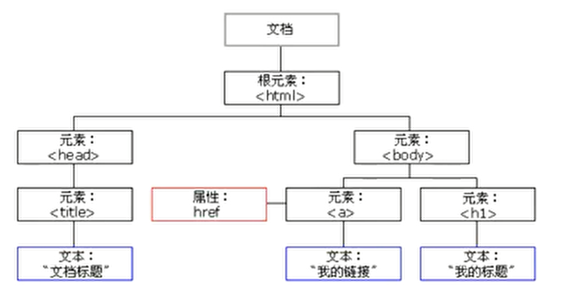
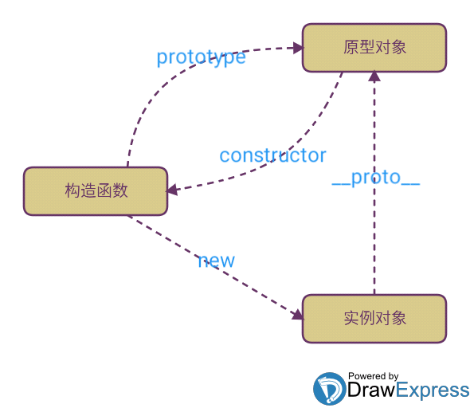

https://developer.mozilla.org/zh-CN/docs/Web/JavaScript/Reference/Functions/Method_definitions
# 1. 基本语法


## 1.1. 注释

我们可以添加注释来对JavaScript进行解释，或者提高代码的可读性。

```javascript
// 单行注释

/*多行注释
多行注释*/
```

## 1.2. 变量

### 1.2.1 变量命名

* 变量可以使用短名称(比如x和y)，也可以使用描述性更好的名称(比如 age，sum，totalvolume)。
* 变量必须以字母开头
* 变量也能以$和_符号开头(不过我们不推荐这么做)
* 变量名称对大小写敏感(y和Y是不同的变量)
* (小)驼峰式命名

### 1.2.2 变量声明
javaScript中变量可以先声明后赋值, 也可以在声明的时候赋值. 以及同时给多个变量赋值
- var 关键字定义的变量可以在使用后声明，也就是变量可以先使用再声明
```javascript
var age;
age = 30;
console.log(age)

var name = "hahaxi";
console.log(name)

var a=100; b=200; c="asdsad";
consloe.log(a)
consloe.log(b)
consloe.log(c)
```

## 1.3 数据类型

### 1.3.1 Overview
字符串、数字、布尔(Boolean)、Null、Undefined、数组
```javascript
var a = 300;  //数值类型, 支持四则运算

var b = "haha";  //字符串类型

var c = true; d = false;  //布尔类型
var l = 2 > 1; // false

var f;  //undefind类型(声明未赋值)

var e = null;  //Null类型

var g = [1, 2, "g", null, true, "5"] // 数组
var f = new Array(1, 2, 3) // 不常用该方法

var n = NaN; // 特殊值
NaN === NaN; // false
isNaN(NaN); // true
```

### 1.3.2 字符串

```javascript
consloe.log(`dsad
dasda
asds`)  // 采用反引号支持换行

// 模板字符串


var name = '小明';
var age = 20;
// 方法一:
var message = '你好, ' + name + ', 你今年' + age + '岁了!';

// 方法二(ES6语法):
var message = `你好, ${name}, 你今年${age}岁了!`;


// 操作字符串

var b = "hello_world!"

b.length; // 12
```

#### 1.3.3 字符串方法

```javascript
// 变成大写 toUpperCase
var s = 'Hello';
s.toUpperCase(); // 返回'HELLO'


// 变成小写 toLowerCase
var s = 'Hello';
var lower = s.toLowerCase(); // 返回'hello'并赋值给变量lower
lower; // 'hello'

// 获取索引
var s = 'hello, world';
s.indexOf('world'); // 返回7, 首个字母的索引
s.indexOf('WORLD'); // 没有找到指定的子串，返回-1

// 获取索引位字符串
var s = 'hello, world'
s.substring(0, 5); // 从索引0开始到5（不包括5），返回'hello'
s.substring(7); // 从索引7开始到结束，返回'world'

// 切片
var s = "hello, world";
s.split(", ");
s.split(/[,\s]+/); // 也可以使用正则表达式
```

### 1.3.3 数组
```js
var g = [1, 2, "g", null, true, "5"] // 数组
var f = new Array(1, 2, 3) // 不常用该方法

// 可以通过控制length实现数组的长度
console.log(g.length) // 6
g.length = 10  // 多余索引的值为undefined
console.log(g) // [1, 2, "g", null, true, "5", undefined, undefined, undefined, undefined]
g.length = 2  // 相当于切片,取前n个
console.log(g) // [1, 2]

var arr = ['A', 'B', 'C', 'D', 'E', 'F', 'G'];
// indexOf 获取索引
arr.indexOf("A")  // 0
// slice 切片
arr.slice(1, 5) // ["B", "C", "D", "E"]
arr.slice(5) // ["F", "G"]
// push 从尾部添加
arr.push("X") // 返回数组长度
console.log(arr) //  ["A", "B", "C", "D", "E", "F", "G", "X"]
// pop 从尾部弹出并删除该元素
var res = arr.pop()
console.log(res)  // X
console.log(arr) // ["A", "B", "C", "D", "E", "F", "G"]


var arr = [1, 2]
// unshift 向头部添加一个元素
arr.unshift("A", "B") // ["A", "B", 1, 2]
// shift 删掉头部第一个元素
arr.shift() // A
console.log(arr) // ["B", 1, 2]
// reverse 反转
arr.reverse() // [2, 1, "B"]
// splice 粘接 在指定索引处删除,返回原始元素并添加新元素
arr.splice(1, 2, "G", "F", "T") // [1, "B"]  将索引1到1+2前,即[1:3]删除并返回,并且在该区间内添加后续元素
console.log(arr) // [2, "G", "F", "T"]
arr.splice(3, 2) // ["T"]  仅删除不添加
arr.splice(2, 0, "O", "U", "Y") // 不删除仅添加
console.log(arr) // [2, "G", "O", "U", "Y", "F"]

// concat 连接 拼接数组
var arr = ['A', 'B', 'C'];
var new_arr =  arr.concat(1, 2, [3, 4]); // ['A', 'B', 'C', 1, 2, 3, 4]
console.log(arr) // ["A", "B", "C"]

// join 格式化输出字符串
var arr = ['A', 'B', 'C'];
var b = arr.join("-")
console.log(b)  // "A-B-C"
```

#### map
按数组顺序入参指定函数, 只能传入一个参数
```js
var arr = [1, 2, 3, 4, 5, 6, 7];

var func = x => {return x*x};

var res = arr.map(func);
console.log(res);  // [1, 4, 9, 16, 25, 36, 49]
```
#### reduce
按数组顺序入参指定函数, 可以传入两个参数.

将前一组的结果与当前顺序的参数一起传入
```js
var arr = [1, 2, 3, 4, 5, 6, 7];

var func = (x, y) => {return x+y};

var res = arr.reduce(func);
console.log(res);  // 28
// 1+2=3
// 3+3=6
// 6+4=10
// 10+5=15
// 15+6=21
// 21+7=28
```

#### filter过滤
filter()把传入的函数依次作用于每个元素，然后根据返回值是true还是false决定保留还是丢弃该元素
```js
var arr = [1, 2, 3, 4, 5, 6, 7];
arr = arr.filter(x=>{return x%2 === 0});
```
filter()接收的回调函数，其实可以有多个参数。通常我们仅使用第一个参数，表示Array的某个元素。回调函数还可以接收另外两个参数，表示元素的位置和数组本身：(类似于forEach)
```js
var arr = ['A', 'B', 'C'];
var r = arr.filter(function (element, index, self) {
    console.log(element); // 依次打印'A', 'B', 'C'
    console.log(index); // 依次打印0, 1, 2
    console.log(self); // self就是变量arr
    return true;
});
```

#### every
判断数组的所有元素是否满足测试条件
```js
var arr = ['Apple', 'pear', 'orange'];
console.log(arr.every(function (s) {
    return s.length > 0;
})); // true, 因为每个元素都满足s.length>0

console.log(arr.every(function (s) {
    return s.toLowerCase() === s;
})); // false, 因为不是每个元素都全部是小写

```

#### find
查找符合条件的第一个元素
- 如果找到了，返回这个元素
- 否则，返回undefined
```js
var arr = ['Apple', 'pear', 'orange'];
console.log(arr.find(function (s) {
    return s.toLowerCase() === s;
})); // 'pear', 因为pear全部是小写

console.log(arr.find(function (s) {
    return s.toUpperCase() === s;
})); // undefined, 因为没有全部是大写的元素

```
#### findIndex
查找符合条件的第一个元素，不同之处在于findIndex()会返回这个元素的索引，如果没有找到，返回-1
```js
var arr = ['Apple', 'pear', 'orange'];
console.log(arr.findIndex(function (s) {
    return s.toLowerCase() === s;
})); // 1, 因为'pear'的索引是1

console.log(arr.findIndex(function (s) {
    return s.toUpperCase() === s;
})); // -1
```
#### 数组排序
对数组的引用。请注意，数组在原数组上进行排序，不生成副本。

如果调用该方法时没有使用参数，将按字母顺序对数组中的元素进行排序，说得更精确点，是按照字符编码的顺序进行排序。要实现这一点，首先应把数组的元素都转换成字符串（如有必要），以便进行比较。

如果想按照其他标准进行排序，就需要提供比较函数，该函数要比较两个值，然后返回一个用于说明这两个值的相对顺序的数字。比较函数应该具有两个参数 a 和 b，其返回值如下：

- 若 a 小于 b，在排序后的数组中 a 应该出现在 b 之前，则返回一个小于 0 的值。
- 若 a 等于 b，则返回 0。
- 若 a 大于 b，则返回一个大于 0 的值。

##### 排序字母
```js
var str = ["abd", "bda", "abc", "xdg", "pjg"];
str.sort();
console.log(str);  // ["abc", "abd", "bda", "pjg", "xdg"]
```
##### 排序数字(自定义排序)
```js
var arr = [10, 55, 2, 333];
var fn = (x,y) => {
    return x>y?1:-1;
    // return x-y;
};
arr.sort(fn);
console.log(arr);  // [2, 10, 55, 333]
```

### 1.3.4 对象
是一组由键-值组成的无序集合
- 方式一(不常用)： `var objA = new object();`
- 方式二：类式于python中的字典， `var objA={};`

每个键又称为对象的属性, 对象方法:对象方法是作为属性来存储的函数。

对象属性key在非特殊字符串的情况下,无需使用引号`""`
```javascript
// 方法一
var objA = new Object();

objA.name = "this is obja"
objA["age"] = 20
objA.func = function(var1, var2){
    alert(var1);
    alert(var2);
}

console.log(objA.name)  // 
console.log(objA["age"])
objA.func("xixixi", "asjdasjdlk")

// 方法二

var objB = {
    name : "js",
    age : 18,
    func : function (var1, var2) {
        alert(var1);
        alert(var2);
        return 20000
    }

}

console.log(objB.age)
console.log(objB["name"])
gg = objB.func("haha", 12345)


objB.year = 2020;  // 自由添加新的属性
console.log(objB.year);
delete objB.year;  // 自由删除属性
console.log(objB.year);  // undefined
console.log(objB);  // {name: "js", age: 18, func: ƒ}

// 检测对象中是否含有该属性(也有可能是继承的)
"name" in objB;  // true
"year" in objB;  // false

// hasOwnProperty可以判断该属性是否为对象自身的
objB.hasOwnProperty("name"); // true
objB.hasOwnProperty("toString"); // false
```

### 1.3.5 Map
ES6新增数据类型,类似于python中的字典

array元素越多时查找越慢,如果用map实现,无论元素有多少,速度都很快
- clear: 从映射中移除所有元素。
- delete: 从映射中移除指定的元素。
- forEach: 对映射中的每个元素执行指定操作。
- get: 返回映射中的指定元素。
- has: 如果映射包含指定元素，则返回 true。
- set: 添加一个新建元素到映射。
- toString: 返回映射的字符串表示形式。
- valueOf: 返回指定对象的原始值。
```js
var m = new Map([['Michael', 95], ['Bob', 75], ['Tracy', 85]]);
m.get('Michael'); // 95
m.set("Tom", 11); // m对象
m.delete("Michael"); // true
m.has("Michael");  // false
m.has("Tom");  // true
```
### 1.3.6 Set
ES6新增数据类型, 是一组key的集合，但不存储value。由于key不能重复，所以，在Set中，没有重复的key。
```js
var s = new Set([1, 2, 3, 3, '3']);
s; // Set {1, 2, 3, "3"}  数字3和字符串'3'是不同的元素
s.add("A");  // s对象
s; // Set {1, 2, 3, "3", "A"}
s.delete(2);  // true
s; // {1, 3, "3", "A"}
```

### 1.3.7 iterable
ES6标准引入了新的iterable类型，Array、Map和Set都属于iterable类型

具有iterable类型的集合可以通过新的`for ... of`循环来遍历。
```js
var arr = ["A", "B", "C"];
var set = new Set([1, 2, "g", "t"]);
var map = new Map([["Tom", 20], ["Jack", 100], ["Bob", 5]]);

for (var x of arr){
    console.log(x);  // A B C
}

for (var x of set){
    console.log(x); // 1 2 g t
}

for (var x of map){
    console.log(x[0]+"="+x[1]);  // Tom=20 Jack=100 Bob=5
}
```
#### forEach
接收一个函数，每次迭代就自动回调该函数, JavaScript的函数调用不要求参数必须一致，因此可以忽略它们
```JS
// 数组
var a = ['A', 'B', 'C'];
a.forEach(function (element, index, array) {
    // element: 指向当前元素的值
    // index: 指向当前索引
    // array: 指向Array对象本身
    console.log(element + ', index = ' + index);
});

// set
var s = new Set(['A', 'B', 'C']);
s.forEach(function (element, sameElement, set) {
    // 因为set没有索引, 所以前两个参数都是元素本身
    // set: 指向s对象本身
    console.log(element);
});

// map
var m = new Map([[1, 'x'], [2, 'y'], [3, 'z']]);
m.forEach(function (value, key, map) {
    // 
    console.log(value);  // x y z
    console.log(key);  // 1 2 3
    console.log(map); // 指向m对象本身
});

// 忽略部分参数
var a = ['A', 'B', 'C'];
a.forEach(element => {
    console.log(element);
});
```

## 1.4 运算符

- 算术运算符：+(加)、-(减)、*(乘)、/(除)、%(求余)
- 赋值运算符：=、+=、-=、*=、/=、%=、++
- 条件运算符：==、===、>、>=、<、<=、!=
- 逻辑运算符：&&(而且)、||(或者)、!(否)


- 第一种是 `==` 比较，它会自动转换数据类型再比较，很多时候，会得到非常诡异的结果；
- 第二种是 `===` 比较，它不会自动转换数据类型，如果数据类型不一致，返回false，如果一致，再比较。
- 由于JavaScript这个设计缺陷，不要使用==比较，始终坚持使用===比较。

```javascript
// 如果需要对浮点数进行对比
Math.abs(1 / 3 - (1 - 2 / 3)) < 0.0000001; // true
```
### 逻辑运算符
- `&&`运算是与运算，只有所有都为true，&&运算结果才是true：
- `||`运算是或运算，只要其中有一个为true，||运算结果就是true：
- `!`运算是非运算，它是一个单目运算符，把true变成false，false变成true：

```js
true && true; // 这个&&语句计算结果为true
true && false; // 这个&&语句计算结果为false
false && true && false; // 这个&&语句计算结果为false

false || false; // 这个||语句计算结果为false
true || false; // 这个||语句计算结果为true
false || true || false; // 这个||语句计算结果为true

! true; // 结果为false
! false; // 结果为true
! (2 > 5); // 结果为true

var age = 15;
if (age >= 18) {
    alert('adult');
} else {
    alert('teenager');
}
```
## 1.5 条件语句

### 1.5.1 if条件语句
`null`、`undefined`、`0`、`NaN`和空字符串`''`视为`false`，其他值一概视为`true`
```javascript
if(a > 10){
    console.log("a大于10");
}else if(a < 1){
    console.log("a小于1")
}else{
    console.log("a小于10 大于1")
}

// 上方语法相当于
if(a > 10){
    console.log("a大于10");
}else{ // 通常不这样写, 在一行表达式的时候可以忽略`{}`
    if(a < 1){
        console.log("a小于1")
    }else{
        console.log("a小于10 大于1")
    }
}

// 一行表达式, 可以忽略`{}`  但是不推荐这样写
if(a > 10)
    console.log("a大于10");
else if(a < 1){
    console.log("a小于1")
else
    console.log("a小于10 大于1")
```

### 1.5.2 switch表达式


计算一次 switch表达式
把表达式的值与每个case的值进行对比
如果存在匹配，则执行关联代码
遇到break 关键词，它会跳出switch代码块。
case 匹配不存在时，运行default的代码：


```javascript
switch(a+b){
    case c:
        console.log("等于c")
        break
    case b:
        console.log("等于b")
        break
    case d:
        console.log("等于d")
        break
    default:
        console.log("都不是")
}
```

## 1.6 函数
允许传入任意个参数而不影响调用
- 因此传入的参数比定义的参数多也没有问题
- 传入的参数比定义的少也没有问题
```javascript
// 命名函数
function func(var1, var2){
    console.log(var1);
    console.log(var2);
}

res = func(1, 3);

// 匿名函数
let func = function(var1, var2){
    console.log(var1);
    console.log(var2) ;
}
res = func(1, 3);
```
### 作用域
如果一个变量在函数体内部申明
- 则该变量的作用域为整个函数体，在函数体外不可引用该变量
- 不同函数内部的同名变量互相独立，互不影响
```js
function func(){
    var x = 1;
    var y = 2;
}
```
内部函数可以访问外部函数定义的变量
```js
function A(){
    var x = 1;
    function B(){
        var y = 2;
        console.log(x);
    }
    B();
    console.log(y); // ReferenceError: y is not defined
}
```
先扫描整个函数体的语句，把所有申明的变量“提升”到函数顶部(仅提升变量,不提升赋值)
```js
function foo() {
    var x = 'Hello, ' + y;  // 提升变量y的申明，此时y为undefined
    console.log(x);
    var y = 'Bob';
}

foo();
```
推荐在函数体的顶部声明完所有的变量
```js
function func(){
    var 
        x = 1,
        y = 2,
        z = 3;
    for (;z>x;z--){
        console.log(z);
    }
}
func();  // 3 2
```
#### 全局作用域
默认全局对象`window`，全局作用域的变量实际上被绑定到window的一个属性
```js
var x = 1;
console.log(window.x); // 1

var func = () => {
    var y = 2;
    return y
}
console.log(window.func()) // 2
```

#### 命名空间
js中如果使用了相同的全局变量，或者定义了相同名字的顶层函数，都会造成命名冲突，并且很难被发现
```js
var GlobalVariable = {}  // 用一个对象来存变量

GlobalVariable.x = 1;
GlobalVariable.foo = () => {};
```
### 参数方法
#### arguments参数
只在函数内部起作用，并且永远指向当前函数的调用者传入的所有参数

arguments类似Array但它不是一个Array

```js
// 函数不定义任何参数，还是可以拿到参数的值
function func(){
    for (var attr in arguments){
    console.log(arguments[attr]);
    }
};

func("a", "b", "c");  // a b c

// 获得调用者传入的所有参数
var f = function(a, b){
    for (var i=0;arguments.length>i;i++){
        console.log(arguments[i])
    }
}

f(1, 2, 3, 4, 5)  // 1 2 3 4 5
```
#### rest可变长参数(对象展开符)
如果传入的参数连正常定义的参数都没填满，也不要紧，rest参数会接收一个空数组

```js
function sum(...rest) {
   var sum = 0
   rest.forEach(elements => {
       sum += elements;
   })
   return sum
}

```
#### 解析赋值
类似与python对多数据的赋值

数组
```js
var [x, y, z] = ['hello', 'JavaScript', 'ES6'];

var [x, [y, z]] = ['hello', ['JavaScript', 'ES6']];  // 如果存在嵌套,且需要拿嵌套的值 则嵌套的位置及顺序需要一致
x; // 'hello'
y; // 'JavaScript'
z; // 'ES6'

var [x, y] = ['hello', ['JavaScript', 'ES6']];  // "hello"  ["JavaScript", "ES6"]

let [, , z] = ['hello', 'JavaScript', 'ES6']; // 忽略前两个元素，只对z赋值第三个元素
z; // 'ES6'
```

对象
```js
var person = {
    name: '小明',
    age: 20,
    gender: 'male',
    passport: 'G-12345678',
    school: 'No.4 middle school'
};
var {name, age, passport} = person;  // "小明"  20  "G-12345678"


// 嵌套对象
var person = {
    name: '小明',
    age: 20,
    gender: 'male',
    passport: 'G-12345678',
    school: 'No.4 middle school',
    address: {
        city: 'Beijing',
        street: 'No.1 Road',
        zipcode: '100001'
    }
};
var {name, address: {city, zip}} = person;  // address不是变量，而是为了让city和zip获得嵌套的address对象的属性
name; // '小明'
city; // 'Beijing'
zip; // undefined, 因为属性名是zipcode而不是zip

// 对象赋值
var animal = {
    name: "little dog",
    age: 3,
    gender: "male"
}
var {name, age:id} = animal;
name; // "little dog"
id; // 3
age; // undefined 注意: age不是变量，而是为了让变量id获得age属性:

// 默认值
var person = {
    name: '小明',
    age: 20,
    gender: 'male',
    passport: 'G-12345678'
};

// 如果person对象没有single属性，默认赋值为true:
var {name, single=true} = person;
name; // '小明'
single; // true
var {age:id=3} = person  // 命名&默认

// 如果时已经声明过的变量,进行赋值时,需要使用括号
({x, y} = { name: '小明', x: 100, y: 200});
```
##### 示例
解析赋值函数的使用
```js
function buildDate({year, month, day, hour=0, minute=0, second=0}) {
    return new Date(year + '-' + month + '-' + day + ' ' + hour + ':' + minute + ':' + second);
}


buildDate({ year: 2017, month: 1, day: 1 }); // {year, month, day, hour=0, minute=0, second=0} = { year: 2017, month: 1, day: 1 } 
buildDate({ year: 2017, month: 1, day: 1, hour: 20, minute: 15 }); // {year, month, day, hour=0, minute=0, second=0} = { year: 2017, month: 1, day: 1, hour: 20, minute: 15 }
```

### 闭包

```js
function func(){
    local = 0;
    return function(){
        local++;
        console.log(local);
        return local
    }
}

var f = func()
f();
f();
f();
f();
```

## 1.7 循环

### 1.7.1 while循环

```javascript
while (条件)
{
    // 需要执行的代码
}
```

```javascript
while(a<5){  // 每次循环开始判断
    console.log("a小于5")
    a++
}
```
```js
var n = 0;
do {
    n = n + 1;  // 每次循环完成开始判断,将至少运行一次
} while (n < 100);
n; // 100
```
```js
function* next_id() {
    var current_id = 0
    while(current_id<100){  // 可以在while表达式中运行
        ++current_id
        yield current_id;
}}

for (let x of next_id()){
    console.log(x);
}
```
### 1.7.2 for循环

```javascript
for (声明变量; 条件判断; 变量处理)  // 3个条件都可以为空,但需要具备退出条件,否则将会进入死循环
{
    被执行的代码块
}
```

```javascript
for (var i=0;i<cars.length;i++)
{ 
    document.write(cars[i] + "<br>");
}
// 前置条件若已经声明 语句一可不写
var i=2,len=cars.length;
for (; i<len; i++)
{ 
    document.write(cars[i] + "<br>");
}
// 语句三 若已经在代码块中有相应代码 也可不写
var i=0,len=cars.length;
for (; i<len; )
{ 
    document.write(cars[i] + "<br>");
    i++;
}

// 遍历对象属性，得到的是属性名
var person={fname:"John",lname:"Doe",age:25}; 

for (var x in person)  // x 为属性名
{
    txt=txt + person[x];
}

// 遍历数组
var aList = [1, 33, 55, 99];
for (var y in aList){
    console.log(y)  // y 为数组索引(字符串类型)
    a = aList[y]
}
```
tip: for...in 适用于对象, for...of 适用于数组等迭代器对象
## es6语法

### 变量关键字 let/const
#### let 局部作用域
let 声明的变量只在 let 命令所在的代码块 {} 内有效，在 {} 之外不能访问。
- let 关键字定义的变量则不可以在使用后声明，也就是变量需要先声明再使用。
```js
{
    let x = 2;
    console.log(x); // 2
}
console.log(x);  // ReferenceError


let i = 5;
for (let i = 0; i < 10; i++) {
    // 一些代码...
}
// 这里输出 i 为 5
```
#### const 常量
const 声明一个只读的常量，一旦声明，常量的值就不能改变(不能重新赋值)
- 使用 const 定义的对象或者数组，是可变的
- const有顺序要求, 必须先声明
```js
const PI = 3.141592653589793;
PI = 3.14;      // 报错
PI = PI + 10;   // 报错

// 创建常量对象
const car = {type:"Fiat", model:"500", color:"white"};
 
// 修改属性:
car.color = "red";
 
// 添加属性
car.owner = "Johnson";
```
### 方法
绑定到对象上的函数称为方法
```js
var obj = {
  foo: function() {
    /* code */
  },
  bar: function() {
    /* code */
  }
};

// 可以缩写为
var obj = {
  foo() {
    /* code */
  },
  bar() {
    /* code */
  }
};

```
### 生成器
```js
// 用有属性名的语法定义方法（ES6之前）：
var obj2 = {
  g: function*() {
    var index = 0;
    while(true)
      yield index++;
  }
};

// 同一个方法，简写语法：
var obj2 = { 
  * g() {
    var index = 0;
    while(true)
      yield index++;
  }
};

var it = obj2.g();
console.log(it.next().value); // 0
console.log(it.next().value); // 1
```

```js
function* fib(max) {
    var
        t,
        a = 0,
        b = 1,
        n = 0;
    while (n < max) {
        yield a;
        [a, b] = [b, a + b];
        n ++;
    }
    return;
}

var f = fib(5); // fib {[[GeneratorStatus]]: "suspended", [[GeneratorReceiver]]: Window}

f.next(); // {value: 0, done: false}
f.next(); // {value: 1, done: false}
f.next(); // {value: 1, done: false}
f.next(); // {value: 2, done: false}
f.next(); // {value: 3, done: false}
f.next(); // {value: undefined, done: true}

// 除了以上的手动调用,还可以通过遍历的形式不断的取得对象
for (var x of fib(10)) {
    console.log(x); // 依次输出0, 1, 1, 2, 3, ...
}

```
- 返回的value就是yield的返回值
- done表示这个generator是否已经执行结束了
- 如果done为true，则value就是return的返回值
### 异步方法
```js
// 用有属性名的语法定义方法（ES6之前）：
var obj3 = {
  f: async function () {
    await some_promise;
  }
};

// 同一个方法，简写语法：
var obj3 = { 
  async f() {
    await some_promise;
  }
};
```
### async生成器方法
```js
var obj4 = {
  f: async function* () {
    yield 1;
    yield 2;
    yield 3;
  }
};

// 简写
var obj4 = {
  async* f() {
   yield 1;
   yield 2;
   yield 3;
  }
};
```
### 支持计算的属性名
```js
var obj5 = {
    name: "foo",
    ["foo" + "2"](){return 1}  // 仅支持拼接之类的
}

```


### 箭头函数
- 当不需要多行表达式时,可以直接一行表示,省略`{}`和`return`
- 如果仅有一位参数时,支持无需`()`, 其他情况都要加括号(无参数也需要)
- 如果返回一个对象,且仅有一行表达式,则必须在对象外加括号
```js
var x = function(i, o){
    return i + o;
};
// 以下是箭头函数, 相当于
var x = (i, o) => {
    return i + o;
};
// 当不需要多行表达式时,可以直接一行表示,省略`{}`和`return`
var x = (i, o) => i + o;
```
```js
// 如果仅有一位参数时,支持无需`()`
i => i * i;
// 无参数,必须`()`
() => 123;
// 返回一个对象
i => ({"name": i})
```
## this
### 方法
绑定到对象上的函数称为方法, 它在内部使用了一个this关键字

this的指向:
- this总是指向词法作用域，也就是外层调用者
- 如果以对象的方法形式调用，比如`xiaoming.age()`，该函数的this指向被调用的对象，也就是xiaoming
- 如果单独调用函数，比如`getAge()`，此时，该函数的this指向全局对象，也就是window
- 要保证this指向正确，必须用obj.xxx()的形式调用
- this指针只在第一级函数内指向xiaoming(对象)，在函数内部定义的函数(嵌套函数)，this又指向undefined了
```js
function getAge() {
    var y = new Date().getFullYear();
    return y - this.birth;
}

var xiaoming = {
    name: '小明',
    birth: 1990,
    age: getAge
};

xiaoming.age(); // 25, 正常结果
getAge(); // this此时指向 window (调用者)
var fn = xiaoming.age; // 先拿到xiaoming的age函数
fn(); // NaN 要保证this指向正确，必须用obj.xxx()的形式调用  this此时指向 window (调用者)
```
用`var that = this;`，你就可以放心地在方法内部定义其他函数，而不是把所有语句都堆到一个方法中。
```js
var xiaoming = {
    name: '小明',
    birth: 1990,
    age: function () {
        function getAgeFromBirth() {
            var y = new Date().getFullYear();
            return y - this.birth;
        }
        return getAgeFromBirth();
    }
};

// this此时指向 window (调用者)  this指针只在age方法的函数内指向xiaoming，在函数内部定义的函数，this又指向undefined了
xiaoming.age(); // Uncaught TypeError: Cannot read property 'birth' of undefined


var xiaoming = {
    name: '小明',
    birth: 1990,
    age: function () {
        var that = this; // 在方法内部一开始就捕获this
        function getAgeFromBirth() {
            var y = new Date().getFullYear();
            return y - that.birth; // 用that而不是this
        }
        return getAgeFromBirth();
    }
};

xiaoming.age(); // 25
```
### 箭头函数
箭头函数内部的this是词法作用域，由上下文确定, this总是指向词法作用域，也就是外层调用者

箭头函数的this指向是函数定义时候就绑定好的

父级作用域下的this指向

相较普通方法,箭头函数嵌套箭头函数不算父级
```js
var obj = {
    birth: 1990;
    getAge: function(){
        var b = this.birth; // 1990
        var fn = () => new Date().getFullYear() - this.birth;
        return fn()
    }
}
obj.getAge()
```
```js
var obj = {
    birth: 1990,
    c: console.log(this),  // window
    getAge(year){
        console.log(this);  // obj
        console.log(year);  // 2015
        var b = this.birth;
        console.log(b);  // 1990
        var fn = y => y - this.birth;
        console.log(fn(year));  // 25
        return fn.call({birth:2000}, year);
    }
};
var b = obj.getAge(2015); // 25
console.log(b);  // 25
```
为何上面这个getAge对象无法写成箭头函数, 因为在箭头函数中this总是指向词法作用域
```js
// 
var obj = {
    birth: 1990,
    c: console.log(this);  // window
    getAge: year => {
        console.log(this);  // window, 作用域还是在window
        console.log(year);  // 2015
        var b = this.birth;
        console.log(b);  // undefined
        var fn = y => y - this.birth;  // 父级指向就是window
        console.log(fn(year));  // NaN
        return fn.call({birth:2000}, year);
    }
};
var b = obj.getAge(2015);
console.log(b)  // NaN
```
#### 实例
```js
function multiply(a, b) {
    if (b === undefined) {  // 当b为空时,返回一个函数
        return function (b) {
            return a * b;
        }
    }
    return a * b;
}

const double = multiply(2);
double(3); // => 6  // 调用内部的函数
multiply(2, 3); // => 6


// 用箭头函数表达
const multiply = (a, b) => b === undefined ? b => a * b : a * b;
const double = multiply(2);
double(3);      // => 6
multiply(2, 3); // => 6
```
### call&apply&bind
call()、apply()、bind() 都是用来重定义 `this` 这个对象的！(修复this指向)

显式this指向
#### call()
- 调用函数对象的call方法时，会调用函数对象
- call方法的参数，会传递给this引用
```js
function func(name, age){
    console.log(name);
    console.log(age);
}

// call()的第一个参数会传递给this，call()还可以有其他参数，其他的实参，都会传递给函数对象的形参
func.call("this对象", "Tom", 20);  // Tom  20
```
```JS
var obj = {
    a: "Jack",
    b: 20,
    print(name, age){
        console.log(this.a);
        console.log(this.b);
        console.log("我的名字是:" + name);
        console.log("我的年龄是:" + age);
    }
}

var obj2 = {
    "a": "Tom",
    "b": 99
};
obj.print.call(obj2, "JOY", 66)  // Tom 99  我的名字是:JOY 我的年龄是:66
```
#### apply()
与call()的用法大致相同, apply()只有两个形参
- 第一个形参接收的值会传递给this（这一点与call()相同）
- 第二个型参是一个数组，他接受函数对象的形参所封装成的数组
```js
function func(name, age){
    console.log(name);
    console.log(age);
}

func.apply("this", ["Jack", 100]);  // Jack  100   
```
```js
var obj = {
    a: "Jack",
    b: 20,
    print(name, age){
        console.log(this.a);
        console.log(this.b);
        console.log("我的名字是:" + name);
        console.log("我的年龄是:" + age);
    }
}

var obj2 = {
    "a": "Tom",
    "b": 99
};
var print = obj.print.apply(obj2, ["JACK", 999])  // Tom 99 我的名字是:JACK 我的年龄是:999
```
#### bind()
bind与上面两个函数使用方法差不多,不过返回的是新的一个对象,需要进行调用
```js
var obj = {
    a: "Jack",
    b: 20,
    print(name, age){
        console.log(this.a);
        console.log(this.b);
        console.log("我的名字是:" + name);
        console.log("我的年龄是:" + age);
    }
}

var obj2 = {
    "a": "Tom",
    "b": 99
};
var print = obj.print.bind(obj2, "JACK", 2000);
print()  // Tom 99 我的名字是:JACK 我的年龄是:2000
```
### 装饰器
利用`call`&`apply`&`bind`可实现装饰器

例如统计函数的调用次数
```js
function func(){
    console.log("我被调用啦!");
}

var backfunc = window.func;
var sum = 0;
window.func = function(){
    sum++;
    return backfunc.apply(null, arguments);
};
parseInt('10');
parseInt('20');
parseInt('30');
console.log('count = ' + count); // 3
```


## 三元运算符
格式: 条件?真结果:假结果
```js
var a = 30
var b = a>50?1:-1
console.log(b) // -1


var c = ""
var d = ""
a>50?(c="a大于50", d=true):(c="a小于50", d=false)  // 多行表达式
console.log(c)  // a小于50
console.log(d)  // false

// 支持多重嵌套
a>50?(a>100?(c="a大于100", d=true):(c="a大于50小于100", d=true)):(a>25?(c="a大于25小于50", d=false): (c="a小于25", d=false))
console.log(c)  // a大于25小于50
console.log(d)  // false
```
## 错误捕获
```js
function func(data){
    try{
        console.log(data);
    }catch(e){
        console.log(e);
    }
}

```

## promise 异步操作
Promise 对象代表一个异步操作，有三种状态：
- pending: 初始状态，不是成功或失败状态。
- fulfilled: 意味着操作成功完成。
- rejected: 意味着操作失败。

只有异步操作的结果，可以决定当前是哪一种状态，任何其他操作都无法改变这个状态

优点:可以将异步操作以同步操作的流程表达出来，避免了层层嵌套的回调函数

缺点:
- 一旦新建它就会立即执行，无法中途取消
- 如果不设置回调函数，Promise 内部抛出的错误，不会反应到外部
- 当处于 Pending 状态时，无法得知目前进展到哪一个阶段

使用:
- Promise 构造函数包含一个参数和一个带有 resolve（解析）和 reject（拒绝）两个的回调参数
- 在回调中执行一些操作（例如异步），如果一切都正常，则调用 `resolve`，否则调用 `reject`
- 支持链式调用
- 如果多个异步实例嵌套,调用者将会等待被调用实例状态为终态

批量接受
- Promise.all(): 可以批量接受promise对象, 传入iterable类型数据(数组等)
1. 传入数据若全部都为fulfilled状态, 则all实例也为fulfilled状态. 此时传入的promise对象的返回值组成一个数组,传递给all实例的回调函数(resolve)
2. 传入数据任有一个rejected状态, 则all实例也为rejected状态. 此时返回第一个rejected状态的promise对象的返回值, 传递给all实例的回调函数(reject)

```js
const asyncFunc = new Promise((resolve, reject)=>{
    setTimeout(()=>{
        console.log("异步操作成功");
        // resolve("执行成功")
        reject(new Error("我失败了")) // 调用reject回调函数, 之后可以通过promise实例.catch捕获
    }, 2500)
})

asyncFunc.then((successMsg)=>{
    console.log(successMsg);
}).catch((error)=>{  // 捕获reject
    console.log(error); // Error: 我失败了
                        // at <anonymous>:5:16
})


var promiseResolve = new Promise((resolve, reject)=>{
    console.log("running"); // running
    setTimeout(()=>{
        resolve("successful!!") // 调用resolve回调函数, 之后可以通过promise实例.then捕获
    }, 300)
})

promiseResolve.then(msg=>{
    console.log("result:"+msg) // result:successful!!
}).catch(error=>{
    console.log("result:"+error)
})


promiseResolve.then(msg=>{ // 支持链式调用, 
    console.log("xxx"+msg); // xxxsuccessful!!
    asd // 调用未知变量将报错
    }).catch(error=>{ // 前面的报错将不断冒泡到后面直至捕获(如果promise实例调用reject会调用此处, 链式调用的错误页会调用此处)
    console.log("error:"+error) // error:ReferenceError: asd is not defined
    }).then(msg=>{  // 如果在then之前调用了catch, 虽然此处仍会被调用 但将不会有参数传入
    console.log("yyy"+msg) // yyyundefined
    })

// 同时调用多个promise实例
Promise.all([asyncFunc, promiseResolve]).then((data)=>{
    console.log("result:"+data);
}).catch(error=>{
    console.log("error:"+error); // error:Error: 我失败了
})

Promise.race([]) // 使用方法同上, 但是其返回逻辑为传递最先改变状态的promise实例返回值给回调函数
```

## async&await 异步操作
`await`: 表示等一下，代码暂停, 该关键字使用的要求非常简单, 后面调用的函数要返回一个Promise对象

在`async`&`await`中,如果需要处理异常,则需要放到`try/catch`中运行
```js
function doubleAfter2sec(num){
    return new Promise((resolve, reject)=>{
        setTimeout(()=>{
            console.log("我要运行拉!")
            resolve(2 * num);
        }, 2000)
    })
}

async function getRuslt(){
    let res1 = await doubleAfter2sec(20); // 每个await处都会等待异步执行完成
    let res2 = await doubleAfter2sec(30); // 返回值为promise实例中调用resolve传递的值
    let res3 = await doubleAfter2sec(40); // 若是报错且没有进行错误捕捉则直接报错停止运行
    console.log(res1 + res2 + res3);
}

getRuslt();
```

# 2. 浏览器对象

- 通过HTMLDOM，可访问JavaScript HTML文档的所有元素。
- 当网页被加载时，浏览器会创建页面的文档对象模型(Document Object Model)。
- HTMLDOM模型被构造为对象的树。





节点树中的节点彼此拥有层级关系。
- 父(parent)、子(child)和同胞(sibling)等术语用于描述这些关系。
- 父节点拥有子节点。同级的子节点被称为同胞(兄弟或姐妹)
## 2.1 获取页面标签


获取标签的方式
- 通常，通过JavaScript操作HTML元素，可以使用内置对象document的方法来找到该标签
- 通过id 找到HTML元素(常用)  `document.getElementByld()`
- 通过标签名找到HTML元素  `document.getElementsByTagName()`  获取出来的是列表
- 通过类名找到HTML元素(通过类名查找HTML元素在IE5，6，7，8中无效) `document.getElementsByClassName()`  取出来的是列表


```javascript
var id = document.getElementById("project_site");
console.log(id);

var cls = document.getElementsByClassName("project_title");
console.log(cls);
console.log(cls[0]);

var tag = document.getElementsByTagName("p");
console.log(tag);
console.log(tag[0]);
```

## 2.2 操作标签内容

```javascript
var tag = document.getElementsByTagName("p");

var tag_0 = tag[0].innerText;
console.log(tag_0);
tag[0].innerText = "哈哈哈哈";
console.log(tag[1].innerHTML)
tag[1].innerHTML = "<h1>嘻嘻嘻</h1>"
```

## 2.3 修改标签属性

```javascript
var tag = document.getElementsByTagName("p");

tag[0].style.height = "300px";
```

## 2.4 间隔时间对象
`setInterval()` 方法可按照指定的周期（以毫秒计）来调用函数或计算表达式
- 返回一个 ID（数字），可以将这个ID传递给`clearInterval()`，`clearTimeout()` 以取消执行。
```js
setInterval(()=>{console.log("hello, world")}, 3000);
```
`clearInterval(id)`可取消由`setInterval()`函数设定的定时执行操作
```js
setInterval(()=>{console.log("hello, world")}, 3000); // 346
clearInterval(346); // 停止
```
`setTimeout()`用于在指定的毫秒数后调用函数或计算表达式
```js
setTimeout(()=>{alert("hello world")}, 3000); //934
```
`clearTimeout()`可取消由`setTimeout()`方法设置的定时操作
```js
setTimeout(()=>{alert("hello world")}, 3000); //934
clearTimeout(934);
```

## 2.5 存储对象
- localStorage: 在浏览器中存储 key/value 对。没有过期时间
- sessionStorage: 	在浏览器中存储 key/value 对。 在关闭窗口或标签页之后将会删除这些数据

方法:
- key(n): 返回存储对象中第 n 个键的名称
- getItem(keyname): 返回指定键的值
- setItem(keyname, value): 	添加键和值，如果对应的值存在，则更新该键对应的值。
- removeItem(keyname): 移除键
- clear(): 清除存储对象中所有的键

tip: 存进去的值都是字符串
```js
// 也可以当作对象一样使用
localStorage.age = 18
localStorage.age // "18"
localStorage["name"] = "tom"
localStorage["name"] // "tom"
```

## 2.6 鼠标对象 
- 鼠标左侧/中间 按钮 事件发生次序
    1. onmousedown
    2. onmouseup
    3. onclick

- 鼠标右侧按钮事件发生次序
    1. onmousedown
    2. onmouseup
    3. oncontextmenu
### 1. onclick 点击事件
onclick 事件会在元素被点击时发生。
```html
<button onclick="clickFunc()">Click me</button>
```
```js
object.onclick=()=>{ alert("click me") };
```
### 2. ondblclick 双击事件
ondblclick 事件会在对象被双击时发生。
```html
<p ondblclick="doubleFunc()">double click me</p>
```
```js
object.ondblclick = () => { alert("double click me")}
```
### 3. onmousedown 鼠标按下
onmousedown 事件会在鼠标按键被按下时发生。
```html
<button onmousedown="downFunc()">Mouse down</button>
```
```js
object.onmousedown = ()=>{ alert("mouse press")}
```
### 4. onmouseup 鼠标松开
onmouseup 事件会在鼠标按键被松开时发生。
```html
<p onmousedown="myFunction(this,'red')" onmouseup="myFunction(this,'green')">
```
```js
```

### 5. onmouseenter 鼠标移入元素
onmouseenter 事件在鼠标指针移动到元素上时触发
```html
<p onmouseenter="display()">提示信息</p>
```
```js
object.onmouseenter = ()=>{ return dispaly=true }

object.addEventListener("mouseenter", myScript);
```
### 6. onmouseleave 鼠标移出元素
onmouseleave 事件在鼠标移出元素时触发。
```html
<p onmouseleave="noDisplay()">提示信息</p>
```
```js
object.onmouseleave = ()=>{ return display=false }
```
### 7. onmousemove 鼠标移动
onmousemove 事件会在鼠标指针移到指定的对象时发生.(如果在触发区域内一直移动一直触发)
```html
<div onmousemove="myMoveFunction()">
  <p>onmousemove: <br> <span id="demo">鼠标移动到我这!</span></p>
</div>
```
```js
object.onmousemove = ()=>{ console.log("moving") }
```
### 8. onmouseover 鼠标移动到元素上
onmouseover 事件会在鼠标指针移动到指定的元素上时发生。

该指定元素内如果有其他子元素,每移动到一个子元素内会再触发
- 如下: div会触发 在p和span也会再次触发
```html
<div onmouseover="myOverFunction()">
  <p>onmouseover: <br> <span id="demo3">鼠标移动到我这!</span></p>
</div>
```
### 9. onmouseout 鼠标从某元素移开
onmouseout 事件会在鼠标指针移出指定的对象时发生。

与onmouseover规则一样,该指定元素内如果有其他子元素,每移开一个子元素会再触发
- 如下: div会触发 在p和span也会再次触发
```html
<div onmouseout="myOutFunction()">
  <p>onmouseover: <br> <span id="demo3">鼠标移动到我这!</span></p>
</div>
```

## 2.7 键盘事件
- 按键事件触发次序:
    1. onkeydown
    2. onkeypress
    3. onkeyup
### 1. onkeydown 按键按下
onkeydown 事件会在用户按下一个键盘按键时发生。
```html
<input type="text" onkeydown="myFunction()">
```
### 2. onkeypress 按键按下并松开
onkeypress 事件会在键盘按键被按下并释放一个键时发生。
```html
<input type="text" onkeypress="myFunction()">
```
### 3. onkeyup 按键松开
onkeyup 事件会在键盘按键被松开时发生。
```html
<input type="text" id="fname" onkeyup="myFunction()">
```
## 2.8 表单事件
### 1. onblur 元素失焦
onblur 事件会在对象失去焦点时发生。(例如用来验证输入框)
```html
<input type="text" id="fname" onblur="myFunction()">
```
### 2. onsubmit 表单提交
onsubmit 事件在表单提交时触发。
```html
<form action="demo-form.php" onsubmit="myFunction()">
    输入名字: <input type="text" name="fname">
    <input type="submit" value="提交">
</form>
```
### 3. onreset 表单重置
onreset 事件在表单被重置后触发。
```html
<form onreset="myFunction()">
	输入您的名字: <input type="text">
	<input type="reset"> 
    <!-- 重置按钮 -->
</form>
```
## 2. location对象
```js
// 加载新页面
location.assign("/"); // 基于当前域名, 参数为path
// 重新加载
location.reload();
```


# 3. 标准对象
## Date
表示日期和时间

定义指定时间对象, 实例化Date对象时JavaScript的月份范围用整数表示是0~11(类似于索引,从0开始)
```js
// 时间为 2021-04-02 01:07:00

// 方法一
var date = new Date(2021, 03, 02, 01, 07, 00);  // 默认浏览器当前本地时区(+8:00)   
date; // Fri Apr 02 2021 01:07:00 GMT+0800 (中国标准时间) 对象
date.getMonth(); // 3 对应4月

// 方法二
var dateStamp = Date.parse("2021-04-02 01:07:00");  // 按实际时间填写
var dateStamp2 = Date.parse("2021.04.02 01:22:33"); // 1617297753000
dateStamp; // 1617296820000

var date = new Date(Date.now())
var date = new Date(dateStamp);
date; // Fri Apr 02 2021 01:07:00 GMT+0800 (中国标准时间) 对象
date.getMonth(); // 3 对应4月

// 获取时间戳
var dateStamp = Date.now(); // 1617296820000
```
取值方法
```js
var now = new Date(); // 不填参数默认取浏览器当前本地时间对象
now.getFullYear(); // 2015, 年份
now.getMonth(); // 5, 月份，注意月份范围是0~11，5表示六月
now.getDate(); // 24, 表示24号
now.getDay(); // 3, 表示星期三
now.getHours(); // 19, 24小时制
now.getMinutes(); // 49, 分钟
now.getSeconds(); // 22, 秒
now.getMilliseconds(); // 875, 毫秒数
now.getTime(); // 1435146562875, 以number形式表示的时间戳
```
格式化
```js
var date = new Date();
date.toJSON(); // "2021-04-01T17:07:00.000Z"
date.toDateString(); // "Fri Apr 02 2021"
date.toLocaleString(); // "2021/4/2上午1:07:00"
date.toString(); // "Fri Apr 02 2021 01:07:00 GMT+0800 (中国标准时间)"
date.toTimeString(); // "01:07:00 GMT+0800 (中国标准时间)"
```
## RegExp
正则表达式

js的正则表达式语法: `/正则表达式主体/修饰符(可选)`
- `/runoob/i`
    - `/runoob/i`  是一个正则表达式。
    - `runoob`  是一个正则表达式主体 (用于检索)。
    - `i`  是一个修饰符 (搜索不区分大小写)。

RegExp的方法:
- search(): 用于检索字符串中指定的子字符串，或检索与正则表达式相匹配的子字符串，并返回子串的起始位置
- replace(): 用于在字符串中用一些字符替换另一些字符，或替换一个与正则表达式匹配的子串

正则表达式的方法:
- test(): 于检测一个字符串是否匹配某个模式，如果字符串中含有匹配的文本，则返回 true，否则返回 false。
- exec(): 用于检索字符串中的正则表达式的匹配, 匹配成功后，会返回一个Array, 第一个元素是正则表达式匹配到的整个字符串，后面的字符串表示匹配成功的子串

```js
// test() 用
var pattern = /[,\s]+/
pattern.test("hello, world") // true
pattern.test("helloworld") // false

// exec() 
var res = /hello/.exec("hello world")
res; // 对象 字符串为匹配到的值  ["hello", index: 0, input: "hello world", groups: undefined]

// 第一个元素是正则表达式匹配到的整个字符串，后面的字符串表示匹配成功的子串
var res2 = /(\w+)\s+\w+/.exec("hello world") // ["hello world", "hello", index: 0, input: "hello world", groups: undefined]

// 字符串切片可直接用正则表达式
var str = "hello world!";
str.split(/[\s]+/);  // ["hello", "world!"]
```

修饰符:
- i: 执行对大小写不敏感的匹配。
- g: 执行全局匹配（查找所有匹配而非在找到第一个匹配后停止）。
- m: 执行多行匹配。

## JSON
序列化与反序列化
### 序列化
stringify(): 将对象序列化成json
- 第一位参数: 需要序列化的对象
- 第二位参数: 
    - 如果 replacer 为函数，则 JSON.stringify 将调用该函数，并传入每个成员的键和值。使用返回值而不是原始值。如果此函数返回 undefined，则排除成员。根对象的键是一个空字符串：""。
    - 如果 replacer 是一个数组，则仅转换该数组中具有键值的成员。成员的转换顺序与键在数组中的顺序一样。
- 第三位参数: 每行json的缩进空格

toJSON(): 函数内设置需要进行序列化的元素
```js
// stringify()

var xiaoming = {
    name: '小明',
    age: 14,
    gender: true,
    height: 1.65,
    grade: null,
    'middle-school': '\"W3C\" Middle School',
    skills: ['JavaScript', 'Java', 'Python', 'Lisp']
};

// 默认
var s = JSON.stringify(xiaoming);
s; // "{"name":"小明","age":14,"gender":true,"height":1.65,"grade":null,"middle-school":"\"W3C\" Middle School","skills":["JavaScript","Java","Python","Lisp"]}"

// 指定输出key 并且进行缩进
var s2 = JSON.stringify(xiaoming, ["name", "age"], "  ");
/*
"{
  "name": "小明",
  "age": 14
}"
*/

// 自定义替换条件
var func = (key, value) => {
    if (typeof value === "string"){
        return value.toUpperCase();
    }
    return value
}
// 多个替换条件 嵌套的列表,对象等都进行遍历传入
var s3 = JSON.stringify(xiaoming, func, "  ");
/*

"{\n  \"name\": \"小明\",\n  \"age\": 14,\n  \"gender\": true,\n  \"height\": 1.65,\n  \"grade\": null,\n  \"middle-school\": \"\\\"W3C\\\" MIDDLE SCHOOL\",\n  \"skills\": [\n    \"JAVASCRIPT\",\n    \"JAVA\",\n    \"PYTHON\",\n    \"LISP\"\n  ]\n}"
```
`toJSON()`
```js
var xiaoming = {
    name: '小明',
    age: 14,
    gender: true,
    height: 1.65,
    grade: null,
    'middle-school': '\"W3C\" Middle School',
    skills: ['JavaScript', 'Java', 'Python', 'Lisp'],
    toJSON(){
        return {
            "NAME": this.name,
            "AGE": this.age
        }
    }
}

xiaoming.toJSON(); // {NAME: "小明", AGE: 14}
```
### 反序列化
`parse()`: 将json转化为对象
```js
var json = `{
    "name":"xiaoming",
    "age":14,
    "gender":true,
    "favourite":[
        "football",
        "basketball"
    ],
    "attribute":{
        "height":180,
        "weight":70
    }
}`
var j = JSON.parse(json);
j;  // {name: "xiaoming", age: 14, gender: true, favourite: Array(2), attribute: {…}}

```

# 4. 原型链
```js
var arr = [1, 2, 3];
// arr ----> Array.prototype ----> Object.prototype ----> null

function func(){return 0}
// func ----> Function.prototype ----> Object.prototype ----> null
```
## 构造函数
可以理解为python的继承

构造函数支持实例化对象, 绑定的this指向新创建的对象
```js
function Student(name){
    this.name = name;
    this.foo = function foo(){
        alert('Hello' + this.name);
    }
}

var xiaoming = new Student("小明");
xiaoming.name; // 小明
xiaoming.foo(); // Hello, 小明

// xiaoming ----> Student.prototype ----> Object.prototype ----> null
```
如果实例化了多个对象
```
xiaoming ↘
xiaohong -→ Student.prototype ----> Object.prototype ----> null
xiaojun  ↗
```
## 原型链
prototype对象相当于特定类型所有实例对象都可以访问的公共容器




用`new Student()`创建的对象还从原型上获得了一个`constructor`属性，它指向函数`Student`本身.但是实例对象没有`prototype`这个属性
```js
// 接上面的构造函数
xiaoming.constructor === Student.prototype.constructor; // true
Student.prototype.constructor === Student; // true
Object.getPrototypeOf(xiaoming) === Student.prototype; // true  getPrototypeOf返回原型对象
xiaoming instanceof Student; // true
```
tip: 实例对象之间互不影响,作用域独立

### 动态添加属性
通过构造函数的prototype属性获得 所有基于构造函数实例化而来的实例的原型,  通过在该原型上添加属性 可以使所有基于构造函数的实例都拥有这个函数
- tip: 不管是在添加属性前实例化还是后实例化都会自动增加属性
```js
// 接上面的构造函数

// 通过构造函数的prototype属性获得 所有基于构造函数实例化而来的实例的原型,  通过在该原型上添加属性 可以使添加属性后所有基于构造函数的实例都拥有这个函数
Student.prototype.hello = function hello(){
    console.log("How are you!" + this.name);
}

const xiaohong = new Student("小红");
xiaohong.hello(); // How are you! 小红

xiaoming.hello(); // How are you!小明  在添加属性前已实例化的小明
```

### 封装实例化
为了方便实例化,避免忘记`new`. 可以将new的过程封装起来
```js
function Student(props) {
    this.name = props.name || '匿名'; // 默认值为'匿名'
    this.grade = props.grade || 1; // 默认值为1
}

Student.prototype.hello = function () {
    alert('Hello, ' + this.name + '!');
};

function createStudent(props) {
    return new Student(props || {})
}


var xiaoming = createStudent({
    name: '小明'
});

xiaoming.grade; // 1
```
### 原型继承
JavaScript由于采用原型继承，我们无法直接扩展一个Class，因为根本不存在Class这种类型

但是可以通过对原型链的继承实现拓展的效果
- 通过一个中间对象来实现一个传递的过程

因为如果直接将继承的原型指向被继承的原型(引用关系),那么修改继承的原型时会影响被继承的原型.所以通过在中间桥接被继承对象的实例从而实现不影响被继承对象的原型


```js
// 父
function Student({name}){
    this.name = name
}

// 子
function PrimaryStudent(prop){
    Student.call(this, prop); // 用来继承父函数的构造属性, 将PrimaryStudent的实例传递到Student中
    this.age = prop.age
}

// 方法定义在构建函数的原型对象上
Student.prototype.grade = function grade(){
    return 11
}
```

方案一: 直接使用call,实例化父函数(Student),但无法获得父函数原型对象的方法.
- 这个并不是原型继承, 在只需要简单的继承父函数构造属性的时候可以使用这个.
```js
function PrimaryStudent(prop){
    Student.call(this, prop);
    this.age = prop.age
}
var xiaoming = new PrimaryStudent({name: "小明", age: 15})
xiaoming.name; // 小明
xiaoming.age; // 15
xiaoming.grade; // Uncaught TypeError: xiaoming.grade is not a function
```
方案二: 将子函数的原型对象定义为父函数的实例.此方法可以继承父函数的原型属性
- 此方法因为需要在定义原型对象时实例化父函数,将会产生实例属性.
- 如果在子函数中没有重新call父函数将属性覆盖,将会继承原型链上的属性
```js
PrimaryStudent.prototype = new Student({name: "小兰"});
PrimaryStudent.prototype.constructor = PrimaryStudent;

var xiaohong = new PrimaryStudent({name: "小红", age: 20});
xiaohong.name; // 小红
xiaohong.age; // 20
xiaohong.grade(); // 11
xiaohong.__proto__.name; // 小兰
// xiaohong -> new Student({name: "小兰"}) -> Student.prototype -> object.prototype -> null
```
方案三: 使用`Object.create`方法,使用现有的对象来提供新创建的对象的__proto__, 简单的讲就是实例化构造函数
- `Object.create(proto, ?propertiesObject)`
    - proto: 新创建对象的原型对象
    - propertiesObject: 可选,为新创建的对象添加指定的属性值和对应的属性描述符
```js
PrimaryStudent.prototype = Object.create(Student.prototype);
PrimaryStudent.prototype.constructor = PrimaryStudent;

var xiaolan = new PrimaryStudent({name: "小兰", age: 30});
xiaolan.name; // 小兰
xiaolan.age; // 30
xiaolan.grade(); // 11
// xiaolan -> Object.create(Student.prototype) -> Student.prototype -> object.prototype -> null

PrimaryStudent.prototype.say = function say(){return "hello, world!"}
xiaolan.say() // "hello, world!"
Student.prototype.send = function send(){return "send notice"}
xiaolan.send() // "send notice"
```

方案四: 使用空函数的形式
```js
// 桥接
function F(){} //

F.prototype = Student.prototype;

PrimaryStudent.prototype = new F();
PrimaryStudent.prototype.constructor = PrimaryStudent;


var p = {
    name: "小红",
    age: 15
}

var ps = new PrimaryStudent(p);

ps.grade(); // 1
ps.age; // 15
ps.name; // 小红

// ps -> new F() -> Student.prototype -> object.prototype -> null
// 将PrimaryStudent的实例ps继承到Student的原型链上
```

### class继承
#### class结构
`class`的定义包含了构造函数`constructor`和定义在原型对象上的函数`hello()`, 避免了分散的代码
```js
class Student{
    constructor(name){
        this.name = name
    }

    hello(){
        console.log("hello "+ this.name)
    }
}

```
#### class继承
```js
// 派生的子类
class PrimaryStudent extends Student{
    constructor(name, age){
        super(name); // // super调用父类的构造方法!
        this.age = age;
    }

    myAge(){
        return this.age
    }
}
```

# 5. 技巧
## 防抖函数
防止重复点击触发事件
```js
function payMoney(){
    console.log("方法")
}


function debounce(func, delay){
    let timer;
    return function(){
        let context = this;
        let args = arguments;
        if(timer){
            clearTimeout(timer);
        }
        timer = setTimeout(()=>{
            func.apply(context, args);
        }, delay)
    }
}

var d = debounce(payMoney, 3000);
d();
d();
d();
d();
d();
```
## 节流函数
指定时间间隔内只会执行一次任务
```js
function payMoney(){
    console.log("方法")
}

function throttle(func, wait){
    let status;
    return function(){
        let context = this
        let args = arguments
        if(!status){
            status = setTimeout(()=>{
                func.apply(context, args);
                status = null;
            }, wait)
        }
    }
}

var d = throttle(payMoney, 3000)
d();
d();
d();
d();
```