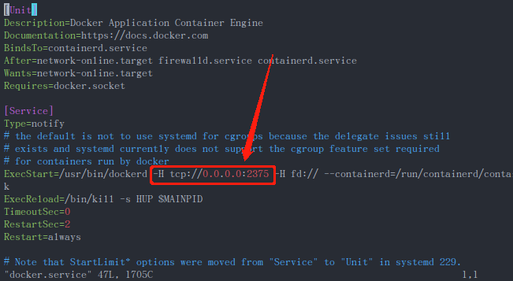
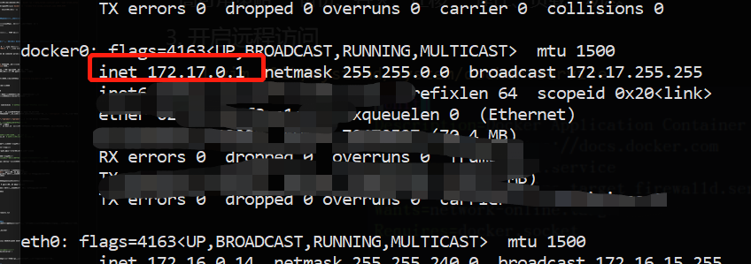
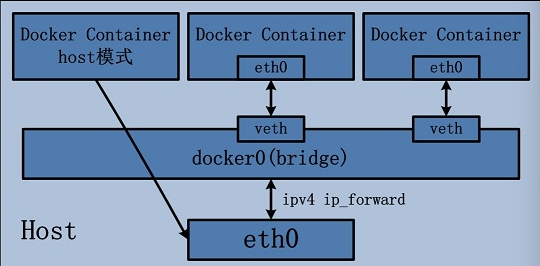
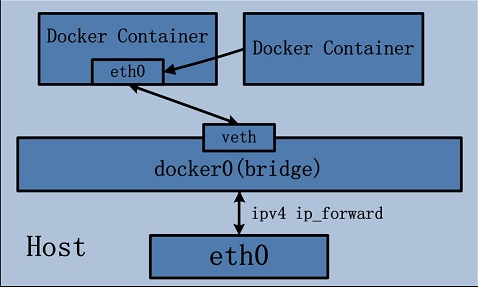
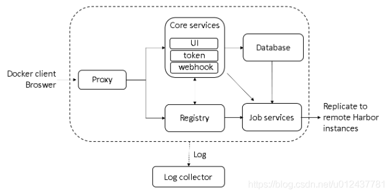

## 1. 介绍

参考资料:https://yeasy.gitbook.io/docker_practice/

* Docker：汽车引擎
* Dockerfile：汽车图纸
* Images：类似于样板车
* Container：把一些汽车的零件，拼接在一起
* Docker compose：老司机
* Docker volume：汽车的油箱
* Docker swarm：交通枢组
* Docker Registry：4s店

tips: Docker本身并不是容器，它是创建容器的工具，是应用容器引擎

### 1.1 Docker的CS模式
#### 1.1.1 步骤
1. Docker Client中来运行Docker的各种命令(docker build etc.)
2. 这些命令会传送给在Docker的宿主机上运行的Docker的守护进程(Server)
3. 守护进程是负责来实现Docker的各种功能
4. 守护进程将命令执行的结果返回给客户端

#### 1.1.2 Remote API(不过多介绍)
Docker提供了守护进程对外的通信接口,支持自定义程序与其集成
[官方文档](https://docs.docker.com/engine/api/)
### 1.2 vmware 和 docker 优劣

|特性|虚拟机|容器|
|-|-|-|
|隔离级别|内核级(操作系统)|进程级|
|隔离策略|Hypervisor|CGroups|
|系统资源|5-15%|0-5%|
|启动时间|分钟级|秒级|
|镜像存储|GB-TB|KB-MB|
|集群规模|上百|上万|
|高可用策略|备份、容灾、迁移|弹性、负载、动态|

## 2. 常规操作

### 1. 安装docker
为了方便国内使用安装docker，推荐使用 daocloud 提供的下载服务

`curl -sSL https://get.daocloud.io/docker | sh`
### 2. 安装docker-compose
为了方便国内使用安装docker-compose，推荐使用 daocloud 提供的下载服务

```sh
curl -L https://get.daocloud.io/docker/compose/releases/download/1.27.4/docker-compose-`uname -s`-`uname -m` > /usr/local/bin/docker-compose

chmod +x /usr/local/bin/docker-compose
```

- 命令行补全提示(可选)

```sh
curl -L https://raw.githubusercontent.com/docker/compose/1.25.5/contrib/completion/bash/docker-compose > /etc/bash_completion.d/docker-compose
```


### 3. DockerHub 加速器

#### 1. ubuntu 16.04+
https://cloud.tencent.com/document/product/457/9113

以下方式支持: Ubuntu 16.04+、Debian 8+、CentOS 7

1. 创建或修改 /etc/docker/daemon.json 文件，并写入以下内容：

```json
{
   "registry-mirrors": [
       "https://mirror.ccs.tencentyun.com"
  ]
}
```

因为笔者的服务器是腾讯云的 所以上方用的是腾讯云的加速器，具体用哪家的看自己的服务器决定
- 网易：https://hub-mirror.c.163.com/
- 阿里云：https://<你的ID>.mirror.aliyuncs.com
- 七牛云加速器：https://reg-mirror.qiniu.com
- 腾讯: https://mirror.ccs.tencentyun.com

2. 依次执行以下命令，重新启动 Docker 服务。

```sh
sudo systemctl daemon-reload
sudo systemctl restart docker
```

3. 检查是否生效
- `docker info`: 查看docker信息

若出现以下信息既为生效

```yaml
Registry Mirrors:
    https://mirror.ccs.tencentyun.com  # 此处以设置的加速器为准
```

### 6. 开启远程访问

**tips: 采用以下非加密方式时 请勿在公网暴露该端口,请勿在生产环境使用，否则将遭受他人恶意攻击！**

1. `vim /lib/systemd/system/docker.service`
2. 添加红框处字符串
3. `systemctl daemon-reload`
4. `systemctl restart docker`
5. `docker -H tcp://{target}:2375 images`若能查到目标机镜像信息既为成功

如需在生产环境使用，请参考以下链接进行TLS加密 如果不需要外网访问且使用云服务器的话可以启用安全策略将入站端口屏蔽
https://docs.docker.com/engine/security/https/

### 7. 容器内访问宿主机网络

1. `ifconfig`查看本机网络
2. 找到`docker0`
3. 该ip地址即可内网访问



 ### 8. 修改容器时间

方法四(推荐)
1. `export TZ=Asia/Shanghai`

or

```docker
ARG TZ="Asia/Shanghai"

ENV TZ ${TZ}
```

or

`docker run -e TZ="Asia/Shanghai" XXXX`

方法一
1. 在运行容器的时候就进行挂载 `-v /etc/localtime:/etc/localtime`(部分系统在该步骤时重启容器即可生效无需第二步)
2. 进入容器中 `echo  'Asia/Shanghai' > /etc/timezone`(不建议在运行容器时当作command输入，可能会破环镜像原本运行的命令)
3. 重启容器

 方法二
1. 将文件复制进去 `docker cp localtime dec317d2e71e:/etc/` (部分系统在该步骤时重启容器即可生效无需第二步)
2. 进入容器中 `echo  'Asia/Shanghai' > /etc/timezone`(不建议在运行容器时当作command输入，可能会破环镜像原本运行的命令)
3. 重启容器

方法三(仅适用于dockerfile)
1. dockerfile文件中`RUN cp /usr/share/zoneinfo/Asia/Shanghai /etc/localtime && echo 'Asia/Shanghai' >/etc/timezone`


### 9. 修改访问仓库为http访问
docker私有仓库服务器，默认是基于https传输,私人使用在不暴露公网情况下可选择http传输

tips: 在客户端上修改(不是在仓库服务端)
1. vi /etc/docker/daemon.json
2. 在文件中添加以下
```json
{
        ...
        "insecure-registries":["localhost:5000"]
}
```
3. `systemctl daemon-reload`
4. `systemctl restart docker`


## 3. 常规命令

- 启动docker：`systemctl start docker`
- 重启docker: `systemctl restart docker`
- 重载守护进程: `systemctl daemon-reload`

### 3.1 docker通用

1. `docker exec -u root container_id -it`
- d: 分离模式, 在后台运行, 不能与另外两个一起使用
- i: 即使没有附加也保持STDIN 打开
- t: 分配一个伪终端
- u: 进入的用户 可搭配: `-u root` 以root权限进入

2. 查看本地镜像仓库: `docker images`
3. alpine类型镜像安装: `apk add xxx`
4. 查看容器资源: `docker stats`
### 3.2 镜像管理

- 查看images下的帮助: `docker image --help`
- 从仓库中拉取镜像(无tag默认拉取最新): `docker pull IMAGE_NAME:TAG`
- 删除本地镜像 镜像名:标签: `docker rmi python:3-alpine`
- 删除本地镜像 IMAGE ID(长ID为镜像ID全称;短ID一般取前3位数即可): `docker rmi c7abf446d82f` or `docker rmi c7a`
- 查看镜像的详细信息(ID or 名称:标签): `docker inspect nginx:latest`
- 修改目标镜像的名字和标签: `docker tag IMAGE_ID NEW_IMAGE_NAME:NEW_TAG`
- 创建镜像: `docker build -t image_name:latest .`
    - -t 参数指定容器镜像的名称和标签
    - "." 号把当前目录设为构建过程中的顶级目录
    - 默认创建脚本为"Dockerfile"
    - 指定创建脚本
        - `docker build -t image_name:latest -f dockerfile_1 .`

### 3.3 容器管理

- 查看容器下的帮助: `docker container --help`
- 从容器中创建镜像: `docker commit -m "提交的描述信息" -a "镜像作者" CONTAINER_ID NEW_IMAGE_NAME:NEW_TAG`
    - `-m` 提交的描述信息 
    - `-a` 镜像作者 
    - 容器ID  
    - 指定要创建的目标镜像名和标签

    
- 查看容器进程
    - 查看顶层容器: `docker ps`
    - 查看全部容器: `docker ps -a`


- 启动容器
    - 构建指定镜像(不带tag将pull latest版本)(不常用): `docker container run IMAGE_NAME`
    - (常用): `docker run -d IMAGE_NAME:tag`
        - `-d`: 以后台daemon的方式运行
    - -P 随机分配端口进行映射: `docker run -P IMAGE_NAME`
    - 将容器5000端口绑定宿主机8000端口用UDP模式: `docker run -p 8000:5000/udp IMAGE_NAME`
    - 构建指定镜像并进入该容器: `docker run -it IMAGE /bin/sh`
        - `-i` 交互
        - `-t` 终端
        - `/bin/sh`一定在后面声明使用的解释器(alpine一般只有sh)
    - 容器运行结束后自我删除: `docker run --rm IMAGE_NAME`
    - 在启动容器命令后加上COMMAND 将会在容器内执行COMMAND :`docker run IMAGE_NAME COMMAND`
    - 构建容器时指定容器名: `docker run --name CONTAINER_NAME IMAGE_NAME`
    - 容器异常时容器: `docker run --restart=always IMAGE_NAME`
    - 更新运行时的容器: `docker update CONTAINER_NAME --restart=always`   https://docs.docker.com/engine/reference/commandline/container_update/
    - 链接其他容器(非常不推荐使用,建议使相关容器绑定新建的网络): `docker run -d --link <name or id>:alias IMAGE_NAME`
        -  `<name or id>`: name和id是源容器的name和id
        -  `alias`: 源容器在link下的别名
        -  链接后双方间可以互相使用 `alias` or `name` or `id` 进行通信
        - 映射实际操作为在双方容器的`/etc/hosts`中设置

- example: `docker run --name container_name -d -p 8000:5000 -e SECRET_KEY=57d40f677 -e MAIL_USERNAME=<your-gmail-username> -e MAIL_PASSWORD=<your-gmail-password> image_name:latest`
    - --name 指容器名；
    - -d 以后台daemon的方式运行
    - -p 把宿主系统的 8000 端口映射到容器的 5000 端口上, 默认tcp模式；
    - -e 设定环境变量；
    - 最后的image_name:latest  指定使用镜像:标签


- 操作容器(可用容器ID或名字)
    - 停止指定的容器进程: `docker stop CONTAINER_ID`
    - 删除指定的容器(需在终结状态): `docker rm CONTAINER_ID`
        - 不推荐使用: `docker container rm CONTAINER_ID`
    - 删除运行中的容器: `docker rm -f CONTAINER_ID`
    - 查看容器内部进程: `docker top CONTAINER_ID`
        - 不推荐使用: `docker container top CONTAINER_ID`
    - 查看容器资源使用情况: `docker stats`
    - 启动容器: `docker start CONTAINER_ID`
    - 重启容器: `docker restart CONTAINER_ID`
    - 暂停容器运行: `docker pause CONTAINER_ID`
    - 恢复暂停的容器运行: `docker unpause CONTAINER_ID`
    - 杀掉容器: `docker kill CONTAINER_ID`
    - 容器详情: `docker inspect CONTAINER_ID`
    - 容器日志: `docker logs CONTAINER_ID`
    - 导出容器快照: `docker export CONTAINER_ID > file.tar`
    - 导入容器快照: `docker import file.tar IMAGE_NAME:TAG_NAME`
    - 进入容器: `docker exec -it CONTAINER_ID /bin/sh`
    - 以root权限进入容器: `docker exec -it -u root CONTAINER_ID /bin/sh`
    - 复制容器内文件到主机: `docker cp CONTAINER_ID:/dir_path target_path`
    - 复制主机文件到容器: `docker cp 主机地址 容器ID:容器地址`


#### 1. health check 健康检查
|命令|说明|
|-|-|
|health-cmd|指定命令在容器内执行，用于检查容器健康状态|
|health-interval|每次健康检查的间隔时间，默认30秒|
|health-retries|假设该值为3，表示若连续三次检测的返回结果都是不健康，就判定该容器不健康，默认值为3|
|health-timeout|超时时间，默认30秒|
|health-start-period|启动时间, 默认0秒|

ex：
`docker run -d --name=healthcheck -p 8181:80 --health-cmd="curl -f localhost:80 || exit 1" --health-interval=15s --health-retries=10 --health-timeout=5s nginx`

## 4. network 网络

### 1. bridge桥接
容器使用虚拟网卡设备对 & `docker0`网桥来构建私有网
- nat网络模型
- 虚拟交换机



e.g. : `docker run -d --net bridge ubuntu`

#### 实现步骤
1. Docker Daemon 利用 veth pair 技术,在宿主机上创建两个虚拟网络接口设备,假设为 
veth0 和 veth1。而 veth pair 技术的特性可以保证无论哪一个 veth 接收到网络报文,都会将 
报文传输给另一方。 
2. Docker Daemon 将 veth0 附加到 Docker Daemon 创建的 docker0 网桥上。保证宿主机的网络报文可以发往 veth0; 
3. Docker Daemon 将 veth1 添加到 Docker Container 所属的 namespace 下,并被改名为 eth0。 

#### 缺点
- 该模式下 Docker Container 不具有一个公有 IP,即和宿主机的 eth0 不处于同一个网段。
导致 的结果是宿主机以外的世界不能直接和容器进行通信。
- 虽然 NAT 模式经过中间处理实现了 这一点,但是 NAT 模式仍然存在问题与不便,如:容器均需要在宿主机上竞争端口,容器 内部服务的访问者需要使用服务发现获知服务的外部端口等。
- 另外 NAT 模式由于是在三层 网络上的实现手段,故肯定会影响网络的传输效率。


### 2. host
采用 host 模式的 Docker Container,可以直接使用 
宿主机的 IP 地址与外界进行通信,若宿主机的 eth0 是一个公有 IP,那么容器也拥有这个公 
有 IP。同时容器内服务的端口也可以使用宿主机的端口,无需额外进行 NAT 转换

e.g. : `docker run -d --net host ubuntu`
#### 缺点
- 网络环境隔离性的弱化,即容器不再拥有隔离、独立的网络栈
- 由于网络隔离性的弱化,该容器会与宿主机共享竞争网络栈的使用
- 容器内部将不再拥有所有的端口资源,原因是部分端口资源已经被宿主机本身的服务占用
- 还有部分端口已经用以bridge网络模式容器的端口映射。

### 3. container


N个容器的网络环境绑定在一个容器上, Container 可以通过 localhost 来访问 namespace 下的其他容器,传输效率较高,但是需要注意的是, 它并没有改善容器与宿主机以外世界通信的情况。

e.g. : `docker run -it --name vm4 --net container:vm1 ubuntu`
- vm1 为共享网络的容器

### 4. none
不为 Docker Container 任何的网络环境

e.g. : ` docker run -it --name vm5 --net none ubuntu`


- 查看网络列表: `docker network ls`
    - ip a # 里面的docker0 为容器分配的网关段
    - ifconfig

- 新增网络类型
    - 创建新的网络类型: `docker network create -d DRIVER_NAME NETWORK_NAME`
        - `docker network create --driver DRIVER_NAME NETWORK_NAME`
- 查看网络模式详情: `docker network inspect NETWORK_NAME`
- 删除网络模式: `docker network rm NETWORK_NAME`
- 配置容器网关模式: `docker run --net NETWORK_NAME IMAGE_NAME /bin/bash`
    - `docker run --network NETWORK_NAME IMAGE_NAME /bin/bash`

**容器a与容器b是同一个网关模式，就建立了互联关系**
- tips
    - 容器内可通过该命令安装ping: `apt install iputils-ping`

- 新建指定网桥ip的网络类型: `docker network create -d DRIVER_NAME --subnet=172.16.100.0/24 NETWORK_NAME`
    - `--subnet`: 网桥ip
    - `-d`：参数指定 Docker 网络类型


#### 4.1 DNS
    
- 在宿主机该文件上可以修改DNS.原有容器需重启生效: `/etc/docker/daemon.json`
- 在容器上该文件可以看容器DNS:`/etc/resolv.conf`

- 指定镜像运行的网络: `docker run --dns=114.114.114.114 --dns-search=test.com IMAGE_NAME`
    - `-h HOSTNAME` 设置主机名 会写到容器 /etc/hostname 和 /etc/hosts
    - `--dns=IP_ADDRESS` 设置解析服务器地址
    - `--dns-search=DOMAIN` 设定容器的搜索域

`/etc/docker/daemon.json`
```json
{
  "dns" : [
    "114.114.114.114",
    "8.8.8.8"
  ]
}
```

## 5. Docker Volume 数据持久化
- 数据卷 可以在容器之间共享和重用
- 对 数据卷 的修改会立马生效
- 对 数据卷 的更新，不会影响镜像
- 数据卷 默认会一直存在，即使容器被删除
- 数据卷存放在`/var/lib/docker/volumes`文件夹中某一个文件夹下面的`_data`文件夹

### 5.1 volume规则
1. 数据卷: 为空则会同步容器中数据, 如果不为空则反向同步到容器中
2. 指定挂载: 不管宿主机中文件夹是否为空, 都会造成容器中数据为空
### 5.2 常用操作
- 挂载指定数据卷(没有会创建):`docker run -v VOLUME_NAME:/usr/share/nginx/html IMAGE_NAME` 
- 挂在匿名数据卷: `docker run -v /usr/share/nginx/html IMAGE_NAME`
- 挂载指定地址数据卷（宿主机地址必须从根目录开始）:`docker run -v $PWD/html:/usr/share/nginx/html IMAGE_NAME`
    - `-v`: 数据卷(可选):容器目录:模式(可选)
        - 模式:(默认读写)
            - `rw`:读写
            - `ro`:只读
- 挂载:`docker run -d --mount source=my-vol,target=/webapp ubuntu:18.04 /bin/sh`
    - --mount给容器挂载数据卷
        - source宿主机目录/数据卷
        - target容器目录

- 创建数据卷:`docker volume create DATA_VOLUME`
- 查看数据卷详情:`docker volume inspect DATA_VOLUME`
- 删除数据卷，需要无容器使用时:`docker volume rm DATA_VOLUME`
- 删除无主的数据卷:`docker volume prune`

### 5.3 共享数据卷容器
1. 先创建一个专门用于同其他容器挂载的已挂载容器: `docker run -v data_volume:/container_path --name volume_container_name IMAGE_NAME`
2. 将其他需要共享的容器挂载到该容器上：`docker run --volumes-from volume_container_name IMAGE_NAME`

- 删除共享数据卷，必须将所有关联容器全部删掉

## 6. dockerfile构建文件

### 6.1 格式
**dockerfile全部关键字都支持exec格式和shell格式**

```dockerfile
CMD ["boot.sh"]  # exec格式(官方推荐), 该格式执行shell时需要  sh -c 
ENTRYPOINT ls /  # shell格式
```

```dockerfile
FROM ubuntu  # 定制的镜像都是基于 FROM 的镜像
LABEL # 指明作者
```

### 6.2 RUN
**注意：Dockerfile 的指令每执行一次都会在 docker 上新建一层。所以过多无意义的层，会造成镜像膨胀过大.可选用分层存储的方式尽量规避**

```dockerfile
RUN python -m venv file  # 执行命令 shell格式
RUN ["命令", "参数1", "参数2"]  # 执行命令 exec格式

# 分层存储
RUN command1 param1 param2 && command2 param1 param2  # 按这种链式执行的话，只有一层
```

1. `CMD`与`RUN`区别:
    - `CMD`:在`docker run`时默认运行的启动命令
    - `RUN`:在`docker build`时运行
2. `CMD`:
    - 可被`docker run`命令行参数中指定要运行的程序所覆盖
    - 如果`Dockerfile`中如果存在多个 CMD 指令，仅最后一个生效

### 6.3 ENV & ARG
- `ENV`: 容器的环境变量
- `ARG`: dockerfile文件内部变量,在build时支持 `--build-arg arg_name=xx`进行修改参数

```dockerfile
ENV username hahah
ENV username=hahah # 容器的环境变量

ARG name xixi
ARG name=bibi  # 内部变量

RUN echo "$username"  # 前面的环境变量可以在容器中或之后的命令中使用
RUN echo "$name" # ARG的环境变量仅能在dockerfile文件中使用
```

修改ARG参数实例
```sh
docker build --build-arg name=dididi  # 此时dockerfile的参数变成了 name=dididi
```

### 6.4 CMD & ENTRYPOINT
- `CMD`:容器启动时默认的可执行体,当有ENTRYPOINT时为默认参数,可被覆盖
- `ENTRYPOINT`:容器启动时默认的可执行体,当存在CMD时,将会把CMD当做默认参数使用,`--entrypoint` `run`时使用该参数会被覆盖.

```dockerfile
CMD ["<可执行文件或命令>","<param1>","<param2>",...]  # 每次 docker run时默认运行

# 如果CMD与ENTRYPOINT一起使用，CMD可给ENTRYPOINT当参数
ENTRYPOINT ["sh"] # 仅最后一个生效
CMD ["boot.sh"]  # 相当于  sh boot.sh  当启动容器时带有其他参数，会覆盖掉CMD的运行。常用来当默认参数使用
```

#### 6.4.2 Example:
```sh
docker run IMAGE_NAME # 此时启动容器会运行  sh boot.sh
docker run IMAGE_NAME xixi.sh  # 此时启动容器会运行 sh xixi.sh
```

### 6.5 COPY & ADD
- `COPY source target`: 将宿主机文件复制到容器中
- `ADD`:比copy多两个特性
    1. 能解压压缩文件,然后复制到镜像
    2. 能远程下载
    3. 缺点：在不解压的前提下,无法复制tar压缩文件.导致性能不佳

```dockerfile
COPY app app # 将宿主机文件复制到容器中
# [--chown=<user>:<group>]：可选参数，用户改变复制到容器内文件的拥有者和属组。

ADD www.baidu.com # 比copy多两个特性：能解压压缩文件，然后复制到镜像；能远程下载 缺点：在不解压的前提下，无法复制 tar 压缩文件。导致性能不佳
```

### 6.6 其余
- `WORKDIR`: 切换到该目录（定义应用所在的顶层目录）
- `USER <用户名>[:<用户组>]`: 指定用户和组 需提前创建好
- `VOLUME <路径>`: 默认指定挂载 或者是原有的数据卷,如果`run`时有指定挂载会被覆盖
- `EXPOSE port`: 用于声明端口

```dockerfile
WORKDIR /home/project # 切换到该目录（定义应用所在的顶层目录）

USER <用户名>[:<用户组>] # 指定用户和组 需提前创建好

VOLUME <路径> # 默认指定挂载 或者是原有的数据卷  如果 run时有指定挂载会被覆盖

EXPOSE 5000 # 仅用于声明端口
```
实例
```dockerfile
FROM python:3-alpine3.9
LABEL fungagis

WORKDIR /usr/src/app

COPY app app
ADD app.tar.gz app

RUN pip install -r requirements.txt

CMD ['python', 'run.py']
```

### 6.7 dockerfile多阶段构建
用处： 可以把一些编译之类的工作(需要特定环境)放在第一个from的镜像里，直接把编译结果copy到第二个from的镜像中，从而减小最终的镜像大小

```dockerfile
# 编译阶段
FROM golang:1.10.3 as go_builder

COPY server.go /build/

WORKDIR /build

RUN CGO_ENABLED=0 GOOS=linux GOARCH=amd64 GOARM=6 go build -ldflags '-w -s' -o server

# 运行阶段
FROM scratch

# 从编译阶段的中拷贝编译结果到当前镜像中
COPY --from=go_builder /build/server /

ENTRYPOINT ["/server"]
```
上方示例的意思是：在完整的go环境中编译玩go二进制后，将改二进制复制到scratch镜像中运行


### 6.8 health check 健康检查
```dockerfile
From nginx:latest

HEALTHCHECK --interval=10s --timeout=5s --retries=3 CMD curl -f localhost:80
```

## 7. 镜像仓库
### 1. docker hub 
- `docker login`: 登录docker hub
- `docker logout`: 退出docker hub
- `docker search KEYWORD`: 查找仓库中的镜像
- `docker tag container_name:latest <dockerhub_username>/container_name:latest`: 修改镜像名称和标签
- `docker push <dockerhub_username>/container_name:latest`: 推送镜像到hub

### 2. 私人镜像仓库
1. `docker run -d -v /registry:/var/lib/registry -p 5000:5000 --restart=always --privileged=true --name registry registry:latest`: 运行仓库镜像
2. `docker push registry_host:port/IMAGE_NAME:TAG`: 将镜像推入指定仓库
3. `docker pull registry_host:port/IMAGE_NAME:TAG`: 将镜像从指定仓库中拉取

### 3. harbor 企业级Registry服务器
Harbor是一个用于存储和分发Docker镜像的企业级Registry服务器，通过添加一些企业必需的功能特性，例如安全、标识和管理等，扩展了开源Docker Distribution

#### features:
- 基于角色的访问控制 ：用户与Docker镜像仓库通过“项目”进行组织管理，一个用户可以对多个镜像仓库在同一命名空间（project）里有不同的权限
- 镜像复制 ： 镜像可以在多个Registry实例中复制（同步）。尤其适合于负载均衡，高可用，混合云和多云的场景。
- 图形化用户界面 ： 用户可以通过浏览器来浏览，检索当前Docker镜像仓库，管理项目和命名空间。
- AD/LDAP 支持 ： Harbor可以集成企业内部已有的AD/LDAP，用于鉴权认证管理。
- 审计管理 ： 所有针对镜像仓库的操作都可以被记录追溯，用于审计管理。
- 国际化 ： 已拥有英文、中文、德文、日文和俄文的本地化版本。更多的语言将会添加进来。
- RESTful API ： RESTful API 提供给管理员对于Harbor更多的操控, 使得与其它管理软件集成变得更容易。
- 部署简单 ： 提供在线和离线两种安装工具， 也可以安装到vSphere平台(OVA方式)虚拟设备。

#### 组件:

- Proxy：Harbor的registry, UI, token等服务，通过一个前置的反向代理统一接收浏览器、Docker客户端的请求，并将请求转发给后端不同的服务。
- Registry： 负责储存Docker镜像，并处理docker push/pull 命令。由于我们要对用户进行访问控制，即不同用户对Docker image有不同的读写权限，Registry会指向一个token服务，强制用户的每次docker pull/push请求都要携带一个合法的token, Registry会通过公钥对token 进行解密验证。
- Core services： 这是Harbor的核心功能，主要提供以下服务：
  - UI：提供图形化界面，帮助用户管理registry上的镜像（image）, 并对用户进行授权。
  - webhook：为了及时获取registry 上image状态变化的情况， 在Registry上配置webhook，把状态变化传递给UI模块。
  - token 服务：负责根据用户权限给每个docker push/pull命令签发token. Docker 客户端向Regiøstry服务发起的请求,如果不包含token，会被重定向到这里，获得token后再重新向Registry进行请求。
- Database：为core services提供数据库服务，负责储存用户权限、审计日志、Docker image分组信息等数据。
- Job Services：提供镜像远程复制功能，可以把本地镜像同步到其他Harbor实例中。
- Log collector：为了帮助监控Harbor运行，负责收集其他组件的log，供日后进行分析。

#### 安装步骤:
tips: 1.  harbor安装分为 在线 和 离线, 本教程以 在线 作为案例  2. 需要安装docker 及 docker-compose
1. 获取harbor: https://github.com/goharbor/harbor/releases
  - `wget -P /workspace/harbor/ https://github.com/goharbor/harbor/releases/download/v2.1.0/harbor-online-installer-v2.1.0.tgz`: 安装目录可自定义  版本可查看github上的版本 实时更新
2. 解压: `tar -zxf harbor-offline-installer-v2.1.0.tgz`
3. 进入文件夹 & 将配置模板复制一份为配置`cp harbor.yml.tmpl harbor.yml`
4. 修改配置文件,里面注释很详细就不多说了,如果不使用https访问,注意将https部分注释
5. 初始化: `./prepare`
6. 安装: `./install.sh`


#### 常规操作:
- 登录仓库: `docker login -u admin -p qidian123 106.55.13.111:5000`
- 改tag: `docker tag hello-world:latest 106.55.13.111:5000/test/hello-world:latest`
- push到仓库: `docker push 106.55.13.111:5000/test/hello-world:latest`


## 8. Docker Compose（单机多容器管理）
### 8.1 安装卸载
- 安装: 若安装很慢可看上方采用daocloud的服务

```sh
sudo curl -L https://github.com/docker/compose/releases/download/1.27.4/docker-compose-`uname -s`-`uname -m` > /usr/local/bin/docker-compose

- sudo chmod +x /usr/local/bin/docker-compose
```

- 命令行补全提示(可选)

```sh
curl -L https://raw.githubusercontent.com/docker/compose/1.25.5/contrib/completion/bash/docker-compose > /etc/bash_completion.d/docker-compose
```

- 卸载

```sh
sudo rm /usr/local/bin/docker-compose
```
### 8.2 术语:
- 服务 (service)：一个应用容器，实际上可以运行多个相同镜像的实例。
- 项目 (project)：由一组关联的应用容器组成的一个完整业务单元。

### 8.3 命令
参考资料: https://yeasy.gitbook.io/docker_practice/compose/commands

常用文件名: `docker-compose.yml`
```yml
version: '3'
services:

  web:
    build: .
    ports:
     - "5000:5000" # 宿主机：容器

  redis:
    image: "redis:alpine"
```

- `docker-compose up -d`: 运行
  - 会生成默认项目名
  - 默认网络
  - `-f` 指定使用的构建模板文件,默认docker-compose.yml
  - `-p` 指定项目名,默认使用所在目录名作为项目名
  - `-d` 以后台daemon的方式运行

- `docker-compose build`: 仅构建
- `docker-compose config`: 检查文件格式
- `down`: 停止up命令启动的容器,并移除网络
- `exec`: 进入指定容器
- `help`: 帮助
- `images`: 列出 Compose 文件中包含的镜像。
- `logs`: 查看服务容器的输出
- `ps`:  列出项目中目前的所有容器
- `top`: 查看各个服务容器内运行的进程
- `pull`: 拉取服务依赖的镜像
- `push`: 推送服务依赖的镜像到 Docker 镜像仓库
- `rm`: 删除所有（停止状态的）服务容器
  - `rm -f`:强制直接删除
  - `rm -v`：删除容器所挂载的数据卷
- `restart`: 重启项目中的服务
- `stop`: 停止已经处于运行状态的容器，但不删除它
- `start`: 启动已经存在的服务容器
- `entrypoint`: 指定服务容器启动后执行的入口文件。

- `scale service=num`: 设置指定服务运行的容器个数
  - Example: `docker-compose scale web=3 db=2`: 将启动 3 个容器运行 web 服务，2 个容器运行 db 服务


### 8.4 模板文件

- build: 指定dockerfile所在文件夹的路径,绝对路径/相对于yml的路径,默认dockerfile
  - context: 指定dockerfile文件path
  - dockerfile: 指定文件名
- command:覆盖容器启动后默认执行的命令
- container_name:指定容器名称
- depends_on:依赖启动顺序,但不会等待到完全启动
- dns: 自定义DNS服务器
- env_file: 设置环境变量的文件(数组)
- environment: 环境编列(可以用数字/字典形式)
- expose: 暴露容器端口,不映射到宿主机
- image: 指定构建的镜像名称/ID
- labels: 辅助说明
- ports: "HOST(可选):CONTAINER" 互联端口信息,如果只给出容器端口则会随便分配一个宿主端口(数组)
- networks: 网络模式
- devices: 指定设备映射关系
- healthcheck: 通过命令检查容器是否健康运行。

#### 8.4.2 Example

健康检查示例：
```yml
healthcheck:
  test: ["CMD", "curl", "-f", "http://localhost"]
  interval: 1m30s  # 间隔
  timeout: 10s  # 超时
  retries: 3  #重试
  start_period: 40s # 启动40秒后
```


```yml
version: '3'
services:

  webapp:
    build: # 指定上下文和文件名
      context: ./dir
      dockerfile: Dockerfile-alternate
      args:
        buildno: 1  # 构建顺序
  app:
    build: ./dir # 默认dockerfile
```
```yml
version: '3'

services:
  web:
    build: .
    depends_on:  # 指定依赖，当数组中容器启动后，才启动当前容器
      - db
      - redis

  redis:
    image: redis

  db:
    image: postgres
```

```yml
version: "3"

services:
  my_src:
    image: mysql:8.0
    restart: always # 重启策略
    volumes:
      - mysql_data:/var/lib/mysql  # 只有全局指定了匿名数据卷才可以做映射
    environment:
        MYSQL_ROOT_PASSWORD: 123456
        MYSQL_DATABASE: dev01

volumes:  # 声明要创建的匿名volumes
  mysql_data:
```

- volumes: 也可以全局使用
    - 宿主机路径(HOST:CONTAINER)
    - 数据卷名称(VOLUME:CONTAINER) 需要额外在文件中配置
    - 访问模式 （HOST:CONTAINER:ro）

```yaml
version: "3"

services:
  sonarqube:
    image: sonarqube:latest
    ports:
      - "9000:9000"
    networks:
      - sonarnet
    environment:
      TZ: Asia/Shanghai
      SONARQUBE_JDBC_USERNAME: sonar
      SONARQUBE_JDBC_PASSWORD: sonar
      SONARQUBE_JDBC_URL: jdbc:postgresql://db:5432/sonar
      
    volumes:
      - sonarqube_conf:/opt/sonarqube/conf
      - sonarqube_data:/opt/sonarqube/data
      - sonarqube_extensions:/opt/sonarqube/extensions
      - sonarqube_bundled-plugins:/opt/sonarqube/lib/bundled-plugins
      - sonarqube_log:/opt/sonarqube/log

  db:
    image: postgres:11.1
    networks:
      - sonarnet
    environment:
      POSTGRES_USER: sonar
      POSTGRES_PASSWORD: sonar
      TZ: Asia/Shanghai
      POSTGRES_DB: sonar
    volumes:
      - postgresql_data:/var/lib/postgresql/data

networks:
  sonarnet:
    driver: bridge

volumes:
  sonarqube_conf:
  sonarqube_data:
  sonarqube_extensions:
  sonarqube_bundled-plugins:
  postgresql_data:
  sonarqube_log:
```

## 9. 容器apt-get源
此源无需添加公钥即可使用
```
deb https://mirrors.tuna.tsinghua.edu.cn/debian/ buster main contrib non-free
deb https://mirrors.tuna.tsinghua.edu.cn/debian/ buster-updates main contrib non-free
deb https://mirrors.tuna.tsinghua.edu.cn/debian/ buster-backports main contrib non-free
deb https://mirrors.tuna.tsinghua.edu.cn/debian-security buster/updates main contrib non-free
```