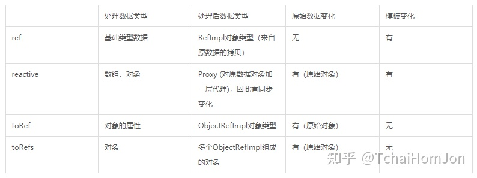

关于cdn:
- 可以使用https://www.bootcdn.cn/ 查找国内cdn.
# 1. vue.js
本文章vue3.x作为记录对象

官方文档: https://v3.cn.vuejs.org/guide/installation.html
## 1. 简介

- 前端三大主流框架之一
    - Angular.js、React.js、Vue.js
- 简单小巧
    - 使用gzip压缩之后，只有20kb左右
    - 入门容易
- 自动进行响应式更新
    - 只需关注前端业务逻辑，无需操作DOM高级特性
    - 解耦视图与数据
    - 可复用组件
    - 前端路由
    - 状态管理
    - 虚拟DOM

Vue.js文档: https://cn.vuejs.org/v2/guide/index.html

### 1.1 MVVM模式
1. 常见架构
- java常采用MVC架构           模型(model)－视图(view)－控制器(controller)
- flask和django采用MVT架构    模型(model)－视图(view)－模板(templates)
- vue.js采用MVVM模式          模型(model)－ViewModel(视图模型)－视图(view) 

2. MVVM模式
- M:模型
    - 从后端获取的数据
- V:视图模板
    - 模板展示
- VM:视图模型
    - 核心控制

### 1.2 组件化

- 模块化
    - 以不同的组件，来划分不同的功能模块
- 复用
- 高效
- 解耦
## 2. 安装

### 2.1 准备环境

- 安装Node.js
    - node官方下载地址: https://nodejs.org/en/download/
    - `node -v` 查看node版本,验证是否安装成功
    - `npm -v` 查看npm版本,验证是否安装成功
    - `cnpm i -g n` 升级node.js
    - `n stable` 选择为稳定版
- 使用淘宝npm镜像源
    - `npm install -g cnpm --registry=https://registry.npm.taobao.org`
### 2.2 安装vue-cli脚手架

- 使用npm
    - `npm install -g @vue/cli`
- 使用淘宝npm镜像源
    - `cnpm install -g @vue/cli`

**tips: 需在要local安装`cnpm i node-saas`**

- `npm install module_name -S`    即    `npm install module_name --save`    写入dependencies
- `npm install module_name -D`    即    `npm install module_name --save-dev` 写入devDependencies
- `npm install module_name -g` 全局安装(命令行使用)
- `npm install module_name` 本地安装(将安装包放在 ./node_modules 下)
### 2.3 创建工程项目(脚手架)

`vue create project_name`

### 2.4 vscode插件

- vutur: 语法高亮、智能感知、Emmet等
- EsLint: 语法纠错
- view in browser: 右键可在浏览器运行html文件
- Auto Close Tag: 自动闭合HTML/XML标签
- Auto Rename Tag: 自动完成另一侧修改
- JavaScript(ES6) code snippets: ES6语法提示&快速输入
- Path Intellisense: 路径补全
- HTML CSS Support: 提示样式
- vue vscode snippets: 快捷键
    例如:
    - vbase:自动生成模板
    - vdata: 自动生成data对象
    - vmethod: 自动生成method对象等

### 2.5 webpack
是前端压缩打包的工具
## 3. 基础

简单vue示例

当这些数据改变时,视图会进行重渲染.需要注意的是只有当实例被创建时已经存在的property才是响应式的

如果需要添加一个新的property将不会有任何更新.

所以如果预期会需要一个property,但是一开始它为空或不存在,那么需要设置一些初始值
```html
<!DOCTYPE html>
<html lang="en">
    <head>
        <meta charset="UTF-8">
        <title>DEMO</title>
        <script src="https://unpkg.com/vue@next"></script>
    </head>
    <body>
        <!-- MVVM模式中的视图  -->
        <div id="app"></div>
        <script>
            // 创建实例
            const app = Vue.createApp({ // 创建实例的对象
                name: "root",
                setup(props, context) { // M 数据层
                    const count = ref(0)
                    const object = reactive({ foo: 'bar' })  

                    // 暴露到template中
                    return {
                        count,
                        object
                    }
                },
                template: `<div>{{ count }} {{ object.foo }}</div>` // V 模板层
            })
            // 根组件
            const vm = app.mount("#app")  // VM 视图数据链接层
            console.log(vm.$data) // 从根组件对象中可以获取所有的数据层 {msg: "hello world"}
        </script>
    </body>
    
</html>
```
### 3.0 ref reactive,toRef,toRefs区别及使用
https://zhuanlan.zhihu.com/p/382893254


### 3.1 UI组件库
https://zhuanlan.zhihu.com/p/61403630
#### 3.1.1 elementUI
https://element.eleme.cn/#/zh-CN/component/installation
- 安装 `cnpm i element-ui -S`
- 导入
```js
import Vue from 'vue';
// elementUI
import ElementUI from 'element-ui';
import 'element-ui/lib/theme-chalk/index.css';

import App from './App.vue';

// 使用
Vue.use(ElementUI);
```

### 3.2 插值表达式
`{{ 变量名 }}` 在"Mustache"语法 (双大括号) 中填写变量名即可

`<div>{{ msg }}</div>` 等价于 `<div v-text="msg"></div>`


[代码示例](./practice/demo4.html)
#### v-once

如果使用了`v-once`指令,将只进行一次插值,之后数据改变将不会更新

`<div v-once>{{ msg }}</div>`

#### v-html
双大括号会将数据解释为普通文本，而非 HTML 代码。为了输出真正的 HTML

用v-html 指令, 可以支持解析html
```html
<span v-html="html"> Using v-html directive </span>

<script>
export default {
    data(){
        return {
            html: "<span style="color: red">This should be red.</span>"
        }
    }
}
</script>
```

#### v-bind
如果需要使用html的attribute,需要使用`v-bind`指令

如果绑定的值是 null 或 undefined，那么该 attribute 将不会被包含在渲染的元素上

```html
<!-- 完整语法 -->
<a v-bind:href="url">...</a>

<!-- 缩写 -->
<a :href="url">...</a>

<!-- 动态参数的缩写 (2.6.0+) -->
<a :[key]="url"> ... </a>

```
```html
<!-- 动态参数 -->
<button :isButtonDisabled="isButtonDisabled" :class="isButtonDisabled===true?'one':'two'">按钮</button>

<script>
export default {
    data(){
        isButtonDisabled: true
    },
    methods: {
        updateValue(){
            this.isButtonDisabled = this.isButtonDisabled === true?false:true
        }
    }
}
</script>
<style>
    .one{color: red}
    .two{color: green}
</style>
```
#### javascript表达式
每个绑定都只能包含单个表达式

模板表达式都被放在沙盒中，只能访问全局变量的一个白名单，如 Math 和 Date 。
```js
{{ number + 1 }}
{{ ok ? 'yes' : 'no' }}
{{ msg.split('').reverse().join('') }}
```
### 3.3 v-if & v-show
`v-if`更加灵活，可以增加多个判断，比如`v-else-if`和`v-else`，而`v-show`不具备这样的灵活性。

`v-if`
- `v-if` 是"真正"的条件渲染，因为它会确保在切换过程中条件块内的事件监听器和子组件适当地被销毁和重建。
- `v-if` 也是惰性的：如果在初始渲染时条件为假，则什么也不做——直到条件第一次变为真时，才会开始渲染条件块。

`v-show`
- `v-show`始终会被渲染, 只是控制DOM元素显示，其实控制的是css样式，也就是`display:none`

一般来说，`v-if`有更高的切换开销，而 `v-show` 有更高的初始渲染开销。
- 因此,如果需要非常频繁地切换，则使用 `v-show` 较好；
- 如果在运行时条件很少改变，则使用 `v-if` 较好。

[代码示例](./practice/demo7.html)

```html
<template>
  <!-- {{}}：插值表达式 -->
  <div class="wrapper">{{msg}}
      <!-- v-if：如果为true则显示，反之则不显示 -->
      <p v-if="isShow">{{xixi}}</p>
      年龄<input v-model="age">
      年龄：{{age}}
      <br>
      <p v-if="age >= 18">年龄大于18岁，已成年</p>
      <p v-else-if="0 < age && age < 18">年龄小于18岁，未成年</p>
      <p v-else>请输入年龄</p>
      <br>
      <p v-show="isShow">sadasdsadsa</p>
  </div>
  
</template>


<script>
export default {
  components:{},
  props:{
      xixi : String // 相当于形参
      },
  name: "learn_1",
  data(){
    return {
        msg : "hahahhahahaha",
        haha : "dxixixiix",
        isShow: true, //
        isShow2: false,
        age : ""
    }
  }
}
</script>
<style lang="scss" scoped>
</style>
```
- v-if:每次都会重新删除或者创建元素，少量操作时使用，较高的切换开销
- v-show:通过`style="display:none;"`将元素隐藏；在有频繁的显示/隐藏操作时使用，较高的渲染开销

### 3.4 v-for
[代码示例](./practice/demo8.html)

在`v-for`块中，可以访问所有父作用域的`property`, 每次使用`v-for`时都需要绑定一个唯一性`key`值.

唯一性`key`值的作用:
- 为了提高循环时性能，在数组其中一项变化后，整个数组不进行全部重新渲染，Vue提供了绑定key值的使用方法，目的就是增加渲染性能，避免重复渲染。
- 不推荐使用`index`, 如果有多个对象需要遍历时,索引不唯一

遍历对象:
- 第一个值: value
- 第二个值: key
- 第三个值: 索引

遍历数组:
- 第一个值: value
- 第二个值: 索引

```js
const app = Vue.createApp({
    data(){
        return {
            objectData: {
                A: 1,
                B: 2,
                C: 3
            },
            arrayData: ["G", "F", "Y"]
        }
    },
    template: `
        <div>
            <p v-for="(value, key, index) in objectData"> 我是对象: [{{ index }}] {{ key }}: {{ value }}</p>
            <p v-for="(item, index) of arrayData">我是数组: [{{ index }}] {{ item }}</p>
        </div>
    `
})
const vm = app.mount("#app")
```
#### 循环数字
数字是从1开始
```html
<span v-for="count in 10"> {{count}} </span>
```

#### 3.4.2 v-if & v-for
当 `v-if` 与 `v-for` 处于同一节点，`v-for` 具有比 `v-if` 更高的优先级。所以 `v-if` 不会生效

此时需要使用`<template></template>`虚拟标签,做一层嵌套,将`v-if`和`v-for`分开.该标签不会显示在实际的dom中
```js
        const app = Vue.createApp({
            data(){
                return {
                    objectData: {
                        A: 1,
                        B: 2,
                        C: 3
                    },
                    arrayData: ["G", "F", "Y"]
                }
            },
            template: `
                <div>
                    <div>
                        <p> for循环嵌套if, 只显示B</p>
                        <ul>
                            <template v-for="(value, key, index) in objectData">
                            <li v-if="key === 'B'">[{{index}}]-{{ value }}</li>
                            </template>
                        </ul>
                    </div>
                </div>
            `
        })
        const vm = app.mount("#app")
```


### 3.5 v-on 绑定事件
vue中的事件名相对于js 只是少了 `on`

如: `onclick` -> `click`

```html
<!-- 完整语法 -->
<a v-on:click="doSomething">...</a>

<!-- 缩写 -->
<a @click="doSomething">...</a>

<!-- 动态参数的缩写 (2.6.0+) -->
<!-- 可以直接使用data()对象中的数据,也可以在里面使用js表达式 -->
<a @[event]="doSomething"> ... </a>
```
```html
<p v-on:click="title='xixixixi'">{{title}}</p>
<p @click="title='xixixixi'">{{title}}</p>
<!-- v-on 缩写@ -->
```

```html
<div id="app"></div>
<script>
    Vue.createApp({
        data(){
            return{
                event1 = "click"
            },
        methods: {
            popup(){
                alert("动态参数")
            }
        },
        template: "<div :[event1]="popup"></div>"
        }
    }).mount("#app")
</script>
```

#### 修饰符
##### prevent
阻止默认行为

方法一: 推荐使用
```js
Vue.createApp({
    methods: {
        popup(){
            alert("提交拉")
        }
    },
    template: `
        <form @click.prevent="popup">
        <button type="submit">submit</button>
        </form>
    `

}).mount("#app")
```
方法二: 繁琐不方便
```js
Vue.createApp({
    methods: {
        popup(e){
            e.preventDefault()
            alert("提交拉")
        }
    },
    template: `
        <form @click="popup">
        <button type="submit">submit</button>
        </form>
    `

}).mount("#app")
```

### 3.6 v-model 数据双向绑定
- v-model 双向绑定,既可以将model中的数据传给输入框的value,也可以将value的数据传给model
- 只能在input、textarea、select元素上使用
- `textarea`等原需要两个标签, 在vue3中可以`<textarea v-model="inputValue" />`仅用一个标签
- 多选框绑定数组可以支持自由添加删减
- 单选框绑定字符串,可实现唯一
- 在使用多选框(checkbox)时,可以使用`true-value`和`false-value`的值做传参

[代码示例](./practice/demo11.html)

```html
<div>
    双向数据绑定{{ inputValue }}
    <input v-model="inputValue" />
    <textarea v-model="inputValue" />
    <hr>
    <div>
        <!-- 初始化时显示的为value中的值 之后会根据状态显示值 -->
        <p>通过选中与未选中判断展示内容:</p> [{{ value }}]
        <input type="checkbox" v-model="value" true-value="勾选我啦" false-value="还没勾选我吗?">
        <hr>
        <p>多选框 {{arrayData}}</p>
        A<input type="checkbox" v-model="arrayData" value="A" />
        B<input type="checkbox" v-model="arrayData" value="B" />
        C<input type="checkbox" v-model="arrayData" value="C" />
    </div>
        
    <div>
        <p>单选框 {{Data}}</p>
        G<input type="radio" v-model="Data" value="G" />
        F<input type="radio" v-model="Data" value="F" />
        H<input type="radio" v-model="Data" value="H" />
    </div>
</div>
```
#### 修饰符
- lazy: 当输入完成后，输入框失去焦点再进行改变
- trim: 消除input框输入内容前后的空格
- number: 字符类型改为数字, 只有首位字符为数字时才会为数字类型,且之后如果输入字符串类型,将不会传入

```html
<div>
    修饰符 lazy trim number
    <p>懒加载: {{lazyData}}</p>
    <input v-model.lazy="lazyData">
    <p>数字类型: {{typeof numberData}}- 值:{{ numberData }}</p>
    <input v-model.number="numberData">
    <p>去除前后端空格: {{trimData}}</p>
    <input v-model.trim="trimData">
</div>
```                    


#### 3.6.2 修饰符
默认情况下，v-model 在每次 input 事件触发后将输入框的值与数据进行同步
```html
<!-- .lazy转为在 change 事件_之后_进行同步  -->
<input v-model.lazy="age">

<!-- .number自动将用户的输入值转为数值类型 -->
<!-- 如果这个值无法被 parseFloat() 解析，则会返回原始的值。 -->
<input v-model.number="age" type="number">

<!-- .trim过滤用户输入的首尾空白字符 -->
<input v-model.trim="msg">
```

### 3.9 vue实例生命周期


#### 3.9.1 生命周期钩子
vue每个组件都是独立的，每个组件都有一个属于它的生命周期，从一个组件创建、数据初始化、挂载、更新、销毁，这就是一个组件所谓的生命周期。

https://v3.cn.vuejs.org/api/options-lifecycle-hooks.html#beforecreate

以下是vue2与vue3的区别

|选项式 API	|Hook inside setup|
-|-
beforeCreate|	Not needed*
created	Not| needed*
beforeMount|	onBeforeMount
mounted	|onMounted
beforeUpdate	|onBeforeUpdate
updated|	onUpdated
beforeUnmount|	onBeforeUnmount
unmounted|	onUnmounted
errorCaptured	|onErrorCaptured
renderTracked|	onRenderTracked
renderTriggered	|onRenderTriggered
activated|	onActivated
deactivated	|onDeactivated


- `beforeCreate`: 在实例生成之前会自动执行函数
- `created`：在实例生成之后会自动执行函数
- `beforeMount`: 在模板渲染完成之前执行的函数
- `mounted`：实例挂载到DOM树之后(渲染完成后执行)
- `beforeUpdate`: 在data变化之前会立即运行函数
- `Updated`: 在data变化之后会立即运行函数
- `beforeUnmount`: 在取消挂载之前运行函数, 通过`app.unmount()`将实例销毁可以看到实例
- `unmounted`: 在取消挂载之后运行函数

- `activated`: 被 keep-alive 缓存的组件激活时调用
- `deactivated`: 被 keep-alive 缓存的组件停用时调用
- `errorCaptured`: 当捕获一个来自子孙组件的错误时被调用
- `renderTracked`: 跟踪虚拟 DOM 重新渲染时调用
- `renderTriggered`: 当虚拟 DOM 重新渲染被触发时调用

[Vue2生命周期代码示例](./practice/demo3.html)

[Vue3生命周期代码示例](./practice/demo3-2.html)


### 3.10 计算属性&侦听器&方法
- computed 和 method都能实现的功能，建议使用computed,因为有缓存，不用渲染页面就刷新。
- computed 和 watch 都能实现的功能，建议使用computed，因为更加简洁。


[计算属性&侦听器 - 代码示例](./practice/demo5.html)
#### 3.10.2 计算属性&方法
- 计算属性的特性,当计算属性依赖的内容发生变化时,才会重新计算
    - 这就意味着只要 依赖内容 还没有发生改变，多次访问计算属性会立即返回之前的计算结果，而不必再次执行函数。比方法更加小的性能开销
- 方法在每次页面渲染的时候都会进行计算
- 在插值表达式中使用的时候,计算属性不需要加括号调用,方法内的需要加括号调用

#### 3.10.3 计算属性&侦听器
计算属性computed必须要返回一个值，而且在页面渲染的同时就会执行里边的业务逻辑，也就是会先执行一遍你写的业务逻辑，而watch只有发生变化时才会执行，也就是说值没有变化，它是不执行里边业务逻辑的

侦听器对象内,以需要侦听的数据作为方法名,会得到两个传参
- 第一个: 当前变化的值
- 第二个: 变化前的值

```js
const app = Vue.createApp({
    data(){
        return {
            price: 20,
            rise: 0,
            history: 0
        }
    },
    watch:{
        price(new_value, old_value){
            console.log("当前变化的值", new_value);
            console.log("变化前的值", old_value);
            this.rise = new_value - old_value;
            this.history += this.rise;
        }

    }
}
)
```

### 3.11 方法
[代码示例](./practice/demo9.html)

- `v-on`指定的函数,如果仅一个函数且没有形参,则无需加`()`括号.
- 如果仅一个函数且只有一个形参,在指定时未使用`()`进行传参,则某人传入`event`对象
- 如果在`v-on`指定函数时仅一个函数且只有一个形参,有传参则按传参传入
- 如果函数有多个形参,则使用`$event`当作实参可传入`event`对象
- 一个事件指定多个函数,必须添加括号`()`, 函数间用逗号`,`隔开

```js
const app = Vue.createApp({
    data(){
        return {
            count : 1
        }
    },
    methods: {
        // 未指定传参则默认传入event对象
        addData(event){
            console.log(event);
            console.log(event.target);
        },
        // 如果要传入event对象,在调用时`$event`
        paramFunc(num, event){
            this.count += num;
            console.log(event.target);
        },
        // 多函数必须都要加括号
        multipleFunc(){
            alert("multiple function");
        }
    },
    template: `
        <div>
            <p>{{ count }}</p>
            <button @click="addData">默认传入事件</button>
            <button @click="paramFunc(5, $event)">带参传入</button>
            <button @click="paramFunc(3, $event), multipleFunc()">多事件</button>
        </div>
    `
})
const vm = app.mount("#app")
```
### 3.12 修饰符

[示例代码](./practice/demo10.html)
#### 事件修饰符
默认触发事件时,从内向外不断冒泡运行

- prevent: 阻止默认事件
- stop: 停止向上冒泡(从下向上)
- capture: 从顶向下
- self: 只有自己被点击才执行
- once: 只运行一次
- passive: 解决滚动时性能的修饰符

#### 键盘修饰符

- enter
- tab
- delete
- esc
- up
- down
- left
- right

```html
<input @keydown.enter="method" />
```

#### 鼠标修饰符

- left
- middle
- right

```html
<input @mousedown.middle="method" />
```
## 4. 组件
[代码示例](./practice/demo12.html)

因为dom标签中如果使用了大写字母,可在使用时以`-`做连接
- `XiaoJieJie`  ---->  `<xiao-jie-jie></xiao-jie-jie>`

也可以直接用
### 根组件
传递给 `createApp` 的选项用于配置根组件。当我们挂载应用时，该组件被用作渲染的起点。

一个应用需要被挂载到一个 DOM 元素中。例如，如果你想把一个 Vue 应用挂载到` <div id="app"></div>`，应该传入 `#app`

```html
<div id="app">
    渲染的起点
</div>
<script>
    import { createApp } from "vue"
    const app = createApp({data() {return {count: 4}}}) // 实例
    const vm = mount("#app"); // 返回的是根组件实例
    vm.count; // 4
</script>
```

### 4.1 全局组件
只要定义了，处处可以使用，性能不高，但是使用起来简单
- 全局组件编写起来确实非常方便，当时全局组件就是你一旦定义了，就会占用系统资源。
- 它是一直存在的，你在任何地方都可以使用这个全局组件。

```js
app.component("titleData", {
    data(){
        return {
            data: "这是我的第" + this.num + "次demo"
        }   
    },
    props: ["num"],
    template: `
        <div>{{ data }}</div>
    `
})
```
### 4.2 局部组件
`{counter, btn: myBtn}`

局部组件在注册的时候可以以键值对的形式,也可以以set的形式
- 键值对形式的时候,key为标签名

```js
// 局部组件
const counter = {
    data(){
        return {
            count: 0
        }
    },
    methods:{
        counter(){
            this.count += 1;
        }
    },
    template: `
        <div>{{ count }}</div>
        <button @click.stop="counter">点我</button>
    `
}
// 局部组件
const myBtn = {
    template: `
        <button>点我无效</button>
    `
}

// 需要在实例中注册
const app = Vue.createApp({
    // 局部组件注册
    components: {counter, btn: myBtn},
    data(){
        return {
            num: 12
        }
    },
    template: `
        <div>
            <counter />
            <btn />
        </div>
    `
})
const vm = app.mount("#app")
```

### 4.3 组件传值
- 动态参数: 使用`v-bind`绑定的参数,该参数的数据类型根据绑定参数而定
- 静态参数: 直接以`dom`属性的形式传参,数据类型永远为字符串类型

参数校验: 如果校验不通过会在控制台中出现告警
- 支持对`String`、`Boolean`、`Array`、`Object`、`Function`和`Symbol`做校验
- 支持做必传校验: `required`
- 支持做默认值: `default`
- 支持`validator`校验器: 可自定义一个校验方法,返回为`true`即为通过
```js
Vue.component("组件名",{
    props: ["形参"],
    template: "生成的模板"
});

Vue.component('blog-post', {
  props: ['show'], // 声明形参
  template: '<h3>{{ show }}</h3>'
})

const component1 = {
    // 对传参的数据类型做校验
    props: {
        A: String,
        B: Boolean,
        C: Array,
        D: Object,
        E: Function,
        F: Symbol
    }
}

const component2 = {
    props: {
        A: {
            type: String,
            required: true  // 必传参数
        },
        B: {
            type: Array,
            default: [1, 2, 3, 4]
        },
        C: {
            type: Boolean,
            validator: (value)=>{
                return value === true
            }
        }
    }
}
```
---
```js
const counter = {
    props: ["name", "age", "height", "popup"],
    data(){
        return {
            count: 0
        }
    },
    methods:{
        counter(){
            this.count += 1;
        }
    },
    template: `
        <div>{{ count }}</div>
        <button @click.stop="counter">点我</button>
        <p>姓名:{{name}}</p> 
        <p>[年龄:{{age}} 数据类型: {{typeof age}}]</p>
        <p>[身高:{{height}} 数据类型: {{typeof height}}]</p>
        <button @click="popup">触发根组件方法</button>
    `
}

const app = Vue.createApp({
    // 局部组件注册
    components: {counter, btn: myBtn},
    data(){
        return {
            num: 12,
            name: "小明",
            age: 30,
            popup: ()=>{ // 传递方法
                alert("这里是根组件的方法")
            }
        }
    },
    template: `
        <div>
            <website />
            <titleData :num="num" />
            <counter :name="name" :age="age" height=200 :popup="popup" />
            <btn />
        </div>
    `
})
```

### 4.4 单向数据流
所有的`prop`都使得其父子`prop`之间形成了一个单向下行绑定：父级`prop`的更新会向下流动到子组件中，但是反过来则不行。
- 简单的说：数据从父级组件传递给子组件，只能单向绑定。子组件内部不能直接修改从父组件传递过来的数据。
- 单项数据流的最终目的，就是为了降低组件的耦合度和独立性。

如下代码示例:
- 子组件如果要对父组件传值参数进行修改,需要重新赋值到一个新的子组件变量上
- 子组件`data()`内,如无内部调用,则只会在初始化子组件时赋值一次,之后父组件传值不会跟着变化
```js
// 子模板
const childBtn = {
    props: ["count"],
    data(){
        return {
            newCount: this.count  // 重新赋值, 此处只会在初始化时运行一次, 之后this.count变化也不会跟着变化
        }
    },
    methods: {
        addCount(){
            this.newCount = this.newCount += 2;
            this.count = this.count += 1;  // [Vue warn]: Attempting to mutate prop "count". Props are readonly.
        }
    },
    template: `
        <p>父组件:count: {{ count }}</p>
        <p>子组件:newCount: {{ newCount }}</p>
        <button @click="addCount">子组件按钮</button>
    `
}

const app = Vue.createApp({
    // 局部组件注册
    components: {childBtn},
    data(){
        return {
            count: 0
        }
    },
    methods: {
        addCount(){
            this.count = this.count += 1;
        }
    },
    template: `
        <div>
            <p>单向数据流</p>
            父组件模板 {{ count }}
            <button @click="addCount">父组件的按钮</button>
            <childBtn :count="count" />
        </div>
    `
})
```

### 4.5 Non-props
[代码实例](./practice/demo13.html)

组件没有接受父组件传递过来的参数，而子组件完全不变的复制了属性到自己的标签上
- 子组件中 如果未在`props`声明的属性, 会继承属性到 子组件属性中
- 如果声明`props`, 则声明的参数在子组件中成为局部变量
- 如果完全不需要继承属性可以使用`inheritAttrs: false`将继承属性关闭
- 多个一级标签,需要进行指定继承:在需要继承的标签内`v-bind="$attrs"`,该标签会接受全部属性. 如果不指定则不会做任何继承
    - `$attrs`是子组件中的系统变量,接受父组件传递的全部属性(子组件未声明props)
    - `$attrs`是一个对象,在子组件内都可以使用,如果需要指定其中某一个属性,可以使用对象取key的方法`$attrs.xxx`
```js
        const nonProps1 = {
            // 如果未声明props, 则在父组件中添加的属性会被传递到 子组件属性中
            template: `
                <div> 你把鼠标放上来瞧瞧 </div>
            `
        }

        const nonProps2 = {
            // 如果声明props, 则在子组件中成为局部变量
            props: ["title"],
            template: `
                <div> 我就没有title属性 </div>
            `
        }

const app = Vue.createApp({
    components: {nonProps1, nonProps2},
    template: `
        <div>
            <nonProps1 title="这就是Non-props" />
            <nonProps2 title="这不是Non-props" style="color: red" />
        </div>
    `
})
```

### 4.6 子组件调用父组件事件
子组件使用父组件时间需要使用`$emit`这个方法
1. 父组件使用`v-on`绑定父组件方法
2. 子组件需要声明在`emits: {}`/`emits: []`声明`v-on`绑定的事件
3. 子组件需要使用`emit(事件, 参数1, 参数N)`向父组件传递参数

子组件可以对向父组件传递的数据做校验, 校验失败在控制台有告警
- `emits: {}`


[代码示例](./practice/demo14.html)
```js
const subEvent1 = {
    emits: ["event1"],  // 声明父组件事件
    methods: {
        subAddCounter(){
            console.log(this.$emit);
            this.$emit("event1", 30)
        }
    },
    template: `
        <div> <button @click="subAddCounter">子组件一</button> </div>
    `
}

const subEvent2 = {
    props: ["count"],
    emits: {  // 声明父组件事件并编写validator对数据进行验证
        event2: (value)=>{
            return value<20?true:false;
        }
    },
    methods: {
        subAddCounter(num){
            this.$emit("event2", this.count + num)
        }
    },
    template: `
        <div> <button  @click="subAddCounter(5)">子组件二</button> </div>
    `
}

const app = Vue.createApp({
    components: {subEvent1, subEvent2},
    data(){
        return {
            count: 0,
            count2: 0,
        }
    },
    methods: {
        addCounter(num){
            this.count = this.count += num;
        },
        addCounterMethod(func){
            this.count2 = func;
        }
    },
    template: `
        <div>
            <p>事件1: {{ count }}</p>
            <p>事件2: {{ count2 }}</p>
            <sub-event1 @event1="addCounter"  />
            <sub-event2 @event2="addCounterMethod" :count="count2"  />
        </div>
    `
})
```

### 4.7 动态组件&状态保存
- 通过在`<component />`标签中使用`:is=""`属性进行动态显示
- 存在需要保存的信息可以使用`<keep-alive></keep-alive>`进行缓存保存

[代码示例](./practice/demo16.html)
```html
<div>
    <keep-alive>
    <component :is="showData" />
    </keep-alive>
    <button @click="switchShow">切换组件</button>
</div>
```

### 4.8 多级组件传值
- 父组件使用`provide`以对象形式声明需要进行多级传值的key和value
- 子组件使用`inject`以数组形式声明需要接受的key

[代码示例](./practice/demo17.html)
```js
const subChild1 = {
    props: ["name"], // 也可参照下面使用
    inject: {"age": {default: 11}},  // 接受声明, 并设置默认值
    template: `
        <p>我是个孙组件 {{ name }}</p>
        <p>我想跨级接收 {{ age }}</p>
    `
}

const subChild2 = {
    props: ["name"],
    inject: ["age"],  // 接受声明
    template: `
        <p>我是个孙组件 {{ name }}</p>
        <p>我想跨级接收 {{ age }}</p>
    `
}

const child = {
    props: ["name"],
    components: {"subchild1": subChild1, "subchild2": subChild2},
    template: `
    <p>我是个子组件: {{ name }}</p>
    <subchild :name="this.name" />
    `
}


const app = Vue.createApp({
    components: {child, subChild1, subChild2},
    data(){
        return{
            name: "我是个胖虎"
        }
    },
    provide: {  // 多级传值声明
        age: 20
    },
    template: `
        <div>
            <child :name="name" />
        </div>
    `
})

const vm = app.mount("#app")
```

### 4.9 异步组件
[代码示例](./practice/demo18.html)


异步组件需要使用`Vue.defineAsyncComponent`这个方法.该方法需要返回一个`Promise`的实例

```js
// 异步组件
const asyncCom = Vue.defineAsyncComponent(()=>{
    return new Promise((resolve, reject)=>{
        setInterval(()=>{
            resolve({
                template: "<div>3秒后我才出现,我是异步组件</div>"
            })
        }, 3000)
    })
})
```


## 5. 样式
[代码示例](./practice/demo6.html)
### 样式绑定
Vue中对模板使用css样式, 支持用数组,字符串,对象的形式控制样式

如果绑定的是style属性, 可以使用 `{样式属性: 样式}` 这种格式声明

```html
<div>
    <p :class="classObject"> 组合显示 </p>
    <p :class="classArray"> 组合显示 </p>
    <p :class="classString"> 组合显示 </p>
    <button @click="updateStyle">你点我试试?</button>

    <p :style="styleObject">我绑定了style</p>

    <my-component style="background: orange" />
</div>
```                
```js
classObject: {red: true, greenBackGround: true, size: true},
classArray: ["red", "greenBackGround", {size: true}],
classString: "size",
styleObject: {color: "green", "font-size": "50px"} // 绑定style属性
```
### 子组件样式绑定
子组件的样式可以在 子组件标签处声明,也可以在子组件模板内声明

子组件模板内需要仅有一个一级标签,否则在子组件处声明样式无效

```js
// 根组件
template: `
<div>
    <p :class="classObject"> 组合显示 </p>
    <p :class="classArray"> 组合显示 </p>
    <p :class="classString"> 组合显示 </p>
    <button @click="updateStyle">你点我试试?</button>

    <p :style="styleObject">我绑定了style</p>

    <my-component style="background: orange" />
</div>
            `


// <!-- 仅有一个一级标签 -->

app.component("my-component", {
template: `
    <div>
        <div class="red">我是红</div>
        <div style="color: green">我是绿</div>    
    </div>
`
})
```

## 6. slot插槽

[代码示例](./practioce/demo15.html)
### 简单插槽

```js
const simpleSolt = {
    template: "<div> 我是个简单插槽 <p><solt></solt></p> </div>"
}
```

### 嵌套子组件插槽
```js
// 根模板省略

const simpleSolt = {
    template: "<div> 我是个简单插槽 <p><solt></solt></p> </div>"
}

const simpleComponent = {
    template: "<div> 别理我 </div>"
}

const app = Vue.createApp({
    component: {simpleSolt, simpleComponent},
    template: `
        <simpleSolt><simpleComponent></simpleComponent></simpleSolt>
    `
})

app.mount("#app")
```
### 默认插槽
如果子组件插槽中有值,在父组件未在子组件标签内填值的情况下.取子组件中的值
```js
// 根模板省略
const defaultSolt = {
    template: `
    <div><solt>我是个默认值</solt></div>
    `
}

const app = Vue.createApp({
    component: {defaultSolt},
    template: `
        <defaultSolt>我要修改你</defaultSolt>
        <defaultSolt></defaultSolt>
        <defaultSolt />
    `
})
app.mount("#app")
```

### 插槽数据作用域
- 父模板里调用的数据属性，使用的都是父模板里的数据
- 子模板里调用的数据属性，使用的都是子模板里的数据
```js
// 根模板省略

const C = {
    data(){ // 子组件使用子组件作用域
        return {
            name: "我是小红呀"
        }
    },
    template: `
        <div> 
            <p>子组件作用域 [{{ name }}]</p> 
            <p><slot></slot></p> 
        </div>
    `
}
const app = Vue.createApp({
    components: {slot1, B, C, defaultSolt, nameSolt, listSolt},
    data(){ // 父组件使用父组件作用域
        return {
            name: "我是小明啊"
        }
    },
    methods: {
    },
    template: `
        <div>
            <C>父组件作用域 [{{ name }}] </C>
        </div>
    `
})

const vm = app.mount("#app")
```
### 具名插槽
- 命名插槽在子组件处需要添加 `name` 属性
- 在父组件需要使用的地方外围以虚拟标签`template`标签包围.并声明指定插槽
- 指定插槽`v-slot:插槽名`或`#插槽名`
```js
const nameSolt = {
    template: `
    <div>
        <p>A</p>
        <slot name="A"></slot>
        <p>B</p>
        <slot name="B"></slot>
        <p>C</p>
        <slot name="C"></slot>
    </div>
    `
}

const app = Vue.createApp({
    components: {nameSolt},
    template: `
        <div>
            <template #B></template>
            <template v-slot:C></template>
            <template #A>我是A你想不到吧</template>
        </div>
    `
})

const vm = app.mount("#app")
```

### 作用域插槽
定义及作用
- 作用域插槽绑定了一套数据，父组件可以拿来用。
- 样式父组件说了算，但内容可以显示子组件插槽绑定的

使用
- 子组件插槽处使用`v-for`遍历数据 并将遍历的数据 进行绑定 `v-bind`
- 父组件在子组件标签处接受子组件绑定的值 `v-slot="任意参数即可"`
    - 相当于子组件的值复制给父组件声明的参数
    - 子组件的值是一个对象, 所以支持解构赋值. 直接在`v-slot="{参数}"`中使用解构赋值.此处参数必须为子组件绑定的参数
    - 通过`v-slot="{ item: todo }"`还可以重命名 将item修改为todo
    - 通过`v-slot="{ item = 'Placeholder' }"`设置默认值

简写: `#default="scope"` -> 如果有指定具名插槽将default改成具名插槽,如果没有则一定要选择default.  相当于`v-slot:default="scope"`

```js
const listSolt = {
    data(){
        return {
            list = [1, 2, 3, 4, 5]
        }
    },
    template: `
        <solt v-for="item of list" :item="item" ></solt>
    `
}
const app = Vue.createApp({
    components: {listSolt},
    template: `
        <div>
            <listSolt v-slot="{item}">
                <div>{{item}}</div>
            </listSolt>
            <listSolt v-slot="param">
                <div>{{param}}</div>
                <div>{{param.item}}</div>
            </listSolt>
        </div>
    `
})

const vm = app.mount("#app")
```

### 实例(异步组件+默认插槽+具名插槽+作用域插槽)


[代码示例](./practice/demo19.html)


## 7. composition api

# 2. vue-router路由库
官方文档: https://next.router.vuejs.org/zh/guide/

1. 安装路由插件：`cnpm install vue-router`
2. 为了方便维护路由，一般都要在src目录创建一个路由目录(router),创建js文件(index.js)
3. 将下面引用放置在js文件中

## 创建简单路由表
`app.use(router)`之后可以在任意组件中
- 以 `this.$router` 的形式访问, `router`对象,是路由器实例
- 以 `this.$route` 的形式访问, `route`对象,是当前路由的情况
    - 如果是动态路由: `this.$route.params`获取参数对象
    - 如果是查询字符串: `this.$route.query`获取参数对象

```js
// 1. 定义路由组件
const Home = {template: "<div>Home</div>"}
const About = {template: "<div>About</div>"}

// 2. 定义路由  路由与组件的映射关系
const routes = [
    {path: "/", component: Home},
    {path: "/about", component: About}
    ]

// 3. 实例化路由
const router = VueRouter.createRouter({
    // 4. 内部提供了 history 模式的实现
    history: VueRouter.createWebHashHistory(),
    routes
})

// 5. 创建vue实例,使用路由
const app = Vue.createAPP({})
app.use(router);
app.mount("app");
```

## 动态路由匹配
路径参数 用冒号 `:` 表示
- 当路由被匹配时,它的 `params` 的值将在每个组件中以 `this.$route.params` 的形式暴露出来
- 将路径参数作为key,匹配到的数据作为值

e.g
- 匹配模式: `/users/:username/posts/:postId`	
- 路径:`/users/eduardo/posts/123`	
- params: `{ username: 'eduardo', postId: '123' }`

示例: `/username/:id`  可以匹配 `/username/xiaoming`
```js
const User = {
  template: '<div>User {{ $route.params.id }}</div>',
}
```

采用动态路由匹配到相同的组件实例将被重复使用,此时需要使用`watch`侦听器对路由变化产生的数据进行重新渲染

### 自定义匹配
采用正则表达式实现自定义匹配

```js

const routes = [
  // 将匹配所有内容并将其放在 `$route.params.pathMatch` 下
  { path: '/:pathMatch(.*)*', name: 'NotFound', component: NotFound },
  // 将匹配以 `/user-` 开头的所有内容，并将其放在 `$route.params.afterUser` 下
  { path: '/user-:afterUser(.*)', component: UserGeneric },
]


// 数字的路由将会有限匹配 orderId
const routes = [
  // /:orderId -> 仅匹配数字
  { path: '/:orderId(\\d+)' },
  // /:productName -> 匹配其他任何内容
  { path: '/:productName' },
]
```

## 嵌套路由
children 配置只是另一个路由数组，就像 routes 本身一样。可以根据自己的需要，不断地嵌套视图

子路由会向上渲染到上一级路由的`<router-view>`中

以 `/`开头的为根路径, 子路由的`path`会与根路径拼接
```js
const routes = [
    {
        path: '/user/:id',  // 以 `/`开头的为根路径
        component: User,
        children: [
            {
                // 当 /user/:id/profile 匹配成功 
                // UserProfile 将被渲染到 User 的 <router-view> 内部
                path: 'profile',
                component: UserProfile,
            },
            {
                // 当 /user/:id/posts 匹配成功
                // UserPosts 将被渲染到 User 的 <router-view> 内部
                path: 'posts',
                component: UserPosts,
            },
                // UserHome 将被渲染到 User 的 <router-view> 内部
            { 
                path: '', 
                component: UserHome 
            }
        ],
    },
]
```
## 编程式导航&声明式导航

|说明|声明式|编程式|
|-|-|-|
|导航|`<router-link :to="...">`|`router.push(...)`|
|替换|`<router-link :to="..." replace>`|`router.replace(...)`|

在vue的实例中,以下都可以全局使用:
- `this.$router.push`: 这个方法会向 history 栈添加一个新的记录
- `<router-link :to="...">`: 点击该标签 相当于调用 `router.push(...)`

### 导航

```js
// 字符串路径
router.push('/users/eduardo')

// 带有路径的对象
router.push({ path: '/users/eduardo' })

// 命名的路由，并加上参数，让路由建立 url
router.push({ name: 'user', params: { username: 'eduardo' } })

// 带查询参数，结果是 /register?plan=private
router.push({ path: '/register', query: { plan: 'private' } })

// 带 hash，结果是 /about#team
router.push({ path: '/about', hash: '#team' })
```
如果提供了 path，params 会被忽略
```js
const username = 'eduardo'
// 我们可以手动建立 url，但我们必须自己处理编码
router.push(`/user/${username}`) // -> /user/eduardo
// 同样
router.push({ path: `/user/${username}` }) // -> /user/eduardo
// 如果可能的话，使用 `name` 和 `params` 从自动 URL 编码中获益
router.push({ name: 'user', params: { username } }) // -> /user/eduardo
// `params` 不能与 `path` 一起使用
router.push({ path: '/user', params: { username } }) // -> /user
```

### 替换
```js
router.push({ path: '/home', replace: true })
// 相当于
router.replace({ path: '/home' })
```
### 横跨历史
表示在历史堆栈中前进或后退多少步
```js
// 向前移动一条记录，与 router.forward() 相同
router.go(1)

// 返回一条记录，与router.back() 相同
router.go(-1)

// 前进 3 条记录
router.go(3)

// 如果没有那么多记录，默认失败
router.go(-100)
router.go(100)
```

## 命名路由
除了 path 之外，你还可以为任何路由提供 name

优点:
- 没有硬编码的 URL
- params 的自动编码/解码。
- 防止你在 url 中出现打字错误。
- 绕过路径排序（如显示一个）

```js
// 目标路由地址: /user/erina
const routes = [
  {
    path: '/user/:username',
    name: 'user',  // 命名
    component: User
  }
]

// 编程式
router.push({ name: 'user', params: { username: 'erina' } })
```
声明式:
```html
<router-link :to="{ name: 'user', params: { username: 'erina' }}">
  User
</router-link>
```

## 命名路由视图
在`<router-view name="LeftSidebar">`标签中声明`name`需要使用的组件.该组件需要在路由表中映射,否则将直接忽略不会被渲染.
- name: 声明的组件名.需要与路由表中key相同名字

```html
<router-view class="view left-sidebar" name="LeftSidebar"></router-view>
<router-view class="view main-content"></router-view>
<router-view class="view right-sidebar" name="RightSidebar"></router-view>
```
如果只是单个组件使用`component: string`形式,如果多个组件则`components: {}`的形式
```js
const router = createRouter({
  history: createWebHashHistory(),
  routes: [
    {
      path: '/',
      components: {
        default: Home,
        // LeftSidebar: LeftSidebar 的缩写
        LeftSidebar,
        // 它们与 `<router-view>` 上的 `name` 属性匹配
        RightSidebar,
      },
    },
  ],
})
```
### 嵌套命名视图
在同一个父组件下有多个路由映射多个子组件的情况下,可以使用嵌套命名视图
```html
<div>
  <h1>User Settings</h1>
  <NavBar />
  <!-- 默认视图 -->
  <router-view />
  <!-- 当前路由下,如果有 helper 这个组件就会显示,如果没有就忽略 -->
  <router-view name="helper" />
</div>
```
```js
// 路由表
{
  path: '/settings',
  // 你也可以在顶级路由就配置命名视图
  component: UserSettings,
  children: [{
    path: 'emails',
    component: UserEmailsSubscriptions // 默认视图
  }, {
    path: 'profile',
    components: {
      default: UserProfile, // 默认视图
      helper: UserProfilePreview // 命名视图,如果模板中有使用该命名视图则显示.如果模板中的命名视图名字与路由表中key不相同则忽略
    }
  }]
}
```
## 重定向
redirect的路由,可以不需要component
```js
// 可以使用路径
const routes = [{ path: '/home', redirect: '/' }]

// 可以使用命名
const routes = [{ path: '/home', redirect: { name: 'homepage' } }]

// 可以通过函数动态返回
const routes = [
  {
    // /search/screens -> /search?q=screens
    path: '/search/:searchText',
    redirect: to => {
      // 方法接收目标路由作为参数
      // return 重定向的字符串路径/路径对象
      return { path: '/search', query: { q: to.params.searchText } }
    },
  },
  {
    path: '/search',
    // ...
  },
]
```
## 别名
别名: 给一个路由定义多个path
- 如果path具有路径参数,别名中也需要有路径参数
```js
// 访问/home 实际上访问的是 /
const routes = [{ path: '/', component: Homepage, alias: '/home' }]

// 以数组形式定义多个路由, 支持根路径
const routes = [
  {
    path: '/users',
    component: UsersLayout,
    children: [
      // 为这 3 个 URL 呈现 UserList
      // - /users
      // - /users/list
      // - /people
      { path: '', component: UserList, alias: ['/people', 'list'] },
    ],
  },
]
```
## 路由组件传参
布尔模式: 当 `props` 设置为 `true` 时，`route.params` 将被设置为组件的 `props`。
```js
const User = {
  props: ['id'],  // 将{id: $router.params.id}传入
  template: '<div>User {{ id }}</div>'
}
const routes = [{ path: '/user/:id', component: User, props: true }]
```
命名视图: 必须为每个命名视图定义 props 配置
```js
const routes = [
  {
    path: '/user/:id',
    components: { default: User, sidebar: Sidebar },
    props: { default: true, sidebar: false }
  }
]
```
对象模式: 当 props 是一个对象时，它将原样设置为组件 props
```js
const routes = [
  {
    path: '/promotion/from-newsletter',
    component: Promotion,
    props: { newsletterPopup: false } //  将{ newsletterPopup: false }传入到组件
  }
]
```
函数模式
```js
const routes = [
  {
    path: '/search',
    component: SearchUser,
    props: route => ({ query: route.query.q })  // 将{query: 查询字符串q的值} 传入组件
  }
]
```
## 历史模式
HTML5 模式
```js
import { createRouter, createWebHistory } form "vue-router"

const router = createRouter({
    history: createWebHistory();  // 创建历史模式
    routes: [
        {
            path: '/user'
            name: "user"
            component: ()=>{
                import("../views/User.vue")
            }
        }
    ]
})

```
## 导航守卫
使用 `router.beforeEach` 注册一个全局前置守卫
- to: 即将要进入的目标
- from: 当前导航正要离开的路由


### 前置导航

返回值:如果返回一下
- false: 取消当前的导航
- replace: replace: true
- name: name: 'home'
```js
router.beforeEach((to, from, next) => {
    document.title = `${to.meta.title} | vue-manage-system`;
    const role = sessionStorage.getItem("ms_username");
    if (!role) {
        next('/login');
    } else if (role && to.path === '/login') {
        next('/');
    } else if (to.meta.permission) {
        // 如果是管理员权限则可进入，这里只是简单的模拟管理员权限而已
        role === 'admin'
            ? next()
            : next('/403');
    } else {
        next();
    }
});
```

### 解析守卫
在导航被确认之前，同时在所有组件内守卫和异步路由组件被解析之后，解析守卫就被调用
```js
router.beforeResolve(async to => {
  if (to.meta.requiresCamera) {
    try {
      await askForCameraPermission()
    } catch (error) {
      if (error instanceof NotAllowedError) {
        // ... 处理错误，然后取消导航
        return false
      } else {
        // 意料之外的错误，取消导航并把错误传给全局处理器
        throw error
      }
    }
  }
})

```

### 后置导航
```js
router.afterEach((to, from, failure) => {
  if (!failure) sendToAnalytics(to.fullPath)
})

```
### 路由级导航守卫
`beforeEnter` 守卫 只在进入路由时触发,不会在 `params`、`query` 或 `hash` 改变时触发.只有在 从一个不同的 路由导航时，才会被触发
```js
const routes = [
  {
    path: '/users/:id',
    component: UserDetails,
    beforeEnter: (to, from) => {  // 声明在路由对象中
      // reject the navigation
      return false
    },
  },
]


// 支持以数组形式多个导航守卫
function removeQueryParams(to) {
  if (Object.keys(to.query).length)
    return { path: to.path, query: {}, hash: to.hash }
}

function removeHash(to) {
  if (to.hash) return { path: to.path, query: to.query, hash: '' }
}

const routes = [
  {
    path: '/users/:id',
    component: UserDetails,
    beforeEnter: [removeQueryParams, removeHash],
  },
  {
    path: '/about',
    component: UserDetails,
    beforeEnter: [removeQueryParams],
  },
]
```
### 组件级守卫
```js
const UserDetails = {
  template: `...`,
  beforeRouteEnter(to, from) {
    // 在渲染该组件的对应路由被验证前调用
    // 不能获取组件实例 `this` ！
    // 因为当守卫执行时，组件实例还没被创建！
  },
  beforeRouteUpdate(to, from) {
    // 在当前路由改变，但是该组件被复用时调用
    // 举例来说，对于一个带有动态参数的路径 `/users/:id`，在 `/users/1` 和 `/users/2` 之间跳转的时候，
    // 由于会渲染同样的 `UserDetails` 组件，因此组件实例会被复用。而这个钩子就会在这个情况下被调用。
    // 因为在这种情况发生的时候，组件已经挂载好了，导航守卫可以访问组件实例 `this`
  },
  beforeRouteLeave(to, from) {
    // 在导航离开渲染该组件的对应路由时调用
    // 与 `beforeRouteUpdate` 一样，它可以访问组件实例 `this`
  },
}
```
`beforeRouteEnter` 守卫 可以通过传一个回调给 `next` 来访问组件实例
```js
beforeRouteEnter (to, from, next) {
  next(vm => {
    // 通过 `vm` 访问组件实例
  })
}
```

# 3. axios请求库
官方文档: https://www.kancloud.cn/yunye/axios/234845

调用网站:https://dog.ceo/api/breeds/image/random

## 安装
`npm install axios`

如果使用了cnpm: `cnpm install axios`

cdn: `<script src="https://unpkg.com/axios/dist/axios.min.js"></script>`

## 简介
- 非常流行的请求库
- vue发起异步请求的标配
安装 `npm install axios -S`


### 创建实例
```js
// 实例化
const request = axios.create({
    baseURL: "www.baidu.com",
    timeout: 1000,
    headers: {
        "Content-Type": "application/json"
    }
})

// 使用实例发起请求
request.post("/user", {
    firstname: "hello",
    lastname: "world"
}).then(res=>{
    console.log(res);
}).catch(err=>{
    console.log(err);
})

// 直接用实例可以请求
request({
    method: "post",
    url: "/login",
    data: data
}).then(res=>{
    console.log(res);
}).catch(err=>{
    console.log(err);
})
```

直接使用axios也可以(非实例)
```js
axios({
    method: 'post',
    url: '/user/123',
    data: {
        firstname: "hello",
        lastname: "world"
    }
});
```

### 配置全局使用
```js
// ./api/index.js
import axios from "axios"

const service = axios.create({
    baseURL: "/api",
    timeout: 5000,
    headers: {
        "Content-Type": "application/json"
    }
})

export default service

```
```js
// main.js

import Axios from "./api/index"


const app = createApp(App)

// 添加到全局使用
app.config.globalProperties.$axios=Axios

app
    .use(store)
    .use(router)
    .mount('#app')
```
```js
export default {
    data(){
        return {
            loginData: {
                //  省略............
            }
        }
    },
    methods: {
        // 全局使用axios
        send(){
            this.$axios.post("/login", this.loginData).then(res=>{
                console.log(res);
            }).catch(err=>{
                console.log(err);
            })
        }
    }
}
```

### 请求

别名请求: 可以是静态方法,也可以是实例方法
- axios.request(config)
- axios.get(url[, config])
- axios.delete(url[, config])
- axios.head(url[, config])
- axios.post(url[, data[, config]])
- axios.put(url[, data[, config]])
- axios.patch(url[, data[, config]])

并发:以下都是静态方法, 非实例方法
- axios.all(iterable)
- axios.spread(callback)

#### get
axios的get请求有两种形式, 一种直接在url中写好查询字符串, 另一种是在`get`的第二个参数中传入一个对象,对象包含`param`这个对象,该对象内写查询字符串
```js
// get
axios.get("/user?ID=123").then(res=>{
    console.log(res);
}).catch(err=>{
    console.log(err);
})

axios.get("/user", {
    params: {
        ID: 123
    }
}).then(res=>{
    console.log(res);
}).catch(err=>{
    console.log(err);
})
```
#### post
```js
// post
axios.post("/user", {
    firstname: "hello",
    lastname: "world"
}).then(res=>{
    console.log(res);
}).catch(err=>{
    console.log(err);
})

```
#### 并发请求

```js
export default methods: {

    send(){
        login2(this.loginData)
    },  // 注意 all需要的是请求方法(login)返回,而不是.then和.catch

    send3(){
        login(this.loginData)
    },

    allSend(){
        this.$axios.all([this.send3()]).then(
            this.$axios.spread((func1, func2)=>{
                console.log(func1);
                console.log(func2);
            })
        )
    }

    // 
}
```

### 请求参数
只有 url 是必需的。如果没有指定 method，请求将默认使用 get 方法
```js
{
  // `url` 是用于请求的服务器 URL
  url: '/user',

  // `method` 是创建请求时使用的方法
  method: 'get', // 默认是 get

  // `baseURL` 将自动加在 `url` 前面，除非 `url` 是一个绝对 URL。
  // 它可以通过设置一个 `baseURL` 便于为 axios 实例的方法传递相对 URL
  baseURL: 'https://some-domain.com/api/',

  // `transformRequest` 允许在向服务器发送前，修改请求数据
  // 只能用在 'PUT', 'POST' 和 'PATCH' 这几个请求方法
  // 后面数组中的函数必须返回一个字符串，或 ArrayBuffer，或 Stream
  transformRequest: [function (data) {
    // 对 data 进行任意转换处理

    return data;
  }],

  // `transformResponse` 在传递给 then/catch 前，允许修改响应数据
  transformResponse: [function (data) {
    // 对 data 进行任意转换处理

    return data;
  }],

  // `headers` 是即将被发送的自定义请求头
  headers: {'X-Requested-With': 'XMLHttpRequest'},

  // `params` 是即将与请求一起发送的 URL 参数
  // 必须是一个无格式对象(plain object)或 URLSearchParams 对象
  params: {
    ID: 12345
  },

  // `paramsSerializer` 是一个负责 `params` 序列化的函数
  // (e.g. https://www.npmjs.com/package/qs, http://api.jquery.com/jquery.param/)
  paramsSerializer: function(params) {
    return Qs.stringify(params, {arrayFormat: 'brackets'})
  },

  // `data` 是作为请求主体被发送的数据
  // 只适用于这些请求方法 'PUT', 'POST', 和 'PATCH'
  // 在没有设置 `transformRequest` 时，必须是以下类型之一：
  // - string, plain object, ArrayBuffer, ArrayBufferView, URLSearchParams
  // - 浏览器专属：FormData, File, Blob
  // - Node 专属： Stream
  data: {
    firstName: 'Fred'
  },

  // `timeout` 指定请求超时的毫秒数(0 表示无超时时间)
  // 如果请求话费了超过 `timeout` 的时间，请求将被中断
  timeout: 1000,

  // `withCredentials` 表示跨域请求时是否需要使用凭证
  withCredentials: false, // 默认的

  // `adapter` 允许自定义处理请求，以使测试更轻松
  // 返回一个 promise 并应用一个有效的响应 (查阅 [response docs](#response-api)).
  adapter: function (config) {
    /* ... */
  },

  // `auth` 表示应该使用 HTTP 基础验证，并提供凭据
  // 这将设置一个 `Authorization` 头，覆写掉现有的任意使用 `headers` 设置的自定义 `Authorization`头
  auth: {
    username: 'janedoe',
    password: 's00pers3cret'
  },

  // `responseType` 表示服务器响应的数据类型，可以是 'arraybuffer', 'blob', 'document', 'json', 'text', 'stream'
  responseType: 'json', // 默认的

  // `xsrfCookieName` 是用作 xsrf token 的值的cookie的名称
  xsrfCookieName: 'XSRF-TOKEN', // default

  // `xsrfHeaderName` 是承载 xsrf token 的值的 HTTP 头的名称
  xsrfHeaderName: 'X-XSRF-TOKEN', // 默认的

  // `onUploadProgress` 允许为上传处理进度事件
  onUploadProgress: function (progressEvent) {
    // 对原生进度事件的处理
  },

  // `onDownloadProgress` 允许为下载处理进度事件
  onDownloadProgress: function (progressEvent) {
    // 对原生进度事件的处理
  },

  // `maxContentLength` 定义允许的响应内容的最大尺寸
  maxContentLength: 2000,

  // `validateStatus` 定义对于给定的HTTP 响应状态码是 resolve 或 reject  promise 。如果 `validateStatus` 返回 `true` (或者设置为 `null` 或 `undefined`)，promise 将被 resolve; 否则，promise 将被 rejecte
  validateStatus: function (status) {
    return status >= 200 && status < 300; // 默认的
  },

  // `maxRedirects` 定义在 node.js 中 follow 的最大重定向数目
  // 如果设置为0，将不会 follow 任何重定向
  maxRedirects: 5, // 默认的

  // `httpAgent` 和 `httpsAgent` 分别在 node.js 中用于定义在执行 http 和 https 时使用的自定义代理。允许像这样配置选项：
  // `keepAlive` 默认没有启用
  httpAgent: new http.Agent({ keepAlive: true }),
  httpsAgent: new https.Agent({ keepAlive: true }),

  // 'proxy' 定义代理服务器的主机名称和端口
  // `auth` 表示 HTTP 基础验证应当用于连接代理，并提供凭据
  // 这将会设置一个 `Proxy-Authorization` 头，覆写掉已有的通过使用 `header` 设置的自定义 `Proxy-Authorization` 头。
  proxy: {
    host: '127.0.0.1',
    port: 9000,
    auth: : {
      username: 'mikeymike',
      password: 'rapunz3l'
    }
  },

  // `cancelToken` 指定用于取消请求的 cancel token
  // （查看后面的 Cancellation 这节了解更多）
  cancelToken: new CancelToken(function (cancel) {
  })
}
```

### 响应结构

```js
{
  // `data` 由服务器提供的响应
  data: {},

  // `status` 来自服务器响应的 HTTP 状态码
  status: 200,

  // `statusText` 来自服务器响应的 HTTP 状态信息
  statusText: 'OK',

  // `headers` 服务器响应的头
  headers: {},

  // `config` 是为请求提供的配置信息
  config: {}
}
```
接受到的响应是个对象
```js
axios.get('/user/12345')
  .then(function(response) {
    console.log(response.data);
    console.log(response.status);
    console.log(response.statusText);
    console.log(response.headers);
    console.log(response.config);
  });
```
### 配置
#### 全局默认值

```js
axios.defaults.baseURL = 'https://api.example.com';
axios.defaults.headers.common['Authorization'] = AUTH_TOKEN;
axios.defaults.headers.post['Content-Type'] = 'application/x-www-form-urlencoded';
```
实例配置
```js
// 创建实例时设置配置的默认值
var instance = axios.create({
  baseURL: 'https://api.example.com'
});

// 在实例已创建后修改默认值
instance.defaults.headers.common['Authorization'] = AUTH_TOKEN;
```

#### 配置优先级
`lib/defaults.js` 找到的库的默认值，然后是实例的 `defaults` 属性，最后是请求的 `config` 参数。后者将优先于前者
```js
// 使用由库提供的配置的默认值来创建实例
// 此时超时配置的默认值是 `0`
var instance = axios.create();

// 覆写库的超时默认值
// 现在，在超时前，所有请求都会等待 2.5 秒
instance.defaults.timeout = 2500;

// 为已知需要花费很长时间的请求覆写超时设置
instance.get('/longRequest', {
  timeout: 5000
});
```

### 拦截器
在请求或响应被 `then` 或 `catch` 处理前拦截它们。


```js
// 添加请求拦截器
const A = axios.interceptors.request.use(function (config) {
    // 在发送请求之前做些什么
    return config;
  }, function (error) {
    // 对请求错误做些什么
    return Promise.reject(error);
  });

// 添加响应拦截器
const B = axios.interceptors.response.use(function (response) {
    // 对响应数据做点什么
    return response;
  }, function (error) {
    // 对响应错误做点什么
    return Promise.reject(error);
  });


// 给实例添加拦截器
const request = axios.create({
    baseURL: "/api",
    timeout: 5000,
    headers: {
        "Content-Type": "application/json"
    }
})

const C = request.interceptors.request.use(config=>{
    return config;
}, error=>{
    return Promise.reject(error);
});

const D = request.interceptors.response.use(response=>{
    return response;
}, error=>{
    return Promise.reject(error);
})

// 移除拦截器
axios.interceptors.request.eject(A);
axios.interceptors.request.eject(B);
axios.interceptors.request.eject(C);
axios.interceptors.request.eject(D);
```

### 集中管理api
在项目的根目录下新建`api/index.js`文件.该文件集中管理api,将项目所涉及的api都放在此文件上

```js
// api/index.js
import axios form "axios"

// 实例
const service = axios.create({
    baseURL: "/api",
    timeout: 5000,
    headers: {
        "Content-Type": "application/json"
    }
})

export const fetchData = query => {
    return request({
        url: './table.json',
        method: 'get',
        params: query
    });
};

export const login = data => {
    return request.post("/login", data)
}

export const login2 = data => {
    return request({
        method: "post",
        url: "/login",
        data: data
    })
}
```
### 跨域cors
在项目根目录上新建`vue.config.js`文件. 在该文件中设置代理

tip: 修改配置后,需要重启服务.热重启是没有效果的
```js
// vue.config.js
module.exports = {
    devServer: {
        proxy: {
            '/api': {  // 声明需要转发的路径为`/api`开头的url
                // 将 /api 替换成 target
                target: 'http://172.16.0.40:32004/api',
                // 允许跨域
                changeOrigin: true,
                ws: true,
                pathRewrite: { // 并且将`/api`替换为空字符(也就是不要)
                    '^/api': ''
                }
            }
        }
    }
}
```
# 4. vuex状态管理库
Vuex 是一个专为 Vue.js 应用程序开发的状态管理模式。它采用集中式存储管理应用的所有组件的状态，并以相应的规则保证状态以一种可预测的方式发生变化。

官方文档: https://next.vuex.vuejs.org/

vuex的优点:
- Vuex 的状态存储是响应式的。当 Vue 组件从 store 中读取状态的时候，若 store 中的状态发生变化，那么相应的组件也会相应地得到高效更新。
- 你不能直接改变 store 中的状态。改变 store 中的状态的唯一途径就是显式地提交 (commit) mutation。这样使得我们可以方便地跟踪每一个状态的变化，从而让我们能够实现一些工具帮助我们更好地了解我们的应用。

```js
import { createApp } from 'vue'
import { createStore } from 'vuex'

// 创建store实例
const store = createStore({
  state () {
    return {
      count: 0
    }
  },
  mutations: {
    increment (state) {
      state.count++
    }
  }
})

const app = createApp({ /* your root component */ })

// 安装store实例
app.use(store)
```

支持在vue实例中全局使用
```js
this.$store.commit("increment"); // 调用store实例中increment方法

this.$store.conut; // 获取store实例中count数据
```
## state 状态树
通过组件中的`computed`将store变化响应到视图
```js
const Counter = {
  template: `<div>{{ count }}</div>`,
  computed: {
    count () {
      return this.$store.state.count
    }
  }
}
```
### `mapState`函数
通过`mapState`函数实现对store变化的响应
- 支持传入对象,也支持传入数组

以下三种方式都支持将`mapState`内部的函数,在外部直接使用
```js
// in full builds helpers are exposed as Vuex.mapState
import { mapState } from 'vuex'

// 对象
export default {
  // ...
  computed: mapState({
    // 箭头函数可使代码更简练
    count: state => state.count,

    // 传字符串参数 'count' 等同于 `state => state.count`
    countAlias: 'count',

    // 为了能够使用 `this` 获取局部状态，必须使用常规函数
    countPlusLocalState (state) {
      return state.count + this.localCount
    }
  })
}

// 数组
export {   // 支持传入对象,也支持传入数组
    computed: mapState([
        // 映射 this.count 为 store.state.count
        'count'
    ])
}

```
对象展开运算符
```js
export default {
    computed: {
        ...mapState({
            countAlias: 'count',
            count: state => state.count
        })
    }
}
```
## Getter
`getter` 的返回值会根据它的依赖被缓存起来，且只有当它的依赖值发生了改变才会被重新计算
- 接受 `state` 作为其第一个参数
- 接受其他 `getter` 作为第二个参数
```js
const store = createStore({
    state: {
        todos: [
        { id: 1, text: '...', done: true },
        { id: 2, text: '...', done: false }
        ]
    },
    getters: {
        // 接受 state 作为其第一个参数
        doneTodos (state) {
            return state.todos.filter(todo => todo.done)
        },
        // 接受其他 getter 作为第二个参数
        doneTodosCount (state, getters) {
            return getters.doneTodos.length
        },
        getTodoById: (state) => (id) => {
            return state.todos.find(todo => todo.id === id)
        }
    }
})

store.getters.doneTodos // -> [{ id: 1, text: '...', done: true }]
store.getters.doneTodosCount // -> 1
store.getters.getTodoById(2) // -> { id: 2, text: '...', done: false }
```
组件中使用
```js
computed: {
  doneTodosCount () {
    return this.$store.getters.doneTodosCount
  }
}
```
### `mapGetters` 辅助函数
将 store 中的 getter 映射到局部计算属性
```js
import { mapGetters } from 'vuex'

export default {
  // ...
  computed: {
    // 使用对象展开运算符将 getter 混入 computed 对象中
    ...mapGetters([
      'doneTodosCount', // this.$store.getters.doneTodosCount
      'anotherGetter',
      // ...
    ])
  }
}

export {
    computed: {
        ...mapGetters({
        // 把 `this.doneCount` 映射为 `this.$store.getters.doneTodosCount`
        doneCount: 'doneTodosCount'
        })
    }
}
```
## Mutation
store 中的状态的唯一方法是提交 mutation
- 接受 state 作为第一个参数
```js
const store = createStore({
  state: {
    count: 1
  },
  mutations: {
    increment (state, n) {
      // mutate state
      state.count += n;
    }
  }
})

store.commit('increment', 10)
```
```js
const store = createStore({
state: {
    count: 1
},
mutations: {
    increment (state, payload) {
        state.count += payload.amount
        }
    }
})

store.commit('increment', {amount: 10})
store.commit({
    type: "increment",
    amount: 10
})
```
## action
Action 类似于 mutation，不同在于：
- Action 提交的是 mutation，而不是直接变更状态。
- Action 可以包含任意异步操作。

Action 函数接受一个与 store 实例具有相同方法和属性的 context 对象
```js
const store = createStore({
    state: {
        count: 0
    },
    mutations: {
        increment (state, n) {
            state.count += n
        }
    },
    actions: {
        increment1 (context) {
            context.commit('increment')
        },
        increment2 ({ commit }) { // 使用解构赋值
            commit('increment')
        },
        incrementAsync ({ commit }) {
            setTimeout(() => {
            commit('increment')
            }, 1000)
        }
    }
})

store.dispatch('increment1')
store.dispatch('increment1')
```
```js
// 以载荷形式分发
store.dispatch('incrementAsync', {
  amount: 10
})

// 以对象形式分发
store.dispatch({
  type: 'incrementAsync',
  amount: 10
})
```
```js
import { mapActions } from 'vuex'

export default {
  // ...
  methods: {
    ...mapActions([
      'increment', // 将 `this.increment()` 映射为 `this.$store.dispatch('increment')`

      // `mapActions` 也支持载荷：
      'incrementBy' // 将 `this.incrementBy(amount)` 映射为 `this.$store.dispatch('incrementBy', amount)`
    ]),
    ...mapActions({
      add: 'increment' // 将 `this.add()` 映射为 `this.$store.dispatch('increment')`
    })
  }
}
```
### 异步
```js
actions: {
  actionA ({ commit }) {
    return new Promise((resolve, reject) => {
      setTimeout(() => {
        commit('someMutation')
        resolve()
      }, 1000)
    })
  },
  actionB ({ dispatch, commit }) {
    return dispatch('actionA').then(() => {
      commit('someOtherMutation')
    })
  }
}

store.dispatch('actionA').then(() => {
  // ...
})
```
## Module
将 store 分割成模块（module）。每个模块拥有自己的 state、mutation、action、getter、甚至是嵌套子模块——从上至下进行同样方式的分割
- 模块内部的 action，局部状态通过 context.state 暴露出来，根节点状态则为 context.rootState
- 模块内部的 getter，根节点状态会作为第三个参数暴露出来
```js
const moduleA = {
  state: () => ({ ... }),
  mutations: { ... },
  actions: { ... },
  getters: { ... }
}

const moduleB = {
  // ...
  actions: {
    incrementIfOddOnRootSum ({ state, commit, rootState }) {
      if ((state.count + rootState.count) % 2 === 1) {
        commit('increment')
      }
    }
  },
  getters: {
    sumWithRootCount (state, getters, rootState) {
      return state.count + rootState.count
    }
  }
}

const store = new Vuex.Store({
  modules: {
    a: moduleA,
    b: moduleB
  }
})

store.state.a // -> moduleA 的状态
store.state.b // -> moduleB 的状态
```
```js

```
```js
const moduleA = {
  // ...
  getters: {
    sumWithRootCount (state, getters, rootState) {
      return state.count + rootState.count
    }
  }
}
```
# 5. webpack
## 别名
js内访问 `assets` 会访问到目录下的`@/assets`

html中访问则需要 `~assets`
```js
module.exports = {
    configureWebpack: {
        resolve: {
            alias: {
                "assets": "@/assets"
            }
        }
    }
}
```
# 6. 打包
`npm run build`
# 实践
1. 创建目录
2. 设置vue配置: `vue.config.js`
3. 设置全局css样式: `normalize` https://github.com/necolas/normalize.css
4. 封装网络请求
