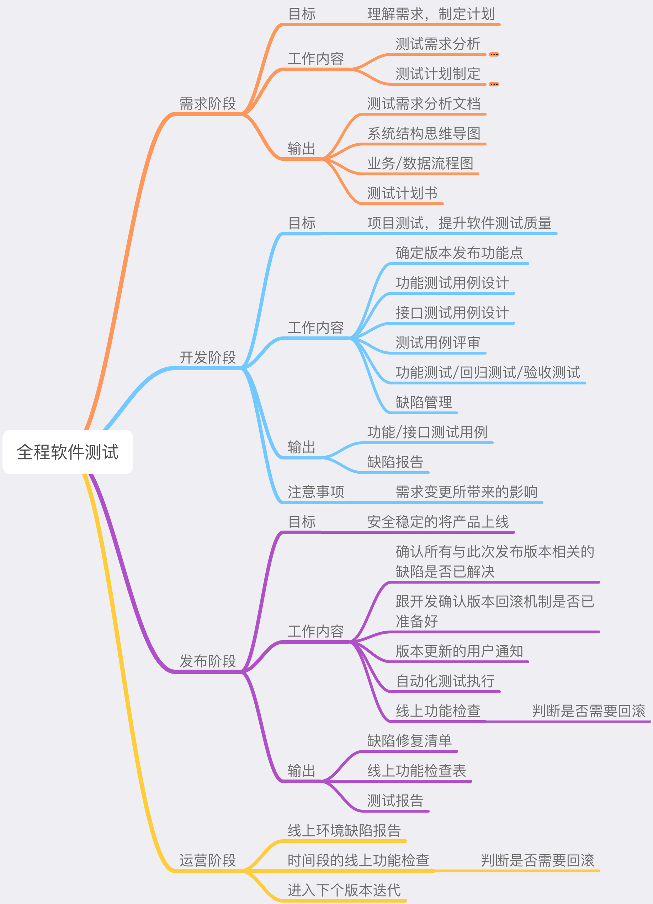
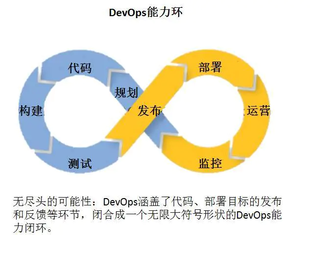

# 1.方法论

## 第一章:科普

### 测试行业

#### 行业现状

```text
在研发团队鄙视链中,测试向来处于一个最低的位置.出现这样的现象跟测试的人才培养,行业现状,职业定位,个人素质,团队定位等有很大的关系.


职业定位上,初级测试的要求是相对较低的,技术壁垒也没有开发明显.如果再拿学科来做比较的话,测试对语文要求为大学,对数学要求为中学,开发则是对数学要求为大学,对语文要求为中学;中学语文能大概明白大学语文,反之则未必;
技术水平上,初阶时要求更多的是软实力,因为不像数学一样有一个明确的量化标准.所以较难直接体现技术水平;在中高阶时技术层面要求的更多是一个广度.功能 产品 用户 代码 系统性能 app性能等等,多而不精也是一个通病
团队定位上,测试更多是一个辅助角色,并不能有一个对外的直接产出.相对的,对一个团队来说开发层面是不可缺少的,但是质量层面并不需要要求那么高;这也就导致了很多测试的质量行为难开展,甚至是无法开展;
因为以上及其他原因,导致从事测试行业的个人技术素质确实不佳,目前存在一定的恶性循环
```

#### 未来发展

```text
在传统瀑布流上,测试只需完成测试用例按用例一步一个脚印的执行即可.但在敏捷模式&devops理念盛行的今天,非敏捷化测试已经远远不够用了,敏捷化测试仍常常成为版本迭代中最大的痛点.面对新形式的挑战,测试的流程和技能都需要敏捷化提升.

近十几年互联网业的高速发展,甚至是内卷化.导致各企业对产品的质量意识和要求也在不断的提高,以及上述所说的devops理念和敏捷模式的流行,也给测试赋予了更多的职责、角色和要求
例如:质量保证、质量管理、敏捷测试、测试开发、测试左移、测试右移、测试中台、中台测试、工程效能、工程效率等等

可以看出来,测试这个职责从单纯测试已经提升到质量这个层面.角色从以往的QC(品质控制)上升到了QA(质量保证)甚至是QM(质量管理),还因为devops理念的冲击开始强调效率,在保证质量的情况下,提高工程效能.从单纯的将目光放在自己放在产品,逐渐向将质量理念,质量工具,质量方法赋能给团队里面的其他同学.

我们先解释一下这几个名词的意思:

定义上
QC：为了提供足够的信任表明实体能满足质量要求，而实施的根据需要进行证实的全部有计划、有系统的活动。(传统意义上的测试,现阶段绝大部分测试还处在测这个阶段,测试的目的只在产品)
QA：为达到质量要求所采取的作业技术和活动。
QM：确定质量方针、目标和职责，并在通过诸如：质量策划、质量控制、质量保证和质量改进等，使其实施的全部管理职能的所有活动。

职责上
QC：最重要的职责在于对制成品的监控。
QA：最重要的职责在于系统层面的完善，侧重于问题的防范及对已发生问题的根源的探究及其对策的实施，从而降低不良的产生。
QM：最重要的职责在于从组织层面上保障质量工作环境。
```

#### 落地现状

```text
正如我之前所说,因为缺少实践的机会,目前测试的先进方法论是远超于落地实践.业界也只有中厂以上才会有一些大型的质量实践活动.一定程度上导致了具备质量意识的不多,明白测试的核心在效率和质量的非常少,具备上述落地实践能力的从业人员更是极其的情况.两极分化严重,绝大部分从业者只会点点点,少数具备简单代码能力.
```

#### 先驱实践

```text
我们上面讲了很多测试的发展,下面给大家看看大厂们的实践

最开始微软质量团队是行业的kol,在05年后谷歌替代了微软成为了新一代的kol.
谷歌在十几年前已经逐步把测试提到与开发同等重要的位置.在谷歌测试团队被归为"工程效能"团队.他们的职责横跨开发测试人员使用的工具研发、产品发布和各种级别的测试，从单元级别的测试到探索性级别的测试.

谷歌工程效能团队里面有两个角色,测试开发工程师（SET）和测试工程师（TE）;
    SET是SWE的合作伙伴,与SWE是在增加功能性的代码或是提高性能的代码更关注功能实现上不同的是,SET工作重心在可测试性和通用测试基础框架上他们参与设计评审，非常近距离地观察代码质量和风险。为了增加可测试性，他们甚至会对代码进行重构，并编写单元测试框架和自动化测试框架。
    TE的关注点是把用户放在第一位来思考，代表用户的利益;TE会花费大量的时间在模拟用户的使用场景和自动化测试脚本或代码的编写上。同时，他们会把开发工程师和SET编写的测试分门别类地组织起来，分析、解释、测试运行结果，驱动测试执行，构建端到端的自动化测试。特别是在项目的最后阶段，推动产品发布。TE是真正的产品专家、质量顾问和风险分析师。

简单的说,SET的主要关注对象是开发人员。主要职责是赋能开发的测试能力让开发者可以很容易的编写测试代码。TE专注于用户角度的测试。
从测试层次来说,SET赋能开发者完成模块级别与功能级别的测试;TE则验证这些可执行的代码与数据集成在一起之后(集成测试)，是否可以满足用户的需求。

看到这里大家应该明白了吧.TE就是现有我们团队里面的测试角色,更多是端与端级别的测试,站在用户的立场和产品经理的立场去理解产品.

SET:一个融合开发角色和质量意识于一身的角色
```

\*源于&lt;&gt;

#### 国内大厂实践

_以下是来自2019中国互联网测试开发大会的会议主题_

```text
《如何获得智能终端的真实质量？》 朱少民---软件绿色联盟
《测试有效性度量》 张翔(义理)---蚂蚁金服
《区块链AOP异常测试实践之路》 周勇钧---腾讯
《洞穿性能之PerfDog》 周绍胜---腾讯IEG品质管理部
```

质量保障&开源专场

```text
《唯品会高效自动化测试实践及快速反馈》 马家麒-唯品会
《腾讯质量监控中台建设实战》 刘华星---CSIG质量部
《网易云音乐稳定性保障体》 朱丽青---网易云音乐中间件&性能测试负责人
《移动端自动化测试的进化和落地》 王建军---网易游戏Airtest Project团队核心成员
《Tcloud云测平台-多服务框架分享》 王杰---Tcloud平台技术负责人 王金龙---比格基地(趣头条)测试负责人
```

质量保障专场

```text
《给你一个测试团队，你该怎么管》 高学文---奇虎360 Qtest测试总监
《金融科技研发效能提升》 游小华---小赢科技测试开发&研发效能负责人
《bilibili质量体系建设探索与实践》 王伯龙---bilibili商业中心测试负责人
《网易云音乐舆情监控实践》 蒋超---网易云音乐舆情监控负责人&音视频测试负责人
《toB业务的工程效能提升探索》 张尤长---字节跳动企业应用部门测试架构师
移动专场
《对App崩溃Say No! 如何长期保持1‰以下崩溃率》 黄健基---阿里UC研发效能部质量效能专家
《移动端App自动化兼容性测试的提效之路》 赖勇辉---腾讯IEG品质管理部图灵实验室
《APP端侧数据智能化测试体系》 程召（天道）---阿里巴巴Aliexpress技术部测试开发专家
《游戏UI自动化实践》 邓纯---望尘科技公司测试部负责人
《进化的覆盖率——代码实时染色系统》 翟帅---蚂蚁金服无线开发专家 周为---蚂蚁金服高级开发工程师
```

AI专场

```text
《AI算法的精准测试及样本之痛》 鲁四喜---腾讯CDG平台研发部高级专项测试工程师
《基于游戏的图像异常AI检测实践》 王君乐---腾讯互娱品质管理部图灵实验室图像检测组负责人
《基于图像分类的下一代速度类测试解决方案》 冯张驰---OPPO互联网组测试开发工程师
《API测试在智能化测试时代的探索与实践》 宿翰元---百度移动生态质量研发部资深测试工程师
《广告系统大规模机器学习质量保障实践》 何晴---百度商业服务质量部百度商业搜索模型质量负责人
```

高新专场

```text
《智能车载系统自动化测试实践》 林少康---小鹏汽车互联网中心测试开发高级专家
《探索天空之城，寻觅质量轨迹》 张志权---大疆质量效率部测试工程师（TSE）
高雪健---大疆影像部测试工程师，产品测试团队负责人
《让视频算法为质量服务》 李禹---阿里文娱优酷技术保障部测试开发专家
《蚂蚁金服工业级精细化测试体系建议》 朱建华（飞麦）---蚂蚁金服工程效能部高级专家
《基于生产日志的接口用例设计与优化》 谭林斯---平安证券渠道测试组组长，Aurora平台产品负责人
```

* [https://testerhome.com/topics/21874](https://testerhome.com/topics/21874)

  **测试工作常规流程**

  

  这一份是比较完整的一份步骤,在我们现有的体系中,我们剔除了一部分来应对效率问题

#### 需求分析  & 测试导图的魅力

```text
我们知道产品给的需求文档在细节上未必那么全面,涉及到其他场景时思考的不够全面等,这时候就需要测试同学根据PRD与产品同学和开发同学探讨去完善细节,功能逻辑,流程场景等.
```

 

```text
测试导图,很多同学并不重视;甚至很多测试同学都是没有感情的搬运工具,一条一条的从产品需求里面搬运,为了完成而完成.
测试导图里面详细记载了整个端下面每一个功能点的详细信息,流程场景,逻辑等.
一份好的测试导图,应该面面俱到,如要去跟产品探讨功能未来的拓展,以及自身站在产品角度面对功能未来的拓展的风险项.降低未来因为功能流程的变动而产生的不稳定性;要去跟开发同学探讨开发思路,相互完善.
测试同学只要拿着一份完善的导图既足以完成测试，也可以轻松转化为测试用例.开发同学可以凭借一份导图理清思路以及注意细节.产品也可以凭借导图去做整体的规划
```

例如:  


看了以上案例同学们是否有一丝丝的体会呢?

#### 测试用例

测试用例是不是跟测试导图很相似!  

### 测试职业基本要求

1. 沟通技巧 心细 逻辑强 
2. 具备开发思维\(站在开发的角度,开发思路\) 
3. 具备产品思维\(站在产品的角度,需求背景 目的效果\)
4. 具备用户思维\(站在用户的角度,友好 使用成本等\)
5. 快速熟悉业务的能力
6. 测试场景与用例制定

   ......

   

   **高阶要求**

7. 在研发角度，去影响研发团队提高质量效率
8. 从运维和线上角度，去影响运维和线上用户，然后去分析更好的质量。
9. 从团队流程的角度提高质量
10. 从测试流程的角度提高质量

    ......

### 常见进阶角色

#### 自动化测试

```text
自动化测试其实还是归属于功能测试范畴,具备一定的代码能力,利用代码编写自动化测试脚本(api webui appui),提高测试效率(测试敏捷化),降低测试枯燥感,快速响应,快速反馈,把有限的时间分配到更多有意义的测试上去(探索性测试).符合devops中CI\CD(持续集成 持续部署)理念
```

#### 性能测试

```text
性能测试是通过自动化的测试工具模拟多种正常、峰值以及异常负载条件来对系统的各项性能指标进行测试。

测试的方向总结起来是三大方向:应用在客户端性能的测试、应用在网络上性能的测试 和 应用在服务器端性能 的测试。

JD要求:
初级:编写&执行脚本，数据收集统计，能在指导下完成简单的性能测试工作
中级:独立完成常规的性能测试工作，有一定的性能瓶颈分析能力
高级:能独立或带领team推动完成较为复杂的性能测试工作，分析定位瓶颈并参与调优
资深:从业务或架构角度，事前预防、事中定位调优、事后复盘整体优化，更好的服务业务，迭代进化team水准

从最简单的收集统计,编写脚本 到要对各方面都非常了解,比如:网络协议 系统架构 数据库 各个中间件(redis雪崩,穿透等问题) 系统监控 代码能力.涉及的面非常广,对造诣要求也很深.在测试进阶中是一个比较难走的路

性能测试还有细分,比如app性能:耗电量怎么去测，内存泄漏怎么去测，一些底层的性能
```

#### 专项测试

**专项测试是对专项技能深入理解，负责产品专项质量的测试， 存在是因为这个技能体系庞大，深入，没有专职人员无法应对; 安全 性能 app等都属于专项测试的范畴**

### 总览

 

## 第二章:质量体系与devops

### devops简介

```text
互联网企业为了快速响应用户多变的诉求，软件工程的核心诉求发生了变化，从严格按图纸施工的瀑布式开发，转而追求质量与效率的平衡。 敏捷的基础上提出的精益理念，构建了从产品到用户的闭环，所谓小步快跑，产品需要第一时间被用户见到，收集用户的数据和观点，从而不断修正产品形态。
但是随着研发团队规模逐渐庞大，流程变重效率下降,devops开始孕育而生.可以理解为敏捷2.0
DevOps旨在建立一套快速、频繁、稳定地进行构建，测试，发布软件的文化与环境。
简单的说就是高质量,高效交付(跨职能)

DevOps是为了填补开发端,QA端,运维端之间的信息鸿沟，改善团队之间的协作关系。
两个方面:
1. DevOps希望做到的是软件产品交付过程中IT工具链的打通，使得各个团队减少时间损耗，更加高效地协同工作。总结出了下面这个DevOps能力图，良好的闭环可以大大增加整体的产出。
2. 从产品研发流程标准中打通,高效交付
```

 

### 质量体系

```text
我们研发同学敲代码开发一个业务系统称谓工程，把系统的各种能力各种服务规划设计好称谓架构.
回到测试的身上，我认为对测试来说不是开发一个测试工具就叫测试工程，
不是把持续集成自动化测试设计好落地好，把流程规划好就叫做测试架构，
测试工作其实是要求测试工程师能够把一个业务或者一整块的业务的质量保障体系给建立起来，质量保障体系需要我们做的就是通过测试能力建设
测试能力建设，还是围绕 质量保障 和 工程效能 的两个核心，说通俗一些就是团队在质量和效率这两块缺什么，作为测试工程师就需要做什么
把测试肉身投入转换成测试能力投入，我们是人，但我们也是能力的一种，但能力未必是人，他可以是技术，可以是流程，简单地说就是怎么把人力转换成技术能力和流程化,标准化.
```

#### 测试开发

```text
互联网行业，基于devops理念,大家都开始强调要研测一体，测试左移右移等.
作为DevOps的一员，测试工程师(质量人员)必须同时具备一定的开发和运维能力,测试人员会更深入介入开发工作
通过“测试左移”，提前与开发人员一起制定测试计划，推动代码评审、代码审计、单元测试、自动化冒烟测试、测试精准化分析以及研发自测等来保证研发阶段的质量；
另外，通过“测试右移”,测试人员会也会参与配置部署，将自动化测试用例配置到持续交付链中.全流程监控发布后的应用质量。
简单的说
“测试左移”强调的是尽早介入测试，提前发现问题
“测试右移”也就是发布后的质量监控
通过大量的测试左移和测试右移活动，开发、测试、运维全员参与测试，各自从自己的视角体验和测试产品，最大效率的发现核心问题，弱化流程，重在产品。
```


**测试左移&测试右移构思**

左移

```text
这时候还是围绕工程化和流程优化这两个点，先规范代码的管理分支，在多位研发并行开发的时候我们需要怎么规避一些由于切分支带来的问题，明确好开发分支，提测分支，发布分支和主干，测试只接受提测分支的版本测试，发布的版本只能用发布分支等，同时接入静态代码扫描等代码精准测试的能力，研发每次提交代码后基本上都经历了一层代码扫描的质量保障过程，同时在接口和端功能层面，测试应该去建立自动化回归测试的能力，我们可以用接口测试框架或UI测试框架等自己手打自动化测试用例，把持续集成的流程建设起来，也可以通过更成熟的工具或平台如线上流量引流回归重放等等，其实就是通过大规模的自动化等能力来从最根本的代码层面，接口层面等保障起来，为了就是尽可能不带bug提测，所以这个过程就是要做如何把这些自动化的能力建设起来，缺乏工具和平台的时候，我们就得去找合适的工具和平台，找不到就得自己设计开发，这也是作为测试开发乃至所有的测试工程师都需要具备的能力，有了工具和平台之后就结合业务的特征进行相应能力的建设，做到懂得用，懂得做，懂得落地

在流程上，左移的方式是通过提前交付测试用例,测试方案或工具赋能研发自测，为了还是不要把bug带到测试阶段这个目标，或许研发会质疑说研发来测试，要测试来干嘛，我们从ROI的角度去思考，研发自测花大概0.5到1个人天，但如果出现bug导致版本阻塞，可能影响的就不是0.5到1个人天，测试服务来来回回几次，测试找bug，定位bug原因等，一不小心几天就过去了，这时候就会出现版本延期的风险，所以我们要把问题扼杀在摇篮之中，这需要代价，但这也给我们带来了更好的结果，研发自测和产品验收很大程度就是依赖了测试用例或测试方案，所以这个时候我们就不仅仅是把当前的需求要点或技术改动点给覆盖，当然不是说所有的用例产品研发都要过完，测试工程师是测试执行的兜底，研发基本上都是把核心链路和功能过完后就提测，这时我们更多的是实践探索性的测试，测试执行和研发分工，节省的时间做更有深度的测试工作，包括把版本的一些测试需求自动化，或者考究安全性性能等

每个版本的测试，不是简简单单把测试用例执行完，功能执行完就完成的，每做一件事情，必须明确这件事情的目标或背景，因为接下来所做的一切都会围绕着这个目标去开展，对于目标不清晰的，设计出来的方案或用例，存在偏差的概率就会增大，也就会存在漏测的风险，二来我们需要明确版本的改动范围，尤其是多组件多服务组成的业务，在加上相关依赖关系，这个是可以用来明确我们的测试范围，测试成本永远都是有限的，要做到即充分又低成本的那就需要明确测试范围，目标和范围都明确之后我们就可以进行相关的用例设计，需求的用例，技术性的用例，都需要在测试用例中体现，具体的如接口的逻辑是如何的，缓存的逻辑如何，如遇到数据迁移等情况，我们也需要把对应的数据验证和数据同步用例等设计好，
```

 右移

```text
把测试阶段的验证都设计好之后，那就是发布阶段和运营阶段的一些质量保障手段，大家都了解有灰度发布，流量隔离，线上监控，线上验收等一些测试能力，这些就是在测试右移中采取的一些质量保障策略，所以在设计阶段我们就要把作为线上验收能力的一些打点和日志输出设计好，监控项给明确好，甚至设计好质量相关的数据报表，通过这些采集监控数据进行分析和配置告警，来观察版本发布的情况，从而建立了一个线上的业务健康度模型

有些情况确实是通过测试右移的方式来执行，在实际实践业务时，经常遇到由于环境等原因，功能必须在线上验收，所以这个时候我们就需要有线上验证的能力，线上验证的原则是尽可能的不要影响到原有功能和使用业务的用户，这个就需要做好很好的隔离，所以从研发一开始的设计就从线上可测性角度就需要考虑到这一点，功能做好隔离，数据做好隔离，一旦出现问题，我们有相对应的风险预案，如何清除脏数据，如何将功能降级等，前期的设计都要考虑好

发布完成以后我们还需要考虑运营层面的事情，运营事故在各大互联网公司中也是屡见不鲜，比如暴露了一些敏感数据等，对于这方面作为业务的测试我们也是需要建立其相关的防范机制，不管是流程上和从技术上去杜绝，这往往也会在我们的风险预案中体现，当然故障都没有是最好的，但一旦出现故障的时候我们就要能够快速的发现和解决，这也是我们作为测试能力建设中的一个重要环节
```


```text
一旦把这些能力都建立起来，测试人员的投入就会变成测试能力的投入，测试工程师就是测试能力的体现，测试能力的建设者，只要安排人员去执行使用测试能力即可，就不一定需要测试工程师的肉身投入，让业务都具备自我质量保障的能力，从根本上的提效和降低投入成本
纵我上文所说，作为测试工程师大部分的时间应该都在做测试设计，测试设计体现一名测试工程师的产出，测试执行不一定需要测试工程师来做，但需要你做好的是在测试能力方面的建设，质量是整个团队的目标和责任，测试工程师就是专门为这个目标出谋划策的，我们认清出自己的职责，把自己的思维转换过来，把肉身转化成能力，把人力成本变成技术成本，这是作为测试工程师价值的体现
```

* [https://testerhome.com/topics/23727](https://testerhome.com/topics/23727)

**测试开发流行的原因**

1. Scrum & DevOps的项目管理迭代的方法论的流行加大了测试压力 有很多人认为测试就是找bug，但是测试工程师的核心是质量保证。举个例子，以前项目中常用瀑布流等工作模式,一个项目，按月发布，两月发布一个，一月发布一个，现在呢，一个月也慢慢变成了两周，三周，甚至一周，甚至有的时候2天就可以发布一个功能，如果是按照这个节奏，研发只需要改一行代码，你要保证这一行代码的正确性，你要写很多的用例，甚至要回归，几十条甚至上百条的都有可能。那么他的改动会越来越频繁，而对于测试来说，每一次的改动，我们都要去做回归的，而这种回归，在这种短时间迭代越来越短的节奏下，其实已经没有办法再靠人力去支撑了，到时候必然就会带来测试工程师要进行加班，而且光加班也是解决不了的问题，所以这个时候，测试的压力是非常大的。
2. 原有的质量保证体系缺乏可以融入架构的工程化技术支撑。\(微服务 容器化\) 原有的质量保证体系指的是什么呢，我们说最早期的手工测试的方法论，什么边界值啦，以及我们自动化最简单的一些自动化测试、压测，所有原来的这一套测试体系其实在当今的这个测试行业下，尤其是互联网快速发展的阶段里面已经慢慢的不太适用了。虽然说目前它仍然非常的有用，但是这样的一套体系很难融入已经流行的比如说持续交付、持续集成、DevOps等这样一个大的环境里面。你所做的自动化测试，如何融入到这个体系中去，如何能快速的发现线上的问题，以及更早的发现研发级别的问题，靠原有的这些质量保证手段，其实已经有点匮乏了。
3. 行业大量技术根基薄弱的测试工程师面临淘汰和外包 这句话听起来残酷，但是这个就是现实。通过和一些测试经理进行沟通，也都是认为现在很多的测试工程师都不及格，要么是会点点点，要么是会一点自动化。20%-30%的人懂一点最基础的自动化，自动化的能力也是属于一个很薄弱的环节，既解决不了公司里面深层次的问题，又没有办法帮公司支撑和搭建更高的平台，完善更好的一套测试流程，所以也会导致这一类人也不太及格。 比如说阿里的一些现状，就是招测试开发，或者说招研发做测试，由测试开发以及研发来负责完成公司内的质量体系建设，公司的持续集成，持续交付，DevOps，以及一些质量监控平台，剩下的点点点，外包给其他的公司来做，这是他们目前的一个现状，也就是说，如果你们只是点点点，那么很快你将失去在大的公司的工作机会，直接会被外包公司吸收过去。

## 第三章:拓展

### 全链路性能测试:

什么是全链路压测

```text
基于实际的生产业务场景、系统环境，模拟海量的用户请求和数据对整个业务链进行压力测试，并持续调优的过程。
```

全链路压测解决什么问题

```text
针对业务场景越发复杂化、海量数据冲击下整个业务系统链的可用性、服务能力的瓶颈发现.转而针对业务进行容量规划,让每一个业务系统能够清晰地知道什么时候应该加机器、什么时候应该减机器？面对海量数据如何既能保障系统稳定性、又能节约成本？
```

> 每年的 11 月 11 日 00：00：00，阿里巴巴集团最紧张激动的时刻到来了。多收档的热情这一刻开始爆发，反映到数字上是去年双十一今人的记录：24 小时交易额 1012 亿，交易创建峰值 17.2w；而在二进制世界里面，则是极短时间内如海啸般涌入的超大规模流量。 流量洪峰的杀伤力，曾在 2011 年和 2012 年给技术团队留下了午夜惊魂的难忘回忆。然而随着全链路压测的登场，它改变了阿里巴巴对应流量洪峰的态度和方式，也一次次刷新中国互联网世界的纪录。

 

* [https://www.cnblogs.com/imyalost/p/8439910.html](https://www.cnblogs.com/imyalost/p/8439910.html)
* [https://tech.meituan.com/2019/02/14/full-link-pressure-test-automation.html](https://tech.meituan.com/2019/02/14/full-link-pressure-test-automation.html)

  **舆情收集与质量闭环建设**

  在上图devops闭环中,还有一个运营环节.对质量体系闭环来说也是如此,产品投入实战,被用户所使用最能体现一个产品的质量如何 获取用户反馈，除了从用户行为分析入手外，主动收集用户投诉（客服途径、产品的反馈表单）和被动获取用户反馈信息，都是协同产品迭代的重要补充。

  舆情系统主要针对三类场景：舆情监控、竞品分析、问题召回。

  以百度为例: 舆情监控是最容易理解的应用场景，例如今年夏季频发的百度搜索流量劫持，这类问题当影响流量比较较低时很难在服务器端发现。当用户针对该问题的负面反馈显著增高时，我们是能通过第三方反馈数据发现这一问题的。此外，舆情监控常用于了解产品阶段性状态，例如糯米在砸200亿开拓市场时做了几次贴现活动，由于是一次性活动无历史数据比对，舆情反馈是衡量效果的有力手段。

  竞品分析是为了辨识产品与市场主线产品的竞争优势劣势，这也是第三方舆情收集的优势；毕竟，内嵌在产品线的反馈数据无法覆盖第三方产品。例如，通过用户负面反馈比例，我们发现和美团、点评相比，百度糯米团购的退款流程存在更高比例的负面问题。这些结论对产品决策非常重要。

  产出的数据支撑了很多业务线的质量问题闭环。经常会发现用户快速传播一些错误的搜索结果，例如搜索“就不上图了”，会出现大量色情图片结果，这些问题很难在测试与监控环节发现，反馈是应对的有利武器。在这些问题散布之前，我们的系统就能及时捕获，并提供给产品线进行处理。由用户扩散、发现、处理的流程，可以短至小时级别。百度有专职的风控、市场、品牌类部门，每个业务线也有负责运营的产品经理。舆情数据为这些岗位提供了有力的技术保障。

* [https://www.cnblogs.com/baidumtc/p/5220692.html](https://www.cnblogs.com/baidumtc/p/5220692.html)

### 混沌工程（Chaos Engineering）


```text
在一个由很多微服务组成的分布式系统中，我们永远难以全面掌握发生什么事件会 导致系统局部不可用，甚至全面崩溃。但我们却可以尽可能地在这些不可用的情况发生 之前找出系统中的脆弱点。

混沌工程，是一种提高技术架构弹性能力的复杂技术手段。Chaos工程经过实验可以确保系统的可用性。混沌工程旨在将故障扼杀在襁褓之中，也就是在故障造成中断之前将它们识别出来。通过主动制造故障，测试系统在各种压力下的行为，识别并修复故障问题，避免造成严重后果。

可以如上图视其为一只讨厌的猴子，在你的系统里面上蹦下窜，不停捣乱，直到搞挂你的系统。

也可以视为流感疫苗，故意将有害物质注入体内以防止未来疾病，适用于分布式云系统。混沌工程会将故障注入系统以测试系统对其的响应。这使公司能够为宕机做准备，并在宕机发生之前将其影响降至最低。

通常，团队可以通过单元测试、集成测试和性能测试等手段进行验证。但是，无论这些测试写的多好，我们认为都远远不够，因为错误可以在任何时间发生，尤其是对分布式系统而言，此时就需要引入混沌工程（Chaos Engineering）。
```

与故障测试的区别

```text
混沌工程是通过实践对系统有更新的认知,试验会有怎样的新信息生成，我们是不确定的;
而传统测试则是使用特定方式对某一块进行特定测试,给予好一个已知的断言
```


推荐给大家的书: 《混沌工程：Netflix系统稳定性之道》 《黑天鹅》 《反脆弱》

### 中台测试 & 测试中台

* [https://segmentfault.com/a/1190000019997854?utm\_source=tag-newest](https://segmentfault.com/a/1190000019997854?utm_source=tag-newest)

### 总结

**质量体系的最后就是没有测试**

_致力于讲的清楚,讲的有趣_

