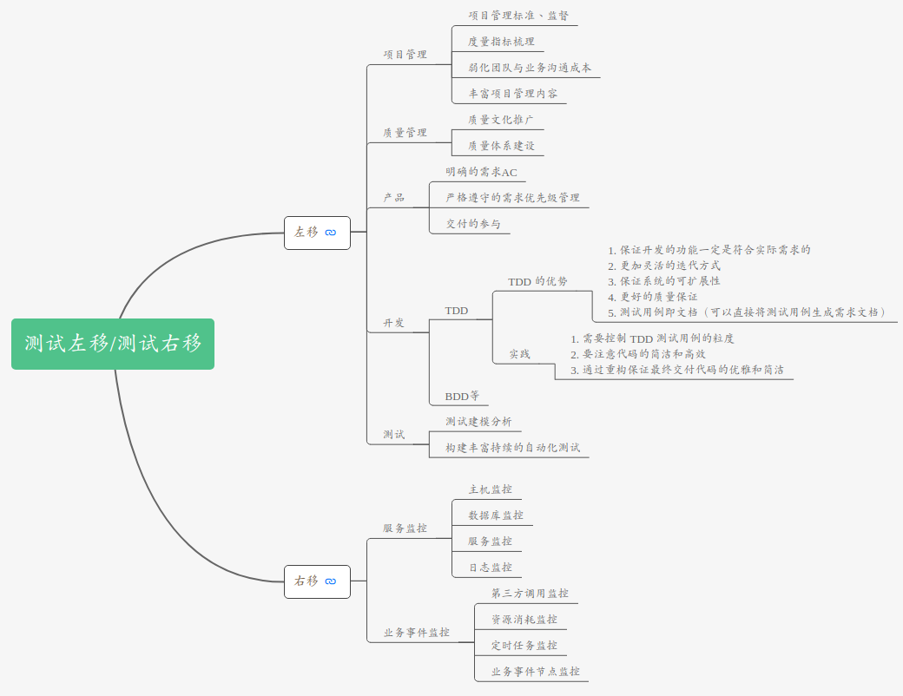
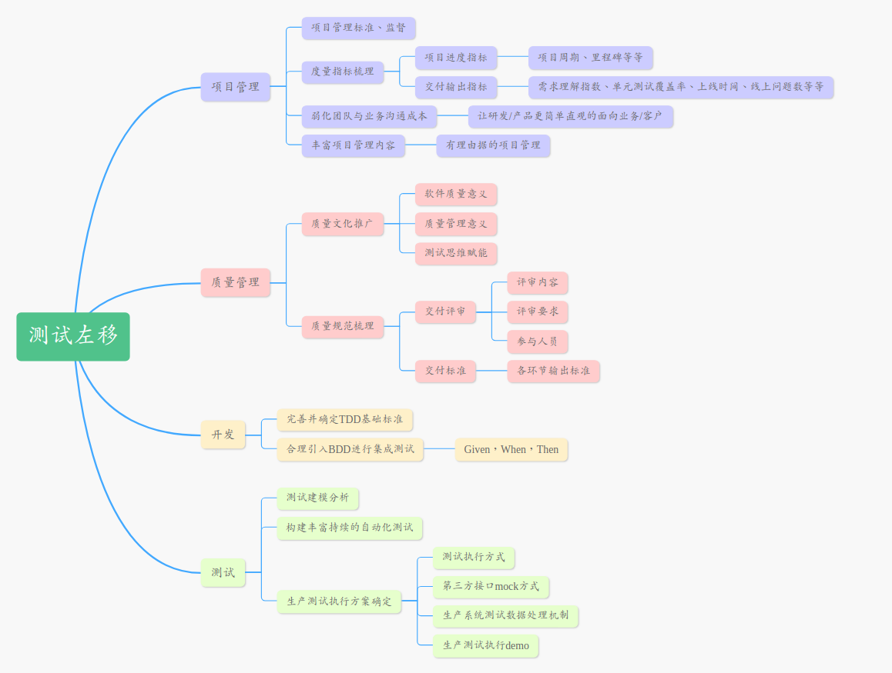
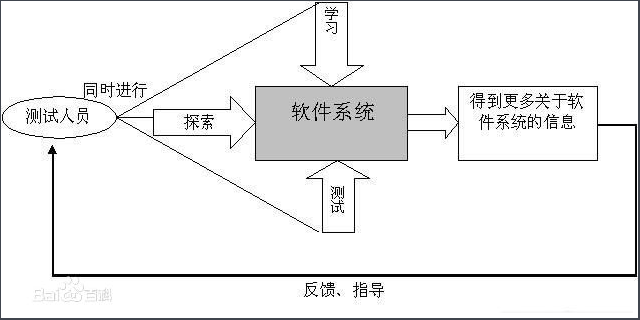
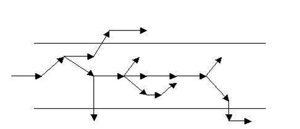

## 1. 左移&右移

### 1. 左移
- 左移：通过对代码的静态扫描，安全扫描，组织评审等方式，提前解决一些可能的代码质量问题,缩短测试的周期。1.提高质量上限 2.提高质量下限.围绕质量服务思想展开,主要关注于质量问题，参与人员则不仅仅局限于测试人员. 对于测试左移的落实，最重要的就是全员质量服务意识的培养

### 2. 右移
- 右移：通过对测试环境（开发环境、生产环境或许也有）的管理和质量维度的监控，实现上线前、上线后的质量保证。这里其实一般的测试主要是保证测试环境的质量。但是我觉得，对生产环境的质量监控是非常重要的，这是测试了解生产真实情况的最佳途径。右移我认为也不是抢运维的饭碗，也是对产品质量的保证补充。

### 3. 总结
1. 传统以往的研发和运维体系，其实是缺失了这一部分的质量保证。研发没有从代码层面监控质量，运维没有从生产上监控软件质量。以前的运维，只要服务器不出问题，软件正常跑，其他就不管了。
2. 现在微服务的发展，需要非常细的颗粒度去监控整个软件的运行，所以有了全链路追踪。全链路追踪这里可以认为是运维应该做的，也可以认为测试应该做的，因为测试的职责是把控质量，而链路追踪恰巧可以给测试了解到软件运行过程中非常多的质量问题，这也是以前没有的。所以现在很多公司是测试在做这块，运维没啥动力。
3. 每家公司的情况都有很大的不同，有的公司可能开发规范，开发自然而然的就把我们需要左移的事情都做了，那测试就可以作为质量监督者把控下即可。如果是公司没有，那么测试做，可以提高自己。运维的活同理。
4. 其实作为测试，我觉得无论如何，首先要准确的认识到自己做的事情是为了什么。无论是左移还是右移，目的都在于更好的产品质量。我们用的所有手段，所有技术，都是为了提高测试过程中的效率，准确判断产品质量问题。如果偏移了这个中心，那么我觉得测试就不再是测试了。

### 有哪些活动可以提高质量上限（举例）

- 健康的项目流程（合理并且严格遵守的项目流程）
- 合理的需求分析（评估需求的质量，分析需求的合理性以及完整性）
- 出色的系统架构
- 完整的系统设计（评估设计的质量，分析需求的合理性以及完整性）
- 充分利用静态代码扫描
- 进行研发标准的定义
- 更早的测试分析（先于开发完成需求的分析，做好各种评审的准备）
- 尽早的测试执行（提早参与测试执行，在集成前就发现一些问题）

### 有哪些活动可以提高质量下限（举例）

- 健康的测试流程
- 优秀的测试用例
- 合理的测试计划
- 合适的自动化
- 适当的探索式测试
- 开发自测（TDD、BDD，测试提供更好的用例、技术支持）
- 团队质量意识的培养

## 2. 敏捷测试
敏捷测试就是符合敏捷宣言思想，遵守敏捷开发原则，在敏捷开发环境下能够很好地和其整体开发流程融合的一系列的测试实践，这些实践具有鲜明的敏捷开发的特征，如TDD、ATDD、结对编程、持续测试等。和传统测试的区分，可以概括如下：

1. 传统测试更强调测试的独立性，将“开发人员”和“测试人员”角色分得比较清楚。而敏捷测试可以有专职的测试人员，也可以是全民测试，即在敏捷测试中，可以没有“测试人员”角色，强调整个团队对测试负责。

2. 传统测试更具有阶段性，从需求评审、设计评审、单元测试到集成测试、系统测试等，从测试计划、测试设计再到测试执行、测试报告等，但敏捷测试更强调持续测试、持续的质量反馈，阶段性比较模糊。

3. 传统测试强调测试的计划性，认为没有良好的测试计划和不按计划执行，测试就难以控制和管理，而敏捷测试更强调测试的速度和适应性，侧重计划的不断调整以适应需求的变化。

4. 传统测试强调测试是由“验证”和“确认”两种活动构成的，而敏捷测试没有这种区分，始终以用户需求为中心，每时每刻不离用户需求，将验证和确认统一起来。

5. 传统测试强调任何发现的缺陷要记录下来，以便进行缺陷根本原因分析，达到缺陷预防的目的，并强调缺陷跟踪和处理的流程，区分测试人员和开发人员的各自不同的责任。而敏捷测试强调面对面的沟通、协作，强调团队的责任，不太关注对缺陷的记录与跟踪。

6. 传统测试更关注缺陷，围绕缺陷开展一系列的活动，如缺陷跟踪、缺陷度量、缺陷分析、缺陷报告质量检查等，而敏捷测试更关注产品本身，关注可以交付的客户价值。在快速交付的敏捷开发模式下，缺陷修复的成本很低。

7. 传统测试鼓励自动化测试，但自动化测试的成功与否对测试没有致命的影响，但敏捷测试的基础就是自动化测试，敏捷测试是具有良好的自动化测试框架支撑的快速测试。

## 3. 质量管理

首先需要理解不论是敏捷开发还是瀑布开发，质量都是一个研发团队需要关注的，质量管理也都是要进行的。任何一个不关注质量的团队，是没办法长期发展的。

### 1.敏捷开发与质量管理的关系
* 敏捷开发关注敏捷，快速响应变化，减少互联网发展带来的影响;
* 质量管理关注质量，确保产品质量，带来长期效益。

两者表面看起来是没有什么关联关系的，但是其实两者之间是一个互补的关系。质量管理为敏捷开发提供敏捷基础，敏捷开发为质量管理提供文化传播。怎么理解？
1. 敏捷开发关注快速响应，但是长久的敏捷才是真正的敏捷！

如果为了实现敏捷闷头迭代向前冲刺，一段时间之后就会发现有很多瓶颈。例如：新类型的需求系统架构不支持，需要系统重构;为了快速响应、迭代上线，开发忽略了单元测试、测试忽略覆盖率，线上问题很多。质量管理就是为敏捷开发提供基石，让敏捷开发长期的快速前进。
2. 质量管理的重心思想是**消灭质量部门，将质量变为所有人关注的问题**。

### 2.敏捷开发中如何做质量管理
上面提到质量管理4.0的时代已经开始，需要将敏捷开发与质量管理4.0结合
这里我想起之前整理’测试左移‘时的两点“质量上限、质量下限”

如果将敏捷开发看作“车”，质量管理看作“路”，那么团队要做得事情就是”把车开到目的地“
1. 确定并遵守质量下限
    明确质量下限就意味着，无论事情做得多糟糕只要满足质量下限，就可以认为产品是合格的。
    跟敏捷开发结合起来就是，严格遵守质量下限的基础上快速响应，即提高了响应效率又保证合格的质量。就像只要“路”存在，“车”就可以跑起来。
2. 不断挑战质量上限
    挑战质量上线，就是通过更好的方式让产品的质量输出更好
    跟敏捷开发结合起来就是，提高质量上限就像把“石路”变成“柏油路”再变成“高速路”，这样“车”就可以换成“跑车”，让敏捷变得更敏捷。
3. 质量管理不要成为敏捷开发的累赘
    为特定的“车”提供合适的“路”即可。团队的精力是有限的，既要“开车”又要“修路”，当”车“还是”奥拓“的时候没有必要为他修一条”高速公路“，如果把精力全部放在”修路“上反而没有精力去”开车“，毕竟”车到达目的地“才是重点
4. 敏捷团队的所有人都要参与质量管理
    ”车“和”路“都有了，但是把“车”开到”目的地“还早，小心“路上有坑”！
    敏捷开发提供了快速的工具，但是它毕竟只是工具，真正的完成目标还需要注意过程。

### 3 敏捷开发中质量人员的角色分配
**传统质量管理角色（QC、QA和QM）**

根据质量管理4.0的终极目标“消灭质量部门”，是不再需要质量人员的。

但是实现这个终极目标是需要进行很大的前期工作的，所以QM、QA、QC人员在这个阶段仍然是不可或缺甚至说很重要的，他们需要向着“消灭自己”持续奋斗

* QM职在建立敏捷质量体系，需要真正理解质量管理、敏捷开发，定义质量体系结构。必要时QM可以扩充为一个组织（包括boss、总监、各级主管）

* 跟质量上限是一样的道理，QA人员通过质量文化传播、不断改进等方式为团队带来**质量上线**的不断提升。

* 同样QC人员通过功能测试、探索测试等方式为团队提供**质量下限**

其实敏捷开发中的质量人员角色，相较于上图的角色定位都向前迈出了半步。QC需要做一些QA的工作，QA需要掌握QM的基础，QM由部门走向全员组织。而最基础的QC检验即将被淘汰，所以说敏捷开发中
* 如果你将自己钉在 传统QC的位置上，基本上死定了。
* 如果你将自己盯在 QA，那么可以提升自己的系统思维方

## 4. 探索性测试
https://zhuanlan.zhihu.com/p/91935859
https://zhuanlan.zhihu.com/p/96879003
https://blog.csdn.net/weixin_34233856/article/details/93889358

1. 探索性测试的定义

探索性测试（ET）是敏捷世界里的一种重要测试方法，作为一个研究性的工具，它是用户故事测试和自动化回归集的重要补充。它是一种经过深思熟虑的测 试方式，没有测试脚本，可以使你的测试超出各种明显已经测试过的场景。探索测试将学习，测试设计和测试执行整合在一起，形成一种测试方法。

探索性测试的最大特色是在对测试对象进行测试的同时学习测试对象并设计测试，在测试过程中运用获得的关于测试对象的信息设计新的更好的测试。他的典型过程如下图：

这相对于传统软件测试过程中严格的“先设计，后执行”来说，是具有很大区别的。

 

2. 探索性测试的基本过程

探索性测试的基本过程包括如下：

        识别软件系统的目的；

        识别软件系统提供的功能；

        识别软件系统潜在的不稳定的区域；

        在探索软件系统的过程中记录关于软件的消息和问题；

        创建一个测试纲要，使用它来执行测试。

注意：上面的过程是一个循环的过程，并且没有很严格的执行顺序，完全能够先创建测试纲要，执行测试，然后在测试中进修软件系统；也能够先探索软件系统的各个区域，然后再列出需要测试的要点。

探索性测试强调创新的测试思维，在测试过程中不断地出现许多关于测试的新想法，

因而就像一把叉，下图就是一个所谓的“探索叉”（exploratory forks）。

探索性测试强调测试过程中要有更多的发散思维，这也是与保守测试方式的最大区别。

保守测试方式强调设想完善的测试用例，测试人员严格按测试用例执行测试，这多少限制了测试人员的测试思维，测试人员往往缺乏主观能动性。

下图展示了一个发散思维的过程，探索性测试强调发散，但并不是盲目地发散，在适当的时候还要收敛回来。

例如，当发觉在一个测试的分支路径上已经花了很长时间也没有找到问题的答案时，则能够考虑先放弃那个区域的探索，因为还有一个主线的测试任务。

探索性测试尤其适合于那些需求不是很明确的测试任务，或者是一名刚刚接手一项新的测试任务的测试人员使用。

3. 探索性测试的价值

    1. 探索性测试可以用来找到深层次的BUG。

     因为探索性测试人员是优秀的观察者，他们观察不正常和不期望的结果，并进行认真的思考，这种状态和按部就班的执行用例是不一样的，因此，它更容易发现一些隐藏的很深的问题。

    2. 探索性测试可以加深测试人员对被测系统的了解。

     探索性测试强调对被测试对象的学习，并且是在测试过程中的学习，并在此基础上设计测试，因此，它使测试人员更容易深入的理解被测系统。

4. 探索性测试的误区

    1. 不要将探索性测试和随机测试混淆。

    探索性测试不是在键盘前坐下并敲击，没有熟练技能，不会认真思考的“黑盒”测试人员所做的并不是探索性测试，一个合格的探索性测试人员需要认真思考和分析结果，并且在探索测试的过程中做记录。

    2. 不要将探索性测试和回归测试混淆。

    探索性测试更注重的是思考和学习，不断发现新的问题，而版本的回归测试，是对原有的功能的保证，为持续迭代构筑安全网。重复的功能回归测试应该尽量用自动化的方式来完成，这样，才有足够的人力来进行探索性测试。

    3. 探索性测试不能用来评估软件质量。

    尽管探索性测试是一种有效的测试方法，但是它不意味着是一种全面覆盖的测试方法。如果你要评估测试是否全面，可能你需要其他的手段。

