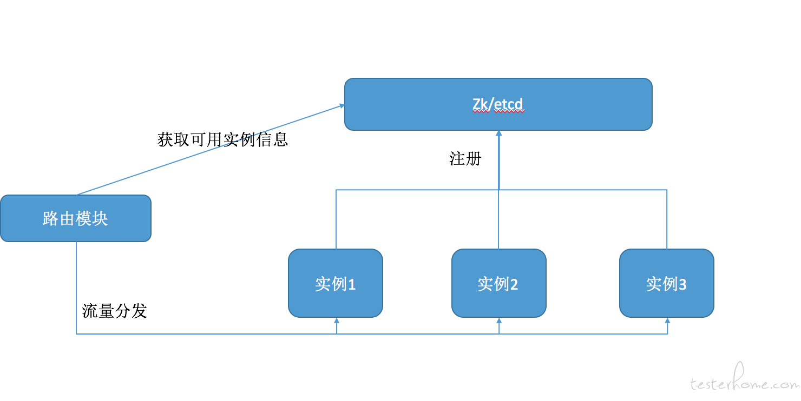

https://testerhome.com/articles/21746

# 简介
混沌工程在早期其实一直都被称呼为高可用测试，或故障演练。其目的是验证即便遇到各种事故导致某些服务停摆，系统依然可以依靠其高可用特性正常提供服务。 之所以用chaos(混沌)这个单词是代表其不确定性，我理解的意思是不确定何时何地发生何种故障后，会对系统造成何种影响。而我们的目的就是通过测试，把这些不确定性变为可以确定的信息并推进修复这些问题。

# 高可用测试
高可用=冗余+故障自动转移
- 故障自动转移=负载均衡中间件来保证。
- 冗余= 主从+集群+哨兵等架构来保证。

高可用测试，最重要的是测试系统的故障发现能力

## 健康检查
1. 自注册架构机制

在这种系统里一般都会有一个类似zk的中间件， 启动的实例将自己的信息注册到zk中，路由模块到zk中获取服务实例的信息并开始分发流量。 而每个实例都会周期性的向zk写入自己的健康信息(包括时间戳)。路由模块会根据写入信息的时间来判断服务是否健康。如果某个实例出现故障，它无法向zk写入自己的信息时，路由模块会发现它上一次写入的时间已经超过了设定的超时时间， 所以它判断该服务已不可用。 这种架构强调的是路由模块和实例之间没有强耦合关系， 一切都是zk中的注册信息为准。

2. 主动探测机制

- 以k8s针对服务的健康检查为代表
- 一般都是由业务实例提供一个健康检查接口， 监控检查接口中会去检查当前服务的健康状态

# 失败重试(failover)
主动和被动两种常用的健康检查机制,这两个机制都无法解决一个问题,就是健康检查的延迟

为了保证在这段时间内的请求不会失败,当在这段延迟时间内如果有请求发送到了故障实例中， 这自然会出现失败或者超时， 那么上层业务可以选择重试几次

# 工具

- cpu,io, 磁盘负载可以用dd命令
    - CPU过载(需提前限制容器性能避免压垮宿主机):`for i in seq 1 40; do dd if=/dev/zero of=/dev/null & done`
- 模拟断网可以用iptables命令
    - 请求全部丢弃: `iptables -D INPUT -p tcp --dport 80 -j DROP`
- 模拟网络延迟，丢包等可以用tc命令。

# 故障隔离与注入的要点
- 安全性：避免影响其他服务甚至是整个物理机或者系统造成不可逆的影响(或者是恢复成本很高)，做不好这块会影响测试效果或者花费过高的成本恢复故障导致拖慢测试进度。
- 故障恢复：故障隔离后，恢复策略就很容易了。 因为故障隔离后故障的影响非常小， 我们在最坏的情况下也只需要删除整个沙箱即可。 比如我们使用docker容器作为部署方案隔离故障， 那么故障注入进容器后， 想要恢复它，最差也就是删除容器后重新启动即可。