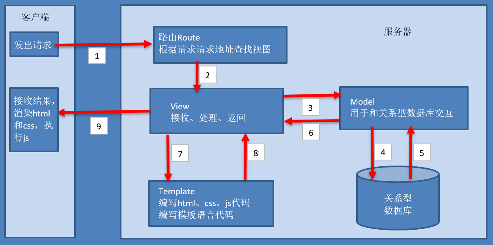
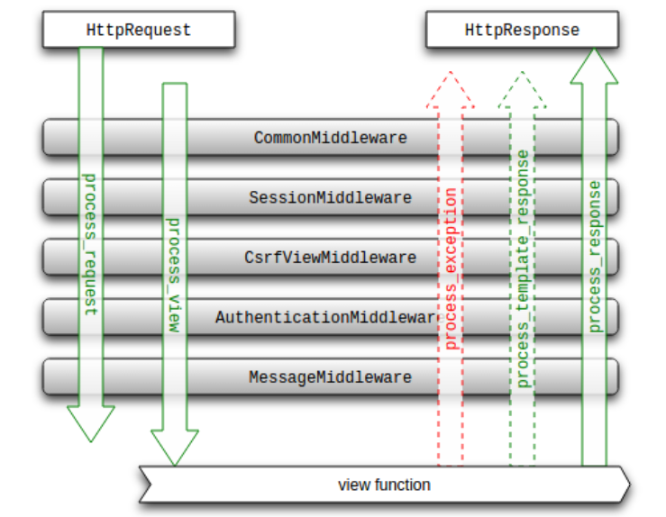

tip: 本文档涉及知识点主要与drf结合使用.模板使用 表单使用等 [查看](./99.other.md)
# 1. 简介
Django 本身基于 MVC 模型,即 Model（模型）+ View（视图）+ Controller（控制器）设计模式

MVC优势:
- 低耦合
- 开发快捷
- 部署方便
- 可重用性高
- 维护成本低

框架特点:
- 强大的数据库功能
- 自带强大的后台功能
- 优雅的路由

缺点:
1. 大包大揽(重)
2. 过度封装
3. 异步支持(目前还不支持异步orm)
## django3.x 新特性
1. 支持ASGI（异步服务器网关接口）
- 支持WebSocket, 性能提升了3~5倍
2. 异步视图

Asgi的作用: 
- WebSocket:若我们发起一个WebSocket请求,客户端就无须等待具体的消息内容,可以去做其他事情。在这里设置了一个类似回调的机制,一旦收到消息,就触发回调,作出对应的处理。而对于服务端,服务器和客户端建立连接之后,只有在有接收新消息或者发送消息的时候才处理。
- 程序遇到耗时操作,就设下一个回调（插眼）,然后就去处理其他请求。一旦耗时操作完成,就会触发回调通知Web程序继续处理请求

## MVC与MTV模型


在django中因为Controller绝大部分情况下由框架自动处理,不需要使用者做什么东西.所以又为MTV模式.

MVC模型
- 模型（M）- 编写程序应有的功能,负责业务对象与数据库的映射(ORM)。
- 视图（V）- 图形界面,负责与用户的交互(页面)。
- 控制器（C）- 负责转发请求,对请求进行处理。


MTV模型
- M 表示模型（Model）：编写程序应有的功能,负责业务对象与数据库的映射(ORM)。
- T 表示模板 (Template)：负责如何把页面(html)展示给用户。
- V 表示视图（View）：负责业务逻辑,并在适当时候调用 Model和 Template。



除了以上三层之外,还需要一个URL分发器,它的作用是将一个个URL的页面请求分发给不同的View处理,View再调用相应的Model和Template

MTV与MVC对比:
- 两者M都是指model数据模型
- MVC中的C与MTV中的V更相似,都负责逻辑层的处理
- MVC中的V与MTV中的T更相似,都用来对外显示

响应顺序:
1. Web服务器（中间件）收到一个http请求 
2. Django在`URLconf`里查找对应的视图(View)函数来处理http请求 
3. 视图函数调用相应的数据模型来存取数据、调用相应的模板向用户展示页面 
4. 视图函数处理结束后返回一个http的响应给Web服务器 
5. Web服务器将响应发送给客户端 

# 2. 基本使用
## 2.1 安装方法
1. 使用pip工具即可安装django: `pip install django`
2. 从github中下载
## 2.2 创建工程(project)
1. `django-admin startproject project_name`(未指定目录)默认会在命令行所在目录生成project_name子目录
2. `django-admin startproject project_name .`(第四个参数指定目录)会在命令行所在目录(当做项目根目录)生成相关文件
### 2.2.2 默认生成工程目录
- 根目录
    - `manage.py`: 与Django项目交互的命令行工具
    - 项目配置目录(与脚手架创建project同名)
        1. `setting.py`: 项目配置文件
        2. `urls.py`: 全局ur1路由表
        3. `wsgi.py`: WSGI服务器的入口文件
        4. `asgi.py`: ASGI服务器的入口文件(支持websocket, 3.X+新增特性)
    - `db.sqlite3`默认数据库

## 2.3 启动工程
1. `python manage.py runserver` 会启动web服务器,具有django欢迎页面
2. `python manage.py runserver ip：端口` 指定运行ip和端口
## 2.4 生成应用(application)
1. `python manage.py startapp application_name` 生成文件应用
2. `django-admin startapp application_name` 与上个命令效果一样

|文件|描述|
|-|-|
|admin.py|跟网站的后台管理站点配置相关的文件|
|apps.py|用于配置当前子应用相关信息的文件|
|models.py|保存数据库模型类|
|tests.py|用于编写单元测试|
|views.py|用于编写Web应用视图|
### 应用初始化配置过程
1. 创建应用

`python manage.py startapp app`: 创建名为`app`的应用
2. 注册应用

在配置文件`settings.py`中的`INSTALLED_APPS`列表添加子应用
```py
INSTALLED_APPS = [
    # ...
    'app' # 应用名
]
```
3. 注册应用路由

在项目urls.py中注册应用路由
```py
from django.urls import path, include

urlpatterns = [
    path("/app", include('app.urls'))  # 设置 将/app的路由映射到 app应用中
]
```
### 应用视图&路由
初始化配置完后,外界便可以访问应用了,可以开始对应用视图及路由进行编写(当然也可以不初始化)
1. 创建视图(示例为函数视图)

`/项目/app/views.py`
```py
from django.http import HttpResponse


def index(request):  # request 是全局上下文.
    return HttpResponse("你访问的是:" + request.path)
```
2. 创建路由

`/项目/app/urls.py`
```py
from django.urls import path
from . import views

urlpatterns = [
    path("/index", views.index)
]
```
## 2,5 使用帮助
1. `django-admin` 或 `django-admin help` 可以看到一级命令的使用帮助
2. `django-admin help options_name` 可以看到二级命令options_name的使用帮助
## 2.6 配置参数
1. `DEBUG` 是否开启调试模式
2. `ALLOWED_HOSTS` 指定服务的host和ports,默认为 127.0.0.1:8000
3. `INSTALLED_APPS` 允许使用的application
4. `DATABASES` 配置数据库
5. `TIME_ZONE` 设置时区,东八区(`Asia/Shanghai`)https://en.wikipedia.org/wiki/List_of_tz_database_time_zones
6. `MIDDLEWARE` 中间件
7. `ROOT_URLCONF` 根路由
8. `DATABASE_ROUTERS`: 数据库路由
9. `USE_TZ`: 使用UTC时间

```py
LANGUAGE_CODE = 'zh-hans'
TIME_ZONE = 'Asia/Shanghai'
USE_I18N = True 
USE_L10N = True 
USE_TZ = True

# 项目.文件.变量  找到定义路由的变量字典
DATABASE_ROUTERS = ['Project.database_router.DatabaseAppsRouter']
```
## 2.7 命令行
- `python manage.py shell` 进入项目交互模式
- `python manage.py sqlmigrate 应用名 序号` 查看迁移文件原始sql
- `python manage.py check` 检查项目是否有错误
- `makemigrations` 生成迁移文件 
- `migrate` 迁移
    - `--database default`默认为默认数据库
- `showmigrations` 显示一个项目中的所有迁移
- `runserver ip:port`运行服务
- `sendtestemail` 发送测试邮件
    - django-admin sendtestemail foo@example.com bar@example.com
    - --managers 向 MANAGERS 中指定的邮件地址发送邮件
    - --admins 向 ADMINS 中指定的邮件地址发送邮件
- `startapp` 创建应用
- `startproject` 创建工程
- `changepassword` 修改密码
    - `--database DATABASE`
- `createsuperuser` 创建超级用户
    - `--database DATABASE`
- `createuser` 创建普通用户
    - `--database DATABASE`
## 2.8 auth
默认使用PBKDF2加密算法

## 2.9 Utils
```py
django.utils import timezone

timezone.now()  # 获取当前时间及时区
```

# 3. 数据模型 ORM
优点:
1. 可移植性强,更改数据库只需要在setting.py中更改即可,无需更改代码
2. 安全性好,框架已有诸如sql注入等攻击,无需在安全性上花太多时间
3. 查询语法简单.

- 模型类如果未指明表名,Django默认以 `小写app应用名_小写模型类名` 为数据库表名
- django会为表创建自动增长的主键列,每个模型只能有一个主键列,如果使用选项设置某属性为主键列后django不会再创建自动增长的主键列。默认创建的主键列属性为id,可以使用pk(primary key)代替

## 最佳模型构成
1. 自定义字段
2. 自定义Manage方法(可选)
3. Meta选项(可选)
4. `__str__`: 模型实例名(可选)
5. 重写save方法`def save()`(可选)
6. 定义单个对象绝对路径`get_absolute_url()`(可选),用于在通用视图中编辑类视图使用
7. 其他方法(可选)

```py
from django.db import models
from django.urls import reverse


# 自定义Manage类
class BaseManager(models.Manager):

    def undelete(self):  # 筛选非软删除数据
        return self.fliter(is_delete__isnull=True)


class BaseModel(models.Model):  # 父类 

    create_date = models.DateTimeField(auto_now_add=True)
    update_date = models.DateTimeField(auto_now=True)
    is_delete = models.BooleanField(default=0)

    objects = models.Manager()
    base_manager = BaseManager()

    class Meta:
        abstract = True
        app_label = "app"

    def __str__(self):
        return self.id


class Model(BaseModel):
    name = models.CharField(max_length=30)

    def __str__(self):
        return self.name

    def save(self, *args, **kwargs):
        print(self.name)  #
        if self.name == "admin":
            return 
        else:
            super().save(*args, **kwargs)

    def get_absolute_url(self):
        return reverse("index", args=(self.pk, ))

    def do_something(self):
        pass
```

## 特性
### 惰性执行
创建查询集不会访问数据库,直到调用数据时,才会访问数据库,调用数据的情况包括迭代、序列化、与if合用

```py
users = Users.objects.all()  # 此时并未执行
[user.name for user in users]  # 调用时才真正执行 ['xiaoming', 'xiaohong', 'xiaolan']
```
### 缓存
使用同一个查询集,第一次使用时会发生数据库的查询,然后Django会把结果缓存下来,再次使用这个查询集时会使用缓存的数据,减少了数据库的查询次数
```py
accounts = Account.objects.all()
[account.account for account in accounts]  # ['qidian123', 'zhanghao']
Account.objects.create(account="zhanghaoaaa", pwd="123")  # 创建新数据 <Account: Account object (4)>
[account.account for account in accounts]  # 复用第一次的缓存['qidian123', 'zhanghao']
```

## ORM 对象关系映射&解析
使用 ORM 的好处：
- 提高开发效率。
- 不同数据库可以平滑切换。

使用 ORM 的缺点：
- ORM 代码转换为 SQL 语句时,需要花费一定的时间,执行效率会有所降低。
- 长期写 ORM 代码,会降低编写 SQL 语句的能力。

ORM 解析过程:
- ORM 会将 Python 代码转成为 SQL 语句。
- SQL 语句通过 pymysql 传送到数据库服务端。
- 在数据库中执行 SQL 语句并将结果返回。


## mysql数据库配置
以下 3.4.5点是用于 migrate

1. 安装`pip install pymysql`
2. 在项目目录的`__init__.py`文件中
```py
from pymysql import install_as_MySQLdb

install_as_MySQLdb()
```
3. 升级pip`pip install --upgrade pip`
4. 安装`pip install setuptools_rust`
5. 安装`pip install cryptography`
6. 在`setting.py`的`DATABASES`中配置数据库配置
```py
DATABASES = {
    'default': {
        'ENGINE': 'django.db.backends.mysql',  # 修改引擎
        'NAME': 'my_django',  # 数据库名
        'USER': 'root',  # 账号
        'PASSWORD': 'qazwsx',  # 密码
        'HOST': 'localhost', # 地址
        'PORT': 3306, # 端口
        'CONN_MAX_AGE': 60  # (可选)数据库连接的寿命
    },
    'sqlite3': {
        'ENGINE': 'django.db.backends.sqlite3',
        'NAME': os.path.join(BASE_DIR, 'db.sqlite3'),
    }
}
# 可以支持多个数据库,在migrate时要指定  python manage.py migrate --database=sqlite3
```
## migrate迁移
### 创建模型执行文件
- `python3 manage.py makemigrations` 生成模型执行的初始化文件(xxxx_initial.py)
- `python3 manage.py sqlmigrate 应用名 应用内migrations文件` 查看初始化文件转化成原生sql语句(如下)

django中通过ORM创建数据库表通用命名格式:
- `"小写的application名" + "_" + "小写的类名"`, 例如blog_blogarticles
```sql
BEGIN;
--
-- Create model BlogArticles
--
CREATE TABLE "blog_blogarticles" (
    "id" integer NOT NULL PRIMARY KEY AUTOINCREMENT, 
    "title" varchar(30) NOT NULL, 
    "body" text NOT NULL, 
    "publish" datetime NOT NULL, 
    "author_id" integer NOT NULL REFERENCES "auth_user" ("id") DEFERRABLE INITIALLY DEFERRED);
CREATE INDEX "blog_blogarticles_author_id_ed798e23" ON "blog_blogarticles" ("author_id");
COMMIT;
```
### 执行模型文件
`python3 manage.py migrate --database=指定数据库` 写入database中

### 导出数据库数据
`python manage.py dumpdata 应用名 --database=指定数据库 > text.json`

```json
[
    {
        "model":"app.account",
        "pk":2,
        "fields":{
            "create_date":"2021-04-25T12:17:51.820Z",
            "update_date":"2021-04-25T12:17:52.192Z",
            "delete_date":null,
            "account":"qidian123",
            "pwd":"123456"
        }
    },
    {
        "model":"app.users",
        "pk":3,
        "fields":{
            "create_date":"2021-04-25T12:17:52.777Z",
            "update_date":"2021-04-25T12:17:53.389Z",
            "delete_date":null,
            "name":"xiaoming",
            "age":50,
            "switch":false,
            "account":2
        }
    }
]
```
### 导入
`python manage.py loaddata text.json --database=指定数据库`

### 初始化
如果migrations目录被删除,需要重新进行初始化

- `python manage.py makemigrations --empty app_name`: 生成空记录
- `python manage.py makemigrations `: 生成新记录(从头开始全部)
- `python manage.py migrate`: 执行记录

## 数据库路由(读写分离,多数据库)
当有多个数据库,或者需要进行读写分离时.需要设置数据库路由
### 数据库路由表
在`setting.py`中
- 设置`DATABASE_APPS_MAPPING`用于路由表映射
- 设置`DATABASE_ROUTERS`用于声明路由规则
```py
DATABASE_APPS_MAPPING = {  # 路由表映射 左侧是模型中app_label 右侧是数据库表中的key
    # example:
    # 'key':'database_name',
    'app02': 'db02',
    'app01': 'db01',
    'admin': 'db01',
    'auth':  'db01',
    'contenttypes': 'db01',
    'sessions': 'db01',
}

DATABASE_ROUTERS = ['Prject.database_router.DatabaseAppsRouter']  # 声明路由规则
```
### 数据库路由规则
在工程目录新建路由规则表`database_router.py`(命名随意), 创建路由规则类.

以下几个方法名不允许改变:
- db_for_read: 应用于读取类型对象的数据库模型,如果数据库提供附加信息会在hints字典中提供,最后如果没有则返回None
- db_for_write: 应用于写入类型对象的数据库模型,hints字典提供附加信息,如果没有则返回None
- allow_relation: 外键操作,判断两个对象之间是否是应该允许关系,是返回True,否则返回False,如果路由允许返回None
- allow_syncdb：　是否允许同步
- allow_migrate:是否允许对db这个数据库进行migrate
```py
from django.conf import settings

DATABASE_MAPPING = settings.DATABASE_APPS_MAPPING


class DatabaseAppsRouter(object):
    """
    A router to control all database operations on models for different
    databases.

    In case an app is not set in settings.DATABASE_APPS_MAPPING, the router
    will fallback to the `default` database.

    Settings example:

    DATABASE_APPS_MAPPING = {'app1': 'db1', 'app2': 'db2'}
    """

    def db_for_read(self, model, **hints):
        """"Point all read operations to the specific database."""
        if model._meta.app_label in DATABASE_MAPPING:
            return DATABASE_MAPPING[model._meta.app_label]  # 返回什么就指定什么数据库
        return None  # 返回为空就用DEFAULT

    def db_for_write(self, model, **hints):
        """Point all write operations to the specific database."""
        if model._meta.app_label in DATABASE_MAPPING:
            return DATABASE_MAPPING[model._meta.app_label]
        return None

    def allow_relation(self, obj1, obj2, **hints):
        """Allow any relation between apps that use the same database."""
        db_obj1 = DATABASE_MAPPING.get(obj1._meta.app_label)
        db_obj2 = DATABASE_MAPPING.get(obj2._meta.app_label)
        if db_obj1 and db_obj2:
            if db_obj1 == db_obj2:
                return True
            else:
                return False
        return None

    def allow_syncdb(self, db, model):
        """Make sure that apps only appear in the related database."""

        if db in DATABASE_MAPPING.values():
            return DATABASE_MAPPING.get(model._meta.app_label) == db
        elif model._meta.app_label in DATABASE_MAPPING:
            return False
        return None

    def allow_migrate(self, db, app_label, model=None, **hints):
        """
        Make sure the auth app only appears in the 'auth_db'
        database.
        """
        if db in DATABASE_MAPPING.values():
            return DATABASE_MAPPING.get(app_label) == db
        elif app_label in DATABASE_MAPPING:
            return False
        return None
```
### 设置模型指向
需要通过在模型的  `Meta`类中设置`app_label`声明(路由映射表左侧key).

如果不指定将指向为 default
```py
class Users(models.Model):
    name = models.CharField(max_length=50)
    passwd = models.CharField(max_length=100)
 
    def __str__(self):
        return "app01 %s " % self.name
 
    class Meta:
        app_label = "app01"  # 声明在路由映射表中key
        db_table = "myUsers"
```

### 手动选择数据库
```py
Users.objects.using("admin").all()

user = Users(name="xiaoming", passwd="123456")
user.save(using="admin")

user2 = Users(name="xiaohong", passwd="123")
user2.save(using="admin")
user2.pk = None  # 清除主键后再保存到其他,避免主键冲突
user2.save(using="app02")
```

## 基础语法
1. 每一个应用下的数据库模型类,需要在当前应用下的models.py文件中定义
2. 一个数据库模型类相当与一个数据表（Table）
3. 一个数据库模型类需更继承Model或者Model的子类
4. 定义的一个类属性,就相当于数据库表中的一个字段
5. 默认会创建一个自动递增的id主键
6. 默认创建的数据库名： 应用名小写_模型类名小写

### 字段类型
|类型|说明|参数|示例
|-|-|-|-|
AutoField|自动增长的IntegerField,通常不用指定,不指定时Django会自动创建属性名为id的自动增长属性。||id = models.AutoField()
BooleanField|布尔字段,值为True或False
NullBooleanField(已弃用)|支持Null、True、False三种值
CharField|字符串|必填max_length:表示最大字符个数|CharField(max_length=30)
EmailField|邮件|继承于CharField,包含校验规则
URLField|链接|继承于CharField,包含校验规则
TextField|大文本字段,一般超过4000个字符时使用
IntegerField|整数
DecimalField|十进制浮点数|max_digits:总位数;decimal_places:小数位数|DecimalField(max_digits=None, decimal_places=None)
FloatField|浮点数
DateField|日期|auto_now:每次保存对象时,自动设置该字段为当前时间,多用于"最后一次修改"的时间戳,使用当前日期;auto_now_add表示当对象第一次被创建时自动设置当前时间,用于创建的时间戳,使用当前日期;auto_now_add和auto_now相互排斥|DateField[auto_now=False, auto_now_add=False])
TimeField|时间|同上|TimeField[auto_now=False, auto_now_add=False]
DateTimeField|日期时间|同上|DateTimeField[auto_now=False, auto_now_add=False]
FileField|文件
ImageField|图像

### 选项
选项|说明
-|-
null|如果为True,表示允许为空,默认值是False。
blank|如果为True,则该字段允许为空白,默认值是False。
db_column|字段的名称,如果未指定,则使用属性的名称。
db_index|若值为True, 则在表中会为此字段创建索引,默认值是False。
default|默认值。
primary_key|若为True,则该字段会成为模型的主键字段,默认值是False,一般作为AutoField的选项使用。
unique|如果为True, 这个字段在表中必须有唯一值,默认值是False。
max_length|为字段的最大长度
verbose_name|详细字段名
help_text|用于api文档中帮助信息
auto_now|每次保存对象时,自动设置该字段为当前时间,多用于"最后一次修改"的时间戳
auto_now_add|对象第一次被创建时自动设置当前时间,用于创建的时间戳

- null是数据库范畴的概念,blank是表单验证范畴的。
### 外键
`models.ForeignKey(User, related_name='blog_posts', on_delete=models.CASCADE)`
1. User: 外键被关联的类 
2. related_name: 被关联的类反向查询的属性名(User.blog_posts可以查到当前关联类)
3. on_delete: 关联删除

on_delete选项:从`models的全局属性`
- CASCADE 级联: 删除主表数据时连通一起删除外键表中数据
- PROTECT 保护: 通过抛出ProtectedError异常,来阻止删除主表中被外键应用的数据
- SET_NULL 设置为NULL: 仅在该字段null=True允许为null时可用
- SET_DEFAULT 设置为默认值: 仅在该字段设置了默认值时可用
- SET() 设置为特定值或者调用特定方法
- DO_NOTHING 不做任何操作: 如果数据库前置指明级联性,此选项会抛出IntegrityError异常


```py
from django.db import models


class Account(models.Model):
    account = models.CharField(max_length=20)
    pwd = models.CharField(max_length=20)

    class Meta:
        app_label = "app"


class Users(models.Model):
    name = models.CharField(max_length=50)
    age = models.IntegerField()
    switch = models.BooleanField()
    account = models.ForeignKey(to=Account, related_name="user", on_delete=models.CASCADE)

    class Meta:
        app_label = "app"


account = Account(account="zhanghao", pwd="123456")
Users.objects.create(name="xiaoming", age=30, switch=True, account=account)
Account.objects.get(user=1)  # 获取外键=1的查询集
account.user  # 获取account实例的关联数据
```
### 查看原生sql
```py
model.objects.all().query.__str__()
```

### 模型类默认方法
函数|说明
-|-
all()|查询所有结果
filter(**kwargs)|它包含了与所给筛选条件相匹配的对象
get(**kwargs)|返回与所给筛选条件相匹配的对象,返回结果有且只有一个,如果符合筛选条件的对象超过一个或者没有都会抛出错误。
exclude(**kwargs)|它包含了与所给筛选条件不匹配的对象
order_by(*field)|对查询结果排序  用法:`order_by('-price')`DESC 降序
reverse()|对查询结果反向排序
count()|返回数据库中匹配查询(QuerySet)的对象数量。
first()|返回第一条记录
last()|返回最后一条记录
exists()|如果QuerySet包含数据,就返回True,否则返回False 相当于limit 1(用途查询这个表中是否有值)
values(*field)|查询指定字段,用法:`Account.base_manager.not_null().values("account")`  返回值是`<QuerySet [{'account': 'qidian123'}, {'account': 'zhanghao'}]>`
values_list(*field)|用法:`Account.base_manager.all().values_list("account")`  返回值是`<QuerySet [{'account': 'qidian123'}, {'account': 'zhanghao'}]>`
distinct()|从返回结果中剔除重复纪录 `Module.objects.filter(project__teams__users=12).distinct()`

### meta元数据

函数|说明
-|-
abstract|如果abstract=True,那么模型会被认为是一个抽象模型。抽象模型本身不实际生成数据库表,而是作为其它模型的父类,被继承使用。
app_label|如果定义了模型的app没有在INSTALLED_APPS中注册,则必须通过此元选项声明它属于哪个app。
base_manager_name|自定义模型的_base_manager管理器的名字。模型管理器是Django为模型提供的API所在。
db_table|指定在数据库中,当前模型生成的数据表的表名。例如：db_table=“my_friends”
db_tablespace|自定义数据表空间的名字。默认值是工程的DEFAULT_TABLESPACE设置。
default_manager_name|自定义模型的_default_manager管理器的名字。
default_related_name|从一个模型反向关联设置有关系字段的源模型。
get_latest_by|Django管理器给我们提供有latest()和earliest()方法,分别表示获取最近一个和最前一个数据对象。这就是他来实现的。实例：get_latest_by = “order_date”,按照日期的加入先后排序的
managed|该元数据默认值为True,表示Django将按照既定的规则,管理数据库表的生命周期。
order_with_respect_to|其用途是根据指定的字段进行排序,通常用于关系字段。
ordering|用于指定该模型生成的所有对象的排序方式,接收一个字段名组成的元祖或列表。默认按升序排列,如果在字段名前加上字符“-”则表示按降序排列,如果使用字符问号“?”表示随机排列 实例：ordering = [’-pub_date’, ‘author’]
permission|该元数据用于当创建对象时增加额外的权限。
default_permission|Django默认给所有的模型设置(‘add’, ‘change’, ‘delete’)的权限,也就是增删改。你可以自定义这个选项,比如设置为一个空列表,表示你不需要默认的权限,但是这一操作必须在执行migrate命令之前。
proxy|如果设置了proxy = True,表示使用代理模式的模型继承方式。
required_db_features|声明模型依赖的数据库功能。
required_db_vendor|声明模型支持的数据库。Django默认支持sqlite, postgresql, mysql, oracle。
indexes|接收一个应用在当前模型上的索引列表
unique_together|联合唯一
verbose_name|最常用的元数据之一！用于设置模型对象的直观、人类可读的名称。可以用中文。实例：verbose_name = “披萨”
verbose_name_plural|英语有单数和复数形式。
label|前面介绍的元数据都是可修改和设置的,但还有两个只读的元数据,label就是其中之一。label等同于app_label.object_name。例如polls.Question,polls是应用名,Question是模型名。
label_lower|同上,不过是小写的模型名。
constraints|给数据库中的数据表增加约束

```py
unique_together = (('name','birth_day','address'),)
#这样,哪怕有两个在同一天出生的张伟,但他们的籍贯不同,也就是两个不同的用户。一旦三者都相同,则会被Django拒绝创建。这一元数据经常被用在admin后台,并且强制应用于数据库层面。
```

## 数据库关系
- 一对多: 一找多,返回 查询集; 
- 多对一: 多找一,返回 模型对象
- 一对一: 都返回模型对象,并且字段具备唯一属性
- 多对多: 将会创建额外一张新表,用于记录关系.双方都返回 查询集

### 一对一 OneToOneField
如果你没有给一对一关系设置related_name参数,Django将使用当前模型的小写名作为默认值
```py
# 省略部分模型类

class Info(BaseModel):
    address = models.CharField(max_length=50)
    pin_code = models.IntegerField()
    user = models.OneToOneField(to=Users, to_field="account", on_delete=models.CASCADE)
    # 默认情况下,外键都是关联到被关联对象的主键上（一般为id）。如果指定这个参数,可以关联到指定的字段上,但是该字段必须具有unique=True属性,也就是具有唯一属性。
    class Meta:
        app_label = "app"
```
```py
i = Users.base_manager.get(id=5)
o = Info.base_manager.create(address="这是个地址1", pin_code=123456, user=i)

i.info  # <Info: Info object (1)>
o.user  # <Users: Users object (5)>

i.info.pin_code  # 123456
o.user.name  # 'xiaolan'
```
### 一对多 ForeignKey
id|users_id
-|-
1|5
2|5
```py
class Region(BaseModel):
    region = models.ForeignKey(to=Users, related_name="region", on_delete=models.CASCADE)

    class Meta:
        app_label = "app"
```
```py
q = Region(region=i)
q.save()
q.region  # <Users: Users object (5)>

# 正向查询
Region.base_manager.values("region__region")
# <QuerySet [{'region__region': 1}, {'region__region': 2}, {'region__region': 1}, {'region__region': 2}]>
q.region.name  # 'xiaolan'

# 反向查询  q.region
q.region.region.all()
# <QuerySet [<Region: Region object (1)>, <Region: Region object (2)>]>

l = Users.base_manager.get(id=5)
l.region.values("id")  # <QuerySet [{'id': 1}, {'id': 2}]>
```
### 多对多 ManyToManyField
`users_like = models.ManyToManyField(User, related_name="articles_like", blank=True)`

设置该字段不会在表中创建该字段,会另外创建一张表
表中三个字段:ID、外键到设置表(设置该字段的表)的字段和外键到指定表(User)的字段

```py
class BaseModel(models.Model):
    create_date = models.DateTimeField(auto_now_add=True)
    update_date = models.DateTimeField(auto_now=True)
    delete_date = models.DateTimeField(null=True, default=None)

    class Meta:
        abstract = True


class Users(BaseModel):
    name = models.CharField(max_length=50)
    age = models.IntegerField()
    switch = models.BooleanField()

    class Meta:
        app_label = "app"


class Book(BaseModel):
    author = models.ManyToManyField(Users)
    book_name = models.CharField(max_length=30)

    class Meta:
        app_label = "app"
```
tip: 通过`add` `remove`等操作将直接保存,无需之后再调用`save`
```py
user = Users.objects.get(name="xiaolan")
book = Book.objects.create(book_name="语文书")

# 增加
book.author.add(user)
book.author.add(3)

# 清除/删除
book.author.all()
# <QuerySet [<Users: Users object (3)>, <Users: Users object (5)>]>
book.author.remove(3)  # 删除3,也可以传对象
book.author.all()
# <QuerySet [<Users: Users object (5)>]>
book.author.clear()  # 清除全部
book.author.all()
# <QuerySet []>

# 查询
user.book_set.all()  # <QuerySet [<Book: Book object (1)>]>
book.author.all()  # <QuerySet [<Users: Users object (5)>]>

# 修改
book.book_name = "物理书"
book.save()
```
#### 自定义中间模型
在中间模型上有一个以上的外键到任何一个（甚至两个）参与多对多关系的模型时,必须指定 
`through_fields`接受一个二元元组 `('field1', 'field2')`
- field1 是定义了 `ManyToManyField` 字段的模型（本例中为 AHero ）的外键名称
- field2 是目标模型（本例中为 ABook ）的外键名称

```py
class ABook(BaseModel):
    book = models.CharField(max_length=20, null=False)


class Through(BaseModel):
    book = models.ForeignKey(ABook, related_name="through", on_delete=models.CASCADE)
    hero = models.ForeignKey("AHero", related_name="through", on_delete=models.CASCADE)
    reason = models.CharField(max_length=50)
    owner = models.ForeignKey("AHero", related_name="owner", on_delete=models.CASCADE, null=True)


class AHero(BaseModel):
    # book = models.ManyToManyField(ABook, "hero", through=Through)
    book = models.ManyToManyField(ABook, "hero", through=Through, through_fields=("hero", "book"))  # 当中间模型中有1个以上关联到多对多的模型中需要指定关联的外键
    name = models.CharField(max_length=20, null=False)
```

### 自关联


#### 一对多自关联
Comments表
id|content|star|parent_comments
-|-|-|-
1|这是父评论1|0|null
2|这是父评论2|0|null
3|这是二级评论1|0|1
4|这是三级评论1|0|3
5|这是二级评论2|0|2
6|这是二级评论3|0|1
```py
class Comments(BaseModel):
    content = models.CharField(max_length=200)
    star = models.IntegerField(default=0)
    parent_comments = models.ForeignKey(to="self", null=True, on_delete=models.CASCADE)
```
```py
a = Comments.objects.create(content="这是父评论1")
b = Comments(content="这是父评论2")
b.save()
c = Comments.objects.create(content="这是二级评论1", parent_comments=a)

# 省略部分数据添加过程,最终结果看上述表

a.comments_set.all()  # 反向查询 <QuerySet [<Comments: Comments object (3)>, <Comments: Comments object (6)>]>
a.comments_set.values("id")  # <QuerySet [{'id': 3}, {'id': 6}]>
c.parent_comments  # 正向查询 <Comments: Comments object (1)>
```

#### 多对多自关联
friends表
id|users_id
-|-
1|3
2|4
3|5

friends_friends表
id|from_friends_id|to_friends_id
-|-|-
1|1|2
2|1|3
3|3|2

```py
class Friends(BaseModel):
    # 关联上述的Users表
    user = models.OneToOneField(to=Users, related_name="owner", on_delete=models.CASCADE)
    # 关闭symmetrical(对称,下面有详细解释)
    friends = models.ManyToManyField(to="self", symmetrical=False, related_name="relation")

    class Meta:
        app_label = "app"
```

```py
# 添加数据
a = Friends.objects.create(user=3)  # 直接以id位置
b = Friends.objects.create(user=Users.objects.get(id=4))  # 以对象

a.friends.add(b)  # 添加外键
a.save()  # 保存

# 省略部分数据添加过程,以下示例都以上述表数据为准

# 正向查询 (->friends 用户查询我认的朋友有多少)
a.friends.all()  # 返回关联多对多查询集 <QuerySet [<Friends: Friends object (2)>, <Friends: Friends object (3)>]>
a.friends.values("user__name")  # 正向查询, 查询friends的name <QuerySet [{'user__name': 'xiaohong'}, {'user__name': 'xiaolan'}]>
a.friends.values("user__owner")  # 通过关联对象又找回friends对象 <QuerySet [{'user__owner': 2}, {'user__owner': 3}]>
g = a.friends.all()[0]  # 获取任意一个关联对象
g  # <Friends: Friends object (2)>
g.user  # 通过user外键字段找到关联Users表对象 <Users: Users object (4)>
g.user.name  # 'xiaohong'
g.user.owner  # 通过Users表对象找回 <Friends: Friends object (2)>

# 反向查询 (->relation 用户查询认我的朋友有多少)
b.relation.all()  # 反向查询<QuerySet [<Friends: Friends object (1)>, <Friends: Friends object (3)>]>
b.relation.values("user__name")  # <QuerySet [{'user__name': 'xiaoming'}, {'user__name': 'xiaolan'}]>
```
symmetrical 反向数据

用来标注是否创建反向关系数据.并且不会添加反向关联的查询属性(`xxx_set`属性)
- 例如: A是B的朋友,那么B自然也是A的朋友.当然这个需要看具体的需求.也有可能如上述模型案例中,A认B为朋友,B不一定认A为朋友(此时`symmetrical=False`).

id|name
-|-
3|xiaoming
4|xiaohong
5|xiaolan

id|from_users_id|to_users_id
-|-|-
1|3|4
2|3|5
3|4|3
4|5|3

```py
# 前面省略,可查看上方案例理解

class Users(BaseModel):
    name = models.CharField(max_length=50)
    friends = models.ManyToManyField(to="self")

    class Meta:
        app_label = "app"
```
```py
a = Users.objects.get(id=3)
b = Users.objects.get(id=4)
c = Users.objects.get(id=5)
a.friends.add(b,c)  # 将a的friends 添加b和c.此时b和c也会添加a.即产生跟上述表一样的数据(互相关联)
a.save()

# 只有正向查询
a.friends.values("name")
# <QuerySet [{'name': 'xiaohong'}, {'name': 'xiaolan'}]>
# 不支持反向查询
a.users_set  # AttributeError: 'Users' object has no attribute 'users_set'

b.friends.add(c)
b.save()

a.friends.values("friends__name")  # a的friends对象的friends对象
# <QuerySet [{'friends__name': 'xiaoming'}, {'friends__name': 'xiaolan'}, {'friends__name': 'xiaoming'}, {'friends__name': 'xiaohong'}]>
```

## CURD增删改查
本章节以下方两模型为原型举例
```py
from django.db import models


class BaseModel(models.Model):
    create_date = models.DateTimeField(auto_now_add=True)
    update_date = models.DateTimeField(auto_now=True)
    delete_date = models.DateTimeField(null=True)

    class Meta:
        abstract = True


class Account(BaseModel):
    account = models.CharField(max_length=20)
    pwd = models.CharField(max_length=20)

    class Meta:
        app_label = "app"


class Users(BaseModel):
    name = models.CharField(max_length=50)
    age = models.IntegerField()
    switch = models.BooleanField()
    account = models.ForeignKey(to=Account, related_name="user", on_delete=models.CASCADE)

    class Meta:
        app_label = "app"
```


### 增加
```py
# 通过实例化模型类进行创建
account = Account(account="zhanghao", pwd="mima")
account.save()


# 使用模型类创建
Users.objects.create(name="xiaohong", age=3, switch=True, account=account)  # <Users: Users object (4)>


li = [
    Users(name="xiaohong", age=3, switch=True, account=account),
    Users(name="xiaolan", age=5, switch=True, account=account),
    Users(name="xiaohuang", age=10, switch=False, account=account),
    Users(name="xiaozi", age=200, switch=True, account=account),
]

Users.objects.bulk_create(li)
```

### 查询
数据表
|id|name|age|switch|account_id|create_date|update_date|delete_date
-|-|-|-|-|-|-|-
|3|xiaoming|50|0|2|2021-04-25 12:17:52.777114|2021-04-25 12:17:52.777114
|4|xiaohong|3|1|3|2021-04-25 12:17:52.777114|2021-04-25 12:17:52.777114
```py
# 查询行数(只有查询集对象才可以使用)
Users.objects.count()  # 2  查询Users模型的全部行数
# 查询过滤后的行数
Users.objects.filter(name="xiaohong").count()  # 1 

# 查看全部对象
Users.objects.all()  # <QuerySet [<Users: Users object (3)>, <Users: Users object (4)>]>
# 支持切片
Users.objects.all()[0]  # <QuerySet [<Users: Users object (3)>]>
# 查看指定对象
Users.objects.get(id=3)  # <Users: Users object (3)>
# 查询不存在对象
Users.objects.get(id=-1)  # 抛出错误 app.models.Users.DoesNotExist: Users matching query does not exist.
# 查询存在多条记录
Users.objects.get(account_id__gt=2)  # 抛出错误app.models.Users.MultipleObjectsReturned: get() returned more than one Users -- it returned 2!


# 反向查询
Users.objects.exclude(id=3)  # 查询除id=3外的查询集 <QuerySet [<Users: Users object (4)>]>

# 过滤查询,返回查询集
Users.objects.filter(id=3) #  <QuerySet [<Users: Users object (3)>]>

# 聚合查询 Avg平均 Count数量 Max最大  Min最小 Sum求和
from django.db.models import Avg, Count, Max, Min, Sum

Users.objects.aggregate(Sum("age"))
# {'age__sum': 73}
Users.objects.aggregate(Count("id"))
# {'id__count': 3}
Users.objects.aggregate(Max("age"))
# {'age__max': 50}
Users.objects.aggregate(Min("age"))
# {'age__min': 3}
Users.objects.aggregate(Avg("age"))
# {'age__avg': 24.3333}


# 排序(查询集对象可使用) 带负号(-1)为倒序(desc), 无符号为正序(asc)
Users.objects.all().order_by("-id")
# <QuerySet [<Users: Users object (5)>, <Users: Users object (4)>, <Users: Users object (3)>]>
Users.objects.all().order_by("id")
# <QuerySet [<Users: Users object (3)>, <Users: Users object (4)>, <Users: Users object (5)>]>
Users.objects.filter(age__gt=3).order_by("-id")
# <QuerySet [<Users: Users object (5)>, <Users: Users object (3)>]>


# 关联
single = Account.objects.get(id=2)  # 单
multiple = Users.objects.get(id=3)  # 多
single.user  # 外键设置了relation_name,所以通过该名字访问 <django.db.models.fields.related_descriptors.create_reverse_many_to_one_manager.<locals>.RelatedManager object at 0x7f9af309d450>
multiple.account_id  # 2
single.users_set # 如果没设置relation_name则通过关联类小写_set进行查询,如果设置则无法使用
# AttributeError: 'Account' object has no attribute 'users_set'


# 关联过滤
# 单访问多 格式: relation_name设置的名字或者关联类小写_set(users_set 设置relation_name的不可使用)__对方类属性__表达式
Account.objects.filter(user__name__contains="xiao")  # 单访问多
# <QuerySet [<Account: Account object (2)>, <Account: Account object (3)>, <Account: Account object (3)>]>

# 多访问单 格式: 外键__被关联类属性__表达式
Users.objects.filter(account__create_date__year__gte=2021)
# <QuerySet [<Users: Users object (3)>, <Users: Users object (4)>, <Users: Users object (5)>]>
```
- `aggregate`: 多用来做全局的聚合函数计算
- `annotate`: 用来计算每个对象的聚合函数计算

#### limit 限制
在orm中,使用切片时会自动定义为limit
```py
Users.objects.all()[:5]
```
#### annotate 分组/额外注释
https://docs.djangoproject.com/zh-hans/3.2/topics/db/aggregation/

- values 或者 values_list 放在 annotate 前面：values 或者 values_list 是声明以什么字段分组,annotate 执行分组。
- values 或者 values_list 放在 annotate 后面：annotate 表示直接以当前表的pk执行分组,values 或者 values_list 表示查询哪些字段, 并且要将 annotate 里的聚合函数起别名,在 values 或者 values_list 里写其别名。
```py
# 当额外字段使用
Users.base_manager.annotate(avg=Avg(F("age")+F("id"))).values_list("name", "age", "avg")
# <QuerySet [('xiaobi', 20, 20.0), ('xiaohei', 20, 21.0), ('xiaozi', 3, 5.0), ('xiaoming', 50, 53.0), ('xiaohong', 3, 7.0), ('xiaolan', 20, 25.0)]>

# 分组
Users.base_manager.values("age").annotate(Count("age"))  
# sql: select age, count(age) as age__count from django.app_users group by age;
# <QuerySet [{'age': 20, 'age__count': 3}, {'age': 3, 'age__count': 2}, {'age': 50, 'age__count': 1}]>

# 分组过滤
Users.base_manager.values("age").annotate(Count("age")).filter(age__count__gt=1)
# <QuerySet [{'age': 20, 'age__count': 3}, {'age': 3, 'age__count': 2}]>

# 联表分组
Users.base_manager.filter(owner__isnull=False).values("name").annotate(Count("owner__friends"))  # 过滤空值再以name分组, 统计好友数
# <QuerySet [{'name': 'xiaoming', 'owner__friends__count': 2}, {'name': 'xiaohong', 'owner__friends__count': 0}, {'name': 'xiaolan', 'owner__friends__count': 1}]>
```

`filter`和`annotate`使用顺序也很重要
1. 如果先`filter`, 结果将限制在过滤后的查询集
2. 如果先`annotate`, 结果将限制在任意满足一个条件

- 出版者A有两本评分4和5的书。
- 出版者B有两本评分1和4的书。
- 出版者C有一本评分1的书。
```py
>>> a, b = Publisher.objects.annotate(num_books=Count('book', distinct=True)).filter(book__rating__gt=3.0)
>>> a, a.num_books
(<Publisher: A>, 2)
>>> b, b.num_books
(<Publisher: B>, 2)

>>> a, b = Publisher.objects.filter(book__rating__gt=3.0).annotate(num_books=Count('book'))
>>> a, a.num_books
(<Publisher: A>, 2)
>>> b, b.num_books
(<Publisher: B>, 1)
```
#### 过滤表达式
语法: `属性名称__比较运算符=值`

tip: 以下表达式并不是只有在过滤时才可以使用.但是只推荐在过滤时使用
```py
# 相等 exact
Users.objects.filter(id__exact=3)  
# <QuerySet [<Users: Users object (3)>]>

# 空 isnull
Users.objects.filter(name__isnull=False)  
# <QuerySet [<Users: Users object (3)>, <Users: Users object (4)>]>


# 范围 in
Users.objects.filter(id__in=[1, 2, 3, 4, 5])  
# <QuerySet [<Users: Users object (3)>, <Users: Users object (4)>]>
```
##### 模糊匹配
包含`contains` 开头`startswith `结尾`endswith`

模糊匹配中: 最前面加`i`可忽略大小写
```py
Users.objects.filter(name__contains="xiao")  
# <QuerySet [<Users: Users object (3)>, <Users: Users object (4)>]>
Users.objects.filter(name__icontains="xiao")  
# <QuerySet [<Users: Users object (3)>, <Users: Users object (4)>]>

Users.objects.filter(name__startswith="xiao")  
# <QuerySet [<Users: Users object (3)>, <Users: Users object (4)>]>
Users.objects.filter(name__istartswith="XIAO")  
# <QuerySet [<Users: Users object (3)>, <Users: Users object (4)>]>

Users.objects.filter(name__endswith="xiao")  
# <QuerySet []>
```
##### 比较表达式
gt大于 gte大于等于 lt小于 lte小于等于
```py
Users.objects.filter(id__gt=3)
# <QuerySet [<Users: Users object (4)>]>
Users.objects.filter(id__gte=3)
# <QuerySet [<Users: Users object (3)>, <Users: Users object (4)>]>
Users.objects.filter(id__lt=4)
# <QuerySet [<Users: Users object (3)>]>
Users.objects.filter(id__lte=4)
# <QuerySet [<Users: Users object (3)>, <Users: Users object (4)>]>
```
##### 日期表达式
`year` `month` `day` `week_day` `hour` `minute` `second` 可以与比较表达式组合使用
```py
Users.objects.filter(create_date__year=2021)  
# <QuerySet [<Users: Users object (3)>, <Users: Users object (4)>]>
Users.objects.filter(create_date__year__gte=2021)  
# <QuerySet [<Users: Users object (3)>, <Users: Users object (4)>]>
Users.objects.filter(update_date__month__lt=12)  
# <QuerySet [<Users: Users object (3)>, <Users: Users object (4)>]>
```
##### F对象
操作数据表中的某列值,F()允许Django在未实际链接数据的情况下具有对数据库字段的值的引用,不用获取对象放在内存中再对字段进行操作,直接执行原生产sql语句操作
```py
from django.db.models import F

a = Users.objects.get(id=3)
a.age += 3
a.save()
# 此时sql: update `app_users` set age=53 where id=3;

a.age = F("age") + 3  # 以sql原生的形式计算
a.save()
# sql: update `app_users` set age=age + 3 where id=3;


Users.objects.filter(create_date__year=F("update_date__year")) # 相同年份
# <QuerySet [<Users: Users object (3)>, <Users: Users object (4)>]>
Users.objects.filter(age=F("account_id")+48)  # age=50 account_id=2
# <QuerySet [<Users: Users object (3)>]>
```
##### Q对象
逻辑处理 &与 |或 ~非
```py
from django.db.models import Q

# 如果只要and可以不使用Q对象, 链式查询是惰性查询,只会发起一次请求
Users.objects.filter(id__gt=2, age__gt=3)  # 可以多个表达式
# <QuerySet [<Users: Users object (3)>]>
Users.objects.filter(id__gt=2).filter(age__gt=3)  # 可以使用链式
# <QuerySet [<Users: Users object (3)>]>

# 如果需要涉及其他逻辑处理,就需要使用Q对象了
Users.objects.filter(Q(id__gt=2)&Q(age__gt=3))
# <QuerySet [<Users: Users object (3)>]>
Users.objects.filter(Q(id__gt=2)&Q(age__exact=3)|Q(age__exact=50))
# <QuerySet [<Users: Users object (3)>, <Users: Users object (4)>]>
Account.base_manager.filter(~Q(delete_date=None))
# <QuerySet [<Account: Account object (4)>]>
```

#### 错误处理
```py
res = Users.objects.get(id=1)
```
查询不到时,弹错误页
```py
from django.shortcuts import reder, get_object_or_404
res = get_object_or_404(ORM_Class, id=1)
# 上下方法效果一致,上方更加简便
try:
    res = ORM_Class.objects.get(id=1) # 如果搜索为空会抛出DoesNotExist异常
except DoesNotExist:
    raise Http404()
```


### 修改
支持 单个修改, 也支持批量修改
```py
# 单个修改
single = Users.objects.get(id=3)
single.age = 50
single.save()


# 批量修改(只能用于查询集)
multiple = Users.objects.all()  # <QuerySet [<Users: Users object (3)>]>
multiple.update(name="xiaoming")  # 1 返回修改的行(row)数


objs = [
    Users.objects.get(id=1),
    Users.objects.get(id=2)
]

objs[0].name = "小明1"
objs[1].name = "小明2"

Users.objects.bulk_update(objs, ["name"])
```

### 删除
支持 单个删除,也支持批量删除
```py
# 单个删除
account = Account.objects.get(id=1)  # 返回实例 <Account: Account object (1)>
account.delete()  # 删除,返回外键关联删除数 (2, {'app.Users': 1, 'app.Account': 1})

# 批量删除
user = Users.objects.filter(id=2)  # 返回查询集 <QuerySet [<Users: Users object (2)>]>
user.delete()  # 批量删除 (1, {'app.Users': 1})
```

## 继承
###  抽象模型继承
当实施数据迁移时,数据库不会创建抽象类
```py
from django.db import models 


class BaseModel(models.Model):
    name = models.ForeignKey(User, on_delete=models.CASCADE, related_name='%(app_label)s_%(class)s_related')  # 动态设置相关名字,避免子类冲突
    age = models.IntegerField()

    class Meta:
        abstract = True
        ordering = ['age']


class Programmer(BaseModel):
    lang = models.CharField(max_length=200)
```


### 代理模式
在子类的内部类Meta中声明`proxy=True`,
子类通过自定义的方法或者重写内部类Meta的方式,改变模型行为.

设置`proxy=True`的类,将不会产生实际的数据.仅是逻辑层面
```py
from django.db import models


class Student(models.Model):
    name = CharField(max_length=300)
    age = IntegerField()

class Teacher(Student):
    class Meta:
        proxy = True
        ordering = ['age']  # 使查询集数据默认以age为顺序,而不影响父类

    def teacher_age(self):  # 自定义方法
        return self.age + 17


```
## 存储文件
```py
def user_directory_path(instance, filename):  # 参数: 1.接收模型实例 2.接收文件名
    return f"courses/user_{instance.user.id}/{filename}"

class Lesson(models.Model):
    video = models.FileField(upload_to=user_directory_path)
    attch = models.FIleField(upload_to=user_directory_path)
```
## 管理器manager
管理器是Django的模型进行数据库操作的接口,Django应用的每个模型类都拥有至少一个管理器。

我们在通过模型类的objects属性提供的方法操作数据库时,即是在使用一个管理器对象objects。当没有为模型类定义管理器时,Django会为每一个模型类生成一个名为objects的管理器,它是models.Manager类的对象。

一旦为模型类指明自定义的过滤器后,Django不再生成默认管理对象objects

```py
from django.db import models


class BaseManager(models.Manager):

    def all(self):
        return self.filter(delete_date__isnull=True)  # 默认过滤软删除的数据

    def not_null(self):  # 自定义方法
        return super().filter(delete_date__isnull=True)


class BaseModel(models.Model):
    create_date = models.DateTimeField(auto_now_add=True)
    update_date = models.DateTimeField(auto_now=True)
    delete_date = models.DateTimeField(null=True, default=None)
    base_manager = BaseManager()  # 添加新管理器
    objects = models.Manager()  # 手动保留默认管理器

    class Meta:
        abstract = True

# 两个模型省略,参照上面模型
```
```py
from django.utils import timezone

a = Account.base_manager.get(id=4)
a.delete_date = timezone.now()  # 将id=4的数据,软删除
a.save()

Account.base_manager.all()  # 过滤软删除
# <QuerySet [<Account: Account object (2)>, <Account: Account object (3)>]>

Account.base_manager.not_null()  # 调用自定义方法
# <QuerySet [<Account: Account object (2)>, <Account: Account object (3)>]>
```
## 数据库字段介绍
### jsonfield
https://mp.weixin.qq.com/s?__biz=MjM5OTMyODA4Nw==&mid=2247484703&idx=1&sn=f35fe1a15a24f8b3303b203a8a8a27cf&chksm=a73c6527904bec31b4095e7a90c53bc70f7638457d7758bf4589472a636394c5cf239e3f415b&scene=21#wechat_redirect

```py
# 如果要设置 json的null 时
from django.db.models import Value
Hero.objects.create(name='coffee', data=Value('null'))  # 此时 data是有值的 通过 isnull=True是无法查出的
```
通过 `字段__表达式` 可以查询json内部的信息
```py
Hero.objects.create(name='ops-coffee.cn', data={
     'age': 12,
     'group': {
         'name': 'ow1',
         'skill': [
             {'name': 'swim', 'rank': 'A+'},
             {'name': 'shot', 'rank': None}
         ]
     }
 })


Hero.objects.filter(data__age=12)
Hero.objects.filter(data__group__name='ow1')
Hero.objects.filter(data__group__skill__0__name='swim')
Hero.objects.filter(data__has_key='group')
Hero.objects.filter(data__has_keys=['group','age'])
Hero.objects.filter(data__has_any_keys=['group','age'])
Hero.objects.filter(data__contains={'age':12,'group': {'name': 'ow1'}})

# 其他常规表达式都可以
Hero.objects.filter(data__age__lte=12)
Hero.objects.filter(data__group__name__startswith='ow')

```

### Choices类型字段
原来在使用choice选项时,需要定义一个二元数组,
现在django3.x新增了几个Choices类型的子类.以对象的形式更加方便于使用choice选项
- TextChoices
- IntegerChoices
```py
class Status(models.TextChoices):
    INCOMPLETE = "UN", "INCOMPLETE"
    COMPLETE = "CP", "COMPLETE"


class Gender(models.IntegerChoices):
    man = 1, "男"
    woman = 2, "女"


class RateOfProgress(models.Model):
    rate = models.CharField(choices=Status.choices, default=Status.INCOMPLETE, max_length=50)
    status = models.IntegerField(choices=Gender.choices, default=Gender.man)
```
```py
a = RateOfProgress.objects.create(rate="CP", status=2)
Status(a.rate)  # CP
Status(a.rate).label  # "COMPLETE"
a.get_rate_display()  # "COMPLETE"

Gender(a.status)  # 2
Gender(a.status).label  # "女"
a.get_status_display()  # "女"
```
### 时间类型字段
- DateField
- TimeField
- DateTimeField

```py
from django.utils import timezone


class book(models.Model):
    create_date = models.DateTimeField(auto_now_add=True)
    update_date = models.DateTimeField(auto_now=True)
    default_date = models.DateTimeField(default=timezone.now)

```
# 4. 路由 urls
## 路由匹配规则
1. `urlpatterns`为固定名称的列表
2. 列表中的元素就代表一个路由
3. 从上到下进行匹配,如果能匹配上,就调用和导入path函数的第二个参数（或去子路由文件中继续匹配）
4. 如果匹配不上,会自动抛出一个404异常

## 路由寻址顺序
1. 从根路由从上到下查找
2. 找到子应用/视图函数
3. 从子路由从上到下查找
4. 如果找不到返回404
## 使用
`django.urls`提供了常用的三个方法
- `include`: 包含, 用于将匹配到的路由指向到应用路由中
- `path`: 普通路由,提供了几个规则;采用双尖括号`<变量类型:变量名>`或`<变量名>`传递
- `re_path`: 规则路由,自定义路由规则;采用命名组`(?P<变量名>表达式)`的方式传递参数
- `reverse`: 反向查询,通过路由名找路径

变量类型:
- str - 匹配除了 '/' 之外的非空字符串。如果表达式内不包含转换器,则会默认匹配字符串。
- int - 匹配 0 或任何正整数。返回一个 int 。
- slug - 匹配任意由 ASCII 字母或数字以及连字符和下划线组成的短标签。比如,building-your-1st-django-site 。
- uuid - 匹配一个格式化的 UUID 。为了防止多个 URL 映射到同一个页面,必须包含破折号并且字符都为小写。比如,`075194d3-6885-417e-a8a8-6c931e272f00`。返回一个 UUID 实例。
- path - 匹配非空字段,包括路径分隔符 '/' 。它允许你匹配完整的 URL 路径而不是像 str 那样匹配 URL 的一部分。
### 规则路由
path中提供了一些常用的格式,但如果需要更加的自定义,可以使用`re_path`自己编辑规则

格式: `(?P<xixi>\d+)`  (?P<变量名>表达式)
```py
from django.urls import re_path

urlpatterns = [
    re_path(r"/(?P<xixi>\d+)/$", views.index)
]
```
### include
在项目同名目录下的`urls.py`文件中定义, 是Django解析路由的入口
```py
# 在工程目录下的urls.py中
from django.contrib import admin
from django.urls import path, include


urlpatterns = [
    path('admin/', admin.site.urls),  # 第一个参数是path, 第二参数是视图函数
    path('blog/', include('blog.urls')),  #　include 将指定path的路由都转到指定应用的路由管理
]
```
### 应用级路由
```py
# 在各application目录下创建urls.py文件
from django.urls import path
from django.contrib.auth import views as auth_views
from . import views


urlpatterns = [
    path('', view.blog_title),  # 第一个参数是path(空则为根), 第二参数是视图函数
    path('<int:article_id>', view.blog_article),  # 应用根后面的数字会当成参数传入
    path('login', auth.views.LoginView.as_view(template_name='account/login.html'), name='user_login')  # 使用内置的登录视图,登录后redirect默认为profile.此处需要在setting.py中修改
    path('logout/', auth_views.LogoutView.as_view(template_name='account/logout.html'), name='user_logout'),  # 内置的退出视图
]
```
### 命名应用路由
1. 方法一(推荐):直接在项目urls上传参app_name,在多应用下更方便管理
2. 方法二:在子应用中设置app_name变量

`project的urls.py`
```py
from django.urls import path, include


urlpatterns = [
    path("blog", include(('blog.urls', 'blog'), namespace='blog')),  # 方法一
    path("admin", include('admin.urls', namespace='admin'))  # 方法二
]
```

`app的urls.py`
```py
from django.urls import path
from . import views


app_name = 'admin'  # 方法二
urlpatterns = [
    path('', views.blog_article, name='blog_article')
]
```

### 反向查询
通过上述配置路由时,`name`参数的值/视图 做反向查询

```py
from django.urls import reverse


reverse(viewname, urlconf=None, args=None, kwargs=None, current_app=None)
```
- viewname: 可以是一个 URL 模式名称 或者是可调用的视图对象
- args: 用于传给目标路由的参数
- kwargs: 同上


# 5.信号 signals
使用场景: 用于程序间解耦,比如
- 关联更新: A模型更新后,需要通知B模型做一些处理
- 缓存: 新增缓存或者更新缓存.当模型更新/添加时创建缓存

## 内置信号
在django.db.models.signals中有以下几个内部信号
- `pre_save` & `post_save`: 在模型调用 save()方法之前或之后发送。
- `pre_init`& `post_init`: 在模型调用_init_方法之前或之后发送。
- `pre_delete` & `post_delete`: 在模型调用delete()方法或查询集调用delete() 方法之前或之后发送。
- `m2m_changed`: 在模型多对多关系改变后发送。
- `request_started` & `request_finished`: Django建立或关闭HTTP 请求时发送。

这些信号都非常有用。举个例子：使用pre_save信号可以在将用户的评论存入数据库前对其进行过滤,或则检测一个模型对象的字段是否发生了变更。

注意：监听pre_save和post_save信号的回调函数不能再调用save()方法,否则回出现死循环。另外Django的update方法不会发出pre_save和post_save的信号。


```py
from django.db.models.signals import post_save
from django.dispatch import receiver
from .models import Book


@receiver(post_save, sender=Book)
def create_book_info(sender, instance, created, **kwargs):
    print(sender)
    print(instance)
    print(created)
    print(kwargs)
```

## 自定义signal(信号)
1. 实例化signal类
```py
from django.dispatch import Signal

signal = Signal(providing_args=["name"])  # 提供的参数,声明实例使用者可以传指定的关键字参数,此参数如果声明就一定要传.
```
2. 触发信号
```py
from django.contrib.auth.models import User

signal.send(sender=User, name="tom", msg="this is msg")
# sender 为必填参数,可以为None,也可以为某一对象.有两个作用,一个是将sender传递给关联函数,一个是用于声明发送者
```
3. 绑定关联函数
```py
from django.dispatch import receiver

@receiver(signal, sender=User)
def callback(sender, **kwargs)
    print(sender)  # <class 'django.contrib.auth.models.User'>
    print(kwargs)  # {'signal': <django.dispatch.dispatcher.Signal object at 0x7f500e645a90>, 'msg': 'this is msg', "name": "tom"}
```
# 6.中间件 middleware
中间件`(middleware)`是一个镶嵌到Django的`request`(请求)/`response`(响应)处理机制中的一个钩子(`hooks`) 框架。它是一个可以修改Django全局输入或输出的一个底层插件系统。

通过中间件可以实现很多功能,权限校验、限制用户请求、打印日志、改变输出内容等多种应用场景

## 流程
总流程：　`HttpRequest -> Middleware -> View -> Middleware -> HttpResponse`

中间件内流程以中间件注册顺序为顺序,请求时`从上到下`,响应时`从下到上`.



## 自带中间件
以下中间件在创建工程时已默认注册
- SecurityMiddleware：为request/response提供了几种安全改进;
- SessionMiddleware：开启session会话支持；
- CommonMiddleware：基于APPEND_SLASH和PREPEND_WWW的设置来重写URL,如果APPEND_SLASH设为True,并且初始URL 没有以斜线结尾以及在URLconf 中没找到对应定义,这时形成一个斜线结尾的新URL；
- CsrfViewMiddleware：添加跨站点请求伪造的保护,通过向POST表单添加一个隐藏的表单字段,并检查请求中是否有正确的值；
- AuthenticationMiddleware：在视图函数执行前向每个接收到的user对象添加HttpRequest属性,表示当前登录的用户,无它用不了request.user。
- MessageMiddleware：开启基于Cookie和会话的消息支持
- XFrameOptionsMiddleware：对点击劫持的保护

以下中间件未默认注册
- GZipMiddleware:压缩网站内容
- LocaleMiddleware: 根据用户请求语言返回不同内容
- ConditionalGetMiddleware: 给GET请求附加条件

## 自定义中间件
在django中 中间件可以使用函数形式,也可以使用类的形式实现

虽然实现形式不同,但传递的参数是相同的

- get_response: 下一个中间件对象/视图对象.(如果后面还有中间件则是中间件,没有了则是视图)
- request: 请求上下文
### 函数
通过闭包实现,外层接受下一个调用对象,内层接受请求上下文.最后把结果返回出去
```py
def simple_middleware(get_response):
    # 一次性设置和初始化
    def middleware(request):
        # 请求在到达视图前执行的代码
        response = get_response(request)
        # 响应在返回给客户端前执行的代码
        return response
    return middleware
```

Example:
```py
import time

def timeit_middleware(get_response):
    
    def middleware(request):
        start = time.time()
        response = get_response(request)
        end = time.time()
        print("请求花费时间: {}秒".format(end - start))
        return response

    return middleware
```
### 类
在实例化类时传入 下一个调用对象 再通过`__call__`实现实例化传入 请求上下文
```py
class SimpleMiddleware:
    def __init__(self, get_response):
        # 一次性设置和初始化
        self.get_response = get_response
        
    def __call__(self, request):
        # 视图函数执行前的代码
        response = self.get_response(request)
        # 视图函数执行后的代码
        return response
```

Example:
```py
from django.shortcuts import redirect
from django.conf import settings

class LoginRequiredMiddleware:
    def __init__(self, get_response):
        self.get_response = get_response
        self.login_url = settings.LOGIN_URL
        # 开放白名单,比如['/login/', '/admin/']
        self.open_urls = [self.login_url] + getattr(settings, 'OPEN_URLS', [])

    def __call__(self, request):        
        if not request.user.is_authenticated and request.path_info not in self.open_urls:
            return redirect(self.login_url + '?next=' + request.get_full_path())
        
        response = self.get_response(request) 
        return response
```
### 注册中间件
```py
MIDDLEWARE = [
    'django.middleware.security.SecurityMiddleware',
    'django.contrib.sessions.middleware.SessionMiddleware',
    'django.middleware.common.CommonMiddleware',
    'django.middleware.csrf.CsrfViewMiddleware',
    'django.contrib.auth.middleware.AuthenticationMiddleware',
    'django.contrib.messages.middleware.MessageMiddleware',
    'django.middleware.clickjacking.XFrameOptionsMiddleware',
    'blog.middleware.timeit_middleware',
    'blog.middleware.LoginRequiredMiddleware',
]

LOGIN_URL = "/admin/login/"
OPEN_URLS = ["/admin/"]
```
### 钩子函数
#### process_view
- process_view(request, view_func, view_args, view_kwargs)
    - request是HttpRequest对象。
    - view_func是Django即将使用的视图函数。它是实际的函数对象,而不是函数的名称作为字符串。
    - view_args是将传递给视图的位置参数的列表。
    - view_kwargs是将传递给视图的关键字参数的字典。 view_args和view_kwargs都不包含第一个视图参数（request）。

Django会在调用视图函数之前调用`process_view`方法。它应该返回`None`或一个`HttpResponse`对象。 
- 如果返回`None`,Django将继续处理这个请求,执行任何其他中间件的`process_view`方法,然后在执行相应的视图。 
- 如果它返回一个`HttpResponse`对象,Django不会调用适当的视图函数。 它会将响应中间件应用到`HttpResponse` 并返回结果。
#### process_exception
- process_exception(self, request, exception)
    - request 是一个HttpRequest对象
    - exception 是一个exception是视图函数异常产生的Exception对象。

当视图引发异常时,Django 会调用 `process_exception()`。它应该返回 `None` 或 `HttpResponse` 对象。
- 如果返回一个`None`,则交给下一个中间件的process_exception方法来处理异常。
- 如果它返回一个 `HttpResponse` 对象,则将结果响应返回浏览器。否则,就会开始默认异常处理（ default exception handling ）。

#### process_template_response
- process_template_response(self, request, response)
    - 一个HttpRequest对象
    - 一个response是TemplateResponse对象（由视图函数或者中间件产生）。

该方法是在视图函数执行完成后立即执行,但是它有一个前提条件,那就是视图函数返回的对象有一个`render()`方法（或者表明该对象是一个TemplateResponse对象)。

它必须返回一个实现了 render 方法的响应对象

#### Example
函数
```py
from django.http import HttpResponse

def timeit_middleware(get_response):
    
    def middleware(request):
        response = get_response(request)
        return response
    
    def process_view(request, view_func, view_args, view_kwargs)
        return None or HttpResponse(xx)
 
    def process_exception(self, request, exception):
        return None or HttpResponse(xx)
    
    def process_template_response(self, request, response)
        return ...
    
    middleware.process_view = process_view
    middleware.process_exception = process_exception
    middleware.process_template_response = process_template_response
 
    return middleware
```

类
```py
class MyClassMiddleware:
    def __init__(self, get_response):
        self.get_response = get_response
 
    def __call__(self, request):
        return self.get_response(request)
    
    def process_view(request, view_func, view_args, view_kwargs)
        return None or HttpResponse(xx)
 
    def process_exception(self, request, exception):
        return None or HttpResponse(xx)
        # 例子: 打印出异常
        return HttpResponse(<h1>str(exception)</h1)
    
    # 该方法仅对TemplateResponse输入有用,对render方法失效
    def process_template_response(self, request, response)
        response.context_data['title'] = 'New title'
        return response
```
### 异步中间件
在 方法/类 属性 中需要声明异步支持的状态
- sync_capable 是一个布尔值,来表明中间件是否处理同步请求。默认为 True。
- async_capable 是一个布尔值,来表明中间件是否处理异步请求。默认为 False。

函数可以通过`django.utils.decorators`中提供的三个装饰器进行处理

```py
from django.utils.decorators import async_only_middleware, sync_only_middleware, sync_and_async_middleware

@sync_and_async_middleware
def simple_middleware(get_response):
    # One-time configuration and initialization goes here.
    if asyncio.iscoroutinefunction(get_response):
        async def middleware(request):
            # Do something here!
            response = await get_response(request)
            return response

    else:
        def middleware(request):
            # Do something here!
            response = get_response(request)
            return response

    return middleware
```

类可以通过继承`MiddlewareMixin`实现
```py
import time
import asyncio
from django.utils.deprecation import MiddlewareMixin
from django.utils.decorators import async_only_middleware, sync_only_middleware, sync_and_async_middleware


class TimeMiddleWare(MiddlewareMixin):

    # def __init__(self, get_response):
    #     self.get_response = get_response

    async def __call__(self, request):
        start = time.time()
        response = await self.get_response(request)
        print(time.time() - start, "====================")
        return response

    async def process_view(self, request, view_func, view_args, view_kwargs):
        print(request)
        print(view_func)
        print(view_args)
        print(view_kwargs)

        async def func():
            await asyncio.sleep(5)
            print("xxxxxxxxxxxxxxxx,=======================")

        loop = asyncio.get_event_loop()
        loop.create_task(func())
        return None
        # return JsonResponse({"dd": "xx"})

    async def process_exception(self, request, exception):
        print(request)
        print(exception)
        print("process_exception")
        return None

    async def process_template_response(self, request, response):
        print(request)
        print(response)
        return response
```
# 其他
## 日志
https://docs.djangoproject.com/zh-hans/3.2/topics/logging/#django-s-default-logging-configuration


e.g
```py
Logs = BASE_DIR / "logs"

Logs.mkdir(exist_ok=True)  # 文件夹必须已创建,否则会报错

LOGGING = {
    "version": 1,
    "disable_existing_loggers": False, 
    "filters": {  # 定义过滤器
        "require_debug_false": {
            "()": "django.utils.log.RequireDebugFalse"
        }
    },
    "formatters": {  # 定义了日志格式
        "verbose": {  # 标准
            "format": "%(levelname)s %(asctime)s %(module)s "
                      "%(process)d %(thread)d %(message)s"
        },
        'simple': {  # 简单
            'format': '[%(asctime)s][%(levelname)s][%(filename)s:%(lineno)d]%(message)s'
        },
    },
    "handlers": {  # 定义了日志处理方式
        "mail_admins": {  # 只有debug=False且Error级别以上发邮件给admin
            "level": "ERROR",
            "filters": ["require_debug_false"],
            "class": "django.utils.log.AdminEmailHandler",
        },
        'file': {  # Info级别以上保存到日志文件
            'level': 'INFO',
            'class': 'logging.handlers.RotatingFileHandler',  # 保存到文件，根据文件大小自动切
            'filename': Logs / "info.log",  # 日志文件
            'maxBytes': 1024 * 1024 * 10,  # 日志大小 10M
            'backupCount': 2,  # 备份数为 2
            'formatter': 'simple',  # 简单格式
            'encoding': 'utf-8',
        },
        "console": {  # 打印到终端console
            "level": "DEBUG",
            "class": "logging.StreamHandler",
            "formatter": "verbose",
        },
    },
    "root": {  # 最顶级日志
        "level": "INFO", 
        "handlers": ["console", "file"]
        },
    "loggers": {
        "django.request": {  # Django的request发生error会自动记录
            "handlers": ["mail_admins"],
            "level": "ERROR",
            "propagate": True,  # 向不向更高级别的logger传递
        },
        "django.security.DisallowedHost": {  # 对于不在 ALLOWED_HOSTS 中的请求不发送报错邮件
            "level": "ERROR",
            "handlers": ["console", "mail_admins"],
            "propagate": True,
        },
    },
}
```
使用 e.g
```py
import logging

logging.getLogger(__name__)  # 常规可以使用当前文件名作为日志实例名
logging.getLogger('project.application.module')  # 但是在django项目中建议采用 `项目.应用.模块文件名` 

```
`project.application.module`这种 logger 的名字，用点号分隔的路径定义了一种层次结构。
- `project.application` 这个 logger 是 `project.application.module` logger 的上级；而 `project` logger 是 `project.application` logger 的上级。


## 邮件
https://docs.djangoproject.com/zh-hans/3.2/topics/email/

e.g
```py
ADMINS = (
    ('super_admin', 'Example@gmail.com'),
)

MANAGERS = ADMINS

SERVER_EMAIL = 'Example@qq.com'
DEFAULT_FROM_EMAIL = 'Example@qq.com'
EMAIL_HOST = 'smtp.qq.com'
EMAIL_HOST_USER = 'Example@qq.com'
EMAIL_HOST_PASSWORD = '123456'
EMAIL_BACKEND = 'django.core.mail.backends.smtp.EmailBackend'
```

- ADMINS: 管理人员列表, 二维嵌套格式, 左边为名字, 右边为收件人
- SERVER_EMAIL: 通过`mail_admins`发送的发件人(日志中使用`AdminEmailHandler`进行邮件预警也是这个)
- DEFAULT_FROM_EMAIL: 其他情况下默认发件人
- EMAIL_HOST: 服务器地址
- EMAIL_PORT: 服务器端口
- EMAIL_HOST_USER: 账户
- EMAIL_HOST_PASSWORD: 密码(如果使用的是qq, 则需要申请其授权码)
- EMAIL_BACKEND: 邮件处理后端

tip: qq邮箱的发件人名字必须与用户名一致,如果不一致将发送失败

```py
from django.core.mail import send_mail, mail_admins

send_mail("Subject here", "Here is the meassage!!!", "Example@qq.com", ["Example@126.com", "Example@gmail.com"])

mail_admins("Subject here", "Here is the message!!!")
mail_admins("Subject here", None, html_message="<p>这是一封<strong>重要的</strong>邮件.</p>")

message1 = ('Subject here', 'Here is the message', 'from@example.com', ['first@example.com', 'other@example.com'])
message2 = ('Another Subject', 'Here is another message', 'from@example.com', ['second@test.com'])
send_mass_mail((message1, message2), fail_silently=False)
```

`send_mail(subject, message, from_email, recipient_list, fail_silently=False, auth_user=None, auth_password=None, connection=None, html_message=None)`
- subject: 主题
- message: 正文内容(text/plain)
- from_email: 发件人,默认从setting设置中`DEFAULT_FROM_EMAIL`取
- recipient_list: 收件人(列表)每个成员都可以在邮件的 "收件人:" 中看到其他的收件人
- html_message: html内容(text/html)

`mail_admins(subject, message, fail_silently=False, connection=None, html_message=None)`
- 同上

`send_mass_mail(datatuple, fail_silently=False, auth_user=None, auth_password=None, connection=None)`
- 该方法与`send_mail`区别是, 该方法复用同一条连接, 进行批量发送.在性能层面上更加友好
## 缓存
1. https://github.com/jazzband/django-redis django-redis 官方
2. https://django-redis-chs.readthedocs.io/zh_CN/latest/ 第三方共享的中文手册
3. https://docs.djangoproject.com/zh-hans/3.2/topics/cache/ django官方缓存

本次缓存采用django-redis作为缓存后端(backend)

安装: `pip install django-redis`

### 基本用法(该用法为通用用法与具体后端无关)
1. `cache.set(key, value, timeout=DEFAULT_TIMEOUT, version=None)`: 添加缓存,如果添加成功则返回`True`
- key: 字符串
- value: 任意python对象都可以
- timeout: 有效期, `None`则为永久
2. `cache.get(key, default=None, version=None)`: 获取缓存, 如果获取成功刚返回`值`, 获取失败返回`None`. 
- key: 字符串
- default: 如果查询不到的默认值, (如果获取的值也为None, 分不清是获取不到还是值时, 可以用此处添加额外的值便于分清)
3. `cache.add(key, value, timeout=DEFAULT_TIMEOUT, version=None)`: 在键不存在的时候，使用 add() 方法可以添加键。它与 set() 带有相同的参数，但如果指定的键已经存在，将不会尝试更新缓存
4. `cache.get_or_set(key, default, timeout=DEFAULT_TIMEOUT, version=None)`: 果你想得到键值或者如果键不在缓存中时设置一个值，可以使用 get_or_set() 方法。它带有和 get() 一样的参数，但默认是为那个键设置一个新缓存值，而不是返回
5. `cache.get_many(keys, version=None)`: 返回一个字典，其中包含你请求的键，这些键真实存在缓存中（并且没过期)
- keys: 列表格式 
6. `cache.set_many(dict, timeout)`: 批量添加
- dict: 字典格式
7. `cache.delete(key, version=None)`: 删除
8. `cache.delete_many(keys, version=None)`: 批量删除
- keys: 列表格式
9. `cache.clear()`: 清空所有缓存
10. `cache.touch(key, timeout=DEFAULT_TIMEOUT, version=None)`: 设置新过期时间
- key: 键
- timeout: 过期时间
11. `cache.incr(key, delta=1, version=None)`: 递增一个已存在的键, 如果key为不存在的键将抛出`ValueError`错误. 返回递增后数值
12. `cache.decr(key, delta=1, version=None)`: 递减一个已存在的键, 如果key为不存在的键将抛出`ValueError`错误. 返回递减后数值

```py
from django.core.cache import cache

cache.set('my_key', 'hello, world!', 30)
cache.get('my_key')  # 如果存在则返回值, 如果不存在则返回None
cache.get('my_key', 123) is 123 # 通过该设置默认值, 判断是不存在还是值为None

cache.get_or_set('my_key', 'hello, world!')  # 如果存在则返回值, 如果不存在则新建并返回新创建的值

cache.get_many(['a', 'b', 'c'])  # 以字典形式返回, 如果查不到则为空, 查的到多少显示多少

cache.set_many({'a': 1, 'b': 2, 'c': 3})  # 返回None

cache.delete_many(['a', 'b', 'c']) # 返回成功删除的个数

cache.clear()  # 返回None

cache.touch('a', 10)  # 成功返回 True

cache.incr('a', 10)  # 20
cache.decr('a', 5)  # 15

```
### redis用法
django-redis 支持调用redis库的用法
```py
from django_redis import get_redis_connection


con = get_redis_connection("default")  # 创建实例, default 为django setting中设置的缓存key

con.incr(name)  # 递增, 默认为1
con.hmset(name=name, mapping={"code": code, "failure": 0})  # 批量添加指定hash的值
con.expire(name, 300)  # 设置过期时间 单位为秒
res = con.hincrby(name, "failure")  # 递增hash的某个值
res = con.hget(name, "code")  # 获取hash的某个值, 取出来的类型为 byte 需要进行编码
con.expireat(name, daily_deadline())  # 设置过期时间 单位为 datetime对象
```

tip: redis中取出来的 `key/value` 都为byte类型, 需要进行编码
```py
b = b'asd123'

b.decode()  # byte 转为 str

s = "asd123"

s.encode() # str 转为 byte
```

# wsgi服务器
`gunicorn project_name.wsgi:application`

# asgi服务器
uvicorn官方文档: https://www.uvicorn.org

1. 使用`uvicorn`提供异步网关服务
2. 使用`gunicorn`作为`uvicorn`的进程管理器

`gunicorn project_name.asgi:application -w 4 -k uvicorn.workers.UvicornWorker`: 启动服务, 默认8000端口
- w 用于控制进程数

nginx配置
```nginx
upstream backend {
    server 127.0.0.1:8000;
    # There could be more than a backend here
}

server {
    server_name my-domain.com;

    location / {
	proxy_pass http://backend;
	proxy_set_header Host $host;
	proxy_set_header X-Real-IP $remote_addr;
	proxy_set_header X-Forwarded-For $proxy_add_x_forwarded_for;
    proxy_set_header X-Forwarded-Proto $scheme;
    }
}
```


```bash
Usage: uvicorn [OPTIONS] APP

optional arguments:
  -h, --help            show this help message and exit
  -v, --version         show program's version number and exit
  -c CONFIG, --config CONFIG
                        The Gunicorn config file. [./gunicorn.conf.py]
  -b ADDRESS, --bind ADDRESS
                        The socket to bind. [['127.0.0.1:8000']]
  --backlog INT         The maximum number of pending connections. [2048]
  -w INT, --workers INT
                        The number of worker processes for handling requests.
                        [1]
  -k STRING, --worker-class STRING
                        The type of workers to use. [sync]
  --threads INT         The number of worker threads for handling requests.
                        [1]
  --worker-connections INT
                        The maximum number of simultaneous clients. [1000]
  --max-requests INT    The maximum number of requests a worker will process
                        before restarting. [0]
  --max-requests-jitter INT
                        The maximum jitter to add to the *max_requests*
                        setting. [0]
  -t INT, --timeout INT
                        Workers silent for more than this many seconds are
                        killed and restarted. [30]
  --graceful-timeout INT
                        Timeout for graceful workers restart. [30]
  --keep-alive INT      The number of seconds to wait for requests on a Keep-
                        Alive connection. [2]
  --limit-request-line INT
                        The maximum size of HTTP request line in bytes. [4094]
  --limit-request-fields INT
                        Limit the number of HTTP headers fields in a request.
                        [100]
  --limit-request-field_size INT
                        Limit the allowed size of an HTTP request header
                        field. [8190]
  --reload              Restart workers when code changes. [False]
  --reload-engine STRING
                        The implementation that should be used to power
                        :ref:`reload`. [auto]
  --reload-extra-file FILES
                        Extends :ref:`reload` option to also watch and reload
                        on additional files [[]]
  --spew                Install a trace function that spews every line
                        executed by the server. [False]
  --check-config        Check the configuration and exit. The exit status is 0
                        if the [False]
  --print-config        Print the configuration settings as fully resolved.
                        Implies :ref:`check-config`. [False]
  --preload             Load application code before the worker processes are
                        forked. [False]
  --no-sendfile         Disables the use of ``sendfile()``. [None]
  --reuse-port          Set the ``SO_REUSEPORT`` flag on the listening socket.
                        [False]
  --chdir CHDIR         Change directory to specified directory before loading
                        apps. [/home/qydev012/workspace/demo]
  -D, --daemon          Daemonize the Gunicorn process. [False]
  -e ENV, --env ENV     Set environment variables in the execution
                        environment. [[]]
  -p FILE, --pid FILE   A filename to use for the PID file. [None]
  --worker-tmp-dir DIR  A directory to use for the worker heartbeat temporary
                        file. [None]
  -u USER, --user USER  Switch worker processes to run as this user. [1000]
  -g GROUP, --group GROUP
                        Switch worker process to run as this group. [1000]
  -m INT, --umask INT   A bit mask for the file mode on files written by
                        Gunicorn. [0]
  --initgroups          If true, set the worker process's group access list
                        with all of the [False]
  --forwarded-allow-ips STRING
                        Front-end's IPs from which allowed to handle set
                        secure headers. [127.0.0.1]
  --access-logfile FILE
                        The Access log file to write to. [None]
  --disable-redirect-access-to-syslog
                        Disable redirect access logs to syslog. [False]
  --access-logformat STRING
                        The access log format. [%(h)s %(l)s %(u)s %(t)s
                        "%(r)s" %(s)s %(b)s "%(f)s" "%(a)s"]
  --error-logfile FILE, --log-file FILE
                        The Error log file to write to. [-]
  --log-level LEVEL     The granularity of Error log outputs. [info]
  --capture-output      Redirect stdout/stderr to specified file in
                        :ref:`errorlog`. [False]
  --logger-class STRING
                        The logger you want to use to log events in Gunicorn.
                        [gunicorn.glogging.Logger]
  --log-config FILE     The log config file to use. [None]
  --log-syslog-to SYSLOG_ADDR
                        Address to send syslog messages. [udp://localhost:514]
  --log-syslog          Send *Gunicorn* logs to syslog. [False]
  --log-syslog-prefix SYSLOG_PREFIX
                        Makes Gunicorn use the parameter as program-name in
                        the syslog entries. [None]
  --log-syslog-facility SYSLOG_FACILITY
                        Syslog facility name [user]
  -R, --enable-stdio-inheritance
                        Enable stdio inheritance. [False]
  --statsd-host STATSD_ADDR
                        ``host:port`` of the statsd server to log to. [None]
  --dogstatsd-tags DOGSTATSD_TAGS
                        A comma-delimited list of datadog statsd (dogstatsd)
                        tags to append to []
  --statsd-prefix STATSD_PREFIX
                        Prefix to use when emitting statsd metrics (a trailing
                        ``.`` is added, []
  -n STRING, --name STRING
                        A base to use with setproctitle for process naming.
                        [None]
  --pythonpath STRING   A comma-separated list of directories to add to the
                        Python path. [None]
  --paste STRING, --paster STRING
                        Load a PasteDeploy config file. The argument may
                        contain a ``#`` [None]
  --proxy-protocol      Enable detect PROXY protocol (PROXY mode). [False]
  --proxy-allow-from PROXY_ALLOW_IPS
                        Front-end's IPs from which allowed accept proxy
                        requests (comma separate). [127.0.0.1]
  --keyfile FILE        SSL key file [None]
  --certfile FILE       SSL certificate file [None]
  --ssl-version SSL_VERSION
                        SSL version to use. [_SSLMethod.PROTOCOL_TLS]
  --cert-reqs CERT_REQS
                        Whether client certificate is required (see stdlib ssl
                        module's) [VerifyMode.CERT_NONE]
  --ca-certs FILE       CA certificates file [None]
  --suppress-ragged-eofs
                        Suppress ragged EOFs (see stdlib ssl module's) [True]
  --do-handshake-on-connect
                        Whether to perform SSL handshake on socket connect
                        (see stdlib ssl module's) [False]
  --ciphers CIPHERS     SSL Cipher suite to use, in the format of an OpenSSL
                        cipher list. [None]
  --paste-global CONF   Set a PasteDeploy global config variable in
                        ``key=value`` form. [[]]
  --strip-header-spaces
                        Strip spaces present between the header name and the
                        the ``:``. [False]

```

# 部署
https://mp.weixin.qq.com/s?__biz=MjM5OTMyODA4Nw==&mid=2247485718&idx=1&sn=836d1b8170f2ecf05ca928d9ec012469&chksm=a73c692e904be038e33202b656acafea2ebcb73e40cd4f49fe89fcf5a5d2bd125145bef71656&scene=126&sessionid=1622539812&key=53f59223bb025ab09255b52ba87c9c894f027a3b848b34cd0c128515143f1f46f41e7ff57338c9177195cbe22671a07755acd2450c7fe398035035609cf8b90fdbcfdb6334d38a201dfb7e96880cdad0395bdb0fe4a34bfa440b7423a2c1f1559ed3f81f1f31936ecfe47742786fbe14be54d0396c8a6813612b685bd4830767&ascene=1&uin=MjI0Mzc2NDk2Mg%3D%3D&devicetype=Windows+XP1&version=63000039&lang=zh_CN&exportkey=A5ILeRSGJi2YAZbeSX9lqwU%3D&pass_ticket=GB9n7FjwflXLl7GfyDZYqSCmaQszGVbOqOXU5eHqJ8smDzDIr41WDQtWgZQk7AWk&wx_header=0