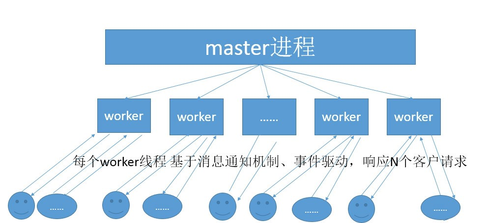

## 官方文档
- 官方文档: https://docs.gunicorn.org/en/stable/install.html
- source: https://github.com/benoitc/gunicorn

## 简介
Gunicorn是一个WSGI HTTP服务器,python自带的有个web服务器,叫做wsgiref模块
- Gunicorn的优势在于,它使用了pre-fork + master-worker模式,gunicorn在启动时,会在主进程中预先fork出指定数量的worker进程来处理请求,
gunicorn依靠操作系统来提供负载均衡,推荐的worker数量是(2*$num_cores)+1
- 我们知道,python是单线程的语言,当进程阻塞时,后续请求将排队处理.所用pre-fork worker模式,极大提升了服务器请求负载.
- 缺点: 不支持HTTP/1.1协议版本

### master-worker

gunicorn启动之后会有一个master进程和多个worker进程
- master进程的主要功能就是管理worker进程
- 所有的请求和响应都是由worker进程进行处理

### pre-fork
pre-fork和fork模式类似,都是通过一个单独的进程来处理请求,但是不同的是,pre-fork模式会提前开启大量的进程,等待处理收到的请求,所以这个模式能够更快的处理请求,等到所有的进程都在处理请求时,服务器会额外开启其他的新进程.

- 每个worker进程都是从master进程fork过来.在master进程里面,先建立好需要listen的socket之后,然后再提前fork出多个worker进程,这样每个worker进程都可以去accept这个socket(fork的进程空间是copy on write产生的,多个子进程会继承该文件描述符).
- 我们模拟用户请求过来的场景, 当一个连接进来后,所有在accept这个socket上面的进程,都会收到通知,而只有一个进程可以accept这个连接,其它的则accept失败.多个worker进程之间是对等的,他们同等竞争来自客户端的请求,各进程互相之间是独立的.一个请求,只可能在一个worker进程中处理,一个worker进程,不可能处理其它进程的请求



### 安装
`pip install gunicorn`

### 命令
- `gunicorn -h`: 查看帮助
- `pip show gunicorn`: 查看info

### 启动命令 & 参数
- `gunicorn -w 4 -b 0.0.0.0:8000 demo:app`: 启动4个worker 监听8000端口 运行demo文件的app应用
1.  `-c CONFIG` & `–config=CONFIG`: 指定一个配置文件(py文件)
2.  `-b BIND` & `–bind=BIND`: 与指定socket进行板顶
3.  `-D` & `–daemon`: 后台进程方式运行gunicorn进程
4.  `-w WORKERS` & `–workers=WORKERS`: 工作进程的数量
5.  `-k WORKERCLASS` & `–worker-class=WORKERCLASS`: 工作进程类型,包括sync(默认)(eventlet,gevent,tornado,gthread,gaiohttp)
6.  `–backlog INT`: 最大挂起的连接数
7.  `–log-level LEVEL`: 日志输出等级
8.  `–access-logfile FILE`: 访问日志输出文件
9.  `–error-logfile FILE`: 错误日志输出文件
11. `--thread` & `--threads`: 线程数量
12. `--worker-connections`：worker最大连接数

### 配置
gunicorn配置项可以通过gunicorn的启动命令行中设定,也可以通过配置文件指定.强烈建议使用一个配置文件.

#### server socket 服务
- `bind`: 监听地址和端口
- `backlog`: 服务器中在pending状态的最大连接数,即client处于waiting的数目.超过这个数目,client连接会得到一个error.建议值64-2048.

#### worker 进程
- `workers`: worker进程的数量(UNIX 进程模式)
    - 建议值`((2*CPU)+1)`,缺省为1
    - wokers之间没有共享内存
- `worker_class`: worker进程的工作方式
    - 选项: sync, eventlet, gevent, tornado, gthread, 缺省值sync
- `threads`: 工作进程中线程的数量.
    - 建议值`((2*CPU)+1)`,缺省值1.
    - 此配置只适用于gthread进程工作方式, 因为gevent这种使用的是协程工作方式
    - 同一个worker生成的每个线程共享相同的内存空间
    - 使用threads模式，worker类就会是gthread
        - 以下两者等同;最大并发数(2*CPU) +1 = 10
        - `gunicorn -w 5 --threads=2  main:app`
        - `gunicorn -w 5 --threads=2 --worker-class=gthread main:app`
- `worker_connections`: 客户端最大同时连接数.
    - 只适用于(eventlet,gevent)(协程类)工作方式
    - workers * worker_connections = 最大并发请求数
- `max_requests`: worker重启之前处理的最大requests数, 缺省值为0表示自动重启disabled.主要是防止内存泄露.
- `max_requests_jitter`: 抖动参数,防止worker全部同时重启.
- `timeout`: 通常设为30.
- `graceful_timeout`: 接收到restart信号后,worker可以在graceful_timeout时间内,继续处理完当前requests.
- `keepalive`: server端保持连接时间.

#### security 安全
- `limit_request_line`: http request line最大字节数.值范围0-8190, 0表示无限制.
- `limit_request_field`: http request中 header字段数的最大值.缺省为100,最大32768.
- `limit_request_field_size`: http request header字段最大字节数.0表示无限制.

#### debug 调试
- `reload`: 当代码有修改时,自动重启workers.适用于开发环境.
- `reload_extra_files`: 扩展reload配置,增加templates,configurations等文件修改监控.
- `spew`: 跟踪程序执行的每一行.
- `check_config`: 检查配置.

#### server 机制
- `sendfile`: 系统底层拷贝数据方式,提供performance.
- `chdir`: 在app加载之前,进入到此目录.
- `daemon`: 应用是否以daemon方式运行.
- `raw_env`: key=value, 传递环境参数.
- `pidfile`: pid存储文件路径.
- `worker_tmp_dir`: 临时工作目录.
- `user`: 指定worker进程的运行用户名.
- `group`: 指定worker进程运行用户所在组.
- `umask`: gunicorn创建文件的缺省权限.
- `pythonpath`: 附加到python path的目录列表.

#### 日志
- `accesslog`: 访问日志文件路径.
- `access_log_format`: 日志格式. 例如 %(h)s %(l)s %(u)s %(t)s "%(r)s" %(s)s %(b)s "%(f)s" "%(a)s" .
- `errorlog`: 错误日志路径.
- `loglever`: 日志级别.debug, info, warning, error, critical.
- `capture_output`: 重定向stdout/stderr到error log file.
- `logger_class`: 日志实现类.缺省gunicorn.glogging.Logger .
- `logconfig`: 日志配置文件.同python标准日志模块logging的配置.

#### 进程名
- `proc_name`: 设置进程名(setproctitle),在ps,top等命令中会看到. 缺省值为default_proc_name配置.

#### server hook 钩子
- `on_starting`
- `on_reload`
- `when_ready`
- `pre_fork`
- `post_fork`
- `post_worker_init`
- `worker_init`
- `worker_abort`
- `pre_exec`
- `pre_request`
- `post_request`
- `child_exit`
- `worker-exit`
- `nworkers_changed`
- `on_exit`


## 其他
### django & flask 自带 WSGI 缺陷
1. 单进程(通过一些手段也可以多进程,但终究不方便)
2. 缺乏worker动态管理

### gunicorn和flask通信 流程
nginx <-> gunicorn <-> flask

### worker 工作模式
1. IO 受限 -建议使用gevent或者asyn
2. CPU受限 -建议增加workers数量
3. 不确定内存占用? -建议使用gthread
4. 不知道怎么选择? -建议增加workers数量

### 参数设置优先级
- 框架设置 < 配置文件 < 命令行
- 即相同参数命令行会覆盖配置文件

### 自动获取cpu核心数
```py
import multiprocessing

bind = "127.0.0.1:8000"
workers = multiprocessing.cpu_count() * 2 + 1
```

### 官方推荐 nginx配置
```nginx
worker_processes 1;

user nobody nogroup;
# 'user nobody nobody;' for systems with 'nobody' as a group instead
error_log  /var/log/nginx/error.log warn;
pid /var/run/nginx.pid;

events {
  worker_connections 1024; # increase if you have lots of clients
  accept_mutex off; # set to 'on' if nginx worker_processes > 1
  # 'use epoll;' to enable for Linux 2.6+
  # 'use kqueue;' to enable for FreeBSD, OSX
}

http {
  include mime.types;
  # fallback in case we can't determine a type
  default_type application/octet-stream;
  access_log /var/log/nginx/access.log combined;
  sendfile on;

  upstream app_server {
    # fail_timeout=0 means we always retry an upstream even if it failed
    # to return a good HTTP response

    # for UNIX domain socket setups
    server unix:/tmp/gunicorn.sock fail_timeout=0;

    # for a TCP configuration
    # server 192.168.0.7:8000 fail_timeout=0;
  }

  server {
    # if no Host match, close the connection to prevent host spoofing
    listen 80 default_server;
    return 444;
  }

  server {
    # use 'listen 80 deferred;' for Linux
    # use 'listen 80 accept_filter=httpready;' for FreeBSD
    listen 80;
    client_max_body_size 4G;

    # set the correct host(s) for your site
    server_name example.com www.example.com;

    keepalive_timeout 5;

    # path for static files
    root /path/to/app/current/public;

    location / {
      # checks for static file, if not found proxy to app
      try_files $uri @proxy_to_app;
    }

    location @proxy_to_app {
      proxy_set_header X-Forwarded-For $proxy_add_x_forwarded_for;
      proxy_set_header X-Forwarded-Proto $scheme;
      proxy_set_header Host $http_host;
      # we don't want nginx trying to do something clever with
      # redirects, we set the Host: header above already.
      proxy_redirect off;
      proxy_pass http://app_server;
      # proxy_buffering off; 
      # When you do this you must run with one of the async worker classes
    }

    error_page 500 502 503 504 /500.html;
    location = /500.html {
      root /path/to/app/current/public;
    }
  }
}
```

### nginx与gunicorn不同服务器
If you are running Nginx on a different host than Gunicorn you need to tell Gunicorn to trust the X-Forwarded-* headers sent by Nginx. By default, Gunicorn will only trust these headers if the connection comes from localhost. This is to prevent a malicious client from forging these headers:

- `gunicorn -w 3 --forwarded-allow-ips="10.170.3.217,10.170.3.220" test:app`: 设置运行名单

### Supervisor监控gunicorn服务状态

```
[program:gunicorn]
command=/path/to/gunicorn main:application -c /path/to/gunicorn.conf.py
directory=/path/to/project
user=nobody
autostart=true
autorestart=true
redirect_stderr=true
```

### 自定义gunicorn服务
- `gunicorn.app.base.BaseApplication`: 继承

ex:
```py
import multiprocessing

import gunicorn.app.base


def number_of_workers():
    return (multiprocessing.cpu_count() * 2) + 1


def handler_app(environ, start_response):
    response_body = b'Works fine'
    status = '200 OK'

    response_headers = [
        ('Content-Type', 'text/plain'),
    ]

    start_response(status, response_headers)

    return [response_body]


class StandaloneApplication(gunicorn.app.base.BaseApplication):

    def __init__(self, app, options=None):
        self.options = options or {}
        self.application = app
        super().__init__()

    def load_config(self):
        config = {key: value for key, value in self.options.items()
                  if key in self.cfg.settings and value is not None}
        for key, value in config.items():
            self.cfg.set(key.lower(), value)

    def load(self):
        return self.application


if __name__ == '__main__':
    options = {
        'bind': '%s:%s' % ('127.0.0.1', '8080'),
        'workers': number_of_workers(),
    }
    StandaloneApplication(handler_app, options).run()
```

### 架构

#### 服务模式
- Gunicorn是基于pre-fork worker 模型。
- 这意味着存在一个master主进程来管理一组worker进程。
- master不处理任何关于来自客户端的事情。
- 所有请求和响应都完全由工作进程处理。

#### master

- master是一个简单的循环，它监听各种过程信号并做出相应的反应。 
- 它通过侦听`TTIN`，`TTOU`和`CHLD`等信号来管理正在运行的worker列表。 
- `TTIN`和`TTOU`通知master增加或减少正在运行的工人的数量。 
- `CHLD`说明 worker子进程已终止，在这种情况下，master会自动重新启动发生故障的程序。

### 重启服务
`kill -HUP master的pid`

### 为什么不支持keep-alive(长连接)
因为gunicorn在设计的时候就打算放在代理服务器(nginx)之后运行

### 动态改变worker数量
- `kill -TTIN $masterpid`: 增加一个工人
- `kill -TTOU $masterpid`: 减少一个工人

### gunicorn暂时无法解决惊群效应(Thundering Herd)的问题
- 什么是惊群效应
1. 惊群现象就是多进程（多线程）在同时阻塞等待同一个事件的时候（休眠状态），如果等待的这个事件发生，那么他就会唤醒等待的所有进程（或者线程），但是最终却只可能有一个进程（线程）获得这个时间的“控制权”，对该事件进行处理，而其他进程（线程）获取“控制权”失败，只能重新进入休眠状态，这种现象和性能浪费就叫做惊群。

- 惊群效应消耗了什么
1. 系统对用户进程/线程频繁地做无效的调度，上下文切换系统性能大打折扣。
2. 为了确保只有一个线程得到资源，用户必须对资源操作进行加锁保护，进一步加大了系统开销

- Linux 解决方案之 Accept
1. Linux 2.6 版本之前，监听同一个 socket 的进程会挂在同一个等待队列上，当请求到来时，会唤醒所有等待的进程。
2. Linux 2.6 版本之后，通过引入一个标记位 WQ_FLAG_EXCLUSIVE，解决掉了 accept 惊群效应。
