参考资料
1. http://docs.kubernetes.org.cn/
2. 在线k8s：https://www.katacoda.com/
3. https://kubernetes.io/zh/docs/home/

# 1. 简介
1. Kubernetes是一个容器编排平台, 用于管理容器的工作负载和服务
2. Docker无法应用于庞大的业务实现，存在编排困难、管理和调度问题。k8s则满足对 Docker 及容器进行更高级更灵活的管理。
3. k8s 把数量众多的服务器重新抽象为一个统一的资源池
4. k8s 自己也是运行在一堆 pod 上

优点:
- 快速部署应用
- 快速扩展应用
- 无缝对接新的应用功能
- 节省资源，优化硬件资源的使用

特点:
- 可移植: 支持公有云，私有云，混合云，多重云 multi-cloud
- 可拓展: 模块化，插件化，可挂载，可组合
- 自动化: 自动部署，自动重启，自动复制，自动伸缩/扩展

功能：
1. 自动装箱
  - 基于容器对应用运行环境的资源配置要求自动部署应用容器
2. 自我修复
  - 当容器失败时，会对容器进行重启
  - Node节点故障时，会对容器进行重新部署和调度
  - 当容器未通过监控检查时，会关闭容器直至正常，才恢复对外服务
3. 水平扩展
  - 通过简单的命令、用户UI界面或基于CPU等资源使用情况，对应用容器进行规模扩大或规模剪裁
4. 服务发现（负载均衡）
  - 用户不需使用额外的服务发现机制，就能够基于Kubernetes自身能力实现服务发现和负载均衡。
5. 滚动更新
  - 可以根据应用的变化，对应用容器运行的应用，进行一次性或批量式更新。
  - 当更新的服务没问题时才会替代原有服务并销毁
6. 版本回退
  - 可以根据应用部署情况，对应用容器运行的应用，进行历史版本即时回退。
7. 密钥和配置管理。
  - 在不需要重新构建镜像的情况下，可以部署和更新密钥和应用配置，类似热部署。
8. 存储编排
  - 自动实现存储系统挂载及应用，特别对有状态应用实现数据持久化非常重要
  - 存储系统可以来自于本地目录、网络存储（NFS、Gluster、Ceph 等）、公共云存储服务
9. 批处理。
  - 提供一次性任务，定时任务；满足批量数据处理和分析的场景。

## 1.2 云架构
- 云和 K8s 是什么关系
    - 云就是使用容器构建的一套服务集群网络，云由很多的大量容器构成。K8s 就是用来管理云中的容器。

- 云原生有如下特点：
    - 容器化，所有服务都必须部署在容器中
    - 微服务，Web 服务架构式服务架构
    - CI/CD
    - DevOps

- Iaas: 基础设施即服务(一台云服务器)
- Paas: 平台即服务(数据库)
- Saas: 软件即服务(现成的软件)

## 1.3 k8s架构
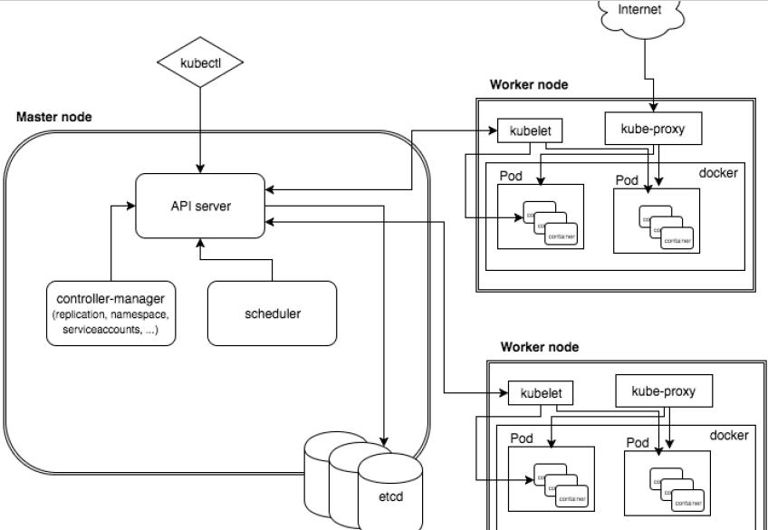

k8s是一(master)对多(slave)的分布式架构

Master节点结构:(主控节点)
- apiserver 网关: 集群统一入口，以restful方式提供服务，交给etcd存储
- Scheduler 调度器: 对集群内部的资源（node）进行调度
- Controller MangerServer 控制器管理: 负责管理控制器
  - 处理集群中常规后台任务，一个资源对应一个控制器
- ETCD 存储系统：保存集群相关数据

Worker节点结构:(工作节点)
- kubelet: 管理节点上的资源操作指令(Node上的Pod，包括创建、修改、监控、删除等)
- kube-proxy 网络代理(虚拟网卡): 服务间(Pod)负载均衡
- Pod: k8s 管理的基本单元（最小单元）
    - k8s 不直接管理容器，而是管理 Pod
    - 容器的存储在 Node 节点，容器是存储在 Pod 内部的
    - Pod 内部可以有一个容器，或者多个容器
    - 由多个docker容器（常规1个） + pause容器组成(pause用来传达管理其他容器的指令)
- Docker: 容器引擎


# 2. kubectl k8s命令行工具

kubectl命令语法: `kubectl [COMMAND] [TYPE] [NAME] [FLAGS]`
- COMMAND: 指定要对资源执行的操作(create, get, describe, delete)
- TYPE: 指定资源类型,支持单数/复数
- NAME: 资源名称,大小写敏感,如果不写则显示全部
- FLAGS: 可选参数

e.g. :
`kubectl get node xx`: 查看名为xx的node

获取kubectl帮助: `kubectl --help`

帮助可以不断细化, 例如: `get`子命令帮助: `kubectl get --help`

## 1. 命令分类

### 1. 基础命令
|命令|说明|
|-|-|
|create|通过文件名/标准输入创建资源|
|expose|将一个资源公开为一个新的service(服务)|
|run|在集群中运行一个特定的功能|
|set|在对象上设置特定的功能|
|get|显示一个或多个资源|
|explain|文档参考资料|
|edit|使用默认的编辑器编辑一个资源|
|delete|通过文件名,标准输入,资源名称,标签选择器来删除资源|

### 2. 部署命令
|命令|说明|
|-|-|
|rollout|管理资源的发布|
|rolling-update|对给定的复制控制器滚动更新|
|scale|扩容/缩容pod数量,deployment,replicaset,rc,job|
|autoscale|创建一个自动选择扩容/缩容饼设置pod数量|

### 3. 集群管理命令
|命令|说明|
|-|-|
|certificate|修改证书资源|
|cluster-info|显示集群信息|
|top|显示资源使用.需要heapster运行|
|cordon|标记节点不可调度|
|uncordon|标记节点可调度|
|drain|驱逐节点的应用,准备下线维护|
|taint|修改节点taint标记|

### 4. 故障诊断\调试命令
|命令|说明|
|-|-|
|describe|显示特定资源或资源组的详细信息|
|logs|在一个pod中打印一个容器日志,如果pod只有一个容器,容器名称是可选的|
|attach|附加到一个运行的容器|
|exec|执行命令到容器|
|port-forward|转发一个或多个本地端口到一个pod|
|proxy|运行一个proxy到kubernetes api server|
|cp|拷贝文件/目录到容器中|
|auth|检查授权|


### 5. 高级命令
|命令|说明|
|-|-|
|apply|通过文件名/标准输入对资源应用配置|
|patch|使用补丁修改,更新资源的资源|
|replace|通过文件名或标准输入替换一个资源|
|convert|不同的api版本之间转换配置文件|

### 6. 设置命令
|命令|说明|
|-|-|
|label|更新资源上的标签|
|annotate|更新资源上的注释|
|completion|用于实现kubectl工具自动补全|

### 7. 其他命令
|命令|说明|
|-|-|
|api-versions|受支持的API版本|
|config|修改kubeconfig文件|
|help|所有命令帮助|
|plugin|运行一个命令行插件|
|version|打印客户端和服务版本信息|

## 2. 命令实例

### 1. 查看
- 命名空间: 是 k8s 中'组'的概念，提供同一服务的 pod 就应该被放置同一命名空间下
#### 1. kubectl get 查看资源

- `kubectl get pod` \ `kubectl get po`: 查看所有pod(容器组)
- `kubectl get pod -n kube-system -o wide`: 查看系统服务pod
    - `-n`: 指定 命名空间(k8s 所有的 pod 都被放置在 kube-system 命名空间下)
    - `-o wide`: 查看更多的信息
- `kubectl get pod redis-master-fd5b55b33 -o yaml`
    - `-o yaml`: pod的配置文件
- `kubectl get node`: 查看集群节点
- `kubectl get svc`: 查看服务(service)
- `kubectl get rs`: 查看副本控制器(ReplicaSet副本集)
- `kubectl get deploy`: 查看部署(Deployment)
- `kubectl get secret`: 查看秘钥(secret)
- `kubectl get pod,svc`: 可以进行组合查询(一次性给出2个的结果)
----
e.g. :
```py
root@xixi:~# kubectl get pod -n kube-system
--------------------------------------------------------------------------
NAME                                    READY   STATUS    RESTARTS   AGE
dns-4c5785cbcc-8ck7s                1/1     Running   2          169d
dns-4c5785cbcc-zsmvg                1/1     Running   2          169d
heapster-4b9b6b6597-6l9gd               1/1     Running   3          169d
kube-flannel-ds-amd64-bmkdv             1/1     Running   11         371d
kubernetes-dashboard-59d6887fdf-pdfrd   1/1     Running   0          158d
metrics-server-79558644c6-ngj4g         1/1     Running   2          169d
prometheus-68f6cf7cfd-87sh2             1/1     Running   1          169d
```

- NAME：第一列是 pod 的名字，k8s 默认为 pod 随机分配一个五位数的后缀。
- READY：第二列是 pod 中已经就绪的容器数量，上文中我们提到了，pod 封装了一个或多个 docker 容器。在这里，1/1的含义为:就绪1个容器/共计1个容器。
- STATUS：第三列是 pod 的当前状态，下面是一些常见的状态：

|状态名	|含义|
|-|-|
|Running|运行中|
|Error|异常，无法提供服务|
|Pending|准备中，暂时无法提供服务|
|Terminating|结束中，即将被移除|
|Unknown|未知状态，多发生于节点宕机|
|PullImageBackOff|镜像拉取失败|

- RESTART：k8s 可以自动重启 pod，这一行就是标记了 pod 一共重启了多少次。
- AGE：pod 一共存在了多长时间。

#### 2. kubectl describe 查看详情

`-n`: 指定 命名空间

- `kubectl describe secrets 秘钥名`: 查看指定秘钥详情 
    - Example: `kubectl describe secrets admin-user-token-666wc -n kube-system` 查看dashboard token
- `kubectl describe pod 容器组名`: 查看指定容器详情
    - Example: `kubectl describe pod redis-master-fd5b55b33-t95lr` 查看redis pod 的详情

```py
root@xixipc:~# kubectl describe pod redis-master-fd5b55b33-t95lr
------------------------------------------------------------------
# 实例名字
Name:           redis-master-fd5b55b33-t95lr
# 命名空间
Namespace:      default
# 工作节点
Node:           172.16.5.11/172.16.5.11
# 启动时间
Start Time:     Tue, 14 Apr 2020 09:18:11 +0800
# 标签
Labels:         app=redis
                pod-template-hash=fd5b55b33
                role=master
# 注解
Annotations:    <none>
# 状态
Status:         Running
# pod的ip
IP:             172.20.0.97
# 控制资源
Controlled By:  ReplicaSet/redis-master-fd5b55b33
Containers:
  redis-master:
    Container ID:   docker://b63482e57bc593648629a6d5c76f30a38f074a4e562ec9c3b9ec067d4d45f7
    Image:          redis:2.8.23
    Image ID:       docker-pullable://redis@sha256:e507029ca6a11b85f8ff16d7ff73ae54582f16fd757e64431f5ca6d27a13c
    Port:           6379/TCP
    Host Port:      0/TCP
    State:          Running
      Started:      Fri, 24 Apr 2020 17:24:46 +0800
    Last State:     Terminated
      Reason:       Completed
      Exit Code:    0
      Started:      Fri, 24 Apr 2020 17:22:52 +0800
      Finished:     Fri, 24 Apr 2020 17:23:39 +0800
    Ready:          True
    Restart Count:  2
    Environment:    <none>
    Mounts:
      /var/run/secrets/kubernetes.io/serviceaccount from default-token-f0wln (ro)
Conditions:
  Type              Status
  Initialized       True 
  Ready             True 
  ContainersReady   True 
  PodScheduled      True 
Volumes:
  default-token-f0wln:
    Type:        Secret (a volume populated by a Secret)
    SecretName:  default-token-f0wln
    Optional:    false
QoS Class:       BestEffort
Node-Selectors:  <none>
Tolerations:     <none>
Events:          <none>
```
- 当pod运行异常时,可以在describe末尾处的Events看到相关信息

#### 3. kubectl logs 查看日志
`kubectl logs -f -n kube-system prometheus-68f6cf7cfd-87sh2`
- `-f`: 持续查看日志
- `-n`: 指定空间名

### 2. 创建(kubectl create)


#### 2.1  yaml文件创建资源
`kubectl create -f <yaml文件>`
- 配置文件格式:

```yaml
apiVersion: v1
kind: Pod
metadata:
  name: redis-manual
spec:
  containers:
  - image: xixi/redis
    name: redis
    ports:
      containerPort: 8080
      protocol: TCP
```

#### 2.2 简易创建
- `kubectl create <资源类型> <资源名>`
- `kubectl create` 会有帮助文档

e.g. :
- `kubectl create deployment nginx --image=nginx`: 拉取nginx并运行
- `kubectl expose deployment nginx --port=80 --type=NodePort`: 对外暴露80端口
- `kubectl get pod,svc`: 查看pod和service


### 3. 查看配置解释

#### 3.1 kubectl explain 查看配置解释

- `kubectl explain <配置名>`

- Example 查看services解释:`kubectl explain services`

```
root@xixipc:~# kubectl explain services
KIND:     Service
VERSION:  v1

DESCRIPTION:
     Service is a named abstraction of software service (for example, mysql)
     consisting of local port (for example 3306) that the proxy listens on, and
     the selector that determines which pods will answer requests sent through
     the proxy.

FIELDS:
   apiVersion	<string>
     APIVersion defines the versioned schema of this representation of an
     object. Servers should convert recognized schemas to the latest internal
     value, and may reject unrecognized values. More info:
     https://git.k8s.io/community/contributors/devel/api-conventions.md#resources

   kind	<string>
     Kind is a string value representing the REST resource this object
     represents. Servers may infer this from the endpoint the client submits
     requests to. Cannot be updated. In CamelCase. More info:
     https://git.k8s.io/community/contributors/devel/api-conventions.md#types-kinds

   metadata	<Object>
     Standard object's metadata. More info:
     https://git.k8s.io/community/contributors/devel/api-conventions.md#metadata

   spec	<Object>
     Spec defines the behavior of a service.
     https://git.k8s.io/community/contributors/devel/api-conventions.md#spec-and-status

   status	<Object>
     Most recently observed status of the service. Populated by the system.
     Read-only. More info:
     https://git.k8s.io/community/contributors/devel/api-conventions.md#spec-and-status

```

- e.g.: 查看services的status解释:`kubectl explain services.status`

```yaml
root@devops40:~# kubectl explain services.status
KIND:     Service
VERSION:  v1

RESOURCE: status <Object>

DESCRIPTION:
     Most recently observed status of the service. Populated by the system.
     Read-only. More info:
     https://git.k8s.io/community/contributors/devel/api-conventions.md#spec-and-status

     ServiceStatus represents the current status of a service.

FIELDS:
   loadBalancer	<Object>
     LoadBalancer contains the current status of the load-balancer, if one is
     present.

```

### 4. 删除
#### 4.1 kubectl delete 删除
- `kubectl delete <资源类型> <资源名>`
    - `kubectl delete pod redis-4n2tg`: 删除指定pod
    - `kubectl delete pod --all`: 删除全部pod
    - `kubectl delete all --all`: 删除全部
    - `kubectl delete deployment deployment_name`: 删除deployment,会将所有的pod都删除

### 5. 编辑
#### 5.1 kubectl edit 编辑配置
- `kubectl edit <资源类型> <资源名>`
    - `kubectl edit pod redis-manual`

tips: 无法修改运行中资源的名称和类型

#### 5.2 kubectl apply 应用配置
- `kubectl apply -f <yaml文件>`: 
    - k8s 在接受到这个配置文件后，会根据metadata中的元数据来查找目标资源，如果没有的话则直接新建，如果找到的话就依次比对配置文件之间有什么不同点，然后应用不同的配置。
    - 例如可以将配置指定为远程配置

### 6. 其他命令
- `kubectl version`: 查看k8s的版本
- `kubectl cluster-info`: 查看master地址和版本
- `kubectl expose deployment nginx --port=80 --type=NodePort`: 对外暴露端口
- `kubectl run nginx-deployment --image=nginx:1.7.9 --replicas=2`: 创建并运行名为nginx-deployment的pod和相关的deployment等其他组件

# 3. 核心概念
核心组件: Pod, ReplicaSet, Deployment, StatefulSet, controller, service

## 3.1 yaml配置文件

### 1. 配置文件示例

#### 1.pod的yaml
```yml
apiVersion: v1
kind: Pod
metadata:
  creationTimestamp: "2020-04-14T01:04:52Z"
  generateName: redis-master-fd5b55b85-
  labels:
    app: redis
    pod-template-hash: fd5b55b85
    role: master
  name: redis-master-fd5b55b85-t9r
  namespace: default
  ownerReferences:
  - apiVersion: apps/v1
    blockOwnerDeletion: true
    controller: true
    kind: ReplicaSet
    name: redis-master-fd5b55b85
    uid: 593a225f-c885-11e9-950d-a401211cc2
  resourceVersion: "69192726"
  selfLink: /api/v1/namespaces/default/pods/redis-master-fd5b55b85-t95lr
  uid: f26b819a-7deb-11ea-8c04-a4bf012112
spec:
  containers:
  - image: redis:2.8.23
    imagePullPolicy: IfNotPresent
    name: redis-master
    ports:
    - containerPort: 6379
      name: redis-server
      protocol: TCP
    resources: {}
    terminationMessagePath: /dev/termination-log
    terminationMessagePolicy: File
    volumeMounts:
    - mountPath: /var/run/secrets/kubernetes.io/serviceaccount
      name: default-token-f7wln
      readOnly: true
  dnsPolicy: ClusterFirst
  enableServiceLinks: true
  nodeName: 172.16.0.40
  restartPolicy: Always
  schedulerName: default-scheduler
  securityContext: {}
  serviceAccount: default
  serviceAccountName: default
  terminationGracePeriodSeconds: 30
  volumes:
  - name: default-token-f7w
    secret:
      defaultMode: 420
      secretName: default-token-f7w
status:
  conditions:
  - lastProbeTime: null
    lastTransitionTime: "2020-04-14T01:18:11Z"
    status: "True"
    type: Initialized
  - lastProbeTime: null
    lastTransitionTime: "2020-04-24T09:24:48Z"
    status: "True"
    type: Ready
  - lastProbeTime: null
    lastTransitionTime: "2020-04-24T09:24:48Z"
    status: "True"
    type: ContainersReady
  - lastProbeTime: null
    lastTransitionTime: "2020-04-14T01:18:11Z"
    status: "True"
    type: PodScheduled
  containerStatuses:
  - containerID: docker://b63482e57bc593648629a6d5c76f30a3ec9c3b9ec067d4d45f7
    image: redis:2.8.23
    imageID: docker-pullable://redis@sha256:e507029ca6a11b85f8628ff582f16fd757e64431f5ca6d27a13c
    lastState:
      terminated:
        containerID: docker://82104ba34bd48da6c099edd52620a2ef2ee8b525b664
        exitCode: 0
        finishedAt: "2020-04-24T09:23:39Z"
        reason: Completed
        startedAt: "2020-04-24T09:22:52Z"
    name: redis-master
    ready: true
    restartCount: 2
    state:
      running:
        startedAt: "2020-04-24T09:24:46Z"
  hostIP: 172.16.0.40
  phase: Running
  podIP: 172.20.0.97
  qosClass: BestEffort
  startTime: "2020-04-14T01:18:11Z"
```

#### 2.Deployment的yaml
```yml
apiVersion: extensions/v1beta1
kind: Deployment
metadata:
  annotations:
    deployment.kubernetes.io/revision: "1"
  creationTimestamp: "2019-08-27T04:44:26Z"
  generation: 1
  labels:
    app: redis
    role: master
  name: redis-master
  namespace: default
  resourceVersion: "69192729"
  selfLink: /apis/extensions/v1beta1/namespaces/default/deployments/redis-master
  uid: 5939e1ab-c885-11e9-950d-a1211cc2
spec:
  progressDeadlineSeconds: 600
  replicas: 1
  revisionHistoryLimit: 2
  selector:
    matchLabels:
      app: redis
      role: master
  strategy:
    rollingUpdate:
      maxSurge: 25%
      maxUnavailable: 25%
    type: RollingUpdate
  template:
    metadata:
      creationTimestamp: null
      labels:
        app: redis
        role: master
    spec:
      containers:
      - image: redis:2.8.23
        imagePullPolicy: IfNotPresent
        name: redis-master
        ports:
        - containerPort: 6379
          name: redis-server
          protocol: TCP
        resources: {}
        terminationMessagePath: /dev/termination-log
        terminationMessagePolicy: File
      dnsPolicy: ClusterFirst
      restartPolicy: Always
      schedulerName: default-scheduler
      securityContext: {}
      terminationGracePeriodSeconds: 30
status:
  availableReplicas: 1
  conditions:
  - lastTransitionTime: "2019-08-27T04:44:26Z"
    lastUpdateTime: "2019-08-27T04:45:22Z"
    message: ReplicaSet "redis-master-fd5b55b85" has successfully progressed.
    reason: NewReplicaSetAvailable
    status: "True"
    type: Progressing
  - lastTransitionTime: "2021-06-10T03:49:51Z"
    lastUpdateTime: "2021-06-10T03:49:51Z"
    message: Deployment has minimum availability.
    reason: MinimumReplicasAvailable
    status: "True"
    type: Available
  observedGeneration: 1
  readyReplicas: 1
  replicas: 1
  updatedReplicas: 1
```
|  属性名称  |    介绍    |
| :--------: | :--------: |
| apiVersion |  API版本   |
|    kind    |  资源类型  |
|  metadata  | 资源元数据 |
|    spec    |  资源规格  |
|  replicas  |  副本数量  |
|  selector  | 标签选择器 |
|  template  |  Pod模板   |
|  metadata  | Pod元数据  |
|    spec    |  Pod规格   |
| containers |  容器配置  |

### 2.生成&获取 配置文件
获取已有配置文件: `kubectl get 资源类型 资源名 -o yaml`
- e.g.:`kubectl get po nginx -o yaml`

生成配置文件: `kubectl create deployment web --image=nginx -o yaml --dry-run > hello.yaml`: 试运行一个部署并重定向输出
- `--dry-run`: 尝试运行,并不会真正的创建部署

## 3.2 Pod (容器组)
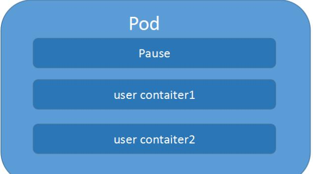
### 1.什么是pod
#### 1.基础概念
- Pod 是一个容器，这个容器中装的是 Docker 创建的容器，Pod 是用来封装容器的一个容器
- Pod 是一个逻辑分组, 是应用的一个实例相当于独立主机，有专用的IP
- Pod 是k8s的最小创建和管理单元, 是在k8s上运行容器化应用的资源对象, 其他的资源对象都是用来支撑或者扩展Pod对象功能的
  - 控制器对象是用来管控Pod对象的
  - Service或者Ingress资源对象是用来暴露Pod 引用对象的
  - PersistentVolume资源对象是用来为Pod提供存储
- Pod 生命周期是短暂的
- Pod由一个或多个容器组成，彼此间共享网络和存储资源，每个Pod 中有一个Pause(根)容器保存所有的容器状态， 通过管理pause容器，达到管理pod 中所有容器的效果
- 同一个Pod 中的容器总会被调度到相同Node 节点，不同节点间Pod 的通信基于虚拟二层网络技术实现
---
1. Web 服务集群如何实现？
    - 实现服务集群：只需要复制多方 Pod 的副本即可，这也是 K8s 管理的先进之处，K8s 如果继续扩容，只需要控制 Pod 的数量即可，缩容道理类似。

2. Pod 底层网络，数据存储是如何进行的？
    - Pod 内部容器创建之前，必须先创建 Pause(根容器)容器；
    - 服务容器之间访问 localhost ，相当于访问本地服务一样，性能非常高。
#### 2.资源共享
一个Pod 里的多个容器可以**共享存储和网络**，可以看作一个逻辑的主机。共享的如namespace,cgroups 或者其他的隔离资源。

多个容器共享同一`network namespace`，由此在一个Pod 里的多个容器共享Pod的`IP`和`端口namespace`，所以一个Pod 内的多个容器之间可以通过localhost 来进行通信,所需要注意的是不同容器要注意不要有端口冲突即可。不同的Pod 有不同的IP,不同Pod 内的多个容器之前通信，不可以使用IPC（如果没有特殊指定的话）通信，通常情况下使用Pod的IP 进行通信。

一个Pod 里的多个容器可以共享存储卷，这个存储卷会被定义为Pod 的一部分，并且可以挂载到该Pod 里的所有容器的文件系统上。

```yml
apiVersion: v1
kind: Pod
metadata:
  creationTimestamp: "2019-12-30T10:29:20Z"
  generateName: redis-master-d889978-
  labels:
    app: redis
    pod-template-hash: d889978
    role: master
  name: redis-master-d889978-dhhj5
  namespace: default
spec:
  containers:
  - image: redis:2.8.23
    imagePullPolicy: IfNotPresent  # 镜像拉取策略
    name: redis-master
    ports:
    - containerPort: 6379
      name: redis-server
      protocol: TCP
    resources: {}
    terminationMessagePath: /dev/termination-log
    terminationMessagePolicy: File
    volumeMounts:
    - mountPath: /data  # 挂载
      name: redis-nfs
    - mountPath: /var/run/secrets/kubernetes/serviceaccount
      name: default-token-nss
      readOnly: true
volumes:  # 数据卷
- name: data
  emptyDir: {}
```
#### 3.命令行
三者等价 `po` 代替 `pod` \ `pods`

- `kubectl create -f xxx.yaml`
- `kubectl get pod/po <Pod_name>`
- `kubectl get pod/po <Pod_name> -o wide`
- `kubectl describe pod/po <Pod_name>`
- `kubectl delete -f pod pod_name.yaml`
- `kubectl delete pod --all/[pod_name]`


#### 4.pod 创建流程
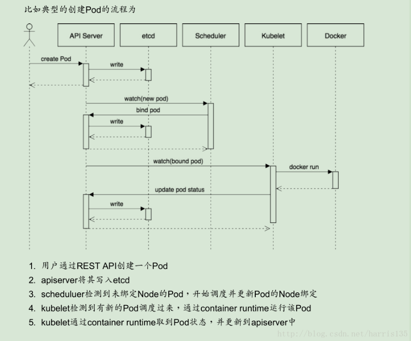
1. 客户端提交创建请求，可以通过API Server的Restful API，也可以使用kubectl命令行工具。支持的数据类型包括JSON和YAML。
2. API Server处理用户请求，存储Pod的元数据到etcd。
3. 调度器通过API Server查看未绑定的Pod。尝试为Pod分配主机。
    1. 过滤主机 (调度预选)：调度器用一组规则过滤掉不符合要求的主机。比如Pod指定了所需要的资源量，那么可用资源比Pod需要的资源量少的主机会被过滤掉。
    2. 主机打分(调度优选)：对第一步筛选出的符合要求的主机进行打分，在主机打分阶段，调度器会考虑一些整体优化策略，比如把容一个Replication Controller的副本分布到不同的主机上，使用最低负载的主机等。
    3. 选择主机：选择打分最高的主机，进行binding操作。
4. 绑定成功后，scheduler会调用APIServer的API在etcd中创建一个boundpod对象(描述在一个工作节点上绑定运行的所有pod信息)
5. kubelet检测到有新的调度结果通过container runtime 运行Pod创建操作
    - 运行在每个工作节点上的kubelet也会定期与etcd同步boundpod信息，一旦发现应该在该工作节点上运行的boundpod对象没有更新，则调用Docker API创建并启动pod内的容器。
6. kubelet通过container runtime获取POD状态,并更新到API Server,API Server将结果写入etcd中

#### 5.Pod的网络实现


infra container，它也叫做pause容器，也被称为sandbox,这个沙箱为其他容器提供共享的网络和文件挂载资源.它的逻辑跟docker中container网络模式的逻辑一样.当这个容器被创建出来并hold住Network Namespace之后，其他由用户自己定义的容器就可以通过container模式加入到这个容器的Network Namespace中,这也就意味着，对于在一个POD中的容器A和容器B来说，他们拥有相同的IP地址，可以通过localhost进行互相通信
#### 6.Pod yaml配置文件
[原始pod的yaml文件](#1.pod的yaml)

##### 1.单个容器ex
```yml
apiVersion: v1 
kind: Pod 
metadata:
  name: mytomcat 
  labels:
    name: mytomcat 
spec:
  containers:
  - name: mytomcat 
  image: tomcat 
  ports:
  - containerPort: 8000
```

##### 2.多个容器ex

```yml
apiVersion: v1 
kind: Pod 
metadata:
  name: myweb 
  labels:
    name: tomcat-redis
spec:
  containers:
  - name: tomcat 
  image: tomcat 
  ports:
  - containerPort: 8080
  - name: redis 
  image: redis 
  ports:
  - containerPort: 6379
```

### 2.镜像拉取策略
|状态名	|含义|
|-|-|
|IfNotPresent|默认值，镜像在宿主机上不存在才拉取|
|Always|不管什么情况只要启动容器就尝试拉取镜像，如果节点中有镜像会覆盖|
|Never|Pod永远不会主动拉取这个镜像|

```yml
apiVersion: v1
kind: Pod
metadata:
  name: test
  labels:
    run: test
spec:
  nodeSelector:
      env: test
  containers:
  - name: selenium-node-chrome
    image: registry.4paradigm.com/chrome_debug
    imagePullPolicy: IfNotPresent
    ports:
      - containerPort: 5900
```


### 3.调度策略

#### 1.节点选择器标签(nodeSelector)
`kubectl label nodes <node-name> <label-key>=<label-value> `

`kubectl label nodes qa-test001 env=test`: 向qa-test001这个节点打上`env=test`的标签

`kubectl get nodes --show-labels`: 查看label

`kubectl label nodes <node-name> <label-key>-`: 删除

`kubectl label nodes <node-name> <label-key>=<label-value> --overwrite`: 修改

部署POD的时候selector会部署在含有指定label的node

```yaml
apiVersion: v1
kind: Pod
metadata:
  name: test
  labels:
    run: test
spec:
      nodeSelector:
         env: test
      containers:
      - name: selenium-node-chrome
        image: registry.4paradigm.com/chrome_debug
        imagePullPolicy: IfNotPresent
        ports:
          - containerPort: 5900
        env:
          - name: HUB_PORT_4444_TCP_ADDR
            value: "selenium-hub"
          - name: HUB_PORT_4444_TCP_PORT
            value: "4444"
          - name: NODE_MAX_INSTANCES
            value: "30"
          - name: NODE_MAX_SESSION
            value: "30"
          - name: NODE_REGISTER_CYCLE
            value: "5000"
          - name: DBUS_SESSION_BUS_ADDRESS
            value: "/dev/null"
```
#### 2.资源配额
Pod在进行调度的时候，会根据设定的资源配额进行限制，例如限制某Pod调度所需的资源是2c4g，那么在调度对应的node节点时，只会占用对应的资源，对于不满足资源的节点，将不会进行调度
```yml
apiVersion: v1 
kind: Pod 
metadata:
  name: mydb 
sepc:
  containers:
  - name: db
    image: mysql
    env:
    - name: MYSQL_ROOT_PASSWORD
      value: "123456pwd"
    resources:
      requests:
        memory: "64Mi"
        cpu: "250m"
      limits:
        memory: "128Mi"
        cpu: "500m"
```
- requests:
  - 调度所需的资源最少0.25 个CPU 以及64MiB 内存，
- limits:
  - 最大所占用的资源为0.5 个CPU 以及128MiB 内存

#### 3.节点亲和性(nodeAffinity)
- 硬亲和性：约束条件必须满足
  1. `requiredDuringSchedulingIgnoredDuringExecution`
  表示pod必须部署到满足条件的节点上，如果没有满足条件的节点，就不停重试。其中IgnoreDuringExecution表示pod部署之后运行的时候，如果节点标签发生了变化，不再满足pod指定的条件，pod也会继续运行。

  2. `requiredDuringSchedulingRequiredDuringExecution`
  表示pod必须部署到满足条件的节点上，如果没有满足条件的节点，就不停重试。其中RequiredDuringExecution表示pod部署之后运行的时候，如果节点标签发生了变化，不再满足pod指定的条件，则重新选择符合要求的节点。
- 软亲和性：尝试满足，不保证
  1. `preferredDuringSchedulingIgnoredDuringExecution`
  表示优先部署到满足条件的节点上，如果没有满足条件的节点，就忽略这些条件，按照正常逻辑部署。

  2. `preferredDuringSchedulingRequiredDuringExecution`
  表示优先部署到满足条件的节点上，如果没有满足条件的节点，就忽略这些条件，按照正常逻辑部署。其中RequiredDuringExecution表示如果后面节点标签发生了变化，满足了条件，则重新调度到满足条件的节点。

- 操作符
  - In: label的值在某个列表中
  - NotIn：label的值不在某个列表中
  - Exists：某个label存在
  - DoesNotExist：某个label不存在
  - Gt：label的值大于某个值（字符串比较）
  - Lt：label的值小于某个值（字符串比较）


e.g. :
1. pod可以被调度到标签key为`kubernetes.io/e2e-az-name`，值为“e2e-az1”或“e2e-az2”的节点。
2. 另外，在满足该条件的节点中，优先使用具有`another-node-label-key`标签，且值为`another-node-label-value`的节点。
```yml
apiVersion: v1
kind: Pod
metadata:
  name: with-node-affinity
spec:
  affinity:
    nodeAffinity:
      requiredDuringSchedulingIgnoredDuringExecution:  # 硬亲和
        nodeSelectorTerms:
        - matchExpressions:
          - key: kubernetes.io/e2e-az-name
            operator: In
            values:
            - e2e-az1
            - e2e-az2
      preferredDuringSchedulingIgnoredDuringExecution:  # 软亲和
      - weight: 1
        preference:
          matchExpressions:
          - key: another-node-label-key
            operator: In
            values:
            - another-node-label-value
  containers:
  - name: with-node-affinity
    image: gcr.io/google_containers/pause:2.0
```

#### 4.污点和污点容忍(基于节点)
Taint 污点：节点不做普通分配调度，是节点属性

污点值:
- NoSchedule：一定不被调度
- PreferNoSchedule：尽量不被调度【也有被调度的几率】
- NoExecute：不会调度，并且还会驱逐Node已有Pod

1. 查看污点情况: `kubectl describe node k8smaster | grep Taint`
2. 添加节点污点: `kubectl taint node [node] key=value:污点的三个值`
    - e.g.: `kubectl taint node k8snode1 env_role=yes:NoSchedule`
3. 删除节点污点: `kubectl taint node k8snode1 env_role:NoSchedule-`

### 4.restartPolicy(重启策略)
针对服务要支持高可用，灾难恢复，负载均衡等功能,K8S提供了诸如Deployment，Service等资源对象来协助POD完成这些设计.但是也需要POD本身拥有一些机制,restartPolicy就是其中之一。这个功能就是 Kubernetes 里的Pod 恢复机制。它是 Pod 的 Spec 部分的一个标准字段，默认值是Always，意思是不论任何时候POD出现了异常，都一定会重新创建。当然用户还可以手动指定这个重启的策略

- `Always`： 不论任何时候，只要k8s检测到POD不在运行状态，都会尝试重新创建它。
- `OnFailure`：只要在POD中的容器出现异常时才重启容器， 如果容器是处于complete状态，也就是正常退出的状态，是不会重启的
- `Nerver`：从来不重启容器。

tips：如果POD中存在多个容器(不包括pause容器)，那么只有所有容器都都进入异常状态后，POD的状态才会是Failure，否则仍然是running状态。

我们需要根据自己的业务形态来合理的设置这个值， 
1. 如果我们的容器是一个在线的服务，那么可能设置为默认的Always是比较合理的，因为我们期望它能够在异常的时候自动重启来保持服务状态， 
2. 当然如果我们是在测试环境中，可能希望这个值是Nerver比较好， 因为有些时候我们希望能保留现场。 
3. 而如果是离线的task，比如运行一个测试任务，那么设置为OnFailure是比较合理的，也就是只有在出现异常的时候才会重跑任务，而程序正常退出处于complete状态的时候，是不会触发重启策略的。

#### 生命周期
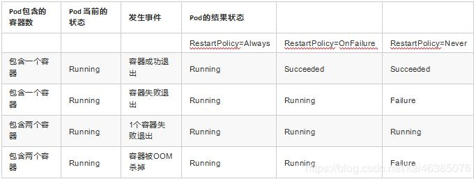

生命周期
|状态名	|含义|
|-|-|
|Running|运行中|
|Error|异常，无法提供服务|
|Pending|准备中，暂时无法提供服务|
|Terminaling|结束中，即将被移除|
|Unknown|未知状态，多发生于节点宕机|
|PullImageBackOff|镜像拉取失败|

---
### 5.probe 探针(健康检查)
比如OOM或者容器内1号进程异常退出。面对这种异常我们是不需要增加任何机制k8s就能检测到并根据restartPolicy进行重启。但是我们面对的大多数情况都是k8s无法自动检测出的异常。比如容器内进程仍然存在，但是已经因为一些异常无法对外正常提供服务了。 所以为了解决这种健康检查问题，k8s为我们提供了两种探针：`livenessProbe`和`readnessProbe`

- `readnessProbe`：用来探后容器启动后服务是否达到ready状态，k8s一旦探测到容器中的服务在启动后达到了可以对外服务的状态，就会将POD设置为Running状态，从此这个探针就会失效。 而如果在探针有效期内容器中的服务一直没有处于ready状态，就会把POD标记为异常状态并触发POD的restartPolicy
- `livenessProbe`：在容器启动后，周期性的持续对容器中的服务进行探活，如果发现容器内的服务处于异常状态，就会将POD标记为异常状态并触发POD的restartPolicy

Probe支持以下三种检查方式

- `httpGet`：发送HTTP请求，返回200 - 400 范围状态码为成功
- `exec`：执行Shell命令返回状态码是0为成功
- `tcpSocket`：发起TCP socket建立成功

e.g. : exec
```yml
apiVersion: v1 
kind: Pod 
metadata:
  name: mydb 
sepc:
  containers:
  - name: db
    image: mysql
    env:
    - name: MYSQL_ROOT_PASSWORD
      value: "123456pwd"
    livenessProbe:
      exec:
        command:
        - cat
        - /tmp/healthy
        initialDelaySeconds: 5  # 初始化部署时间(此时不检测)
        periodSeconds: 5  # 间歇期
        timeoutSeconds: 10  # 超时时间
```
e.g. : httpGet
```yml
apiVersion: v1
kind: Pod
metadata:
  name: liveness-httpget
  namespace: default

spec:
  containers:
  - name: liveness-httpget-container
    image: httpd
    imagePullPolicy: IfNotPresent
    ports:
    - name: http
      containerPort: 80

    livenessProbe:
      httpGet:
        port: http
        path: /index.html
      initialDelaySeconds: 1
      periodSeconds: 3
      timeoutSeconds: 10
```
e.g. : tcpSocket
```yml
apiVersion: v1
kind: Pod
metadata:
  name: liveness-tcp
  namespace: default

spec:
  containers:
  - name: liveness-tcp-container
    image: httpd
    imagePullPolicy: IfNotPresent
    livenessProbe:
      initialDelaySeconds: 5
      timeoutSeconds: 10
      tcpSocket:
        port: 8080
      periodSeconds: 3
```
### 6.使用技巧
#### sidecar模式

在宿主机上开辟出一个空目录，然后把这个目录地址挂载到pod中的各个容器中就可以了。 而在k8s为POD做的声明式API中，专门有一个empty dir的volume类型。 就是专门在POD中开辟一个临时的可共享的空目录。这样在一个POD中的多个容器就可以通过这个目录进行文件的共享。 一个典型的例子就是日志收集。 在我们的产品之前的部署方式中，就是使用这种方式来做日志收集的。 在一个pod中启动一个服务容器，然后再启动一个filebeat容器，这两个容器通过这个 empty dir 共享了日志的目录。 服务容器把日志写到这个目录中， filebeat容器就可以同步的收集这些日志并发送到ES中

sidecar 指的就是我们可以在一个 Pod 中，启动一个辅助容器，来完成一些独立于主进程（主容器）之外的工作。 同时我们有时候也会叫它伴生容器，因为往往它与主容器伴生伴死。 这种sidecar模式有一个缺点就是由于这种伴生伴死的特性来的。 如果辅助容器出现了以外，比如oom，或者用来做健康检查的探针探测失败。 在POD层面都会触发重启，那么在重启结束前会导致主容器的不可用


```yaml
apiVersion: v1
kind: Pod
metadata:
    name: javaweb-2
spec:
	initContainers:
	-	image: geektime/sample:v2
    	name: war
        command: ["cp", "/sample.war", " / app"]
		volumeMounts:
        -   mountPath: /app
            name: app-volume
	containers:
	-	image: geektime/tomcat:7.0
		name : tomcat
        command: ["sh", "-C", "/root/apache-tomcat-7.0.42-v2/bin/start.sh"]
		volumeMounts:
		-   mountPath: /root/apache-tomcat-7.0.42-v2/webapps
		name: app-volume
		ports:
		-   containerPort: 8080
			hostPort : 8001
	volumes
    -   name: app-volume
		    emptyDir: {}
```
## 3.3 label 标签
Label 是Kubernetes 系统中另一个核心概念。
- 一个Label 是一个`key=value` 的键值对，其中key 与value 由用户自己指定。
- Label 可以附加到各种资源对象上，如Node、Pod、Service、RC，一个资源对象可以定义任意数量的Label， 
- 同一个Label 也可以被添加到任意数量的资源对象上，Label 通常在资源对象定义时确定，也可以在对象创建后动态添加或删除。
- Label 的最常见的用法是使用metadata.labels 字段，来为对象添加Label，通过`spec.selector`来引用对象

设置label `app: nginx `
```yml
apiVersion: v1
kind: ReplicationController 
metadata:
  name: nginx 
spec:
  replicas: 3 
  selector:
    app: nginx 
  template:
    metadata:
      labels:
        app: nginx 
    spec:
      containers:
      - name: nginx 
        image: nginx 
        ports:
        - containerPort: 80
```

label selector(标签选择器)选择`app: nginx `
```yml
apiVersion: v1 
kind: Service 
metadata: 
  name: nginx
spec:
  type: NodePort 
  ports:
  - port: 80
    nodePort: 3333 
  selector:
    app: nginx
```
## 3.4 部署 & 副本集
Kubernetes提供了多种 Controller，包括 Deployment、ReplicaSet、DaemonSet、StatefuleSet、Job 等.

### 1. Deployment、ReplicaSet的关系
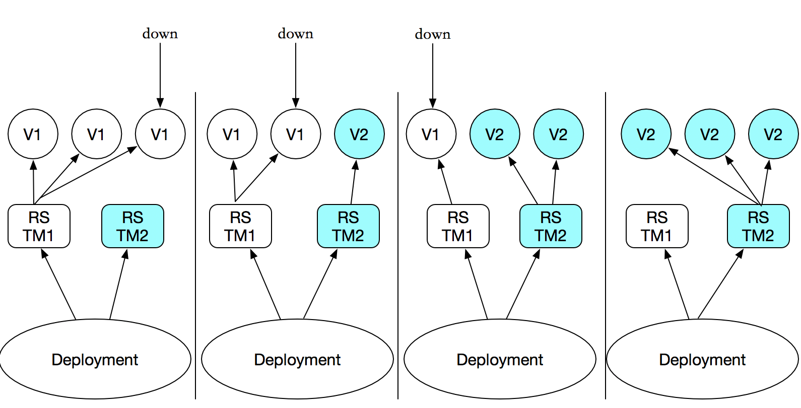
1. Deployment是三层架构,其在Pod 和 ReplicaSet 之上，提供了一个声明式定义（declarative）方法，用来替代以前的ReplicationController 来方便的管理应用
2. 只需要在 Deployment 中描述您想要的目标状态是什么，Deployment controller 就会将 Pod 和ReplicaSet 的实际状态改变到目标状态
3. Deployment支持管理多个ReplicaSet
4. Kubernetes官方强烈建议避免直接使用ReplicaSet，而应该通过Deployment来创建RS和Pod。
5. 相比于ReplicaSet 或其他控制器它的价值是不仅可以用来部署应用程序，还可以以声明的方式滚动升级应用。更强大的是它可以定制升级策略，记录升级所有版本，方便升级失败的回退等操作

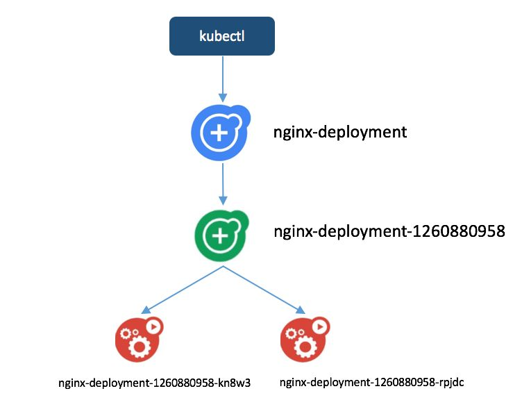


### 2.Deployment 部署
deployment 是最常见的控制器，是部署静态服务用的控制器。控制器通过标签与pod建立联系
- Deployment控制器可以部署无状态应用
- 管理Pod和ReplicaSet
- 部署，滚动升级等功能

#### 1.命令

- `kubectl run nginx-deployment --image=nginx:1.7.9 --replicas=2`: 创建并运行名为nginx-deployment的pod和相关的deployment等其他组件
- `kubectl create deployment web --image=nginx`: 创建名为web的deployment
- `kubectl create deployment web --image=nginx --dry-run -o yaml > nginx.yaml`: 输出deployment的配置文件
- `kubectl apply -f nginx.yaml`: 以指定的配置文件创建deployment
- `kubectl expose deployment web --port=80 --type=NodePort --target-port=8000 --name=web1`: 为deployment的web资源创建名为web1的service,将容器80端口与宿主机8000端口映射


配置文件yaml
```yml
apiVersion: apps/v1
kind: Deployment
metadata:
  creationTimestamp: null
  labels:
    app: web
  name: web
spec:
  replicas: 1
  selector:
    matchLabels:
      app: web
    strategy:
    rollingUpdate:
      maxSurge: 25%
      maxUnavailable: 25%
    type: RollingUpdate  # Recreate：删除所有已存在的pod,重新创建新的; RollingUpdate：滚动升级
  template:
    metadata:
      creationTimestamp: null
      labels:
        app: web
    spec:
      containers:
      - image: nginx
        name: nginx
        resources: {}
status: {}
```

- `kubectl get deployments`: 查看deployments列表
- `kubectl edit deployments pod_name`: 修改配置文件
  - 配置文件中`status.replicas`: 用来修改副本数(pod)


#### 2.应用升级
1. `kubectl apply -f nginx.yaml`: 创建下述nginx:1.14的部署文件
```yml
apiVersion: apps/v1
kind: Deployment
metadata:
  creationTimestamp: null
  labels:
    app: web
  name: web
spec:
  replicas: 1
  selector:
    matchLabels:
      app: web
  strategy: {}
  template:
    metadata:
      creationTimestamp: null
      labels:
        app: web
    spec:
      containers:
      - image: nginx:1.14
        name: nginx
        resources: {}
status: {}
```
2. `kubectl set image deployment web nginx=nginx:1.15`: 将nginx从1.14升级到1.15
    - 首先是开始的nginx 1.14版本的Pod在运行，然后 1.15版本的在创建
    - 然后在1.15版本创建完成后，就会暂停1.14版本
    - 最后把1.14版本的Pod移除，完成我们的升级

- `kubectl rollout status deployment web`: 查看升级状态
- `kubectl rollout history deployment web`: 查看历史版本

#### 3.应用回滚

- `kubectl rollout undo deployment web`: 回滚到上一个版本
- `kubectl rollout undo deployment web --to-revision=2`: 回滚到第二个版本
#### 4.弹性伸缩

- `kubectl scale deployment web --replicas=10`: 扩容或缩容Pod数量
#### 5.实例
```yml
apiVersion: extensions/v1beta1
kind: Deployment
metadata:
  labels:
    app: test-greport
    version: v1
  name: test-greport-deployment
  namespace: default
spec:
  progressDeadlineSeconds: 600
  replicas: 1
  revisionHistoryLimit: 2
  selector:
    matchLabels:
      app: test-greport
      version: v1
  strategy:
    rollingUpdate:
      maxSurge: 25%
      maxUnavailable: 25%
    type: RollingUpdate
  template:
    metadata:
      creationTimestamp: null
      labels:
        app: test-greport
        version: v1
    spec:
      containers:
      - env:
        - name: product
          value: xixixi
        - name: db_env
          value: uat
        - name: docker_env
          value: "1"
        - name: run_env
          value: uat
        image: d.uat.dr:5000/greport:test-5.3.1.rc.12
        imagePullPolicy: Always
        name: test-greport
        ports:
        - containerPort: 3001
          protocol: TCP
        resources: {}
        terminationMessagePath: /dev/termination-log
        terminationMessagePolicy: File
        volumeMounts:
        - mountPath: /var/log/
          name: log-nfs
      dnsPolicy: ClusterFirst
      restartPolicy: Always
      schedulerName: default-scheduler
      securityContext: {}
      terminationGracePeriodSeconds: 30
      volumes:
      - name: log-nfs
        persistentVolumeClaim:
          claimName: log-nfs
```

### 3.ReplicaSet 副本集
- 作用: 控制 Pod 副本「服务集群」的数量，永远与预期设定的数量保持一致即可。当有 Pod 服务宕机时候，副本控制器将会立马重新创建一个新的 Pod，永远保证副本为设置数量。
- 流程: 当定义一个RS提交到集群后,Master节点上的Controller Manager组件就是得到通知,定期检查系统中存活的Pod,并确保目标Pod实例的数量刚好等于RC的预期值,若过多则停止并销毁,若过少则创建新的Pod.也可以通过修改实现动态缩放功能.

实践及官方建议中要求避免直接使用使用Replica Set,它主要被Deployment 这个更高层面的资源对象所使用，从而形成一整套Pod 创建、删除、更新的编排机制,提高应用的容灾能力
#### Replication Controller(RC) 副本控制器
RC是RS的前身,区别是:Replica Sets 支援基于集合的Label selector,而RC 只支持基于等式的Label Selector。
- 动态修改副本数量: `kubectl scale rc nginx --replicas=5`


##### 手动扩容/缩容
`kubectl scale deployment frontend --replicas 1`

#### Horizontal Pod Autoscaler(HPA) 横向扩容
原理: 通过追踪分析RC 控制的所有目标Pod 的负载变化情况，来确定是否需要针对性地调整目标Pod 的副本数。

HPA 控制器基本Master 的`kube-controller-manager` 服务启动参数`--horizontal-podautoscaler-sync-period` 定义的时长(默认值为30s),周期性地监测Pod 的CPU 使用率，并在满足条件时对RC 或Deployment 中的Pod 副本数量进行调整，以符合用户定义的平均Pod CPU 使用率

部署配置
```yml
apiVersion: extensions/v1beta1 
kind: Deployment
metadata:
  name: nginx-deployment 
spec:
  replicas: 1 
  template:
    metadata: 
      name: nginx 
      labels:
        app: nginx 
  spec:
    containers:
    - name: nginx 
      image: nginx
  resources:
    requests:
    cpu: 50m 
```
服务配置
```yml
apiVersion: v1 
kind: Service 
metadata:
  name: nginx-svc 
spec:
  ports:
  - port: 80 
  selector:
    app: nginx
```
HPA配置
```yml
apiVersion: autoscaling/v1
kind: HorizontalPodAutoscaler
metadata:
  name: nginxtest    #应用名
  namespace: default #集群空间
spec:
  scaleTargetRef:
    apiVersion: extensions/v1beta1
    kind: Deployment //需要伸缩的资源类型
    name: nginx-deployment  //需要伸缩的资源名称
  maxReplicas: 5 //资源最大副本数
  minReplicas: 1 //资源最小副本数
  targetCPUUtilizationPercentage: 50 //触发伸缩的cpu使用率
```

### 4.StatefulSet 有状态集
- 对于 K8s 来说，不能使用 Deployment 部署有状态服务
- 对于有状态服务的部署，使用 StatefulSet 进行有状态服务的部署。

- 什么是有状态服务？
    1. 有实时的数据需要存储，指定网络等
    2. 有状态服务集群中，把某一个服务抽离出去，一段时间后再加入机器网络，如果集群网络无法使用
什么是无状态服务？

- 没有实时的数据需要存储
    1. 无状态服务集群中，把某一个服务抽离出去，一段时间后再加入机器网络，对集群服务没有任何影响

- 为了解决有状态服务使用容器化部署的一个问题。
- 部署模型
- 有状态服务

#### 有状态&无状态区别
无状态应用
- 认为Pod都是一样的
- 没有顺序要求
- 不考虑应用在哪个node上运行
- 能够进行随意伸缩和扩展

有状态应用
- 让每个Pod独立的
- 让每个Pod独立的，保持Pod启动顺序和唯一性
- 唯一的网络标识符，持久存储
- 有序，比如mysql中的主从

### 5.DaemonSet 守护进程集
DaemonSet 即后台支撑型服务，主要是用来部署守护进程

后台支撑型服务的核心关注点在K8S集群中的节点(物理机或虚拟机)，要保证每个节点上都有一个此类Pod运行。节点可能是所有集群节点，也可能是通过 nodeSelector选定的一些特定节点。典型的后台支撑型服务包括：存储、日志和监控等。在每个节点上支撑K8S集群运行的服务

### 6.Job&CronJob
一次性任务 和 定时任务
- 一次性任务：一次性执行完就结束
- 定时任务：周期性执行

Job管理的Pod根据用户的设置把任务成功完成就自动退出了。成功完成的标志根据不同的 spec.completions 策略而不同：单Pod型任务有一个Pod成功就标志完成；定数成功行任务保证有N个任务全部成功；工作队列性任务根据应用确定的全局成功而标志成功

`kubectl get jobs`: 查看jobs列表
`kubectl logs jobs_name`: 查看该job的日志


`kubectl get cronjobs`: 查看CronJob列表

## 3.5 service 服务
service主要是提供负载均衡和服务发现,可为一组具有相同功能的容器应用提供一个统一的入口地址
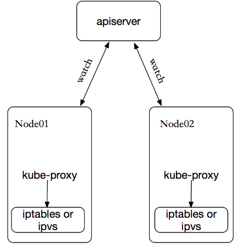
- `kubectl expose deployment web --port=80 --target-port=80 --type=NodePort --dry-run -o yaml > service.yaml`: 创建名字为web的deployment资源的service,
- `kubectl expose deployment web --port=80 --type=NodePort --target-port=8000 --name=web1 --dry-run -o yaml > service.yaml`: 试运行导出[关联deployment.web资源和service.web1,该service的80端口转发至容器的8000端口上]的配置文件
- `kubectl get svc`: 获取services，可以查看服务的虚拟ip
- `kubectl delete svc web`: 删除service资源的web

### 1.service类型
Service常用类型有三种(创建时若未指定type则默认为ClusterIp)
- ClusterIp：集群内部访问

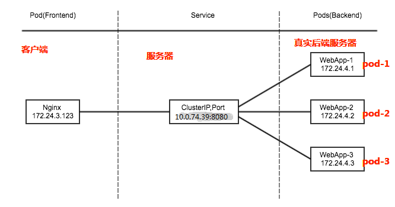
- NodePort：对外访问应用使用
- LoadBalancer：对外访问应用使用，公有云

内部的dns会自动将ip与service名字绑定

互相访问只要输入名字即可
### 2.服务发现
k8s提供了两种方式进行服务发现：

- 环境变量： 当创建一个Pod的时候，kubelet会在该Pod中注入集群内所有Service的相关环境变量。需要注意的是，要想一个Pod中注入某个Service的环境变量，则必须Service要先比该Pod创建。这一点，几乎使得这种方式进行服务发现不可用
- DNS：可以通过cluster add-on的方式轻松的创建KubeDNS来对集群内的Service进行服务发现————这也是k8s官方强烈推荐的方式。为了让Pod中的容器可以使用kube-dns来解析域名，k8s会修改容器的/etc/resolv.conf配置。
### 3.配置实例
service通过selector和pod建立关联,k8s会根据service关联到pod的podIP信息组合成一个endpoint。

- nodePort: 外部机器可访问的端口
- port: 服务之间访问的端口
- targetPort: 容器的端口

```yml
apiVersion: v1
kind: Service
metadata:
  creationTimestamp: "2019-09-04T09:18:59Z"
  labels:
    app: test-way
  name: test-way
  namespace: default
spec:
  clusterIP: 10.69.195.191
  externalTrafficPolicy: Cluster
  ports:
  - name: grpc-pay
    nodePort: 30259  # 外部机器可访问的端口
    port: 3000  # 服务之间访问的端口
    protocol: TCP
    targetPort: 3000  # 容器的端口
  selector:
    app: test-way
  sessionAffinity: None
  type: NodePort
status:
  loadBalancer: {}
```
## 3.6 配置管理
Secret和ConfigMap这两种资源对象的异同点：

相同点：
- key/value的形式
- 属于某个特定的namespace
- 可以导出到环境变量
- 可以通过目录/文件形式挂载
- 通过 volume 挂载的配置信息均可热更新

不同点：
- Secret 可以被 ServerAccount 关联
- Secret 可以存储 docker register 的鉴权信息，用在 ImagePullSecret 参数中，用于拉取私有仓库的镜像
- Secret 支持 Base64 加密
- Secret 分为 kubernetes.io/service-account-token、kubernetes.io/dockerconfigjson、Opaque 三种类型，而 Configmap 不区分类型
### 1.secret的创建与使用
secret用于存储一些加密信息
#### 1.创建secret
##### 1.方法一:将密钥放在文件中,创secret资源
```sh
echo "username" > username.txt
echo "xixixixixi" > password.txt
```
ex-1:

`--from-file=key=value` key为可选项
```sh
kubectl create secret generic user_pwd_secret --from-file=user=./username.txt --from-file=pwd=./password.txt
```
创建名为user_pwd_secret的secret资源
```sh
$ kubectl describe secret user_pwd_secret
```
```sh
Name:            db-user-pass
Namespace:       default
Labels:          <none>
Annotations:     <none>

Type:            Opaque

Data
====
pwd:    password.txt:    5 bytes
user:   username.txt:    5 bytes
```
ex-2:

所有的value都会经过base64转码
- `--from-literal`: 直接以字面意思
- `--from-file`: 提取文件内的内容
```sh
$ kubectl create secret generic user_pwd_secret --from-literal=user=./username.txt --from-file=pwd=./password.txt --dry-run -o yaml
```
```sh
apiVersion: v1
data:
  pwd: eGl4aXhpeGl4aQo=  # 经过base64解码 -> xixixixixi
  user: Li91c2VybmFtZS50eHQ=  # 经过base64解吗 -> username.txt
kind: Secret
metadata:
  creationTimestamp: null
  name: user_pwd_secret
```

##### 2.方法二:将密钥用base64编码后,放在yaml配置文件中创建secret资源
```yml
# user_pwd_secret.yaml
apiVersion: v1
kind: Secret
metadata: 
  name: user_pwd_secret
type: Opaque
data:  
  user: YWRtaW4=  # admin
  pass: eGl4aXhpeGl4aQo=  # xixixixixi
```
```sh
kubectl create -f user_pwd_secret.yaml
```

tips: 解码命令行
```sh
$ echo "YWRtaW4=" | base64 --decode
admin
```
#### 2.secret使用
多个Pod可以引用同一个Secret

**通过volume挂载和环境变量的区别:**
- 通过Volume挂载到容器内部时，当该Secret的值发生变化时，容器内部具备自动更新的能力
- 通过环境变量设置到容器内部该值不具备自动更新的能力。
- 所以一般推荐使用Volume挂载的方式使用Secret。
##### 1.volume挂载secret
更新最长的时间将是一个同步周期加上缓存生命周期(period+ttl)

pod的挂载secret资源
1. 容器volume挂载绑定:在`spec.containers[].volumeMounts[]`中以列表嵌套字典形式`[{mountPath: 容器中被映射的路径, name: 挂载volume的名字, readOnly: 是否为只读}]`
2. 声明volume挂载:在`spec.volumes[]`中以列表嵌套字典的形式`[{name: 该挂载的名字的名字, secret: {defaultMode: 操作权限, secretName: 密钥资源的名字}}]`

```yml
apiVersion: v1
kind: Pod
metadata:
  name: mynginx_secret_volume
spec:
  containers:
  - name: mynginx
    image: nginx
    volumeMounts:
    - name: user_pwd
      mountPath: "/etc/volume"
      readOnly: true  # 可选
  volumes:
  - name: user_pwd
    secret:
      defaultMode: 420  # 可选
      secretName: user_pwd_secret
      items:  # 可选
      - key: user
        path: ./username/myuser
```
在volume挂载secret中,secret以key为文件名的文件形式存在.
- 如上述定义,存在的目录为`/etc/volume`, `cat /etc/volume/pass`即可看到user_pwd_secret资源的pass的密钥
- 如上述定义,通过在`spec.volume.secret.items`中以列表嵌套字典的形式修改文件地址,即`etc/volume`+`./username/myuser`

```sh
$ ls /etc/volume
user
pass
$ cat /etc/volume/username/myuser
admin
$ cat /etc/volume/pass
xixixixixi
```
##### 2.环境变量secret

1. 定义环境变量并使用`env[].valueFrom.secretKeyRef`指定secret和相应的key

```yml
apiVersion: v1
kind: Pod
metadata:
  name: mynginx_secret_env
spec:
  containers:
  - name: mynginx
    image: nginx
    env:
      - name: SECRET_USERNAME  # 环境变量的key
        valueFrom:
          secretKeyRef:
            name: user_pwd_secret  # secret资源名
            key: user  # 该secret资源的key
      - name: SECRET_PASSWORD
        valueFrom:
          secretKeyRef:
            name: user_pwd_secret
            key: pass
  restartPolicy: Never
```
2. 进去容器后,可直接使用该环境变量

```sh
$ echo $SECRET_USERNAME
admin
$ echo $SECRET_PASSWORD
1f2d1e2e67df
```
### 2.ConfigMap的创建与使用
在生产环境中经常会遇到需要修改配置文件的情况，传统的修改方式不仅会影响到服务的正常运行，而且操作步骤也很繁琐。为了解决这个问题，kubernetes项目从1.2版本引入了ConfigMap功能，用于将应用的配置信息与程序的分离。这种方式不仅可以实现应用程序被的复用，而且还可以通过不同的配置实现更灵活的功能。在创建容器时，用户可以将应用程序打包为容器镜像后，通过环境变量或者外接挂载文件的方式进行配置注入。
ConfigMap是以key:value的形式保存配置项，既可以用于表示一个变量的值（例如config=info），也可以用于表示一个完整配置文件的内容

1. 将配置项设置为容器内的环境变量。
2. 将启动参数设置为环境变量。
3. 以Volume的形式挂载到容器内部的文件或目录。

ConfigMap的注意事项如下
1. ConfigMap必须在Pod之前创建。
2. ConfigMap受Namespace限制，只有处于相同Namespace中的Pod才可以引用它。
3. ConfigMap中的配额管理还未能实现。
4. kubelet只支持可以被API Server管理的Pod使用ConfigMap。kubelet在本Node上通过 --manifest-url或–config自动创建的静态Pod将无法引用ConfigMap。
15. 在Pod对ConfigMap进行挂载（volumeMount）操作时，在容器内部只能挂载为“目录”，无法挂载为“文件”。在挂载到容器内部后，在目录下将包含ConfigMap定义的每个item，如果在该目录下原来还有其他文件，则容器内的该目录将被挂载的ConfigMap覆盖。如果应用程序需要保留原来的其他文件，则需要进行额外的处理。可以将ConfigMap挂载到容器内部的临时目录，再通过启动脚本将配置文件复制或者链接到（cp或link命令）应用所用的实际配置目录下。
#### 1.创建ConfigMap
##### 1.方法一:通过命令行创建ConfigMap资源
`configmap NAME [--from-file=[key=]source] [--from-literal=key1=value1] [--dry-run]`
- 与secret创建类似,支持`--from-file`指定文件;`--from-literal`指定文本

```sh
$ echo "TEST" > env.txt
$ echo "v3.1.2" > version.txt
$ kubectl create configmap system-config --from-file=env=./env.txt --from-file=version=version.txt --from-literal=product=baidu --dry-run -o yaml
```
```yml
apiVersion: v1
data:
  env: |
    TEST
  product: baidu
  version: |
    v3.1.2
kind: ConfigMap
metadata:
  creationTimestamp: null
  name: system-config
```
```sh
$ kubectl describe configmap system-config
Name:         system-config
Namespace:    default
Labels:       <none>
Annotations:  <none>

Data
====
env:
----
TEST

product:
----
baidu
version:
----
v3.1.2

Events:  <none>
```
##### 2.方法二:通过yaml配置文件创建ConfigMap资源
```yml
apiVersion: v1
kind: ConfigMap
metadata:
  name: app-config
data:
  apploglevel: info
  appdatadir: /var/data
```
```sh
$ kubectl create -f app-config.yaml  # 创建configmap资源
configmap/app-config created
$ kubectl get configmap  # 查看configmap列表
NAME         DATA   AGE
app-config   2      7s
$ kubectl describe configmap app-config
Name:         app-config
Namespace:    default
Labels:       <none>
Annotations:  <none>

Data
====
appdatadir:
----
/var/data
apploglevel:
----
info
Events:  <none>
```
#### 2.使用ConfigMap
##### 1.通过volume挂载
```yml
apiVersion: v1
kind: ConfigMap
metadata:
  name: app-config
data:
  html: hello world
  log: info
```
```yml
apiVersion: v1
kind: Pod
metadata:
  name: nginx-volume-configmap
spec:
  containers:
    - name: mynginx
      image: nginx
      ports:
        - containerPort: 80
      volumeMounts:
        - name: volume-config
          mountPath: /usr/share/nginx/  # 挂载的根目录
  volumes:
    - name: volume-config
      configMap:
        name: app-config
        items:  # 可选
          - key: html  # configmap资源的key
            path: ./html/main.html  # 自定义的地址和文件名
```
pod创建后,进入pod找到挂载路径下的文件,默认配置key为文件名,文件内即是配置的value
```sh
$ cat /usr/share/nginx/log
info
$ cat /usr/share/nginx/html/main.html
hello world
```
##### 2.通过环境变量
```yml
apiVersion: v1
kind: Pod
metadata:
  name: web
spec:
  containers:
  - name: nginx-web
    image: nginx
    command: [ "/bin/sh", "-c", "env | grep APP" ]
    env:
    - name: APPLOG  # 定义环境变量APPLOG
      valueFrom: 
        configMapkeyRef:
          name: app-config  # 指定configmap资源
          key: apploglevel  # 指定configmap资源中的key
    - name: APPDIR  # 定义环境变量APPDIR
      valueFrom:
        configMapkeyRef:
          name: app-config
          key: appdatadir
  restartPolicy: Never
```
若是configmap资源中所有的配置信息都要的话可以使用`envFrom`
```yml
apiVersion: v1
kind: Pod
metadata:
  name: pod-test
spec:
  containers:
    - name: test
      image: busybox
      command: [ "/bin/sh", "-c", "env|grep APP" ]
      envfrom:
      - configMapRef:
        name: app-config  # 将app-config资源中的所有配置提取到容器的环境变量中
  restartPolicy: Never
```

## 3.7 ingress
nodePort类型的service虽然也支持对外访问,但是有如下几个缺点:
1. 端口都是乱七八糟的端口，不是标准端口，如80；
2. 端口数量有限，才2768个；
3. 端口随机。

Ingress 可以理解为 Service 的“Service”,所以常规的对外提供访问都由ingress提供支持,ingress 控制器需要独立安装.目前用的最多的ingress controller就是nginx实现的,相当于把nginx的配置规则和k8s的configMap进行了结合.

Ingress 公开了从集群外部到集群内服务的 HTTP 和 HTTPS 路由(将虚拟ip映射到公网)。流量路由由 Ingress 资源上定义的规则控制。Ingress 配置为服务提供外部可访问的 URL、负载均衡流量、终止 SSL/TLS，以及提供基于名称的虚拟主机等能力


查看ingress资源:
- `kubectl get ing`
- `kubectl get ingress`


### 1.配置解析
```yml
apiVersion: extensions/v1beta1
kind: Ingress
metadata:
  name: cafe-ingress
spec:
  tls:
  - hosts:
    - cafe.example.com
    secretName: cafe-secret
  defaultBackend:  # 默认后端,若无匹配则访问此处
    service:
      name: test
      port:
        number: 80
  rules:
  - host: cafe.example.com
    http:
      paths:
      - path: /tea
        pathType: Prefix  # 路径类型
        backend:
          serviceName: tea-svc
          servicePort: 80
      - path: /coffee
        backend:
          serviceName: coffee-svc
          servicePort: 80
  - host: "*.foo.com"
    http:
      paths:
      - pathType: Prefix
        path: "/foo"
        backend:
          service:
            name: service2
            port:
              number: 80
```

- "host": 可选,必须是一个标准的域名格式的字符串，而不能是 IP 地址.若未空则所有的ip入口都走这边
- "path": 匹配到该路径则走指定service

路径类型:
- ImplementationSpecific:匹配方法取决于 IngressClass
- Exact:精确匹配 URL 路径，且区分大小写。
- Prefix:基于以 / 分隔的 URL 路径前缀匹配。匹配区分大小写

|类型	|路径	|请求路径	|匹配与否？|
|-|-|-|-|
|Prefix	|/|	（所有路径）	|是|
|Exact|	/foo|	/foo|	是|
|Exact|	/foo|	/bar|	否|
|Exact|	/foo|	/foo/|	否|
|Exact|	/foo/|	/foo|	否|
|Prefix|	/foo|	/foo, /foo/|	是|
|Prefix	|/foo/|	/foo, /foo/	|是|
|Prefix	|/aaa/bb|	/aaa/bbb	|否|
|Prefix|	/aaa/bbb|	/aaa/bbb|	是|
|Prefix	|/aaa/bbb/|	/aaa/bbb|	是，忽略尾部斜线|
|Prefix	|/aaa/bbb	|/aaa/bbb/|	是，匹配尾部斜线|
|Prefix	|/aaa/bbb	|/aaa/bbb/ccc|	是，匹配子路径|
|Prefix	|/aaa/bbb	|/aaa/bbbxyz	|否，字符串前缀不匹配|
|Prefix	|/, /aaa	|/aaa/ccc|	是，匹配 /aaa 前缀|
|Prefix	|/, /aaa, /aaa/bbb|	/aaa/bbb	|是，匹配 /aaa/bbb 前缀|
|Prefix	|/, /aaa, /aaa/bbb|	/ccc|	是，匹配 / 前缀|
|Prefix	|/aaa	|/ccc|	否，使用默认后端|
|混合	|/foo (Prefix), /foo (Exact)|	/foo	|是，优选 Exact 类型|

多重匹配:
- 在某些情况下，Ingress 中的多条路径会匹配同一个请求。 这种情况下最长的匹配路径优先。 如果仍然有两条同等的匹配路径，则精确路径类型优先于前缀路径类型。

主机名通配符:
- 主机名可以是精确匹配（例如“foo.bar.com”）或者使用通配符来匹配 （例如“*.foo.com”）。 精确匹配要求 HTTP host 头部字段与 host 字段值完全匹配。 通配符匹配则要求 HTTP host 头部字段与通配符规则中的后缀部分相同。

|主机	|host头部	|匹配与否？|
|-|-|-|
|*.foo.com|	bar.foo.com	|基于相同的后缀匹配|
|*.foo.com|	baz.bar.foo.com	|不匹配，通配符仅覆盖了一个 DNS 标签|
|*.foo.com|	foo.com	|不匹配，通配符仅覆盖了一个 DNS 标签|

### 2.tls(加密)
Ingress 只支持单个 TLS 端口 443，并假定 TLS 连接终止于 Ingress 节点 （与 Service 及其 Pod 之间的流量都以明文传输）

TLS Secret 必须包含名为 tls.crt 和 tls.key 的键名。 这些数据包含用于 TLS 的证书和私钥

```yaml
apiVersion: v1
kind: Secret
metadata:
  name: testsecret-tls
  namespace: default
data:
  tls.crt: base64 编码的 cert
  tls.key: base64 编码的 key
type: kubernetes.io/tls
```
### 3.资源类型
Ingress的资源类型有以下4种：
1. 单Service资源型Ingress
2. 基于URL路径进行流量转发
3. 基于主机名称的虚拟主机
4. TLS类型的Ingress资源

```yaml
apiVersion: extensions/v1beta1
kind: Ingress
metadata:
  name: my-ingress
spec:
  backend:
    serviceName: my-svc
    servicePort: 80
```
Ingress控制器会为其分配一个IP地址接入请求流量，并将其转发至后端my-svc


### 4.实践

1. 获取配置文件 https://github.com/sunwu51/notebook/tree/master/19.07
2. 创建ing-dep.yml文件
3. `kubectl apply -f ing-dep.yml` 创建
4. 创建ing-config 文件
5. `kubectl apply -f ing-config.yml`创建
6. 外界访问 ing-config中的

## 3.8 存储卷和数据持久化(Volumes and Persistent Storage)

### 1. 存储卷介绍
Kubernetes的卷是pod的一个组成部分，因此像容器一样在pod的规范中就定义了。它们不是独立的Kubernetes对象，也不能单独创建或删除。pod中的所有容器都可以使用卷，但必须先将它挂载在每个需要访问它的容器中。在每个容器中，都可以在其文件系统的任意位置挂载卷。

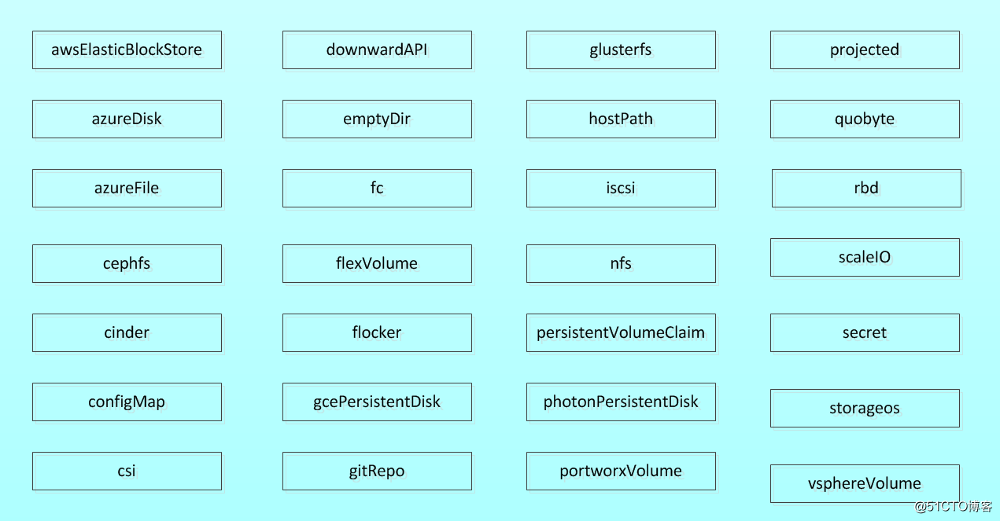
本文将记录常用的emptyDir,hostPath,共享存储NFS,PV及PVC这几个类型的使用

[secret,configmap类型的创建&使用](#3.5-配置管理)

### 2. emptyDir 
emptyDir是最基础的Volume类型，用于存储临时数据的简单空目录。

如果Pod设置了emptyDir类型Volume，Pod被分配到Node上时候，会创建emptyDir，只要Pod运行在Node上，emptyDir都会存在（容器挂掉不会导致emptyDir丢失数据），但是如果Pod从Node上被删除（Pod被删除，或者Pod发生迁移），emptyDir也会被删除，并且永久丢失。 

主要用作临时空间，比如Web 服务器写日志或者tmp 文件需要的临时目录。

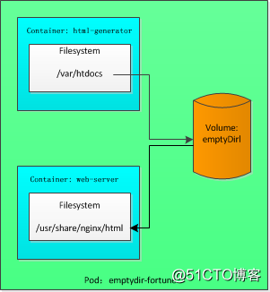
```yml
apiVersion: v1
kind: Pod
metadata:
  labels:
    app: prod  # 标签
  name: test-pd
spec:
  containers:
  - image: k8s.gcr.io/test-webserver
    name: test-container
    volumeMounts:
    - mountPath: /cache
      name: cache-volume
  - image: nginx:alpine
    name: web-server
    volumeMounts:  # 挂载相同的卷至容器/usr/share/nginx/html目录且设置为只读
    - name: cache-volume
      mountPath: /usr/share/nginx/html 
      readOnly: true
    ports:
    - containerPort: 80
      protocol: TCP
  volumes:
  - name: cache-volume
    emptyDir: {}
```

### 3. hostPath
- HostPath 属性的volume 使得对应的容器能够访问当前宿主机上的指定目录。
- hostPath可以实现持久存储，但是在node节点故障时，也会导致数据的丢失
- 切勿使用它们来持久化跨pod的数据,如果这个pod不在这个node,数据卷中的数据虽然不会被永久删除,但数据也不会随pod迁移到其他宿主机上.
- 由于各个宿主机上的文件系统结构和内容并不一定完全相同，所以相同pod 的HostDir 可能会在不同的宿主机上表现出不同的行为。

```yml
apiVersion: v1 
kind: Pod 
metadata:
  name: test-pd 
spec:
  containers:
  - image: docker.io/nazarpc/webserver 
    name: test-container
    volumeMounts:  # 指定在容器中挂接路径
    - mountPath: /test-pd  # 容器挂载点 
      name: test-volume  # 指定所提供的存储卷
  volumes:
    - name: test-volume # 宿主机上的目录hostPath:
      hostPath:
        path: /data  # 准备挂载的node上的文件系统
```

### 4. NFS
NFS是Network File System的缩写，即网络文件系统。Kubernetes中通过简单地配置就可以挂载NFS到Pod中，而NFS中的数据是可以永久保存的，同时NFS支持同时写操作。

nfs与emptydir和hostpath的不同:
1. emptyDir可以提供不同容器间的文件共享，但不能存储；
2. hostPath可以为不同容器提供文件的共享并可以存储，但受制于节点限制，不能跨节点共享；
3. 这时需要网络存储 (NAS)，即既可以方便存储容器又可以从任何集群节点访问。

nfs一般由独立服务器提供服务


```yml
apiVersion: apps/v1 # for versions before 1.9.0 use apps/v1beta2 
kind: Deployment
metadata:
  name: redis 
spec:
  selector: 
    matchLabels:
      app: redis 
  template:
    metadata:
      labels:
        app: redis 
    spec:
      containers:
      - image: redis 
        imagePullPolicy: IfNotPresent
        name: redis
        ports:
        - containerPort: 6379 
          name: redis6379
          protocol: TCP
        env:
        - name: ALLOW_EMPTY_PASSWORD
          value: "yes"
        - name: REDIS_PASSWORD
          value: "redis"
        volumeMounts:
        - name: redis-persistent-storage 
          mountPath: /data
      volumes:
      - name: redis-persistent-storage  # 卷名
        nfs:
          path: /k8s-nfs/redis/data  # nfs服务器对外提供的共享目录
          server: 192.168.126.112  # nfs服务器ip
```

#### nfs的安装
以ubuntu系统作为示例:

1. 安装:`sudo apt install nfs-kernel-server`
2. 编辑/etc/exports 文件：`sudo vim /etc/exports`
```sh
# /etc/exports文件的内容如下：
/data/use *(rw,sync,no_subtree_check,no_root_squash)
```
- /data/use——NFS服务器端的目录，用于与nfs客户端共享
- *——允许所有的网段访问，也可以使用具体的IP
- rw——挂接此目录的客户端对该共享目录具有读写权限
- sync——资料同步写入内存和硬盘
- no_root_squash——root用户具有对根目录的完全管理访问权限
- no_subtree_check——不检查父目录的权限
3. 在服务器端创建/data/use共享目录: `sudo mkdir -p /data/use`
4. 重启服务: `sudo service nfs-kernel-server restart`

其他命令
```sh
#在安装NFS服务器时，已包含常用的命令行工具，无需额外安装。
#显示已经mount到本机nfs目录的客户端机器。
sudo showmount -e localhost

#将配置文件中的目录全部重新export一次！无需重启服务。
sudo exportfs -rv

#查看NFS的运行状态
sudo nfsstat

#查看rpc执行信息，可以用于检测rpc运行情况
sudo rpcinfo

#查看网络端口，NFS默认是使用111端口。
sudo netstat -tu -4
```


### 5. PV&PVC
1. PersistentVolume（PV）是集群中由管理员配置的一段网络存储。它是集群中的资源，就像节点是集群资源一样。其生命周期独立于使用PV 的任何单个pod。

2. PersistentVolumeClaim（PVC）是由用户进行存储的请求。它类似于pod。Pod 消耗节点资源，PVC 消耗PV 资源。Pod 可以请求特定级别的资源（CPU 和内存）。声明可以请求特定的大小和访问模式（例如，可以一次读/写或多次只读）

3. 存储的PV和PVC的这种关系，跟计算的Node和Pod的关系是非常类似的；PV和Node是资源的提供者，根据集群的基础设施变化而变化，由K8s集群管理员配置；而PVC和Pod是资源的使用者，根据业务服务的需求变化而变化，由K8s集群的使用者即服务的管理员来配置

4. StorageClass 为管理员提供了一种描述他们提供的存储的“类”的方法。不同的类可能
映射到服务质量级别，或备份策略，或者由群集管理员确定的任意策略

当集群用户需要在其pod中使用持久化存储时，他们首先创建PVC清单，指定所需要的最低容量要求和访问模式，然后用户将待久卷声明清单提交给Kubernetes API服务器，Kubernetes将找到可匹配的PV并将其绑定到PVC。PVC可以当作pod中的一个卷来使用，其他用户不能使用相同的PV，除非先通过删除PVC绑定来释放。

#### 1.PV(PersistentVolume)

```yml
apiVersion: v1
kind: PersistentVolume
metadata:
  name: pv002
spec:
  capacity:
    storage: 2Gi                             #指定PV容量为2G
  volumeMode: Filesystem                     #卷模式，默认为Filesystem，也可设置为'Block'表示支持原始块设备
  accessModes:
    - ReadOnlyMany                           #访问模式，该卷可以被多个节点以只读模式挂载  ReadWriteOnce 为单个节点
  persistentVolumeReclaimPolicy: Retain      #回收策略，Retain（保留），表示手动回收
  storageClassName: nfs                      #类名，PV可以具有一个类，一个特定类别的PV只能绑定到请求该类别的PVC
  nfs:                                       #指定NFS共享目录和IP信息
    path: /backup/v2
    server: 172.27.9.181
    
apiVersion: v1
kind: PersistentVolume
metadata:
  name: pv002
spec:
  capacity:
    storage: 2Gi                             #指定PV容量为2G
  volumeMode: Filesystem                     #卷模式，默认为Filesystem，也可设置为'Block'表示支持原始块设备
  accessModes:
    - ReadOnlyMany                           #访问模式，该卷可以被多个节点以只读模式挂载
  persistentVolumeReclaimPolicy: Retain      #回收策略，Retain（保留），表示手动回收
  storageClassName: nfs                      #类名，PV可以具有一个类，一个特定类别的PV只能绑定到请求该类别的PVC
  nfs:                                       #指定NFS共享目录和IP信息
    path: /backup/v2
    server: 172.27.9.181
```

查看pv资源列表: `kubectl get pv`

pv状态:
- Available（可用），一块空闲资源还没有被任何声明绑定
- Bound（已绑定），卷已经被声明绑定
- Released（已释放），声明被删除，但是资源还未被集群重新声明
- Failed（失败），该卷的自动回收失败

访问模式有三种：
1. ReadWriteOnce：是最基本的方式，可读可写，但只支持被单个Pod挂载。
2. ReadOnlyMany：可以以只读的方式被多个Pod挂载。
3. ReadWriteMany：这种存储可以以读写的方式被多个Pod共享。不是每一种存储都支持这三种方式，像共享方式，目前支持的还比较少，比较常用的是NFS。

回收策略(persistentVolumeReclaimPolicy):
- 保留策略(Retain)：允许人工处理保留的数据。
- 删除策略(Recycle)：将删除pv 和外部关联的存储资源，需要插件支持。
- 回收策略(delete)：将执行清除操作，之后可以被新的pvc 使用，需要插件支持

#### 2.PVC(PersistentVolumeClaim)
```yaml
kind: PersistentVolumeClaim
apiVersion: v1
metadata:
  name: mypvc                       #声明的名称，当做pod的卷使用时会用到                          
spec:
  accessModes:
  - ReadWriteOnce                 #访问卷模式，筛选PV条件之一
  volumeMode: Filesystem            #卷模式，与PV保持一致，指示将卷作为文件系统或块设备使用
  resources:                        #声明可以请求特定数量的资源,筛选PV条件之一
    requests:
      storage: 2Gi
  storageClassName: nfs             #请求特定的类，与PV保持一致，否则无法完成绑定
```

查看pvc资源列表: `kubectl get pvc`
#### 3.与Pod的使用
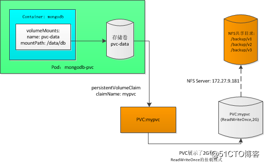
```yml
apiVersion: extensions/v1beta1
kind: Deployment
metadata:
  annotations:
    deployment.kubernetes.io/revision: "1"
  generation: 1
  labels:
    app: redis
    role: master
  name: redis-master
  namespace: default
spec:
  progressDeadlineSeconds: 600
  replicas: 1
  revisionHistoryLimit: 2
  selector:
    matchLabels:
      app: redis
      role: master
  strategy:
    rollingUpdate:
      maxSurge: 25%
      maxUnavailable: 25%
    type: RollingUpdate
  template:
    metadata:
      creationTimestamp: null
      labels:
        app: redis
        role: master
    spec:
      containers:
      - image: redis:2.8.23
        imagePullPolicy: IfNotPresent
        name: redis-master
        ports:
        - containerPort: 6379
          name: redis-server
          protocol: TCP
        resources: {}
        terminationMessagePath: /dev/termination-log
        terminationMessagePolicy: File
        volumeMounts:
        - mountPath: /data
          name: redis-nfs
      dnsPolicy: ClusterFirst
      restartPolicy: Always
      schedulerName: default-scheduler
      securityContext: {}
      terminationGracePeriodSeconds: 30
      volumes:
      - name: redis-nfs
        persistentVolumeClaim:
          claimName: mypvc  # 指定使用的pvc资源
```
#### 4.生命周期
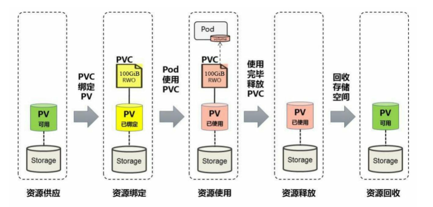

- Provisioning(供应准备): 通过集群外的存储系统或者云平台来提供存储持久化支持
  - 静态提供Static：集群管理员创建多个PV。它们携带可供集群用户使用的真实存储的详细信息。它们存在于Kubernetes API 中，可用于消费
  - 动态提供Dynamic：当管理员创建的静态PV 都不匹配用户的`PersistentVolumeClaim`时，集群可能会尝试为PVC 动态配置卷。此配置基于`StorageClasses：PVC` 必须请求一个类，并且管理员必须已创建并配置该类才能进行动态配置。要求该类的声明有效地为自己禁用动态配置

静态


动态

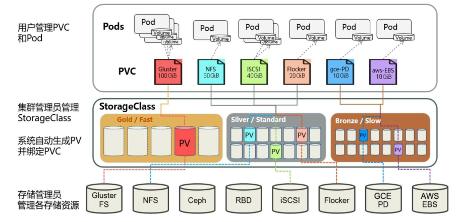


- Binding(绑定): 用户创建pvc 并指定需要的资源和访问模式。在找到可用pv 之前，pvc会保持pending状态
  - 当PVC申请的存储空间比PV的少时，整个PV的空间就都能够为PVC所用，可能会造成资源的浪费。如果资源供应使用的是动态模式，则系统在为PVC找到合适的StorageClass后，将自动创建一个PV并完成与PVC的绑定
- Using(使用): 用户可在pod 中像volume 一样使用pvc
- Releasing(释放): 用户删除pvc 来回收存储资源，pv 将变成"released"状态。由于还保留着之前的数据，这些数据需要根据不同的策略来处理，否则这些存储资源无法被其他pvc 使用
- Recycling(回收): pv 可以设置三种回收策略
  - 保留策略(Retain)：允许人工处理保留的数据。
  - 删除策略(Recycle)：将删除pv 和外部关联的存储资源，需要插件支持。
  - 回收策略(delete)：将执行清除操作，之后可以被新的pvc 使用，需要插件支持

# 4. 搭建服务
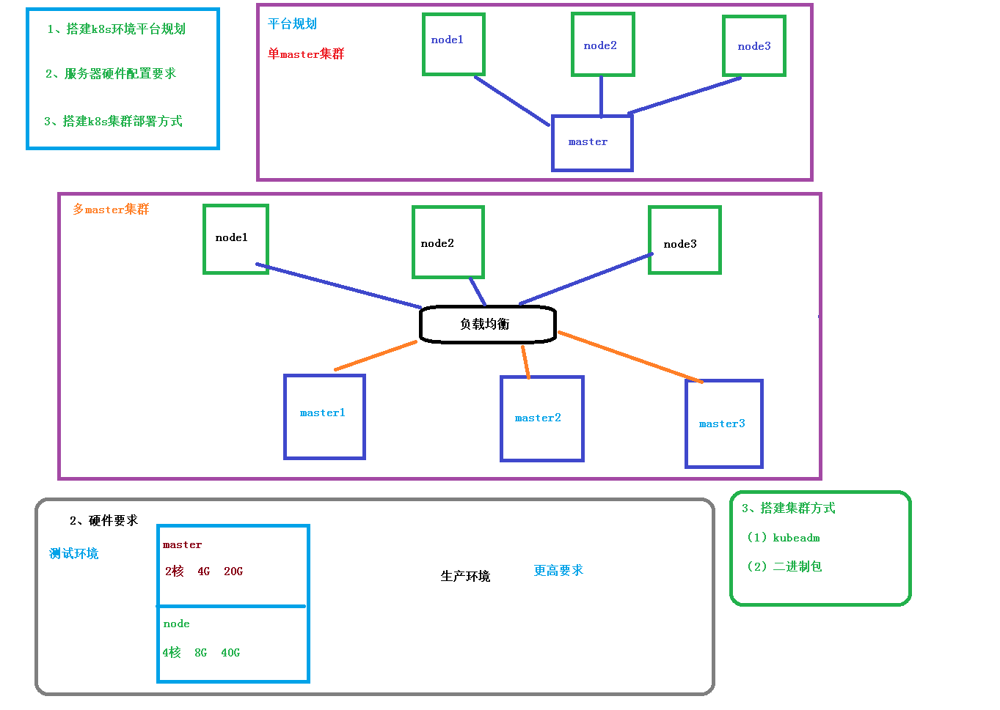
## 1. 搭建k8s环境平台规划
1. 单master集群
2. 多master集群
  - 需要负载均衡


## 2. 服务器硬件配置要求
最低配置: 
- master: 2核4G内存20G硬盘
- worker: 4核8G内存40G硬盘

## 3. 搭建k8s集群部署方式

### 1. kubeadm 快速搭建
官方地址：https://kubernetes.io/docs/reference/setup-tools/kubeadm/kubeadm/

简介：kubeadm 是官方社区推出的一个用于快速部署kubernetes 集群的工具，这个工具能通过两条指令完成一个kubernetes 集群的部署

[kubeadm快速搭建详细步骤](.\使用kubeadm快速部署一个K8s集群.md)

1. 对各节点进行初始化操作
2. 各节点安装docker kubelet kubeadm kubectl
3. master节点执行kubeadm init进行初始化
4. node节点执行kubeadm join把当前节点添加到集群
5. 配置网络插件

### 2. 二进制手动部署
从github 下载发行版的二进制包，手动部署每个组件，组成Kubernetes 集群。

1. 服务器初始化(与上方初始化操作一致)
2. 为etcd和apiserver自签证书
3. 部署Etcd集群
4. 部署master组件(kube-apiserver, kube-controller-manager, kube-scheduler, etcd)
5. 部署worker组件(kubelet, kube-proxy, docker, etcd)
7. 部署集群网络

[二进制手动部署详细步骤](.\使用kubeadm搭建高可用的K8s集群.md)

# 5. 监控服务
## 1. 监控指标
- 集群监控
1. 节点资源利用率
2. 节点数
3. 运行pods

- pod监控
1. 容器指标
2. 应用程序

## 2. 监控平台
使用普罗米修斯【prometheus】 + Grafana 搭建监控平台

prometheus[定时搜索被监控服务的状态]
- 开源的
- 监控、报警、数据库
- 以HTTP协议周期性抓取被监控组件状态
- 不需要复杂的集成过程，使用http接口接入即可

Grafana[可视化]
- 开源的数据分析和可视化工具
- 支持多种数据源

### 1.prometheus部署
[配置文件](./doc/prometheus)

1. `kubectl create -f node-exporter.yaml`:部署node-exporter守护进程,node_exporter用于机器系统数据收集
2. `kubectl create -f rbac-setup.yaml`: 添加相关角色权限
3. `kubectl create -f configmap.yaml`:部署configmap资源
4. `kubectl create -f prometheus.deploy.yml`:部署deployment资源
5. `kubectl create -f prometheus.svc.yml`:部署service资源
### 2.Grafana部署
[配置文件](./doc/grafana)
1. `kubectl create -f grafana-deploy.yaml`:部署deployment资源
2. `kubectl create -f grafana-svc.yaml`:部署service资源
3. `kubectl create -f grafana-ing.yaml`:部署ingress资源

### 3.配置Grafana

1. Grafana初始账号密码都为:`admin`
2. Data Sources添加数据源,prometheus类型,url为ClusterIP(集群内部ip)


3. Dashboards 添加模板: 添加315号模板, 数据源选择为刚配置的哪个


# 6. 高可用搭建

https://gitee.com/moxi159753/LearningNotes/blob/master/K8S/18_Kubernetes%E6%90%AD%E5%BB%BA%E9%AB%98%E5%8F%AF%E7%94%A8%E9%9B%86%E7%BE%A4/README.md


# 7. 交付流程

- 开发代码阶段
  - 编写代码
  - 编写Dockerfile【打镜像做准备】
- 持续交付/集成
  - 代码编译打包
  - 制作镜像
  - 上传镜像仓库
- 应用部署
  - 环境准备
  - Pod
  - Service
  - Ingress
- 运维
  - 监控
  - 故障排查
  - 应用升级