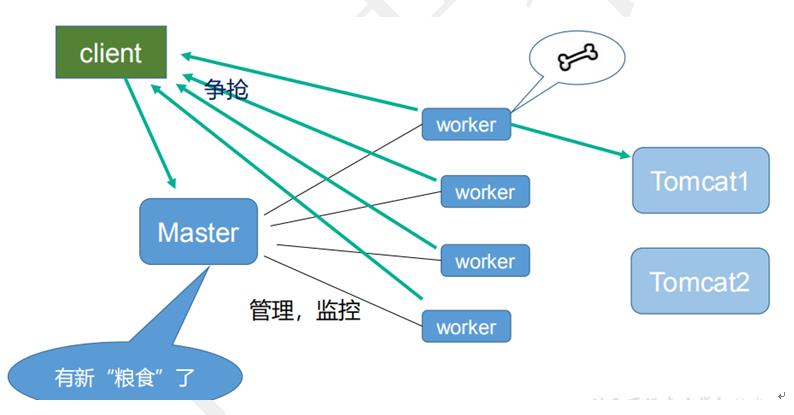
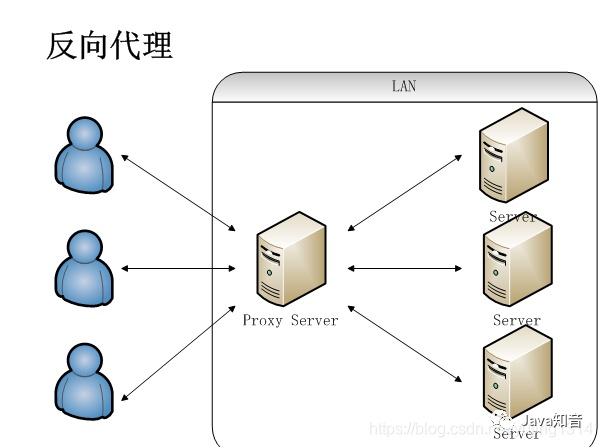
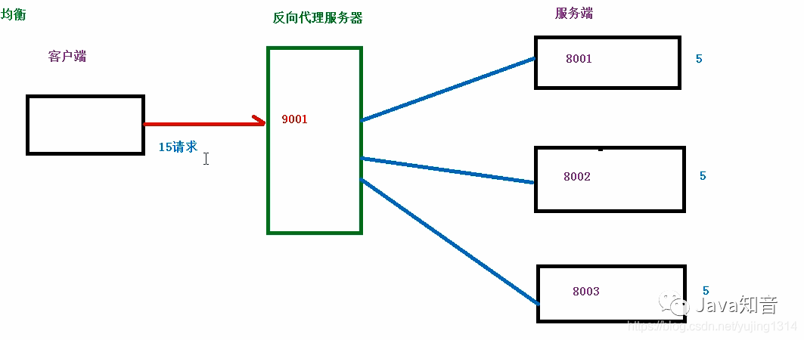
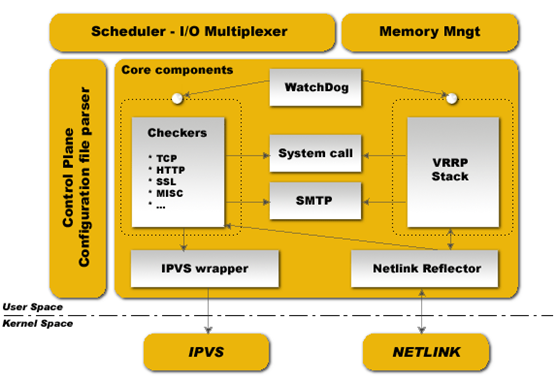

## 1. 简介
nginx是一个高性能的HTTP和反向代理WEB服务器
### 1.1 特性
1. 处理响应请求很快
    - 采用 master-slave 模型
2. 高并发连接
    - 支持高达 50,000 个并发连接数
3. 低的内存消耗
4. 具有很高的可靠性
    - 采取了分阶段资源分配技术，使得它的 CPU 与内存占用率非常低
5. 高扩展性
6. 热部署
    - 不间断服务的情况下进行升级
7. 自由的 BSD 许可协议

### 1.2 功能
1. 负载均衡
2. 反向代理
3. 动静分离
4. 伪静态化并缓存，减少动态请求数量;
5. 依赖于nginx强大的功能和性能，可以做访问控制，限速，限连接数等等;

### 1.3 参考资料
- 官方文档: https://www.nginx.cn/doc/index.html
- w3c: https://www.w3cschool.cn/nginx/ycn81k97.html
- https://www.bilibili.com/video/BV1zJ411w7SV
- https://pythondjango.cn/python/tools/5-nginx-configuration

## 2. 架构设计


### 设计架构
- nginx启动后默认以daemon在后台运行,包含一个 master 进程和多个 worker 进程

- master 进程主要用来管理 worker 进程
    - 接收来自外界的信号
    - 向各 worker 进程发送信号
    - 监控 worker 进程的运行状态
    - 当 worker 进程退出后(异常情况下)，会自动重新启动新的 worker 进程
- worker 进程 处理基本网络事件
    - io多路复用机制
    - 多个 worker 进程之间是对等的
    - 各进程互相之间是独立的
    - worker 进程的个数(work processes)一般与机器cpu核数一致

#### worker_connection连接数
一次请求,将会占用2或4个worker的连接数
- 当请求无需代理至后端时为2次
- 当请求需要代理至后端时为4次

最大并发数计算
- 普通的静态访问最大并发数是：`worker_connections * worker_processes /2`
- 而如果是 HTTP 作 为反向代理来说，最大并发数量应该是 `worker_connections * worker_processes / 4`

#### master - worker 优势
1. 可以使用 `nginx -s reload` 热部署，利用 nginx 进行热部署操作
2. 每个 woker 是独立的进程，如果有其中的一个 woker 出现问题，其他 woker 独立的，继续进行争抢，实现请求过程，不会造成服务中断

### 请求处理逻辑


- 简单过程：
1. 主程序 Master process 启动后，通过一个 for 循环来 接收 和 处理外部信号 ；
2. 主进程通过 fork() 函数产生 worker 子进程 ，每个子进程执行一个 for循环来实现Nginx服务器对事件的接收和处理 。

- 详细过程：

1. master 接收来自外界的信号，先建立好需要 listen 的 socket（listenfd） 之后，然后再 fork 出多个 worker 进程，然后向各worker进程发送信号，每个进程都有可能来处理这个连接。
2. 所有 worker 进程的 listenfd 会在新连接到来时变得可读 ，为保证只有一个进程处理该连接，所有 worker 进程在注册 listenfd 读事件前抢占 accept_mutex ，抢到互斥锁的那个进程注册 listenfd 读事件 ，在读事件里调用 accept 接受该连接。
3. 当一个 worker 进程在 accept 这个连接之后，就开始读取请求、解析请求、处理请求，产生数据后，再返回给客户端 ，最后才断开连接。

## 3. 使用
### 优雅重启/关闭
`nginx -s reload`:重启逻辑
1. 接到信号后, 重新加载配置文件
2. 再启动新的 worker 进程
3. 向所有老的 worker 进程发送信号, 进行优雅关闭(在收到来自 master 的信号后，就不再接收新的请求，并且在当前进程中的所有未处理完的请求处理完成后，再退出)
4. 新的 worker 在启动后，就开始接收新的请求
5. 老的 worker 请求处理完成后,退出

### docker部署
- `docker run -d -v $PWD/nginx/html/:/usr/share/nginx/html/ -v $PWD/nginx/conf/nginx.conf:/etc/nginx/nginx.conf -v $PWD/nginx/log/:/var/log/nginx/ -e TZ="Asia/Shanghai" --name mynginx -p 5555:80 nginx:latest`
    1. 如没配置文件等 需要在非挂载的情况下构建 然后去容器内获取配置文件 再次按上面进行构建
    2. 如有配置文件 可直接执行

### 常用命令
- 查看版本: `nginx -v`
- 启动服务: `nginx`
- 快速关闭: `nginx -s stop` 不管有没有正在处理的请求
- 优雅关闭: `nginx -s quit` 退出前完成已经接受的连接请求
- 重新加载: `nginx -s reload`
- 检查配置: `nginx -t`
- 重新启动: `nginx restart`


## 4. 配置解释
文件路径
- html文件夹: `/usr/share/nginx/html/`
- conf文件: `/etc/nginx/nginx.conf`
- log文件夹: `/var/log/nginx/`

指令解释
- `main`: Nginx 在运行时与具体业务功能（比如http服务或者email服务代理）无关的一些参数，比如工作进程数，运行的身份等。
- `http`: 与提供 http 服务相关的一些配置参数。例如：是否使用 keepalive 啊，是否使用gzip进行压缩等。
- `server`: http 服务上支持若干虚拟主机。每个虚拟主机一个对应的 server 配置项，配置项里面包含该虚拟主机相关的配置。在提供 mail 服务的代理时，也可以建立若干 server，每个 server 通过监听的地址来区分。
- `location`: http 服务中，某些特定的URL对应的一系列配置项。
- `mail`: 实现 email 相关的 SMTP/IMAP/POP3 代理时，共享的一些配置项（因为可能实现多个代理，工作在多个监听地址上）。

### 4.2 配置示例

```nginx
user  nobody;  # 用户
worker_processes  1; # 表示工作进程的数量
error_log  logs/error.log  info;  # 日志路径

events {
    worker_connections  1024;  # 进程数

    # http层面的keep-alive超时时间
    keepalive_timeout 60;
  
    # 客户端请求头部的缓冲区大小
    client_header_buffer_size 2k;
}

http {  
    server {  
        listen          80;  
        server_name     域名1;  
        access_log      logs/linuxidc.access.log main;  
        location / {  
            index index.html;  
            root  /var/www/linuxidc.com/htdocs;  
        }  
    }  

    server {  
        listen          80;  
        server_name     域名2;  
        access_log      logs/androidj.access.log main;  
        location / {  
            index index.html;  
            root  /var/www/androidj.com/htdocs;  
        }  
    }
    # 转发动态请求到web应用服务器
    location / {
        proxy_pass      http://127.0.0.1:8000;
        deny 192.24.40.8;  # 拒绝的ip
        allow 192.24.40.6; # 允许的ip   
    }  
}

main {
    auth_http  127.0.0.1:80/auth.php;
    pop3_capabilities  "TOP"  "USER";
    imap_capabilities  "IMAP4rev1"  "UIDPLUS";

    server {
        listen     110;
        protocol   pop3;
        proxy      on;
    }
    server {
        listen      25;
        protocol    smtp;
        proxy       on;
        smtp_auth   login plain;
        xclient     off;
    }
}
```
```nginx
# 全局块
user www-data;
worker_processes  2;  ## 默认1，一般建议设成CPU核数1-2倍
error_log  logs/error.log; ## 错误日志路径
pid  logs/nginx.pid; ## 进程id

# Events块
events {
  # 使用epoll的I/O 模型处理轮询事件。
  # 可以不设置，nginx会根据操作系统选择合适的模型
  use epoll;
  
  # 工作进程的最大连接数量, 默认1024个
  worker_connections  2048;
  
  # http层面的keep-alive超时时间
  keepalive_timeout 60;
  
  # 客户端请求头部的缓冲区大小
  client_header_buffer_size 2k;
}

http { # http全局块
 
  include mime.types;  # 导入文件扩展名与文件类型映射表
  default_type application/octet-stream;  # 默认文件类型
  
  # 日志格式及access日志路径
  log_format   main '$remote_addr - $remote_user [$time_local]  $status '
    '"$request" $body_bytes_sent "$http_referer" '
    '"$http_user_agent" "$http_x_forwarded_for"';
  access_log   logs/access.log  main;
  
  # 允许sendfile方式传输文件，默认为off。
  sendfile     on;
  tcp_nopush   on; # sendfile开启时才开启。

  # http server块
  # 简单反向代理
  server {
    listen       80;
    server_name  domain2.com www.domain2.com;
    access_log   logs/domain2.access.log  main;
   
    # 转发动态请求到web应用服务器
    location / {
      proxy_pass      http://127.0.0.1:8000;
      deny 192.24.40.8;  # 拒绝的ip
      allow 192.24.40.6; # 允许的ip   
    }
    
    # 错误页面
    error_page   500 502 503 504  /50x.html;
        location = /50x.html {
            root   html;
        }
  }

  # 负载均衡
  upstream backend_server {
    server 192.168.0.1:8000 weight=5; # weight越高，权重越大
    server 192.168.0.2:8000 weight=1;
    server 192.168.0.3:8000;
    server 192.168.0.4:8001 backup; # 热备
  }

  server {
    listen          80;
    server_name     big.server.com;
    access_log      logs/big.server.access.log main;
    
    charset utf-8;
    client_max_body_size 10M; # 限制用户上传文件大小，默认1M

    location / {
      # 使用proxy_pass转发请求到通过upstream定义的一组应用服务器
      proxy_pass      http://backend_server;
      proxy_set_header X-Forwarded-For $proxy_add_x_forwarded_for;
      proxy_set_header Host $http_host;
      proxy_redirect off;
      proxy_set_header X-Real-IP  $remote_addr;
    }
    
  }
}
```

### 4.3 配置语法

#### 1. 全局块
从配置文件开始到 events 块之间的内容，主要会设置一些影响nginx 服务器整体运行的配置指令，主要包括配置运行 Nginx 服务器的用户（组）、允许生成的 worker process 数，进程 PID 存放路径、日志存放路径和类型以及配置文件的引入等。


- `worker_process`: 表示工作进程的数量，一般设置为cpu的核数

#### 2. events块
主要涉及 Nginx 服务器与用户的网络连接，常用的设置包括是否开启对多 workprocess 下的网络连接进行序列化，是否允许同时接收多个网络连接，选取哪种事件驱动模型来处理连接请求，每个 wordprocess 可以同时支持的最大连接数等。

- `worker_connections`: 表示每个工作进程的最大连接数

#### 3. http块
Nginx 服务器配置中最频繁的部分，代理、缓存和日志定义等绝大多数功能和第三方模块的配置都在这里

##### 1. http 全局块
http全局块配置的指令包括文件引入、MIME-TYPE 定义、日志自定义、连接超时时间、单链接请求数上限等

##### 2. server 块
- 每个 http 块可以包括多个 server 块，而每个 server 块就相当于一个虚拟主机。 
- 而每个 server 块也分为全局 server 块，以及可以同时包含多个 locaton 块。


1. 全局server块
最常见的配置是本虚拟机主机的监听配置和本虚拟主机的名称或IP配置

2. location块


- `server{}`: 块定义了虚拟主机
- `listen`: 监听端口
- `server_name `: 监听域名
- `location {}`: 是用来为匹配的 URI 进行配置，URI 即语法中的“/uri/”
- `location /{}`: 匹配任何查询，因为所有请求都以 / 开头
- `root`: 指定对应uri的资源查找路径,完整路径: root+location
- `alias`: 指定对应uri的资源查找路径,相对路径: (alias=location)+剩下uri
- `index `: 指定首页index文件的名称，可以配置多个，以空格分开。如有多个，按配置顺序查找。

```nginx
location ^~ /t/{
    root /www/root/html;
}

location ^~ /t/{
    alias /www/root/html;
}
```
访问 `/t/a.html`

root: `/www/root/html/t/a.html`

alias: `/www/root/html/a.html`


### 4.4 路径(location)匹配规则:

|语法|释义|
|-|-|
|location = /uri|= 表示精确匹配，只有完全匹配上才能生效|
|location ^~ /uri|^~ 开头对URL路径进行前缀匹配，并且在正则之前。|
|location ~ pattern|开头表示区分大小写的正则匹配|
|location ~* pattern|开头表示不区分大小写的正则匹配|
|location /uri|不带任何修饰符，也表示前缀匹配，但是在正则匹配之后|
|location /|通用匹配，任何未匹配到其它location的请求都会匹配到，相当于switch中的default|

1. nginx 路径匹配有四个级别(精准匹配>开头匹配>正则表达式>普通>通用)
2. 同级别的使用匹配程度最高的
3. 同级别匹配程度相同的使用最上面的


```nginx

# 最高级（精准匹配）

location = /a {
    echo "= /a";
}

# 次级（开头匹配）
location ^~ /a {
    echo "^~ /a";
}

# 三级（正则表达式）
location /w {
    echo "regular /w";
}

# 最低级
location /b {
    echo "/b";
}

```

## 5. 反向代理


正向代理：客户端通过代理服务器对外访问(服务器端不知道真实客户端)

反向代理：客户端访问服务，请求先到代理服务器，再由代理服务器分配具体目标服务器
- 客户端无法感知代理，因为客户端访问网络不需要配置，只要把请求发送到反向代理服务器，由反向代理服务器去选择目标服务器获取数据，然后再返回到客户端，此时反向代理服务器和目标服务器对外就是一个服务器，暴露的是代理服务器地址，隐藏了真实服务器IP地址


将根目录代理到目标地址

```nginx
server{
# --------------------------------------
    # 访问/ 相当于 访问 URL
    location / {
        proxy_pass URL;
    }

# --------------------------------------
    # 访问/a 相当于 访问 URL/a
    location /a {
        proxy_pass URL;
    }

# --------------------------------------
    # 访问/b 相当于访问 URL
    location /b/ {
        proxy_pass URL/;
    }
}
```

## 6. 负载均衡(load balance)
将请求分发到多个服务器上，将负载分发到不同的服务器




```nginx
http {
    upstream myserver {
        server IP1 weight 2;
        server IP2 weight 1;
    }
    server {
        location /g {
            proxy_pass http://myserver;
        }
    }
}
```

### 负载均衡方式
1. weight：权重越高优先级越高(默认为1)

```nginx
# 权重，weight越大，承担任务越多
upstream backend_server {
   server 192.168.0.1:8000 weight=3;
   server 192.168.0.2:8000 weight=1;
}
```

2. fair: 按后端服务器的响应时间来分配请求，相应时间短的优先分配

```nginx
upstream myserver {
    server IP1;
    server IP2;
    fair;
}
```
3. ip_hash: 每个请求按照访问ip的hash结果分配，这样每一个访客固定的访问一个后端服务器，可以解决session校验的问题

```nginx
    upstream myserver {
        server IP1;
        server IP2;
        ip_hash;
    }
```
4. 轮询(默认): 每个请求按时间顺序逐一分配到不同的后端服务器，如果后端服务器 down 掉，能自动剔除。


### 基于k8s的负载均衡
1. nginx 负载均衡到多个k8s集群
2. k8s自己的负载均衡到多个pod

## 7. 动静分离


动静分离： 把动态请求和静态请求分开，不是讲动态页面和静态页面物理分离，可以理解为nginx处理静态页面，web服务器负责动态页面

动静分离大致分为两种：
1. 纯粹将静态文件独立成单独域名放在独立的服务器上，也是目前主流方案；
2. 将动态跟静态文件混合在一起发布，通过nginx分开

```nginx

server{
    listen 80;
    server_name localhost;

    location /staics/ {
        root /data/;
        autoindex on;  # 列出文件夹
    }

    location /www/ {
        root /data/;
        index index.heml;
    }
}

```


## 8. 高可用


本高可用方案基于 `keepalived` 实现.keepalived只是实现了VRRP功能,其自身并不能检测nginx是否健康,故还需依托健康检测脚本,定时探测

### 高可用策略
- 多机主从(热备)
- 多机主主(互备)

### keepalived
https://www.keepalived.org/

Keepalived是基于VRRP协议(虚拟路由冗余协议)的一款高可用软件。Keepailived有一台主服务器和多台备份服务器，在主服务器和备份服务器上面部署相同的服务配置，使用一个虚拟IP地址对外提供服务，当主服务器出现故障时，虚拟IP地址会自动漂移到备份服务器。

实际拥有这个对外IP的路由器如果工作正常的话就是MASTER，或者是通过算法选举产生，MASTER实现针对虚拟路由器IP的各种网络功能，如ARP请求，ICMP，以及数据的转发等；其他设备不拥有该IP，状态是BACKUP，除了接收MASTER的VRRP状态通告信息外，不执行对外的网络功能。当主机失效时，BACKUP将接管原先MASTER的网络功能

配置VRRP协议时需要配置每个路由器的虚拟路由器ID(VRID)和优先权值，使用VRID将路由器进行分组，具有相同VRID值的路由器为同一个组，VRID是一个0～255的正整数；同一组中的路由器通过使用优先权值来选举MASTER，优先权大者为MASTER，优先权也是一个0～255的正整数。

#### master选举

1. 如果对外的虚拟路由器IP就是路由器本身配置的IP地址的话，该路由器始终都是MASTER；
2. 否则如果不具备虚拟IP的话，将进行MASTER选举，各路由器都宣告自己是MASTER，发送VRRP通告信息；
3. 如果收到其他机器的发来的通告信息的优先级比自己高，将转回BACKUP状态；
4. 如果优先级相等的话，将比较路由器的实际IP，IP值较大的优先权高；
5. 不过如果对外的虚拟路由器IP就是路由器本身的IP的话，该路由器始终将是MASTER，这时的优先级值为255。

#### 初始化
路由器启动时，如果路由器的优先级是255(最高优先级，路由器拥有路由器地址)，要发送VRRP通告信息，并发送广播ARP信息通告路由器IP地址对应的MAC地址为路由虚拟MAC，设置通告信息定时器准备定时发送VRRP通告信息，转为MASTER状态；否则进入BACKUP状态，设置定时器检查定时检查是否收到MASTER的通告信息。

#### keepalived命令
- systemctl daemon-reload  重新加载
- systemctl enable keepalived.service  设置开机自动启动
- systemctl disable keepalived.service 取消开机自动启动
- systemctl start keepalived.service 启动
- systemctl stop keepalived.service停止
- systemctl status keepalived.service  查看服务状态

#### 架构


keepalived主要有三个模块，分别是core、check和vrrp。
- `core`模块为keepalived的核心，负责主进程的启动、维护以及全局配置文件的加载和解析。
- `check`负责健康检查，包括常见的各种检查方式。
- `vrrp`模块是来实现VRRP协议的。

#### keepalived 配置解释
```sh
global_defs {  # 全局配置
    notification_email {
        acassen@firewall.loc
        failover@firewall.loc
        sysadmin@firewall.loc
    }
    notification_email_from Alexandre.Cassen@firewall.loc
    smtp_server 192.168.17.129
    smtp_connect_timeout 30
    router_id LVS_DEVEL  # 访问主机的名字 hosts里面 127.0.0.1 名字
}

vrrp_script chk_http_port {  # 检测脚本
    script "/usr/local/src/nginx_check.sh"
    interval 2 # 检测脚本执行的间隔
    weight -20  # 当条件成立时 权重变化
}

vrrp_instance VI_1 {  # 虚拟ip配置
    state BACKUP # 备份服务器上将 MASTER 改为 BA CKUP
    interface ens33 # 网卡 通过 ip a 或者 ifconfig 可以查看
    virtual_router_id 51 # 主、备机的 virtual_router_id 必须相同
    priority 90 # 主、备机取不同的优先级，主机值较大，备份机值较小
    advert_int 1 # 心跳间隔
    authentication { # 权限校验方式
        auth_type PASS
        auth_pass 1111
    }
    virtual_ipaddress {
        192.168.17.50 # VRRP H 虚拟地址
    }
    track_script {
       chk_http_port  #调用执行脚本的函数，上面已经定义该函数
    }
}
```


#### 构建docker镜像
此处参考:https://www.cnblogs.com/whroid/p/13636667.html

`dockerfile`文件: 
- 因为网络问题nginx镜像中进行`apt-get update`非常慢,需要耐心等候.
- 如果需要置于后台构建
    1. `nohup docker build -t nginx-keepalived:1.0 . &`
    2. 出现` nohup: ignoring input and appending output to 'nohup.out'`
    3. `ctrl + c`即可
- 如果无需后台构建: `docker build -t nginx-keepalived:1.0`

```dockerfile
FROM nginx

ARG TZ="Asia/Shanghai"

ENV TZ ${TZ}

COPY keepalived/  /etc/keepalived
COPY docker-entrypoint.sh /

RUN apt-get update  \
    && apt-get install -y keepalived \
    && apt install -y procps \
    && apt install -y vim \
    && chmod +x /etc/keepalived/check_nginx.sh \
    && chmod +x /docker-entrypoint.sh

ENTRYPOINT ["/docker-entrypoint.sh"]

CMD ["nginx", "-g",  "daemon off;" ]
```


健康检查: `check_nginx.sh` 放置在keepalived目录中
```bash
#!/bin/bash
run=`ps -C nginx --no-header | wc -l`
if [ $run -eq 0 ]; then
    service nginx start
    sleep 3
    if [ `ps -C nginx --no-header | wc -l` -eq 0 ]; then
        service keepalived stop
    fi
fi
```

容器启动文件: `docker-entrypoint.sh`
```sh
#!/bin/sh
# vim:sw=4:ts=4:et

set -e

if [ -z "${NGINX_ENTRYPOINT_QUIET_LOGS:-}" ]; then
    exec 3>&1
else
    exec 3>/dev/null
fi

if [ "$1" = "nginx" -o "$1" = "nginx-debug" ]; then
    if /usr/bin/find "/docker-entrypoint.d/" -mindepth 1 -maxdepth 1 -type f -print -quit 2>/dev/null | read v; then
        echo >&3 "$0: /docker-entrypoint.d/ is not empty, will attempt to perform configuration"

        echo >&3 "$0: Looking for shell scripts in /docker-entrypoint.d/"
        find "/docker-entrypoint.d/" -follow -type f -print | sort -n | while read -r f; do
            case "$f" in
                *.sh)
                    if [ -x "$f" ]; then
                        echo >&3 "$0: Launching $f";
                        "$f"
                    else
                        # warn on shell scripts without exec bit
                        echo >&3 "$0: Ignoring $f, not executable";
                    fi
                    ;;
                *) echo >&3 "$0: Ignoring $f";;
            esac
        done

        echo >&3 "$0: Configuration complete; ready for start up"
    else
        echo >&3 "$0: No files found in /docker-entrypoint.d/, skipping configuration"
    fi
fi

exec "$@"

exec "service keepalived start" # 相较原始新增此操作,启动keepalived
```

keepalived配置: `keepalived.conf` 放置在keepalived目录中
```sh
global_defs {
   router_id NKEEP_MASTER       #唯一标识，不能重复
   vrrp_skip_check_adv_addr
   #vrrp_strict
   vrrp_garp_interval 1
   vrrp_gna_interval 1
}

vrrp_script check_nginx {         
    script "/etc/keepalived/check_nginx.sh"   
    interval 2
    weight -20      
}

vrrp_instance VI_1 {
    state MASTER
    interface eth0  #所属网络
    virtual_router_id 51
    priority 100  #权重
    advert_int 1
    authentication {
        auth_type PASS
        auth_pass 1111
    }
    virtual_ipaddress {
        172.17.0.100 #vip虚拟地址
    }
    track_script {
       check_nginx #调用执行脚本的函数，上面已经定义该函数
    }
}
```