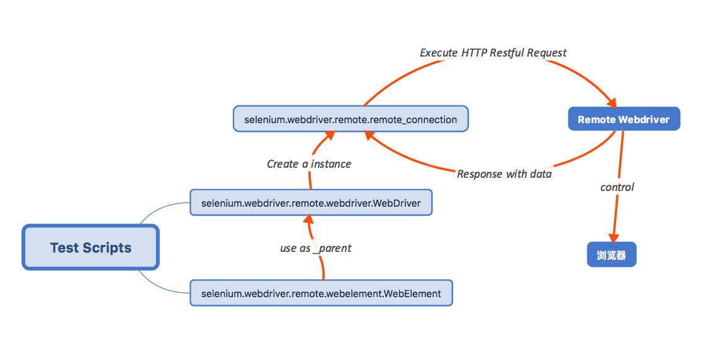
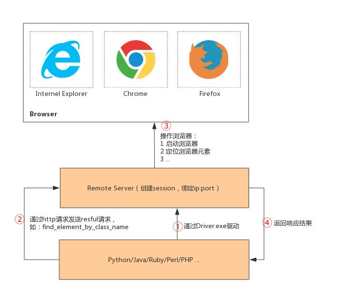

# 1.背景介绍
Selenium是ThoughtWorks公司研发的一个强大的基于浏览器的开源自动化测试工具，它通常用来编写web应用的自动化测试。早期也即Selenium1.x时期主要使用Selenium RC（Selenium Remote Control）进来自动化测试。Selenium2.x集成了Selenium和WebDriver的功能。

官方文档: https://www.selenium.dev/documentation/zh-cn/getting_started/quick/
# 2.WebDriver下载地址
淘宝镜像: http://npm.taobao.org/mirrors/chromedriver/
# 3.实现原理

WebDriver是完全W3C标准化的, 客户端与Remote Server(WebDriver)的通信使用了Selenium自己设计定义的协议The WebDriver Wire Protocol。这套协议,将不关心客户端脚本使用的是什么语言编写,只需最终按照协议通过http进行交互即可.


```py
from selenium import webdriver
import logging


logging.basicConfig(level=logging.DEBUG)  # 开启日志debug
driver = webdriver.Chrome(executable_path="./chromedriver")  # 启动Webdriver,Webdriver启动浏览器
driver.get("https://www.baidu.com")  # 打开网页
print(driver.session_id)  # 1d924717349d874b783c345593078d33
driver.close()  # 关闭当前窗口
driver.quit()  # 关闭驱动及窗口
```
log
```log
/usr/bin/python3.7 /home/qydev012/workspace/demo/demo.py
DEBUG:selenium.webdriver.remote.remote_connection:POST http://127.0.0.1:35579/session {"capabilities": {"firstMatch": [{}], "alwaysMatch": {"browserName": "chrome", "platformName": "any", "goog:chromeOptions": {"extensions": [], "args": []}}}, "desiredCapabilities": {"browserName": "chrome", "version": "", "platform": "ANY", "goog:chromeOptions": {"extensions": [], "args": []}}}
DEBUG:urllib3.connectionpool:Starting new HTTP connection (1): 127.0.0.1:35579
DEBUG:urllib3.connectionpool:http://127.0.0.1:35579 "POST /session HTTP/1.1" 200 930
DEBUG:selenium.webdriver.remote.remote_connection:Finished Request
DEBUG:selenium.webdriver.remote.remote_connection:POST http://127.0.0.1:35579/session/1d924717349d874b783c345593078d33/url {"url": "https://www.baidu.com", "sessionId": "1d924717349d874b783c345593078d33"}
DEBUG:urllib3.connectionpool:http://127.0.0.1:35579 "POST /session/1d924717349d874b783c345593078d33/url HTTP/1.1" 200 72
DEBUG:selenium.webdriver.remote.remote_connection:Finished Request
DEBUG:selenium.webdriver.remote.remote_connection:DELETE http://127.0.0.1:35579/session/1d924717349d874b783c345593078d33/window {"sessionId": "1d924717349d874b783c345593078d33"}
DEBUG:urllib3.connectionpool:http://127.0.0.1:35579 "DELETE /session/1d924717349d874b783c345593078d33/window HTTP/1.1" 200 72
DEBUG:selenium.webdriver.remote.remote_connection:Finished Request
DEBUG:selenium.webdriver.remote.remote_connection:DELETE http://127.0.0.1:35579/session/1d924717349d874b783c345593078d33 {"sessionId": "1d924717349d874b783c345593078d33"}
DEBUG:urllib3.connectionpool:http://127.0.0.1:35579 "DELETE /session/1d924717349d874b783c345593078d33 HTTP/1.1" 200 40
DEBUG:selenium.webdriver.remote.remote_connection:Finished Request
```
具体过程如下：

1. 实例化WebDriver类,将会启动Remote Server服务及打开浏览器
    1. 启动WebDriver程序,该程序即为一个Remote Server服务
    2. 携带相关参数进行post请求`http://host:port/session`
        1. WebDriver将会进行检查 
            - 浏览器的native component是否存在可用
            - 以及是否支持当前浏览器版本
2. 调用相关对象,通过HTTP与Remote Server进行交互,由rs驱动浏览器进行操作,例如打开网页
    1. 发送请求
    2. RS驱动浏览器
    3. RS通过RESPONSE告知操作结果


## 2.操作请求URL
```py
self._commands = {
            Command.STATUS: ('GET', '/status'),
            Command.NEW_SESSION: ('POST', '/session'),
            Command.GET_ALL_SESSIONS: ('GET', '/sessions'),
            Command.QUIT: ('DELETE', '/session/$sessionId'),
            Command.GET_CURRENT_WINDOW_HANDLE:
                ('GET', '/session/$sessionId/window_handle'),
            Command.W3C_GET_CURRENT_WINDOW_HANDLE:
                ('GET', '/session/$sessionId/window'),
            Command.GET_WINDOW_HANDLES:
                ('GET', '/session/$sessionId/window_handles'),
            Command.W3C_GET_WINDOW_HANDLES:
                ('GET', '/session/$sessionId/window/handles'),
            Command.GET: ('POST', '/session/$sessionId/url'),
            Command.GO_FORWARD: ('POST', '/session/$sessionId/forward'),
            Command.GO_BACK: ('POST', '/session/$sessionId/back'),
            Command.REFRESH: ('POST', '/session/$sessionId/refresh'),
            Command.EXECUTE_SCRIPT: ('POST', '/session/$sessionId/execute'),
            Command.W3C_EXECUTE_SCRIPT:
                ('POST', '/session/$sessionId/execute/sync'),
            Command.W3C_EXECUTE_SCRIPT_ASYNC:
                ('POST', '/session/$sessionId/execute/async'),
            Command.GET_CURRENT_URL: ('GET', '/session/$sessionId/url'),
            Command.GET_TITLE: ('GET', '/session/$sessionId/title'),
            Command.GET_PAGE_SOURCE: ('GET', '/session/$sessionId/source'),
            Command.SCREENSHOT: ('GET', '/session/$sessionId/screenshot'),
            Command.ELEMENT_SCREENSHOT: ('GET', '/session/$sessionId/element/$id/screenshot'),
            Command.FIND_ELEMENT: ('POST', '/session/$sessionId/element'),
            Command.FIND_ELEMENTS: ('POST', '/session/$sessionId/elements'),
            Command.W3C_GET_ACTIVE_ELEMENT: ('GET', '/session/$sessionId/element/active'),
            Command.GET_ACTIVE_ELEMENT:
                ('POST', '/session/$sessionId/element/active'),
            Command.FIND_CHILD_ELEMENT:
                ('POST', '/session/$sessionId/element/$id/element'),
            Command.FIND_CHILD_ELEMENTS:
                ('POST', '/session/$sessionId/element/$id/elements'),
            Command.CLICK_ELEMENT: ('POST', '/session/$sessionId/element/$id/click'),
            Command.CLEAR_ELEMENT: ('POST', '/session/$sessionId/element/$id/clear'),
            Command.SUBMIT_ELEMENT: ('POST', '/session/$sessionId/element/$id/submit'),
            Command.GET_ELEMENT_TEXT: ('GET', '/session/$sessionId/element/$id/text'),
            Command.SEND_KEYS_TO_ELEMENT:
                ('POST', '/session/$sessionId/element/$id/value'),
            Command.SEND_KEYS_TO_ACTIVE_ELEMENT:
                ('POST', '/session/$sessionId/keys'),
            Command.UPLOAD_FILE: ('POST', "/session/$sessionId/file"),
            Command.GET_ELEMENT_VALUE:
                ('GET', '/session/$sessionId/element/$id/value'),
            Command.GET_ELEMENT_TAG_NAME:
                ('GET', '/session/$sessionId/element/$id/name'),
            Command.IS_ELEMENT_SELECTED:
                ('GET', '/session/$sessionId/element/$id/selected'),
            Command.SET_ELEMENT_SELECTED:
                ('POST', '/session/$sessionId/element/$id/selected'),
            Command.IS_ELEMENT_ENABLED:
                ('GET', '/session/$sessionId/element/$id/enabled'),
            Command.IS_ELEMENT_DISPLAYED:
                ('GET', '/session/$sessionId/element/$id/displayed'),
            Command.GET_ELEMENT_LOCATION:
                ('GET', '/session/$sessionId/element/$id/location'),
            Command.GET_ELEMENT_LOCATION_ONCE_SCROLLED_INTO_VIEW:
                ('GET', '/session/$sessionId/element/$id/location_in_view'),
            Command.GET_ELEMENT_SIZE:
                ('GET', '/session/$sessionId/element/$id/size'),
            Command.GET_ELEMENT_RECT:
                ('GET', '/session/$sessionId/element/$id/rect'),
            Command.GET_ELEMENT_ATTRIBUTE:
                ('GET', '/session/$sessionId/element/$id/attribute/$name'),
            Command.GET_ELEMENT_PROPERTY:
                ('GET', '/session/$sessionId/element/$id/property/$name'),
            Command.GET_ALL_COOKIES: ('GET', '/session/$sessionId/cookie'),
            Command.ADD_COOKIE: ('POST', '/session/$sessionId/cookie'),
            Command.GET_COOKIE: ('GET', '/session/$sessionId/cookie/$name'),
            Command.DELETE_ALL_COOKIES:
                ('DELETE', '/session/$sessionId/cookie'),
            Command.DELETE_COOKIE:
                ('DELETE', '/session/$sessionId/cookie/$name'),
            Command.SWITCH_TO_FRAME: ('POST', '/session/$sessionId/frame'),
            Command.SWITCH_TO_PARENT_FRAME: ('POST', '/session/$sessionId/frame/parent'),
            Command.SWITCH_TO_WINDOW: ('POST', '/session/$sessionId/window'),
            Command.CLOSE: ('DELETE', '/session/$sessionId/window'),
            Command.GET_ELEMENT_VALUE_OF_CSS_PROPERTY:
                ('GET', '/session/$sessionId/element/$id/css/$propertyName'),
            Command.IMPLICIT_WAIT:
                ('POST', '/session/$sessionId/timeouts/implicit_wait'),
            Command.EXECUTE_ASYNC_SCRIPT: ('POST', '/session/$sessionId/execute_async'),
            Command.SET_SCRIPT_TIMEOUT:
                ('POST', '/session/$sessionId/timeouts/async_script'),
            Command.SET_TIMEOUTS:
                ('POST', '/session/$sessionId/timeouts'),
            Command.DISMISS_ALERT:
                ('POST', '/session/$sessionId/dismiss_alert'),
            Command.W3C_DISMISS_ALERT:
                ('POST', '/session/$sessionId/alert/dismiss'),
            Command.ACCEPT_ALERT:
                ('POST', '/session/$sessionId/accept_alert'),
            Command.W3C_ACCEPT_ALERT:
                ('POST', '/session/$sessionId/alert/accept'),
            Command.SET_ALERT_VALUE:
                ('POST', '/session/$sessionId/alert_text'),
            Command.W3C_SET_ALERT_VALUE:
                ('POST', '/session/$sessionId/alert/text'),
            Command.GET_ALERT_TEXT:
                ('GET', '/session/$sessionId/alert_text'),
            Command.W3C_GET_ALERT_TEXT:
                ('GET', '/session/$sessionId/alert/text'),
            Command.SET_ALERT_CREDENTIALS:
                ('POST', '/session/$sessionId/alert/credentials'),
            Command.CLICK:
                ('POST', '/session/$sessionId/click'),
            Command.W3C_ACTIONS:
                ('POST', '/session/$sessionId/actions'),
            Command.W3C_CLEAR_ACTIONS:
                ('DELETE', '/session/$sessionId/actions'),
            Command.DOUBLE_CLICK:
                ('POST', '/session/$sessionId/doubleclick'),
            Command.MOUSE_DOWN:
                ('POST', '/session/$sessionId/buttondown'),
            Command.MOUSE_UP:
                ('POST', '/session/$sessionId/buttonup'),
            Command.MOVE_TO:
                ('POST', '/session/$sessionId/moveto'),
            Command.GET_WINDOW_SIZE:
                ('GET', '/session/$sessionId/window/$windowHandle/size'),
            Command.SET_WINDOW_SIZE:
                ('POST', '/session/$sessionId/window/$windowHandle/size'),
            Command.GET_WINDOW_POSITION:
                ('GET', '/session/$sessionId/window/$windowHandle/position'),
            Command.SET_WINDOW_POSITION:
                ('POST', '/session/$sessionId/window/$windowHandle/position'),
            Command.SET_WINDOW_RECT:
                ('POST', '/session/$sessionId/window/rect'),
            Command.GET_WINDOW_RECT:
                ('GET', '/session/$sessionId/window/rect'),
            Command.MAXIMIZE_WINDOW:
                ('POST', '/session/$sessionId/window/$windowHandle/maximize'),
            Command.W3C_MAXIMIZE_WINDOW:
                ('POST', '/session/$sessionId/window/maximize'),
            Command.SET_SCREEN_ORIENTATION:
                ('POST', '/session/$sessionId/orientation'),
            Command.GET_SCREEN_ORIENTATION:
                ('GET', '/session/$sessionId/orientation'),
            Command.SINGLE_TAP:
                ('POST', '/session/$sessionId/touch/click'),
            Command.TOUCH_DOWN:
                ('POST', '/session/$sessionId/touch/down'),
            Command.TOUCH_UP:
                ('POST', '/session/$sessionId/touch/up'),
            Command.TOUCH_MOVE:
                ('POST', '/session/$sessionId/touch/move'),
            Command.TOUCH_SCROLL:
                ('POST', '/session/$sessionId/touch/scroll'),
            Command.DOUBLE_TAP:
                ('POST', '/session/$sessionId/touch/doubleclick'),
            Command.LONG_PRESS:
                ('POST', '/session/$sessionId/touch/longclick'),
            Command.FLICK:
                ('POST', '/session/$sessionId/touch/flick'),
            Command.EXECUTE_SQL:
                ('POST', '/session/$sessionId/execute_sql'),
            Command.GET_LOCATION:
                ('GET', '/session/$sessionId/location'),
            Command.SET_LOCATION:
                ('POST', '/session/$sessionId/location'),
            Command.GET_APP_CACHE:
                ('GET', '/session/$sessionId/application_cache'),
            Command.GET_APP_CACHE_STATUS:
                ('GET', '/session/$sessionId/application_cache/status'),
            Command.CLEAR_APP_CACHE:
                ('DELETE', '/session/$sessionId/application_cache/clear'),
            Command.GET_NETWORK_CONNECTION:
                ('GET', '/session/$sessionId/network_connection'),
            Command.SET_NETWORK_CONNECTION:
                ('POST', '/session/$sessionId/network_connection'),
            Command.GET_LOCAL_STORAGE_ITEM:
                ('GET', '/session/$sessionId/local_storage/key/$key'),
            Command.REMOVE_LOCAL_STORAGE_ITEM:
                ('DELETE', '/session/$sessionId/local_storage/key/$key'),
            Command.GET_LOCAL_STORAGE_KEYS:
                ('GET', '/session/$sessionId/local_storage'),
            Command.SET_LOCAL_STORAGE_ITEM:
                ('POST', '/session/$sessionId/local_storage'),
            Command.CLEAR_LOCAL_STORAGE:
                ('DELETE', '/session/$sessionId/local_storage'),
            Command.GET_LOCAL_STORAGE_SIZE:
                ('GET', '/session/$sessionId/local_storage/size'),
            Command.GET_SESSION_STORAGE_ITEM:
                ('GET', '/session/$sessionId/session_storage/key/$key'),
            Command.REMOVE_SESSION_STORAGE_ITEM:
                ('DELETE', '/session/$sessionId/session_storage/key/$key'),
            Command.GET_SESSION_STORAGE_KEYS:
                ('GET', '/session/$sessionId/session_storage'),
            Command.SET_SESSION_STORAGE_ITEM:
                ('POST', '/session/$sessionId/session_storage'),
            Command.CLEAR_SESSION_STORAGE:
                ('DELETE', '/session/$sessionId/session_storage'),
            Command.GET_SESSION_STORAGE_SIZE:
                ('GET', '/session/$sessionId/session_storage/size'),
            Command.GET_LOG:
                ('POST', '/session/$sessionId/log'),
            Command.GET_AVAILABLE_LOG_TYPES:
                ('GET', '/session/$sessionId/log/types'),
            Command.CURRENT_CONTEXT_HANDLE:
                ('GET', '/session/$sessionId/context'),
            Command.CONTEXT_HANDLES:
                ('GET', '/session/$sessionId/contexts'),
            Command.SWITCH_TO_CONTEXT:
                ('POST', '/session/$sessionId/context'),
            Command.FULLSCREEN_WINDOW:
                ('POST', '/session/$sessionId/window/fullscreen'),
            Command.MINIMIZE_WINDOW:
                ('POST', '/session/$sessionId/window/minimize')
        }
```
# 4.WebDriver
## 1.WebDriver程序(以linux为例)
- `./chromedriver`: 启动WebDriver
- `./chromedriver --h`: 查看帮助
```
Usage: ./chromedriver [OPTIONS]

Options
  --port=PORT                     port to listen on
  --adb-port=PORT                 adb server port
  --log-path=FILE                 write server log to file instead of stderr, increases log level to INFO
  --log-level=LEVEL               set log level: ALL, DEBUG, INFO, WARNING, SEVERE, OFF
  --verbose                       log verbosely (equivalent to --log-level=ALL)
  --silent                        log nothing (equivalent to --log-level=OFF)
  --append-log                    append log file instead of rewriting
  --replayable                    (experimental) log verbosely and don't truncate long strings so that the log can be replayed.
  --version                       print the version number and exit
  --url-base                      base URL path prefix for commands, e.g. wd/url
  --readable-timestamp            add readable timestamps to log
  --enable-chrome-logs            show logs from the browser (overrides other logging options)
  --disable-dev-shm-usage         do not use /dev/shm (add this switch if seeing errors related to shared memory)
  --allowed-ips                   comma-separated allowlist of remote IP addresses which are allowed to connect to ChromeDriver
```

## 2.手动请求驱动
可以使用postman之类的对驱动进行接口请求

e.g.

打开网页

`http://127.0.0.1:9515/session/0894a174a294e05fbfe7aedf4d9145be/url`
```json
{
    "url": "https://www.baidu.com",
    "sessionId": "0894a174a294e05fbfe7aedf4d9145be"
}
```
```json
{
    "sessionId": "0894a174a294e05fbfe7aedf4d9145be",
    "status": 0,
    "value": null
}
```
打开浏览器

`http://127.0.0.1:9515/session`
```json
{
    "sessionId": "0894a174a294e05fbfe7aedf4d9145be",
    "status": 0,
    "value": {
        "acceptInsecureCerts": false,
        "acceptSslCerts": false,
        "applicationCacheEnabled": false,
        "browserConnectionEnabled": false,
        "browserName": "chrome",
        "chrome": {
            "chromedriverVersion": "72.0.3626.69 (3c16f8a135abc0d4da2dff33804db79b849a7c38)",
            "userDataDir": "/tmp/.com.google.Chrome.ji2YNH"
        },
        "cssSelectorsEnabled": true,
        "databaseEnabled": false,
        "goog:chromeOptions": {
            "debuggerAddress": "localhost:44659"
        },
        "handlesAlerts": true,
        "hasTouchScreen": false,
        "javascriptEnabled": true,
        "locationContextEnabled": true,
        "mobileEmulationEnabled": false,
        "nativeEvents": true,
        "networkConnectionEnabled": false,
        "pageLoadStrategy": "normal",
        "platform": "Linux",
        "proxy": {},
        "rotatable": false,
        "setWindowRect": true,
        "takesHeapSnapshot": true,
        "takesScreenshot": true,
        "timeouts": {
            "implicit": 0,
            "pageLoad": 300000,
            "script": 30000
        },
        "unexpectedAlertBehaviour": "ignore",
        "version": "72.0.3626.119",
        "webStorageEnabled": true
    }
}
```
如果驱动不匹配
```json
{
    "value": {
        "error": "session not created",
        "message": "session not created: This version of ChromeDriver only supports Chrome version 89\nCurrent browser version is 72.0.3626.119 with binary path /usr/bin/google-chrome",
        "stacktrace": "#0 0x55d1af9512b9 <unknown>\n"
    }
}
```
如果驱动匹配
```json
{
    "sessionId": "3819e25036e316d2b05532ce45f387ac",
    "status": 0,
    "value": {
        "acceptInsecureCerts": false,
        "acceptSslCerts": false,
        "applicationCacheEnabled": false,
        "browserConnectionEnabled": false,
        "browserName": "chrome",
        "chrome": {
            "chromedriverVersion": "72.0.3626.69 (3c16f8a135abc0d4da2dff33804db79b849a7c38)",
            "userDataDir": "/tmp/.com.google.Chrome.AmASeh"
        },
        "cssSelectorsEnabled": true,
        "databaseEnabled": false,
        "goog:chromeOptions": {
            "debuggerAddress": "localhost:39205"
        },
        "handlesAlerts": true,
        "hasTouchScreen": false,
        "javascriptEnabled": true,
        "locationContextEnabled": true,
        "mobileEmulationEnabled": false,
        "nativeEvents": true,
        "networkConnectionEnabled": false,
        "pageLoadStrategy": "normal",
        "platform": "Linux",
        "proxy": {},
        "rotatable": false,
        "setWindowRect": true,
        "takesHeapSnapshot": true,
        "takesScreenshot": true,
        "timeouts": {
            "implicit": 0,
            "pageLoad": 300000,
            "script": 30000
        },
        "unexpectedAlertBehaviour": "ignore",
        "version": "72.0.3626.119",
        "webStorageEnabled": true
    }
}
```

# 5. selenium4 
开发进度: https://github.com/SeleniumHQ/selenium/projects/2

底层上优化
- 测试将直接进行通信，而无需通过W3C协议对API请求进行任何编码和解码(JSON有线协议将不再使用)
- IDE插件化,全新的CLI运行器
- 优化selenium grid使用
    1. 独立模式
    2. 集线器和节点
    3. 完全分布式

功能上增加
- Chromedriver和EdgeDriver继承自ChromiumDriver。 ChromiumDriver类具有访问开发工具的预定义方法
- 支持在2个标签上并发工作
- 相对定位器

# 6.其他设置
## 1.add_argument模式

```py
from selenium import webdriver
proxy="127.0.0.1:8888"
option = webdriver.ChromeOptions()
option.add_argument("--headless")  # 设置无头模式
option.add_argument(f'--proxy-server={proxy}')  # 设置代理
option.add_argument("--hide-scrollbars")  # 隐藏滚动条
option.add_argument("blink-setting=imagesEnable=false")  # 不加载图片
option.add_argument("--no-sandox")  # 不打开沙箱
option.add_argument('disable-infobars')  # 关闭控制警告
driver=webdriver.Chrome("./chromedriver", options=chrome_options)
```
# 查看版本
- `google-chrome --version`: 查看谷歌浏览器版本
- `chromedriver --version`: 查看chromedriver版本