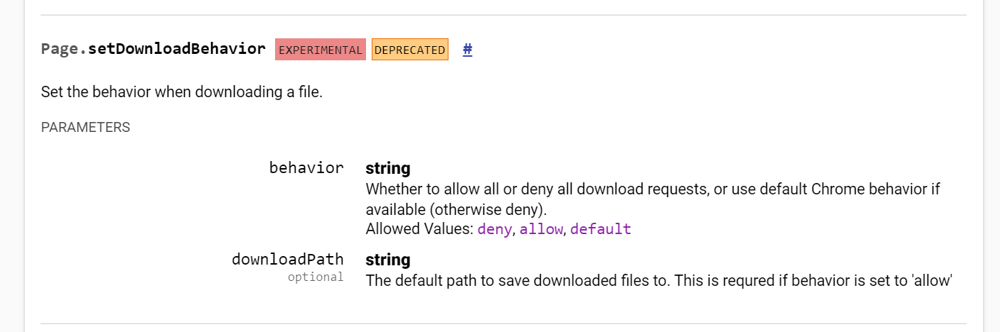

# 下载文件
正常模式下,只需要修改默认的下载地址即可
```py
import os
from selenium import webdriver

options = webdriver.ChromeOptions()
# 0禁止弹出下载窗口
# download.default_directory设置下载路径
prefs = {
    "profile.default_content_settings.popups": 0,
    "download.default_directory": os.getcwd()}
options.add_experimental_option("prefs",prefs)

driver = webdriver.Chrome(chrome_options=options)
driver.get("https://pypi.org/project/selenium/#files")
driver.find_element_by_partial_link_text("selenium-3.141.0.tar.gz").click()
```




无头模式下,就需要使用Chrome DevTools中的功能了,该功能已经被chrome官方定位已过期了,暂时不知道还能否使用.而且并无其他解决方案了

https://chromedevtools.github.io/devtools-protocol/tot/Page/#method-setDownloadBehavior
```py
def enable_download_in_headless_chrome(driver, download_dir):
    #add missing support for chrome "send_command"  to selenium webdriver
    driver.command_executor._commands["send_command"] = ("POST", '/session/$sessionId/chromium/send_command')

    params = {'cmd': 'Page.setDownloadBehavior', 'params': {'behavior': 'allow', 'downloadPath': download_dir}}
    driver.execute("send_command", params)

```

# 上传文件
目前的解决方案都无法实现远端上传(除了input标签的),且都不支持并发操作


## 最佳实现篇
因为传统方法用的都是基于window api的方法操纵窗口,在linux系统下无法操作到.所以改用`pyautogui`该库是通过操作键盘与鼠标的方法实现的简单操作

在出现上传弹框的时候,会自动激活该弹框,所以只要在文件输入框输入绝对地址和回车确定即可

因为是通过脚本对键盘鼠标操作,所以通过远端连接grid运行脚本时,是操作不到的.

所以有一个思路,打造特定的node镜像,内起一个专门用于执行上传弹窗操作的服务.有需要上传就发送请求通知.
```py
def upload_file(self, file_path):
    """
    upload file
    :param file_path:
    :return:
    """
    time.sleep(2)
    pyautogui.write(file_path, _pause=1)
    pyautogui.press('enter', presses=2, interval=0.1, _pause=2)
    logger.info(f"Action:[upload_file] path:{file_path} Upload successful")
    return self
```
为提高鲁棒性,所以增加了操作间隔

## 传统方法篇

### 环境安装

库： pywin32
工具：winspy
链接: https://pan.baidu.com/s/1fJ4I6B4f7FSC5S2XHWKC-w 密码: tn59
### 与autoit的差异

    autoit需要学习autoit的脚本语言在其提供的编辑器里面编写脚本，存在学习门槛问题
    还需要将其脚本生成为exe文件，再由代码去调用，不够优化
    pywin32库，可以由python直接编写，直接运行，但是缺点是要一层层的往里面找到要操作的文件输入框
    
### 使用

以chrome为例：
    
    1.利用winspy工具找到 【title】 【文件路径输入框】 【提交按钮】 的title和class
    2.溯源至最顶层（title）并记录相关的title和class

##【title】:


### 【文件路径输入框】:
- 输入框class 需要继续找到其父级


- 第一层父级

- 第二层父级

- 找到title层父级即停止


### 【提交按钮】：
- 按钮层

- title层


函数说明：

1. `win32gui.FindWindow(lpClassName, lpWindowName)`   # class，值title
2. `win32gui.FindWindowEx(Parent, childafter, calss, window)`  # 父对象, 从第几个下级开始, 类名, text
3. `win32gui.SendMessage(handle, msg, param, param)`  # 父对象, 消息对象, 参数, 参数

```python
import win32con 
import win32gui


def upload_file(file_path):
    # title仅支持chrome
    title = win32gui.FindWindow("#32770", "打开")

    # 二级窗口，4个参数：父级；从父级的第几个儿子开始检索，0表示第一个；自身类名；文本内容，没有则None
    comboboxex32 = win32gui.FindWindowEx(title, 0, "ComboBoxEx32", None)
    combobox = win32gui.FindWindowEx(comboboxex32, 0, "ComboBox", None)
    edit = win32gui.FindWindowEx(combobox, 0, "Edit", None)

    button = win32gui.FindWindowEx(title, 0, "Button", "打开(&O)")

    win32gui.SendMessage(edit, win32con.WM_SETTEXT, None, file_path)
    win32gui.SendMessage(title, win32con.WM_COMMAND, 1, button)  # 按钮处引用的是title
```