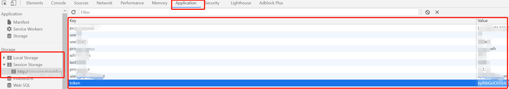

cookie的可以看这篇 https://www.jianshu.com/p/d442a3cbef3a
# 使用背景
在我们实际的使用过程中,有些平台的账号并不是无限的可以随便创建的.如果随便创建的话将会造成数据泛滥.有些同学可能会说将这些造的数据删除即可.但是在有些时候我们是需要这些数据进行历史回顾的.比如使用这些历史数据查看版本升级时候会造成之前的旧数据出现bug.

因此在我们不能随便创建账号的情况下,又要使我们的用例以class级别的进行并发/class级别前置实例化webdriver.这样的情况下,我们可以选择每个需要登录的class级别用例都设定独立的账号.这是一个好方法,但是不够灵活,每增加多一个需要登录的测试用例类都需要新建一个账号.

所以我们决定以某个用例最先需要登录的账号进行登录,然后提取出登录的相关参数,其他需要登录的写入这些参数而不进行登录.
# 前期准备
我们需要了解这些数据都存在那里,以及怎么通过js获取以及写入参数,以下介绍的是token的获取方法,cookie是类似的

1. 通过浏览器的开发者模式找到如下图的位置

2. 查看数据是存在Local Storage还是SessionStorage,一般情况下都是存在SessionStorage的.
3. 查看Storage中的键值对那些是登录必须要的(一般来说,如果有多个键值对那么,不仅仅token需要传)

在浏览器console中查看数据的方法,以下以sessionStorage作为展示,LocalStorage也是类似的
- `sessionStorage`: 查看会话数据对象全部键值对
- `sessionStorage.getItem("token")`: 查看会话数据中的token值
- `sessionStorage.setItem("token", "eyJhbGciOiJSUzI1NiIsInR5cCI6IkpXVCJ9.eyJleHAiOjE2MTQ2MTA1MzQsIm9wZXJhdG9yS")`: 写入token键值对

# 代码实现
```py
driver.get(url1)  # 必须先打开网页,如果先添加将导致数据被清空
token = driver.execute_script('return sessionStorage.getItem("token");')  # 获取token,注意此处必须要return
driver.execute_script(f'sessionStorage.setItem("token", "{token}");')  # 写入token
driver.get(url2)  # 后面需要二次打开与第一次同样的网页(如果登录页会自动跳转的话),或者打开正常登录成功情况下跳转的url
driver.execute_script(f"return Object.keys(sessionStorage)")  # 获取全部storage的key
```

# 实现方案
方案一:
通过接口进行首次登录,提取相关数据

方案二:
通过ui操作登录,提取相关数据,如果使用并发运行,可能存在同时登录的可能性,
- 最佳方案是要在操作的地方加锁.
- 如果不方便加锁,就可以在成功登录之前查看时候已有登录数据.已有登录数据就停止继续UI操作,直接添加登录数据即可.并且增加重试机制

方案三:
如果方便的话,可以直接通过数据库获取

方案四:
在用例运行初始化的时候(`pytest_configure(config)`),造好登录数据,以键值对的形式存储.以便用例需要使用不同的登录数据

方案四:
若token长期不会失效,直接写死token即可