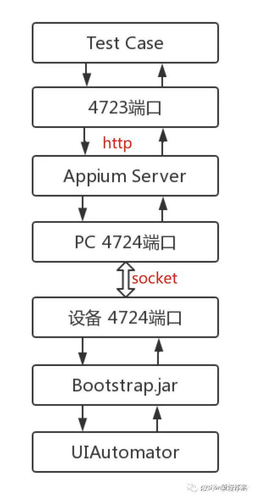

# 背景介绍
Appium是一个开源、跨平台的测试框架，可以用来测试原生及混合的移动端应用。Appium支持IOS、Android及FirefoxOS平台。

Appium使用WebDriver的客户端-服务端协议(json wire protocol协议)，按照这种客户端-服务端架构,使用任意语言编写的客户端向服务端发送适当的HTTP请求即可驱动测试。
# 官方文档
https://appium.github.io/python-client-sphinx/
# 实现原理
以Android系统来说

1. appium 使用adb向设备部署Bootstrap.jar
2. Bootstrap.jar 接收appium发过来的指令
3. Bootstrap.jar 再次将指令发送给uiautomator
4. uiautomator执行命令
## 通讯机制

1. Test Script 发送json协议信息到 Appium Server(4723端口)
2. Appium Server 发送Socket协议信息到 Bootstrap.jar(4724端口)
3. Bootstrap.jar 返回Socket协议信息到 Appium Server
4. Appium Server 返回json协议信息到 Test Script

## 1.Android

在Android端，appium基于WebDriver协议，利用Bootstrap.jar，最后通过调⽤用UiAutomator的命令，实现App的自动化测试。

UiAutomator测试框架是Android SDK自带的App UI自动化测试Java库。

另外由于UiAutomator对H5的支持有限，appium引入了chromedriver以及safaridriver等来实现基于H5的自动化。

工作流

1. client端也就是我们 test script是我们的webdriver测试脚本。
2. 中间是起的Appium的服务，Appium在服务端起了一个Server（4723端口），跟selenium Webdriver测试框架类似， Appium⽀持标准的WebDriver JSON Wire Protocol。在这里提供它提供了一套REST的接口,Appium Server接收web driver client标准rest请求，解析请求内容，调⽤用对应的框架响应操作。
3. appium server会把请求转发给中间件Bootstrap.jar ，它是用java写的，安装在手机上.Bootstrap监听4724端口并接收appium 的命令，最终通过调⽤用UiAutomator的命令来实现。
4. 最后Bootstrap将执行的结果返回给appium server。
5. appium server再将结果返回给 appium client。

## 2.IOS

在IOS端，appium同样使⽤WebDriver的一套协议。

与Android端测试框架不同的是，appium ios封装了apple的 Instruments框架，主要用了Instrument里的UI Automation（Apple的⾃自动化测试框架），然后在设备中注⼊入bootstrap.js进⾏行监听。

工作流
1. client端 依然是 test script是我们的webdriver测试脚本。
2. 中间是起的Appium的服务，Appium在服务端起了一个Server（4723端口），跟selenium Webdriver测试框架类似， Appium⽀持标准的WebDriver JSON Wire Protocol。在这里提供它提供了一套REST的接口,Appium Server接收web driver client标准rest请求，解析请求内容，调⽤用对应的框架响应操作。
3. appium server调用instruments.js 启动一个socket server，同时分出一个⼦子进程运⾏instruments.app，将bootstrap.js（一个UIAutomation脚本）注⼊入到device⽤于和外界进行交互
4. 最后Bootstrap.js将执行的结果返回给appium server
5. appium server再将结果返回给 appium client。

## 3.区别
可以看到android与ios区别在于appium 将请求转发到bootstrap.js或者bootstrap.jar.然后由bootstrap 驱动UIAutomation和UiAutomator去devices上完成具体的动作。

## 4.名字解释
### 1.Client/Server 架构
appium的核心其实是一个暴露了一系列REST API的server。

这个server 监听一个端口，然后接收由client发送来的command。解析这些command，把这些command转成移动设备可以理解的形式发送给移动设备，然后移动设备执行完这些command后把执行结果返回给appium server，appium server再把执行结果返回给client。

### 2.Session
session就是一个会话，在webdriver/appium，你的所有工作永远都是在session start后才可以进行的。一般来说，通过POST /session这个URL，然后传入Desired Capabilities就可以开启session了。

开启session后，会返回一个全局唯一的session id，以后几乎所有的请求都必须带上这个session id，因为这个seesion id代表了你所打开的浏览器或者是移动设备的模拟器。

### 3.Desired Capabilities
重要的作用是告诉server本次测试的上下文,key-value形式的对象

### 4.Bootstrap
1. Bootstrap作用：

Bootstrap是Appium运行在安卓目标测试机器上的一个UiAutomator测试脚本，该脚本的唯一一个所做的事情是在目标机器开启一个socket服务器来把一个session中Appium从PC端过来的命令发送给UiAutomator来执行处理。

它会监听4724端口获得命令然后pass给UiAutomator来做处理。

2. Bootstrap在appium中扮演的角色：

    1. 首先，Bootstrap是uiautomator的测试脚本，它的入口类bootstrap继承于UiautomatorTestCase，所以Uiautomator可以正常运行它，它也可以正常使用uiautomator的方法，这个就是appium的命令可以转换成uiautomator命令的关键；

    2. 其次，bootstrap是一个socket服务器，专门监听4724端口过来的appium的连接和命令数据，并把appium的命令转换成uiautomator的命令来让uiautomator进行处理；

    3. 最后，bootstrap处理的是从pc端过来的命令，而非一个文件