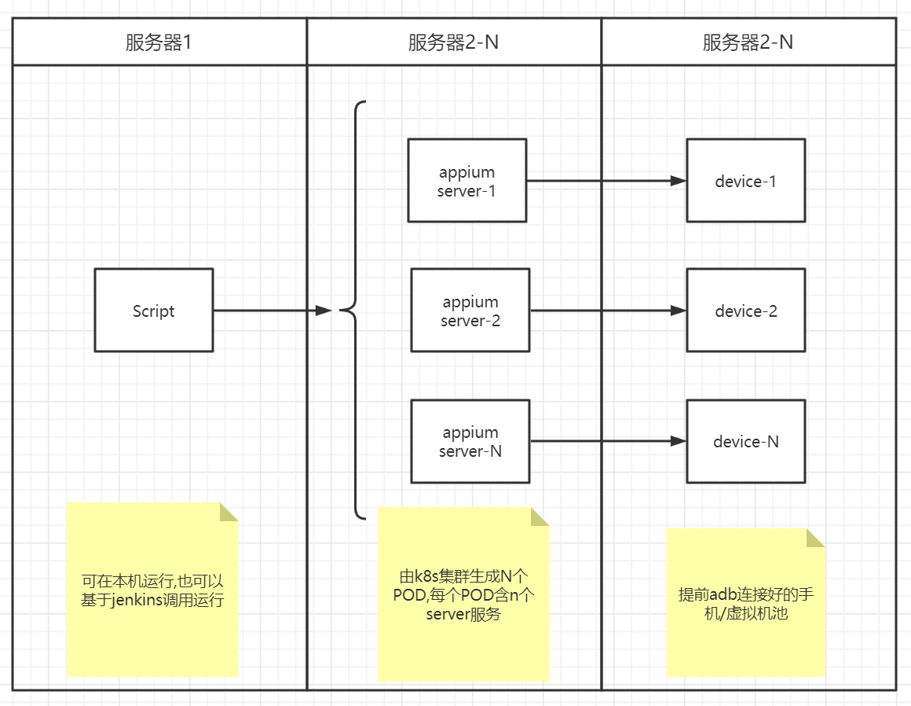

# 1.并发策略设计
## 前置条件
1. 使用自定义插件顺序`pytest-ordering`
2. 使用并发运行插件`pytest-xdist`

## 场景设计

### 小用例量
在性能满足的前提下,可以直接在用例本机上启动多个appium server连接多个devices,进行并发运行

### 大用例量
运行机性能不足或需要增大并发量的前提下,可以采用该方法

1. 一个脚本端,可以在任意地方运行,最好是基于jenkins进行CICD/手动
2. 由k8s集群运行N个appium server, 用于连接驱动设备
3. 提前连接设置好手机/虚拟机池

#### 实践方案一:
1. 由jenkins构建POD
2. POD中包含1个容器,容器中启动多个appium server

优点: 操作方便
缺点: 不便于使用k8s集群水平扩容的优点,使运行用例时实现弹性伸缩

#### 实践方案二:(最佳实践)
1. 手动构建存储卷及数据持久化资源
2. 由jenkins构建运行,测试脚本基于规则动态构建appium server端的POD资源, 支持弹性伸缩及水平扩容,用完销毁
3. 脚本以class级别进行并发
4. jenkins读取数据卷资源,生成allure报告

## 兼容性测试
多系统版本,多型号,多品牌下运行相同用例

TODO:可以考虑开发一个类似与selenium hub分配功能的中间件.

1. 以品牌划分
2. 以系统版本划分
3. 以型号划分

- 以品牌/系统版本划分则不同品牌间each用例,同品牌/系统版本则进行均衡负载
- 以型号划分则不同型号间each用例,同型号则进行均衡负载

## 用例设计
1. 基于PageObject的思想进行设计用例框架,实现元素分层,数据分离.
2. 用例类型上分为 场景测试 和 单页面测试

### 1.场景测试
特征: 层层关联,用例间存在顺序及结果依赖

详细说明: 一个场景流程为一个class,多个function级case形成依赖,通过顺序插件固定顺序

前置后置: class级别的前置:打开appium server;后置:关闭会话 (随机分配设备,错误捕获判断设备是否空闲)

并发策略: 采用xdist进行class级别并发(loadscope)

### 2.单页面测试
特征: 用例独立无依赖,同一页面及以同一页面为主的用例

多个相同页面或操作的归纳为一个class

前置后置: class级别的前置:打开appium server;后置:关闭会话 (随机分配设备,错误捕获判断设备是否空闲)

并发策略: 采用xdist进行class级别并发(loadscope)

### 3.兼容性测试
多系统版本,多型号,多品牌下运行相同用例

详细说明: 多品牌/型号/系统版本下each用例

前置后置: class级别的前置:打开appium server;后置:关闭会话 (随机分配设备,错误捕获判断设备是否空闲)

并发策略: 不同标准的each,相同标准的load 采用xdist进行class级别并发(loadscope)
# 2.实现