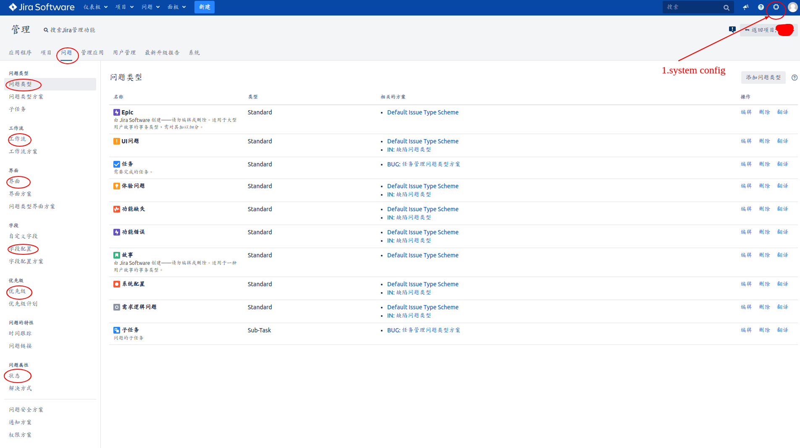
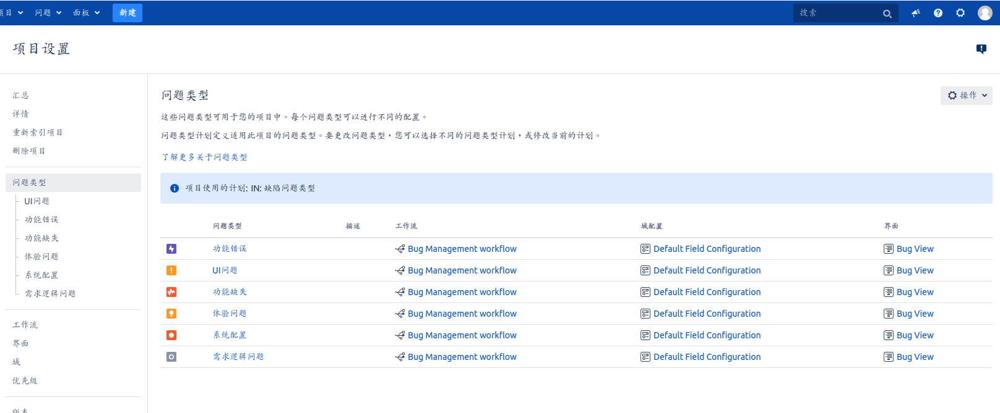
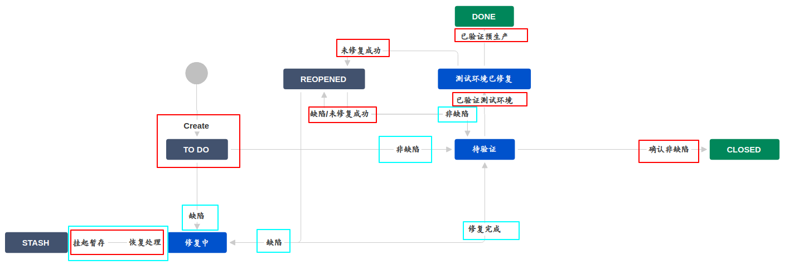
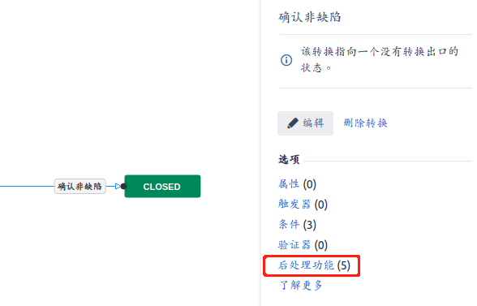
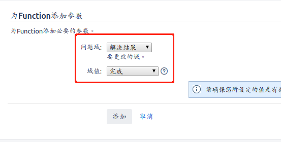
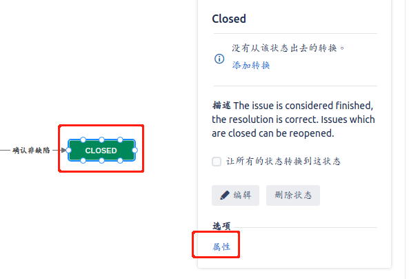
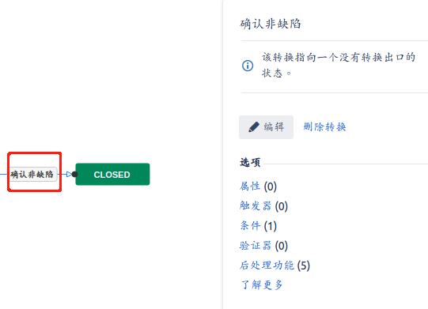
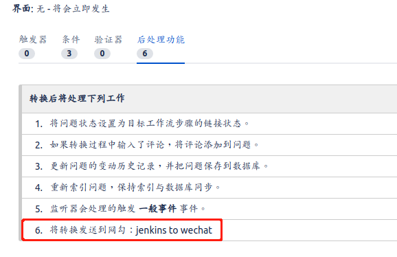

# 1.部署
基于 https://github.com/haxqer/jira/tree/rm 的方案,做了一些优化

tips: requirement
- docker: 17.09.0+
- docker-compose: 1.24.0+


1. 部署jira & mysql
```docker
git clone https://github.com/haxqer/jira.git \
    && cd jira \
    && git checkout rm \
    && docker-compose up -d
```

2. 选择自定义,并修改为中文


3. 数据库按以下参数进行配置
```
driver=mysql5.7+
host=mysql-jira
port=3306
db=jira
user=jira
passwd=123123
```

4. 将页面出现的服务器ID替换下面的"you-server-id-xxxx"(-s处),运行后得到code复制使用即可
```docker
docker exec jira-srv java -jar /var/agent/atlassian-agent.jar \
    -p jira \
    -m haxqer666@gmail.com \
    -n haxqer666@gmail.com \
    -o http://website \
    -s you-server-id-xxxx
```

5. 如果需要安装插件,将插件名(-p处)替换及服务器ID(-s处)替换即可
```docker
docker exec jira-srv java -jar /var/agent/atlassian-agent.jar \
    -p eu.softwareplant.biggantt \
    -m haxqer666@gmail.com \
    -n haxqer666@gmail.com \
    -o http://website \
    -s you-server-id-xxxx
```

# 2.详细使用说明
推荐参考以下作者写的使用非常详细:
- https://www.cnblogs.com/pluto4596/p/12434172.html#project%E5%9F%BA%E6%9C%AC%E4%BF%A1%E6%81%AF
- https://www.cnblogs.com/pluto4596/p/12450323.html#%E5%B1%9E%E6%80%A7
- https://www.cnblogs.com/pluto4596/p/12455932.html#%E7%94%A8%E6%88%B7%E7%BB%84

# 3.实践
笔者只基于质量团队使用的jira.并不涉及团队/项目管理流程的使用.

## 1.项目设置
### 1.全局项目设置


在此处设置的相关数据都是全局共享,现在全局中调整完相关数据选项,后再到单项目中去设置需要使用的选项

在全局项目设置中有:问题类型 工作流 界面 字段 优先级 问题的特性 问题属性 问题安全方案

其中: 问题类型 工作流 界面 字段 优先级 这5个较常设置
- 问题类型: 提的issue类型
- 工作流: issue走的路径
- 界面: issue每个状态需要的字段
- 字段: 具体每个字段的配置
- 优先级: issue的优先级配置

可以看出来这5个选项基本都是两层的一个方案
- 第一层为单个配置
- 第二层为多个配置的合集

在使用的时候仅需要在全局这边配置好相关的方案,直接在单项目中设置该方案即可

### 2.单项目设置


入口: 可通过系统设置中的 项目 导航到项目设置,也可以在项目中直接进入.

此处可配置单项目中独有的一些配置,也可以选择配置方案

### 3.工作流


在工作流中有两个重要的概念,一个是状态.状态就是上图中带背景色的块.一个是转换,也可以理解为步骤,即相关人员在issue中的选项,进而到达相关的状态.

如图,蓝色转换(步骤)处为开发(经办人)所具备的选项,红色为测试具备的选项([权限配置](#步骤))

简单说下上图的一个操作逻辑.
- 测试创建issue单,交由经办人确认是否为缺陷,缺陷走到修复中状态,非缺陷则交由测试再次确认
- 测试确认为非缺陷则将问题关闭
- 如果出现暂时不修复的缺陷,则提交着stash处进行暂存处理
- 修复完成交由测试验证,因为存在两个环境所以测试需进行二次验证
- 如果测试认为问题仍为缺陷/未修复完成则重新打开issue

**tips: 在DONE/CLOSED步骤时需要在转换的后处理功能中修改解决状态**




**工作流中可具体细分到每个 问题类型 具备不同的工作流**
### 4.问题类型
原模板的问题类型不符合质量团队的使用,故需要新增问题类型.

我们将问题类型定为6类
- 功能错误: 交付的需求存在功能等质量问题
- UI问题: 交付的需求存在UI的问题,可能是前端也可能是设计
- 功能缺失: 需求交付缺失功能
- 体验问题: 需求使用体验不佳
- 系统配置: 系统配置原因导致故障
- 需求逻辑问题: 产品设计需求时逻辑有缺陷

### 5.界面
界面提供我们定制化在工作流中不同状态下的展示页面.我们可以自定义的配置字段.

### 6.字段
在界面中需要使用的字段就来自于这里.如果界面中需要用到的字段没有,可以在这里自定义新增.提供给界面使用

### 7.优先级
在此处可配置优先级的选项,也可以将多个优先级组合成方案.

### 8.状态&转换(步骤)
在工作流成配置中,我们可能需要将权限具体到步骤及状态下.

#### 状态


在工作流编辑页面,点击状态后可进入 状态属性页 进行高级操作.(不常用)
#### 步骤


在工作流编辑页面,点击步骤后有配置弹窗,点击可进行相关配置

- 触发器: 是引发 Jira 问题自动转换的事件。触发器的示例包括创建拉取请求、拒绝代码检查等等
- 可使用步骤的条件(比如可以设置某项步骤只有某些项目角色才可以使用)
- 验证器: 执行这个转换前进行输入参数检查。
- 后处理功能: 在转换后将执行的操作(比如webhook等其他)更改结果状态等



tips: 如果需要指定某些步骤触发webhook的话只能在此处设置.在[系统webhook](#3网络钩子(webhook))的设置页面,不支持步骤(转换)级触发设置.

## 2.用户
用户可在全局管理中的用户管理中添加.以及自定义配置用户组等

## 3.网络钩子(webhook)
在使用时产生了经常需要告知开发有新bug的情况,为了减少这种无谓的操作.故将网络钩子与企业微信机器人结合.但是企业机器人不如钉钉.并没有对jira进行支持.所以需要将webhook进行二次开发再将信息发往企业微信.

1. jira webhook 将信息发往jenkins
2. jenkins 将信息解析后 发往企业微信

[具体实现可见 jenkins篇 4.实践部分](../../21.jenkins/1.jenkins.md#4-实践)

