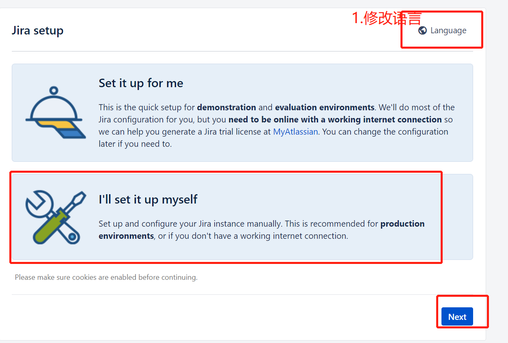

# 部署
基于 https://github.com/haxqer/jira/tree/rm 的方案,做了一些优化

tips: requirement
- docker: 17.09.0+
- docker-compose: 1.24.0+


1. 部署jira & mysql
```docker
git clone https://github.com/haxqer/jira.git \
    && cd jira \
    && git checkout rm \
    && docker-compose up -d
```

2. 选择自定义,并修改为中文


3. 数据库按以下参数进行配置
```
driver=mysql5.7+
host=mysql-jira
port=3306
db=jira
user=jira
passwd=123123
```

4. 将页面出现的服务器ID替换下面的"you-server-id-xxxx"(-s处),运行后得到code复制使用即可
```docker
docker exec jira-srv java -jar /var/agent/atlassian-agent.jar \
    -p jira \
    -m haxqer666@gmail.com \
    -n haxqer666@gmail.com \
    -o http://website \
    -s you-server-id-xxxx
```

5. 如果需要安装插件,将插件名(-p处)替换及服务器ID替换即可
```docker
docker exec jira-srv java -jar /var/agent/atlassian-agent.jar \
    -p eu.softwareplant.biggantt \
    -m haxqer666@gmail.com \
    -n haxqer666@gmail.com \
    -o http://website \
    -s you-server-id-xxxx
```
