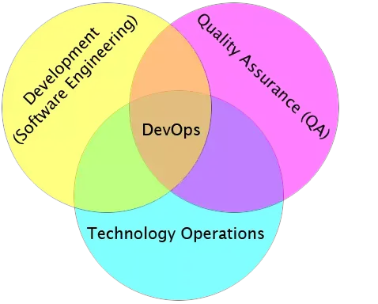
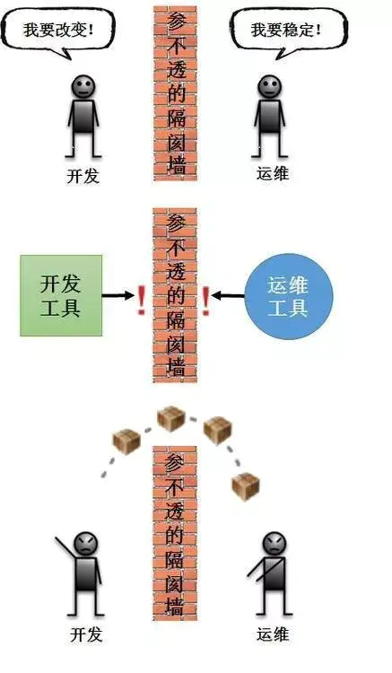
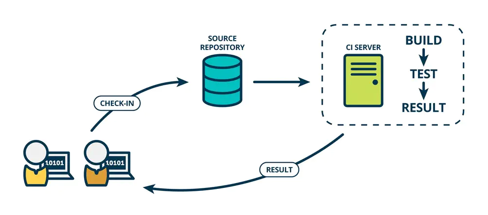
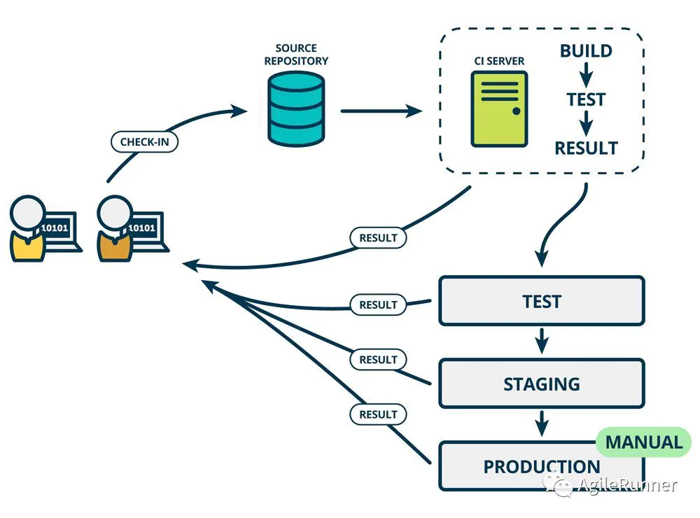
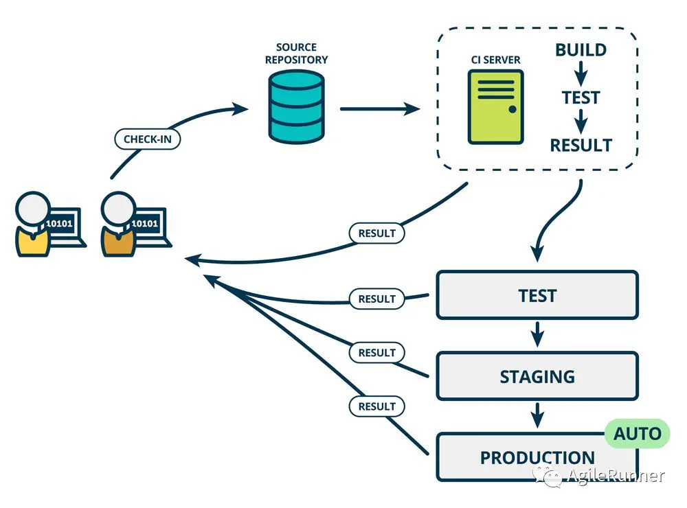
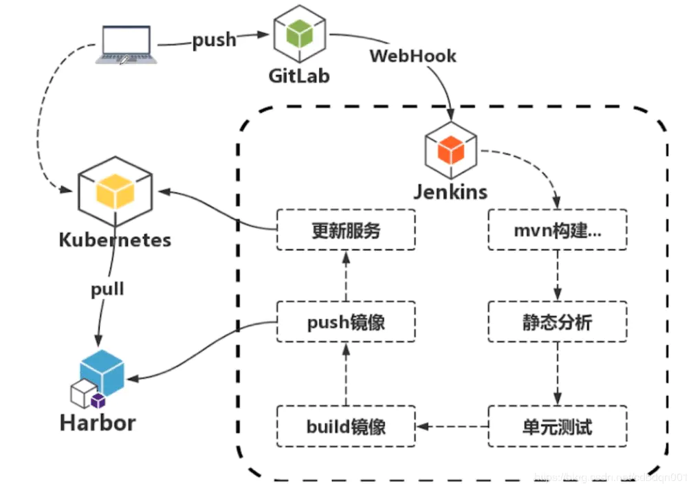

1. DevOps简介
DevOps 就是开发（Development）、测试（QA）、运维（Operations）这三个领域的合并。

为什么要合并这三个领域？主要是开发和运维的脱节。

DevOps是一种思想、一组最佳实践、以及一种文化。DevOps落地实施，从组织架构、设计人员、流程、人员分工、人员技能到工具，变化很大，要求很高，完全颠覆了现有的开发运维模式，建设风险很高。

DevOps落地困境包括：

涉及的部门多（开发中心、质量控制部门、生产运行部门）；
流程改造复杂；
责任边界需要重新划分；
自动化是核心问题。
如下图，传统开发和运维之间存在一堵墙，开发人员想改变而运维人员想要稳定。另外，传统开发工具与运维工具也存在一堵墙，并没有打通成为一条工具链。

3. CI/CD
持续集成（Continuous Integration ，CI）

在传统软件开发过程中，集成通常发生在每个人都完成了各自的工作之后。在项目尾声阶段，通常集成还要痛苦的花费数周或者数月的时间来完成。持续集成是一个将集成提前至开发周期的早期阶段的实践方式，让构建、测试和集成代码更经常反复地发生。

开发人员通常使用一种叫做CI Server 的工具来做构建和集成。持续集成要求史蒂夫和安妮能够自测代码。分别测试各自代码来保证它能够正常工作，这些测试通常被称为单元测试（Unit tests）。

代码集成以后，当所有的单元测试通过，史蒂夫和安妮就得到了一个绿色构建（green build）。这表明他们已经成功地集成在一起，代码正按照测试预期地在工作。然而，尽管集成代码能够成功地一起工作了，它仍未为生产做好准备，因为它没有在类似生产的环境中测试和工作。在下面持续交付部分你可以了解到持续集成后面发生了什么。

持续交付（Continuous Delivery）

Continuous Delivery (CD) 持续交付是持续集成的延伸，将集成后的代码部署到类生产环境，确保可以以可持续的方式快速向客户发布新的更改。如果代码没有问题，可以继续手工部署到生产环境中。

持续部署（Continuous Deploy）

如果真的想获得持续交付的好处，应该尽早部署到生产环境，以确保可以小批次发布，在发生问题时可以轻松排除故障。于是有了持续部署。

我们通常将这个在不同环境发布和测试的过程叫做部署流水线

持续部署是在持续交付的基础上，把部署到生产环境的过程自动化。

2. DevOps 与 CICD的区别及联系

DevOps是CICD思想的延伸，CICD是DevOps的基础核心，如果没有CICD自动化的工具和流程，DevOps是没有意义的。

当然如何理解DevOps和CICD，可能有争议，我认为只要在团队内部达成一致就可以了

3. Docker、Kubernetes的 CICD实现思路

Jenkins是一个比较流行的持续集成工具
GitLab是存储镜像的镜像仓库

由客户端将代码push推送到git仓库，gitlab上配置了一个webHook的东西可以触发Jenkins的构建。进入到Jenkins虚线范围内，它所做的事情非常多，从mvn构建代码，对代码进行静态分析，做单元测试，测试通过之后就可以build镜像，镜像构建成功后就把镜像push推送到Harbor镜像仓库中，镜像push推送到镜像仓库后，我们就可以调用kubernetes集群的restAPI更新服务，而后kubernetes接收到了更新的指令，从Harbor镜像仓库pull拉取镜像，从而完成服务的更新与重启，最后我们从客户端来访问kubernetes集群的服务

1.开发从镜像库里获取基础镜像，对应用进行容器化开发；

2.开发提交代码到Gitlab（在Kubernetes中实现Gitlab服务，并通过持久化存储保存用户数据）；

3.Gitlab收到代码提交请求后通过webhook触发Jenkins master

4.Jenkins master收到请求后在slave节点中对源码进行打包；

5.在源码打包完成后根据流水线，从Gitlab中获取dockerfile，在slave节点中生成docker images；

6.Docker镜像生成之后上传到Docker 私有仓库harbor；

8.通过Jenkins流水线在Kubernetes测试环境拉取镜像，部署应用；

9.测试成功之后，通过Jenkins流水线在Kubernetes生产环境进行应用的部署上线。

其中build镜像过程还可以细分为两部：

构建可执行的程序包（Java为tar包）
将tar包导入基础镜像（Java程序的基础镜像可以理解为一个包含了JDK的linux系统），其实现可以通过dockerfile导入tar包到基础镜像从而构建为应用镜像，也可以通过openshift的s2i启动一个名为build的pod将tar包的二进制流导入基础镜像然后通过docker commit构建为应用镜像

## 团队部署流程

- dev分支push
1. push dev分支代码
2. gitlab → webhook
3. 触发jenkins
5. 静态扫描
6. 单元测试
7. sonar 成功就继续 失败就取消
8. go build(打包go程序二进制)
9. docker build(具备go环境的基础镜像 + 二进制)
10. push docker 到仓库
11. dev 环境 k8s部署

- dev合并到test
1. merge dev分支到test
2. 通过gitlab的web hook通知jenkins
3. jenkins静态扫描
4. 单元测试
5. sonar
6. go build(打包go程序二进制)
7. docker build(具备go环境的基础镜像 + 二进制)
8. push docker 到仓库
9. test 环境 k8s部署
10. test环境冒烟自动化测试(失败回滚)
