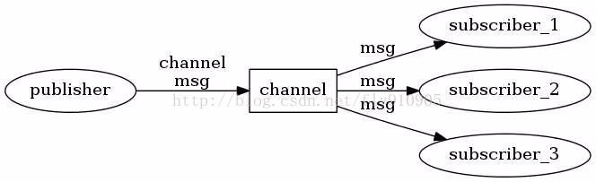

## 1. 简介:
redis 默认端口: 6379

### 1.1 特性
Redis是现在最受欢迎的NoSQL数据库之一，Redis是一个使用ANSI C编写的开源、包含多种数据结构、支持网络、基于内存、可选持久性的键值对存储数据库，其具备如下特性：

- 基于内存运行，性能高效(读11万次/s 写8.1万次/s)
- 支持分布式，理论上可以无限扩展
- key-value存储系统
- 开源的使用ANSI C语言编写、遵守BSD协议、支持网络、可基于内存亦可持久化的日志型、Key-Value数据库，并提供多种语言的API
- 相比于其他数据库类型，Redis具备的特点是：
    - C/S通讯模型(发布订阅)
    - 单进程单线程模型
    - 丰富的数据类型
    - 操作具有原子性(事物)
    - 持久化
    - 高并发读写
    - 支持lua脚本

### 1.2 应用场景
缓存系统（“热点”数据：高频读、低频写）、计数器、消息队列系统、排行榜、社交网络和实时系统

### 1.3 安装
docker:

`docker run -d -p 6379:6379 --restart always -v /root/docker/redis/conf/redis.conf:/etc/redis/redis.conf -v /root/docker/redis/data:/data --name myredis redis redis-server /etc/redis/redis.conf --appendonly yes`
- `--appendonly yes`: 开启数据持久化

## 2. 常规命令:
- 启动redis: `redis-server`
- 进入redis: `redis-cli`:
- 远程访问: `redis-cli -h host -p port -a password`
- 选择数据库(默认为0): `select num`
- 获得redis所有的配置: `CONFIG GET *`
[具体配置操作](https://www.runoob.com/redis/redis-conf.html)

## 3. 数据类型&命令
Redis支持五种数据类型：string（字符串），hash（哈希），list（列表），set（集合）及zset(sorted set：有序集合)

|类型	|简介	|特性	|场景|
|-|-|-|-|
|String(字符串)|二进制安全|可以包含任何数据,比如jpg图片或者序列化的对象,一个键最大能存储512M|---|
|Hash(字典)|键值对集合,即编程语言中的Map类型|适合存储对象,并且可以像数据库中update一个属性一样只修改某一项属性值(Memcached中需要取出整个字符串反序列化成对象修改完再序列化存回去)	|存储、读取、修改用户属性|
List(列表)|	链表(双向链表)|	增删快,提供了操作某一段元素的API	|1,最新消息排行等功能(比如朋友圈的时间线) 2,消息队列|
|Set(集合)	|哈希表实现,元素不重复|	1、添加、删除,查找的复杂度都是O(1) 2、为集合提供了求交集、并集、差集等操作	|1、共同好友 2、利用唯一性,统计访问网站的所有独立ip 3、好友推荐时,根据tag求交集,大于某个阈值就可以推荐|
|Sorted Set(有序集合)	|将Set中的元素增加一个权重参数score,元素按score有序排列	|数据插入集合时,已经进行天然排序|	1、排行榜 2、带权重的消息队列|

### 3.1 key
- `keys pattern`: 列出匹配数据(支持正则表达式)
- `DEL key_name`: 删除数据
- `type key_name`: 获取数据类型
- `exists key_name`: 检查key是否存在
- `expire key_name time_sec`: 设置过期时间(秒)
- `move key_name db_index`: 移动key到指定数据库
- `persist key_name`: 移除过期时间
- `ttl key_name`: 查看过期倒计时
- `randomkey`: 随机返回一个key
- `rename old_key new_key`: 修改key名,如果newkey已存在则覆盖
- `renamenx old_key new_key`: 修改key名,如果newkey已存在则失败

### 3.2 String（字符串）
1. string 类型的值最大能存储 512MB

- `set key_name value`: 写入键值对
- `get key_name`: 获取对应值
- `mset k1 v1 k2 v2 ...`: 批量写入键值对
- `mget k1 k2 ...`: 批量读取键值对
- `incr key_name`: 自增1
- `incrby key_name num`: 自增num
- `decr key_name`: 自减1
- `decrby key_name num`: 自减num

### 3.3 Hash（哈希）
1. 每个 hash 可以存储 2^32-1 键值对（40多亿）

- `hset key_name field value`: 写入hash表(单个)
- `hmset key_name field1 value1 field2 value2 ...`: 写入hash表(多个)
- `hget key_name field`: 获取key_name中指定的field的值
- `hmget key_name field1 field2 ...`: 获取多个指定字段的值
- `hgetall key_name`: 获取key_name中所有的字段和值(奇数是字段,偶数是值)
- `hkeys key_name`: 获取key_name中所有的字段
- `hlen key_name`: 获取key_name中字段数量
- `hdel key_name field1 field2`: 删除指定field(可以多个)
- `hexists key_name field`: 查看key_name中field是否存在

### 3.4 List（列表）
1. 列表最多可存储 2^32-1 元素 (4294967295, 每个列表可存储40多亿)

- `lpush list_name value1 value2 ...`: 往头部(左边)添加多个元素
- `rpush list_name v1 v2 ...`: 往尾部(右边)添加多个元素
- `lrange list_name start_index end_index`: 遍历start索引到end索引的元素，-1为最后
- `lset list_name index value`: 插入元素到指定索引位置
- `lindex list_name index`: 通过索引获取list_name中的元素
- `llen list_name`: 获取列表长度
- `lpop list_name`: 移除列表头部第一个元素，并返回
- `rpop list_name`: 移除列表尾部第一个元素，并返回


### 3.5 Set（集合)
1. Set 是 string 类型的无序集合
2. 集合是通过哈希表实现的，所以添加，删除，查找的复杂度都是 O(1)
3. 集合中最大的成员数为 2^32-1 (4294967295, 每个集合可存储40多亿个成员)

- `sadd set_name value1 value2 ...`: 添加多个元素到set_name集合中,成功几个返回几个
- `smembers set_name`: 取set_name所有的值
- `sdiff set_name1 set_name2 ...`: 返回第一个集合中与其他集合的差异
- `sinter set_name set_name2 ...`: 返回交集
- `sunion set_name set_name2 ...`: 返回并集
- `sismember set_name value`: 查看set_name中value是否存在


### 3.6 zset(sorted set：有序集合)

1. zset 和 set 一样也是string类型元素的集合,且不允许重复的成员。
2. 不同的是每个元素都会关联一个double类型的分数。redis正是通过分数来为集合中的成员进行从小到大的排序。
3. zset的成员是唯一的,但分数(score)却可以重复。
4. 集合中最大的成员数为 232 - 1 (4294967295, 每个集合可存储40多亿个成员)。

- `zadd zset_name score1 value1 score2 value2 ...`: 添加多个元素到集合，若在集合中存在则更新对应score
- `zrangebyscore zset_name min max`: 查看zset_name中min到max区间内(含)的值
- `zcard zset_name`: 返回zset_name中的成员数
- `zcount zset_name min max`: 返回min到max(含)分数区间内的成员
- `zrank zset_name value`: 返回索引
- `zscore zset_name value`: 返回score

### 3.7 事物
redis的事物非原子性,只可以理解为批量执行的脚本.执行中发生错误并不会回滚已执行命令,也不会停止后续命令执行.

- multi开头
- exec结尾

```redis
multi
set key_name value
get key_name
# do something
exec
```

### 3.8 批量删除
`redis-cli -n 3 keys *PCSYS::PC::ALLAVAIABLE* | xargs redis-cli -n 3 del`

先查出key 然后通过管道产地给xargs进行批量删除
- -n 为选择数据库

## 4. 过期策略
### 4.1 缓存过期 && 缓存淘汰
为了使内存中的数据有最大的新鲜度,需要给给缓存内容设置一个超时时间

redis默认的过期策略: 惰性删除 + 定期删除

#### 4.1.1 定期删除(随机选择)
- 概述: 每隔一段时间执行一次删除操作，并通过限制删除操作执行的时长和频率，来减少删除操作对cpu的影响。另一方面定时删除也有效的减少了因惰性删除带来的内存浪费。
- 实现: Redis默认每隔100ms随机抽取一些设置了过期时间的key，检查是否过期，如果过期就删除。
- 缺点: 可能导致已经过期的key未被随机到还滞留在内存中，占用着内存空间。

#### 4.1.2 惰性删除
- 概述: 指某个键值过期后，此键值不会马上被删除，而是等到下次被使用的时候，才会被检查到过期，此时才能得到删除
- 用于解决定期删除的缺点

#### 4.1.3 内存淘汰策略
- 缘由: 如果key即没有被随机到也没有再被请求过,那么还是存在浪费内存的可能性
- 策略:
    - noeviction：返回错误，不会删除任何键值
    - allkeys-lru：使用LRU算法删除最近最少使用的键值
    - volatile-lru：使用LRU算法从设置了过期时间的键集合中删除最近最少使用的键值
    - allkeys-random：从所有key随机删除
    - volatile-random：从设置了过期时间的键的集合中随机删除
    - volatile-ttl：从设置了过期时间的键中删除剩余时间最短的键
    - volatile-lfu：从配置了过期时间的键中删除使用频率最少的键
    - allkeys-lfu：从所有键中删除使用频率最少的键

#### 4.1.4 立即删除(耗费性能)
如果Redis中有大量的key，并且都设置了过期时间，如果全量检查的话，将会耗费大量的CPU时间，这样有损Redis对外的服务性能。


## 5. 解决方案


### 5.1 缓存穿透
- 概念: 缓存穿透是指缓存和数据库中都没有的数据，而用户不断发起请求，如发起为id为“-1”的数据或id为特别大不存在的数据。这时的用户很可能是攻击者，攻击会导致数据库压力过大。

- 解决方案:
1. 布隆过滤器: 从超大的数据集中快速告诉你查找的数据存不存在
    - 缺点: 它告诉你存在的话不能全信，其实有可能是不存在的，不过它要是告诉你不存在的话，那就一定不存在
2. 接口层增加校验
3. 从缓存取不到的数据，在数据库中也没有取到，这时也可以将key-value对写为key-null，缓存有效时间可以设置短点，如30秒（设置太长会导致正常情况也没法使用）


### 5.2 缓存击穿
- 概念:  缓存击穿是指缓存中没有但数据库中有的数据（一般是缓存时间到期），这时由于并发用户特别多，同时读缓存没读到数据，又同时去数据库去取数据，引起数据库压力瞬间增大，造成过大压力

- 解决方案:
1. 热点数据永不过期
2. 键值的过期时间随机
3. 加互斥锁

### 5.3 缓存雪崩
- 概念: 缓存雪崩是指缓存中数据大批量到过期时间，而查询数据量巨大，引起数据库压力过大甚至down机。和缓存击穿不同的是，缓存击穿指并发查同一条数据，缓存雪崩是不同数据都过期了，很多数据都查不到从而查数据库。

- 解决方案:
1. 热点数据永不过期
2. 键值的过期时间随机
3. 如果分布式部署,将热点数据均匀分布在不同数据库中

## 6. 发布订阅


- 订阅消息：`SUBSCRIBE channel`
- 订阅消息(支持简单正则表达式): `PSUBSCRIBE channel`
- 发布消息：`PUBLISH channel messages`

**Example:**

发布端：
```redis
127.0.0.1:6379> PUBLISH aabcb das
(integer) 1
```

订阅端：
```redis
127.0.0.1:6379> PSUBSCRIBE a[abc|dfg]*b
Reading messages... (press Ctrl-C to quit)
1) "psubscribe"
2) "a[abc|dfg]*b"
3) (integer) 1
1) "pmessage"
2) "a[abc|dfg]*b"
3) "aabcb"
4) "das"
```