## 1. SSL/TLS 握手过程详解
### 1. 参考资料
- 通识介绍: https://www.bilibili.com/read/cv1003133/ 
- 官方文档: https://tools.ietf.org/html/rfc5246#section-8.1
### 2. TLS/SSL协议工作原理
TLS/SSL的功能实现主要依赖于三类基本算法：散列函数 Hash、对称加密和非对称加密
- 利用非对称加密实现身份认证和密钥协商
- 对称加密算法采用协商的密钥对数据加密
- 基于散列函数验证信息的完整性。
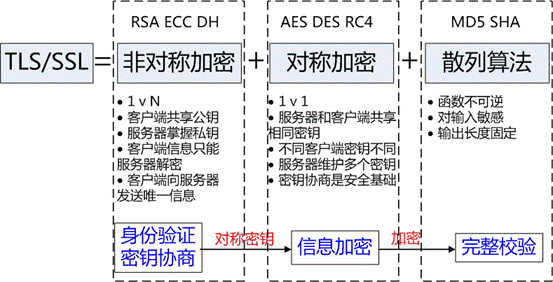


- 散列函数Hash

常见的有 MD5、SHA1、SHA256，该类函数特点是函数单向不可逆、对输入非常敏感、输出长度固定，针对数据的任何修改都会改变散列函数的结果，用于防止信息篡改并验证数据的完整性;

在信息传输过程中，散列函数不能单独实现信息防篡改，因为明文传输，中间人可以修改信息之后重新计算信息摘要，因此需要对传输的信息以及信息摘要进行加密;

- 对称加密

常见的有 AES-CBC、DES、3DES、AES-GCM等，相同的密钥可以用于信息的加密和解密，掌握密钥才能获取信息，能够防止信息窃听，通信方式是1对1;

对称加密的优势是信息传输1对1，需要共享相同的密码，密码的安全是保证信息安全的基础，服务器和 N 个客户端通信，需要维持 N 个密码记录，且缺少修改密码的机制;

- 非对称加密

即常见的 RSA 算法，还包括 ECC、DH 等算法，算法特点是，密钥成对出现，一般称为公钥(公开)和私钥(保密)，公钥加密的信息只能私钥解开，私钥加密的信息只能公钥解开。因此掌握公钥的不同客户端之间不能互相解密信息，只能和掌握私钥的服务器进行加密通信，服务器可以实现1对多的通信，客户端也可以用来验证掌握私钥的服务器身份。

非对称加密的特点是信息传输1对多，服务器只需要维持一个私钥就能够和多个客户端进行加密通信，但服务器发出的信息能够被所有的客户端解密，且该算法的计算复杂，加密速度慢。

结合三类算法的特点，TLS的基本工作方式是，客户端使用非对称加密与服务器进行通信，实现身份验证并协商对称加密使用的密钥，然后对称加密算法采用协商密钥对信息以及信息摘要进行加密通信，不同的节点之间采用的对称密钥不同，从而可以保证信息只能通信双方获取。

### 3. CA(Certificate Authority)认证及客户端验证流程
CA负责核实公钥的拥有者的信息，并颁发认证"证书"，同时能够为使用者提供证书验证服务，即PKI体系(PKI基础知识)。

基本的原理为，CA负责审核信息，然后对关键信息利用私钥进行"签名"，公开对应的公钥，客户端可以利用公钥验证签名。CA也可以吊销已经签发的证书.

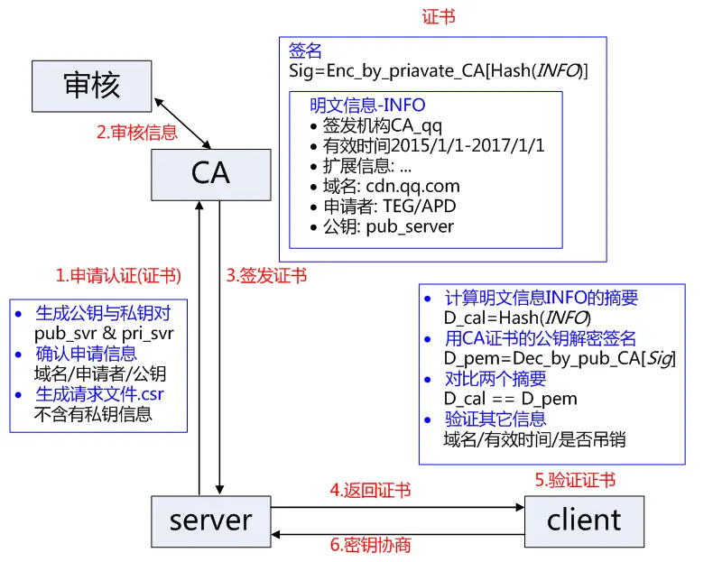

1. 服务方S向第三方机构CA提交公钥、组织信息、个人信息(域名)等信息并申请认证;
2. CA通过线上、线下等多种手段验证申请者提供信息的真实性，如组织是否存在、企业是否合法，是否拥有域名的所有权等;
3. 如信息审核通过，CA会向申请者签发认证文件-证书。
    - 证书包含以下信息：申请者公钥、申请者的组织信息和个人信息、签发机构 CA的信息、有效时间、证书序列号等信息的明文，同时包含一个签名;
    - 签名的产生算法：首先，使用散列函数计算公开的明文信息的信息摘要，然后，采用 CA的私钥对信息摘要进行加密，密文即签名;
4. 客户端 C 向服务器 S 发出请求时，S 返回证书文件;
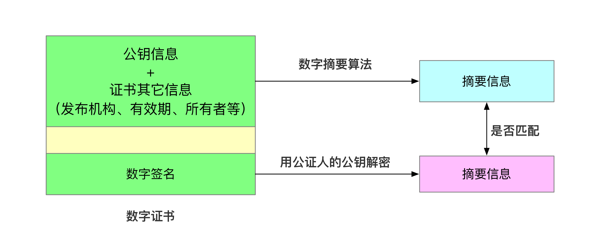
5. 完整性校验:客户端 C 读取证书中的相关的明文信息，采用相同的散列函数计算得到信息摘要，然后，利用对应 CA的公钥解密签名数据，对比证书的信息摘要，如果一致，则可以确认证书的合法性，即公钥合法;
6. 客户端然后验证证书相关的域名信息、有效时间等信息;
7. 客户端内置有信任CA的证书信息(包含公钥)，如果CA不被信任，则找不到对应 CA的证书，证书也会被判定非法。

- 在这个过程注意几点：
1. 申请证书不需要提供私钥，确保私钥永远只能服务器掌握;
2. 证书的合法性仍然依赖于非对称加密算法，证书主要是增加了服务器信息以及签名;
3. 内置 CA 对应的证书称为根证书，颁发者和使用者相同，自己为自己签名，即自签名证书（为什么说"部署自签SSL证书非常不安全"）
4. 证书=公钥+申请者与颁发者信息+签名;

### 4. ssl/tls握手过程(RSA加密版)(DH算法略微有点不同)
https://blog.csdn.net/sarafina527/article/details/89333536

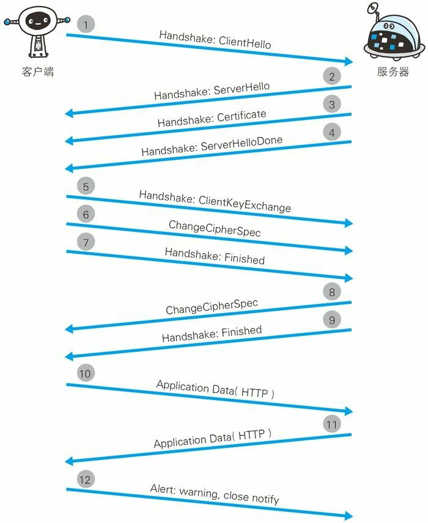


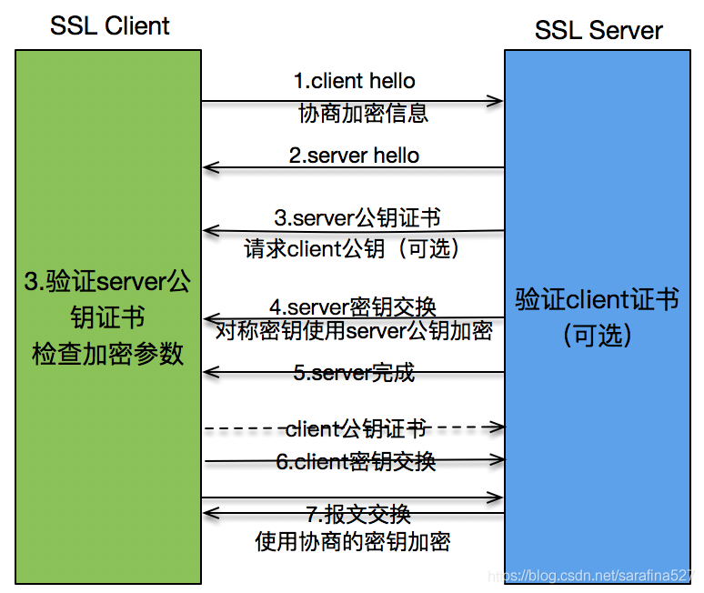

1. 第1次握手
- Client Hello: 包含了一个客户端生成的随机数 Random1、客户端支持的加密套件（Support Ciphers）和 SSL Version 等信息
2. 第2次握手
- Server Hello: 消息会从 Client Hello 传过来的 Support Ciphers 里确定一份加密套件，这个套件决定了后续加密和生成摘要时具体使用哪些算法，另外还会生成一份随机数 Random2
- Certificate: 服务端将自己的证书下发给客户端，让客户端验证自己的身份，客户端验证通过后取出证书中的公钥(详细流程看上面)
- Server Hello Done: 通知客户端 Server Hello 过程结束。
3. 第3次握手
- Certificate Verify: 客户端收到服务端传来的证书后，先从 CA 验证该证书的合法性，验证通过后取出证书中的服务端公钥，再生成一个随机数 Random3(PreMaster Key)，再用服务端公钥进行非对称加密 
- Client Key Exchange: 将这个 PreMaster Key 传给服务端
- Change Cipher Spec(client): 该报文提示服务器,在此报文之后的通信会采用 Pre-master secret 密钥加密
- Finished(client): 客户端发送 Finished 报文。该报文包含连接至今全部报文的整体校验值。这次握手协商是否能够成功,要以服务器是否能够正确解密该报文作为判定标准
4. 第4次握手
- Change Cipher Spec(server): 通知客户端后面再发送的消息都会使用加密，也是一条事件消息
- Finished(server): 服务端也会将握手过程的消息生成摘要再用秘钥加密，这是服务端发出的第一条加密消息。客户端接收后会用秘钥解密(PreMaster Key)，能解出来说明协商的秘钥是一致的。
- 之后应用层便用master-secret进行加密,再通过tcp进行可靠传输
#### 4.2 master-secret
TLS 1.0 至 1.2版本适用; 1.3版本已采用新加密方式

master_secret = PRF(pre_master_secret, "master secret", ClientHello.random + ServerHello.random)

48字节
#### 4.3 握手过程优化
如果每次重连都要重新握手还是比较耗时的，所以可以对握手过程进行优化。从下图里我们看到 Client Hello 消息里还附带了上一次的 Session ID，服务端接收到这个 Session ID 后如果能复用就不再进行后续的握手过程。

### 5. https性能
#### 5.1 HTTPS性能损耗

前文讨论了HTTPS原理与优势：身份验证、信息加密与完整性校验等，且未对TCP和HTTP协议做任何修改。但通过增加新协议以实现更安全的通信必然需要付出代价，HTTPS协议的性能损耗主要体现如下：

1. 增加延时

分析前面的握手过程，一次完整的握手至少需要两端依次来回两次通信，至少增加延时2* RTT，利用会话缓存从而复用连接，延时也至少1* RTT*。

2. 消耗较多的CPU资源

除数据传输之外，HTTPS通信主要包括对对称加解密、非对称加解密(服务器主要采用私钥解密数据);压测 TS8 机型的单核 CPU：对称加密算法AES-CBC-256 吞吐量 600Mbps，非对称 RSA 私钥解密200次/s。不考虑其它软件层面的开销，10G 网卡为对称加密需要消耗 CPU 约17核，24核CPU最多接入 HTTPS 连接 4800;

静态节点当前10G 网卡的 TS8 机型的 HTTP 单机接入能力约为10w/s，如果将所有的HTTP连接变为HTTPS连接，则明显RSA的解密最先成为瓶颈。因此，RSA的解密能力是当前困扰HTTPS接入的主要难题。

#### 5.2 HTTPS接入优化

1. CDN接入

HTTPS 增加的延时主要是传输延时 RTT，RTT 的特点是节点越近延时越小，CDN 天然离用户最近，因此选择使用 CDN 作为 HTTPS 接入的入口，将能够极大减少接入延时。CDN 节点通过和业务服务器维持长连接、会话复用和链路质量优化等可控方法，极大减少 HTTPS 带来的延时。

2. 会话缓存

虽然前文提到 HTTPS 即使采用会话缓存也要至少1*RTT的延时，但是至少延时已经减少为原来的一半，明显的延时优化;同时，基于会话缓存建立的 HTTPS 连接不需要服务器使用RSA私钥解密获取 Pre-master 信息，可以省去CPU 的消耗。如果业务访问连接集中，缓存命中率高，则HTTPS的接入能力讲明显提升。当前TRP平台的缓存命中率高峰时期大于30%，10k/s的接入资源实际可以承载13k/的接入，收效非常可观。

3. 硬件加速

为接入服务器安装专用的SSL硬件加速卡，作用类似 GPU，释放 CPU，能够具有更高的 HTTPS 接入能力且不影响业务程序的。测试某硬件加速卡单卡可以提供35k的解密能力，相当于175核 CPU，至少相当于7台24核的服务器，考虑到接入服务器其它程序的开销，一张硬件卡可以实现接近10台服务器的接入能力。

4. 远程解密

本地接入消耗过多的 CPU 资源，浪费了网卡和硬盘等资源，考虑将最消耗 CPU 资源的RSA解密计算任务转移到其它服务器，如此则可以充分发挥服务器的接入能力，充分利用带宽与网卡资源。远程解密服务器可以选择 CPU 负载较低的机器充当，实现机器资源复用，也可以是专门优化的高计算性能的服务器。当前也是 CDN 用于大规模HTTPS接入的解决方案之一。

5. SPDY/HTTP2

前面的方法分别从减少传输延时和单机负载的方法提高 HTTPS 接入性能，但是方法都基于不改变 HTTP 协议的基础上提出的优化方法，SPDY/HTTP2 利用 TLS/SSL 带来的优势，通过修改协议的方法来提升 HTTPS 的性能，提高下载速度等。

### 5. 证书链
服务器证书、中间证书与根证书在一起组合成一条合法的证书链，证书链的验证是自下而上的信任传递的过程。
#### 5.1 二级证书结构存在的优势：

1. 减少根证书结构的管理工作量，可以更高效的进行证书的审核与签发;
2. 根证书一般内置在客户端中，私钥一般离线存储，一旦私钥泄露，则吊销过程非常困难，无法及时补救;
3. 中间证书结构的私钥泄露，则可以快速在线吊销，并重新为用户签发新的证书;
4. 证书链四级以内一般不会对 HTTPS 的性能造成明显影响

#### 5.2 证书验证流程
1. 服务器证书 server.pem 的签发者为中间证书机构 inter，inter 根据证书 inter.pem 验证 server.pem 确实为自己签发的有效证书;
2. 中间证书 inter.pem 的签发 CA 为 root，root 根据证书 root.pem 验证 inter.pem 为自己签发的合法证书;
3. 客户端内置信任 CA 的 root.pem 证书，因此服务器证书 server.pem 的被信任。

## 2. http报文解析过程

1. 从可读的socket中获取用户发送的请求内容，保存到buf中


```http
GET / HTTP/1.1\r\n
Host: localhost:8000\r\n
User-Agent: curl/7.47.0\r\n
Accept: */*\r\n
Content-Length: 16\r\n
Content-Type: application/x-www-form-urlencoed\r\n\r\n
name=123w4234234
```
- 第一行是request-line
- 最后一行是request-body
- 其余的是request-headers
2. 根据第一个\r\n，buf的内容可以分为两个部分:1. line 2. rbuf
3. 要判断line的长度是否超过了gunicorn配置的limit_request_line参数，超出的话，报错(如果有)
4. line中是否包含了代理协议
    - 如果包含了，说明真正的request-line包含在rbuf中，如果对rbuf(把rbuf看成buf，进行上述的处理)进行分割
5. line就是合法的request-line，可以解析出：协议、请求的路径、版本号等
6. 可以解析出各个request header， 作为一个list返回即可
    - [('Host','localhost:8000'),('User-Agent','curl/7.47.0'),等]


## 3. 网络协议
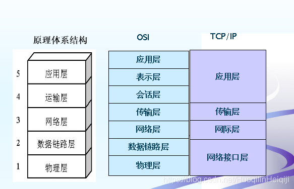
### 1. OSI七层协议
- 优点: 概念清楚 理论完整
- 缺点: 既复杂又不实用


应用层（Application）、表示层（Presentation）、会话层（Session）、运输层（Transport）、网络层（Network）、数据链路层（Data Link）、物理层（Physical）

### 2. TCP/IP四层体系
- 优点: 非常广泛的应用
- 缺点: TCP/IP只有上三层, 网络接口层并无具体内容

应用层、运输层、网际层和网络接口层

### 3. 五层协议(上两个体系中和产物)


应用层、运输层、网络层，数据链路层和物理层

### 4. UDP/TCP(运输层协议)
||UDP|TCP|
|-|-|-|
|是否连接|无连接|面向连接|
|是否可靠|不可靠传输，不使用流量控制和拥塞控制|可靠传输，使用流量控制和拥塞控制|
|连接对象个数|支持一对一，一对多，多对一和多对多交互通信|只能是一对一通信|
|传输方式|面向报文|面向字节流|
|首部开销|首部开销小，仅8字节|首部最小20字节，最大60字节|
|场景|适用于实时应用（IP电话、视频会议、直播等）|适用于要求可靠传输的应用，例如文件传输|


#### 1. TCP报文头部结构

1. 序号：seq序号，占32位，用来标识从TCP源端向目的端发送的字节流，发起方发送数据时对此进行标记。
2. 确认序号：ack序号，占32位，只有ACK标志位为1时，确认序号字段才有效，ack=seq+1。
3. 标志位：共6个，即URG、ACK、PSH、RST、SYN、FIN等，具体含义如下：
- ACK：确认序号有效。
- FIN：释放一个连接。
- PSH：接收方应该尽快将这个报文交给应用层。
- RST：重置连接。
- SYN：发起一个新连接。
- URG：紧急指针（urgent pointer）有效。

## 4. 三次握手&四次挥手


https://blog.csdn.net/ThinkWon/article/details/104903925

### 1. 三次握手
目的: 三次握手的本质是确认通信双方收发数据的能力
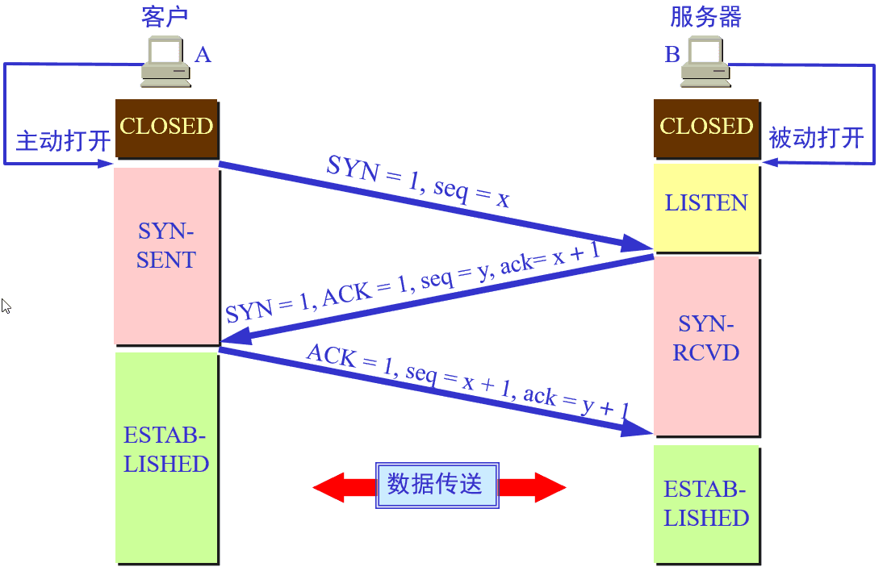

1. 第一次握手：客户端要向服务端发起连接请求，首先客户端随机生成一个起始序列号ISN(比如是100)，那客户端向服务端发送的报文段包含SYN标志位(也就是SYN=1)，序列号seq=100。
2. 第二次握手：服务端收到客户端发过来的报文后，发现SYN=1，知道这是一个连接请求，于是将客户端的起始序列号100存起来，并且随机生成一个服务端的起始序列号(比如是300)。然后给客户端回复一段报文，回复报文包含SYN和ACK标志(也就是SYN=1,ACK=1)、序列号seq=300、确认号ack=101(客户端发过来的序列号+1)。
3. 第三次握手：客户端收到服务端的回复后发现ACK=1并且ack=101,于是知道服务端已经收到了序列号为100的那段报文；同时发现SYN=1，知道了服务端同意了这次连接，于是就将服务端的序列号300给存下来。然后客户端再回复一段报文给服务端，报文包含ACK标志位(ACK=1)、ack=301(服务端序列号+1)、seq=101(第一次握手时发送报文是占据一个序列号的，所以这次seq就从101开始，需要注意的是不携带数据的ACK报文是不占据序列号的，所以后面第一次正式发送数据时seq还是101)。当服务端收到报文后发现ACK=1并且ack=301，就知道客户端收到序列号为300的报文了，就这样客户端和服务端通过TCP建立了连接。


### 2. 四次挥手
目的: 四次挥手的目的是关闭一个连接

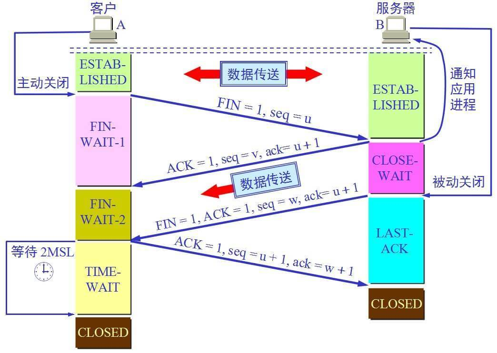

比如客户端初始化的序列号ISA=100，服务端初始化的序列号ISA=300。TCP连接成功后客户端总共发送了1000个字节的数据，服务端在客户端发FIN报文前总共回复了2000个字节的数据。

1. 第一次挥手：当客户端的数据都传输完成后，客户端向服务端发出连接释放报文(当然数据没发完时也可以发送连接释放报文并停止发送数据)，释放连接报文包含FIN标志位(FIN=1)、序列号seq=1101(100+1+1000，其中的1是建立连接时占的一个序列号)。需要注意的是客户端发出FIN报文段后只是不能发数据了，但是还可以正常收数据；另外FIN报文段即使不携带数据也要占据一个序列号。
2. 第二次挥手：服务端收到客户端发的FIN报文后给客户端回复确认报文，确认报文包含ACK标志位(ACK=1)、确认号ack=1102(客户端FIN报文序列号1101+1)、序列号seq=2300(300+2000)。此时服务端处于关闭等待状态，而不是立马给客户端发FIN报文，这个状态还要持续一段时间，因为服务端可能还有数据没发完。
3. 第三次挥手：服务端将最后数据(比如50个字节)发送完毕后就向客户端发出连接释放报文，报文包含FIN和ACK标志位(FIN=1,ACK=1)、确认号和第二次挥手一样ack=1102、序列号seq=2350(2300+50)。
4. 第四次挥手：客户端收到服务端发的FIN报文后，向服务端发出确认报文，确认报文包含ACK标志位(ACK=1)、确认号ack=2351、序列号seq=1102。注意客户端发出确认报文后不是立马释放TCP连接，而是要经过2MSL(最长报文段寿命的2倍时长)后才释放TCP连接。而服务端一旦收到客户端发出的确认报文就会立马释放TCP连接，所以服务端结束TCP连接的时间要比客户端早一些。

### 3. 常见面试题
#### 1. 为什么TCP连接的时候是3次？2次不可以吗？
1. 用于同步seq, 客户端有自己的seq需要服务端ack确认, 服务端也有自己的seq需要客户端ack确认;而服务端确认客户端seq与服务端发送自己的seq合并到第二次握手一起执行
2. 防止失效报文延迟到达引起的错误

因为需要考虑连接时丢包的问题，如果只握手2次，第二次握手时如果服务端发给客户端的确认报文段丢失，此时服务端已经准备好了收发数(可以理解服务端已经连接成功)据，而客户端一直没收到服务端的确认报文，所以客户端就不知道服务端是否已经准备好了(可以理解为客户端未连接成功)，这种情况下客户端不会给服务端发数据，也会忽略服务端发过来的数据。

如果是三次握手，即便发生丢包也不会有问题，比如如果第三次握手客户端发的确认ack报文丢失，服务端在一段时间内没有收到确认ack报文的话就会重新进行第二次握手，也就是服务端会重发SYN报文段，客户端收到重发的报文段后会再次给服务端发送确认ack报文。

#### 2. 为什么TCP连接的时候是3次，关闭的时候却是4次？
因为只有在客户端和服务端都没有数据要发送的时候才能断开TCP。而客户端发出FIN报文时只能保证客户端没有数据发了，服务端还有没有数据发客户端是不知道的。而服务端收到客户端的FIN报文后只能先回复客户端一个确认报文来告诉客户端我服务端已经收到你的FIN报文了，但我服务端还有一些数据没发完，等这些数据发完了服务端才能给客户端发FIN报文(所以不能一次性将确认报文和FIN报文发给客户端，就是这里多出来了一次)。

#### 3. 为什么客户端发出第四次挥手的确认报文后要等2MSL的时间才能释放TCP连接？
这里同样是要考虑丢包的问题，如果第四次挥手的报文丢失，服务端没收到确认ack报文就会重发第三次挥手的报文，这样报文一去一回最长时间就是2MSL，所以需要等这么长时间来确认服务端确实已经收到了。

#### 4. 如果已经建立了连接，但是客户端突然出现故障了怎么办？
TCP设有一个保活计时器，客户端如果出现故障，服务器不能一直等下去，白白浪费资源。服务器每收到一次客户端的请求后都会重新复位这个计时器，时间通常是设置为2小时，若两小时还没有收到客户端的任何数据，服务器就会发送一个探测报文段，以后每隔75秒钟发送一次。若一连发送10个探测报文仍然没反应，服务器就认为客户端出了故障，接着就关闭连接。

## 5. GET和POST
### 1. 用法
- GET：从服务器上获取数据，也就是所谓的查，仅仅是获取服务器资源，不进行修改
- POST：向服务器提交数据，这就涉及到了数据的更新，也就是更改服务器的数据

### 2. 区别
1. Get是不安全的，因为在传输过程，数据被放在请求的URL中；Post的所有操作对用户来说都是不可见的。 但是这种做法也不时绝对的，大部分人的做法也是按照上面的说法来的，但是也可以在get请求加上 request body，给 post请求带上 URL 参数。

2. Get请求提交的url中的数据最多只能是2048字节，这个限制是浏览器或者服务器给添加的，http协议并没有对url长度进行限制，目的是为了保证服务器和浏览器能够正常运行，防止有人恶意发送请求。Post请求则没有大小限制。

3. Get限制Form表单的数据集的值必须为ASCII字符；而Post支持整个ISO10646字符集。

4. Get执行效率却比Post方法好。Get是form提交的默认方法。

5. GET产生一个TCP数据包；POST产生两个TCP数据包。
- 对于GET方式的请求，浏览器会把http header和data一并发送出去，服务器响应200（返回数据）；
- 而对于POST，浏览器先发送header，服务器响应100 continue，浏览器再发送data，服务器响应200 ok（返回数据）。

## 6. HTTP版本
### 1. HTTP2
HTTP2 显著提高了网页的性能。

1. 多路复用
- 即连接共享，即每一个request都是是用作连接共享机制的。一个request对应一个id，这样一个连接上可以有多个request，每个连接的request可以随机的混杂在一起，接收方可以根据request的 id将request再归属到各自不同的服务端请求里面。
- 缘由: 在 HTTP1 中浏览器限制了同一个域名下的请求数量（Chrome 下一般是六个），当在请求很多资源的时候，由于队头阻塞当浏览器达到最大请求数量时，剩余的资源需等待当前的六个请求完成后才能发起请求。
- 原理: HTTP2 中引入了多路复用的技术，这个技术可以只通过一个 TCP 连接就可以传输所有的请求数据。多路复用可以绕过浏览器限制同一个域名下的请求数量的问题，进而提高了网页的性能。
2. 新的二进制格式
- HTTP1.x的解析是基于文本。基于文本协议的格式解析存在天然缺陷，文本的表现形式有多样性，要做到健壮性考虑的场景必然很多，二进制则不同，只认0和1的组合。基于这种考虑HTTP2.0的协议解析决定采用二进制格式，实现方便且健壮
3. header压缩
- HTTP2.0使用encoder来减少需要传输的header大小，通讯双方各自cache一份header fields表，既避免了重复header的传输，又减小了需要传输的大小
4. 服务端推送

### 2. HTTP1.1

1. 缓存处理，在HTTP1.0中主要使用header里的If-Modified-Since,Expires来做为缓存判断的标准，HTTP1.1则引入了更多的缓存控制策略例如Entity tag，If-Unmodified-Since, If-Match, If-None-Match等更多可供选择的缓存头来控制缓存策略。
2. 带宽优化及网络连接的使用，HTTP1.0中，存在一些浪费带宽的现象，例如客户端只是需要某个对象的一部分，而服务器却将整个对象送过来了，并且不支持断点续传功能，HTTP1.1则在请求头引入了range头域，它允许只请求资源的某个部分，即返回码是206（Partial Content），这样就方便了开发者自由的选择以便于充分利用带宽和连接。
3. 错误通知的管理，在HTTP1.1中新增了24个错误状态响应码，如409（Conflict）表示请求的资源与资源的当前状态发生冲突；410（Gone）表示服务器上的某个资源被永久性的删除。
4. Host头处理，在HTTP1.0中认为每台服务器都绑定一个唯一的IP地址，因此，请求消息中的URL并没有传递主机名（hostname）。但随着虚拟主机技术的发展，在一台物理服务器上可以存在多个虚拟主机（Multi-homed Web Servers），并且它们共享一个IP地址。HTTP1.1的请求消息和响应消息都应支持Host头域，且请求消息中如果没有Host头域会报告一个错误（400 Bad Request）。
5. 长连接，HTTP 1.1支持长连接（PersistentConnection）和请求的流水线（Pipelining）处理，在一个TCP连接上可以传送多个HTTP请求和响应，减少了建立和关闭连接的消耗和延迟，在HTTP1.1中默认开启Connection： keep-alive，一定程度上弥补了HTTP1.0每次请求都要创建连接的缺点。

## 7. Session、Cookie和Token的主要区别

HTTP协议本身是无状态的。什么是无状态呢，即服务器无法判断用户身份。

### 1. cookie

cookie是由Web服务器保存在用户浏览器上的小文件（key-value格式），包含用户相关的信息。客户端向服务器发起请求，如果服务器需要记录该用户状态，就使用response向客户端浏览器颁发一个Cookie。客户端浏览器会把Cookie保存起来。当浏览器再请求该网站时，浏览器把请求的网址连同该Cookie一同提交给服务器。服务器检查该Cookie，以此来辨认用户身份。

### 2. session

session是依赖Cookie实现的。session是服务器端对象

session 是浏览器和服务器会话过程中，服务器分配的一块储存空间。服务器默认为浏览器在cookie中设置 sessionid，浏览器在向服务器请求过程中传输 cookie 包含 sessionid ，服务器根据 sessionid 获取出会话中存储的信息，然后确定会话的身份信息。

### 3. cookie与session区别

1. 存储位置与安全性：cookie数据存放在客户端上，安全性较差，session数据放在服务器上，安全性相对更高；
2. 存储空间：单个cookie保存的数据不能超过4K，很多浏览器都限制一个站点最多保存20个cookie，session无此限制
3. 占用服务器资源：session一定时间内保存在服务器上，当访问增多，占用服务器性能，考虑到服务器性能方面，应当使用cookie。

### 4. Token

1. Token的引入：Token是在客户端频繁向服务端请求数据，服务端频繁的去数据库查询用户名和密码并进行对比，判断用户名和密码正确与否，并作出相应提示，在这样的背景下，Token便应运而生。

2. Token的定义：Token是服务端生成的一串字符串，以作客户端进行请求的一个令牌，当第一次登录后，服务器生成一个Token便将此Token返回给客户端，以后客户端只需带上这个Token前来请求数据即可，无需再次带上用户名和密码。

3. 使用Token的目的：Token的目的是为了减轻服务器的压力，减少频繁的查询数据库，使服务器更加健壮。

Token 是在服务端产生的。如果前端使用用户名/密码向服务端请求认证，服务端认证成功，那么在服务端会返回 Token 给前端。前端可以在每次请求的时候带上 Token 证明自己的合法地位

### 5. session与token区别

1. session机制存在服务器压力增大，CSRF跨站伪造请求攻击，扩展性不强等问题；
2. session存储在服务器端，token存储在客户端
3. token提供认证和授权功能，作为身份认证，token安全性比session好；
4. session这种会话存储方式方式只适用于客户端代码和服务端代码运行在同一台服务器上，token适用于项目级的前后端分离（前后端代码运行在不同的服务器下）

## 8. http 知识点&面试题:
整理收集了相关面试题,以题待学.

1. 说一下什么是Http协议

- 是对客户端和服务器端之间数据传输的格式规范，格式简称为“超文本传输协议”。

2. 什么是Http协议无状态协议?怎么解决Http协议无状态协议?

- 无状态协议对于事务处理没有记忆能力。缺少状态意味着如果后续处理需要前面的信息
- 无状态协议解决办法： 通过 1. Cookie 2.通过Session会话保存。

3. 说一下Http协议中302状态

- http协议中，返回状态码302表示重定向。这种情况下，服务器返回的头部信息中会包含一个 Location字段，内容是重定向到的url

4. Http协议由什么组成?


```http
GET / HTTP/1.1\r\n
Host: localhost:8000\r\n
User-Agent: curl/7.47.0\r\n
Accept: */*\r\n
Content-Length: 16\r\n
Content-Type: application/x-www-form-urlencoed\r\n\r\n
name=123w4234234
```
- 请求报文包括三部分:

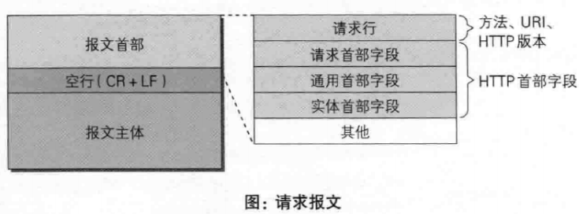

1. 请求行:包含请求方法,URI,HTTP版本协议
2. 请求首部字段
3. 请求内容实体
4. 空行(\r\n)

- 响应报文包含三部分:

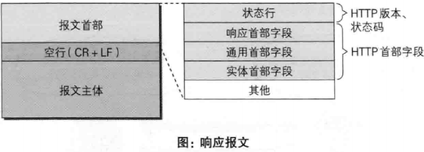

1. 状态行:包含HTTP版本,状态码,状态码原因短语
2. HTTP首部字段(消息报头)
3. 空行(\r\n)
4. 响应内容实体


- 通用首部字段（请求报文与响应报文都会使用的首部字段）
    - Date：创建报文时间
    - Connection：连接的管理
    - Cache-Control：缓存的控制
    - Transfer-Encoding：报文主体的传输编码方式

- 请求首部字段（请求报文会使用的首部字段）
    - Host：请求资源所在服务器
    - Accept：可处理的媒体类型
    - Accept-Charset：可接收的字符集
    - Accept-Encoding：可接受的内容编码
    - Accept-Language：可接受的自然语言

- 响应首部字段（响应报文会使用的首部字段）
    - Accept-Ranges：可接受的字节范围
    - Location：令客户端重新定向到的URI
    - Server：HTTP服务器的安装信息

- 实体首部字段（请求报文与响应报文的的实体部分使用的首部字段）
    - Allow：资源可支持的HTTP方法
    - Content-Type：实体主类的类型
    - Content-Encoding：实体主体适用的编码方式
    - Content-Language：实体主体的自然语言
    - Content-Length：实体主体的的字节数
    - Content-Range：实体主体的位置范围，一般用于发出部分请求时使用


5. Http协议中有哪些请求方式?

- GET:用于请求访问已经被URI(统一资源标识符)识别的资源,可以通过URL传参给服务器
- POST:用于传输信息给服务器,主要功能与GET方法类似,但一般推荐使用POST方式
- PUT:传输文件,报文主体中包含文件内容,保存到对应URI位置
- HEAD:获得报文首部,与GET方法类似,只是不返回报文主体,一般用于验证URI是否有效
- DELETE:删除文件,与PUT方法相反,删除对应URI位置的文件
- OPTIONS:查询响应URI支持的HTTP方法

6. Http协议中Http1.0和1.1区别?

    1. 缓存处理 
    2. 带宽优化及网络连接的使用 
    3. 错误通知的管理 
    4. Host头处理(同ip虚拟主机)
    5. 长连接(keep-alive减少客户端频繁的访问服务器)

7. Http协议实现的原理机制

    1. 整个流程步骤:

    

    2. 域名解析过程:

    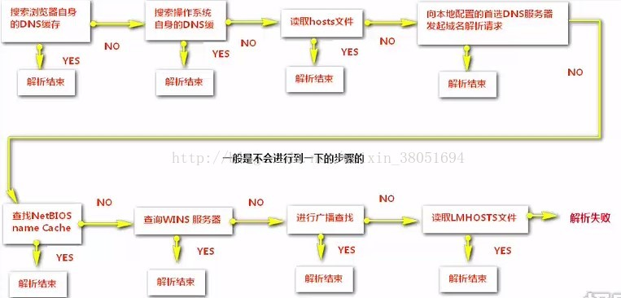

    3. 三次握手过程
    4. 发起Http请求
    5. 响应Http请求并得到HTML代码
    6. 浏览器解析HTML代码
    7. 浏览器对页面进行渲染呈现给用户

8. get与post请求的区别?

- 区别一:get重点在从服务器上获取资源,post重点在向服务器发送数据;
- 区别二:get传输数据是通过URL请求(查询字符串),以filed(字段)=value的形式,置于URL后,并用"?"连接,多个请求数据之间用"&"连接,如`http://127.0.0.1/Test/login.action?name=admin&password=admin`，这个过程用户是可见的
- 区别三:get传输量小,因为受URL长度限制,但效率较低;post可以传输大量数据,所以上传文件时只能用post方式
- 区别四:get是不安全的,因为URL是可见的,可能会泄露私密信息,如密码等;post较get安全

9.常见的Http协议状态

状态码分类：

- 1**: 信息，服务器收到请求，需要请求者继续执行操作
- 2**: 成功，操作被成功接收并处理
- 3**: 重定向，需要进一步的操作以完成请求
- 4**: 客户端错误，请求包含语法错误或无法完成请求
- 5**: 服务器错误，服务器在处理请求的过程中发生了错误

常用状态码：
- 200：请求被正常处理
- 204：请求被受理但没有资源可以返回
- 206：客户端只是请求资源的一部分，服务器只对请求的部分资源执行GET方法，相应报文中通过Content-Range指定范围的资源。
- 301：永久性重定向
- 302：临时重定向
- 303：与302状态码有相似功能，只是它希望客户端在请求一个URI的时候，能通过GET方法重定向到另一个URI上
- 304：发送附带条件的请求时，条件不满足时返回，与重定向无关
- 307：临时重定向，与302类似，只是强制要求使用POST方法
- 400：请求报文语法有误，服务器无法识别
- 401：请求需要认证
- 403：请求的对应资源禁止被访问
- 404：服务器无法找到对应资源
- 500：服务器内部错误
- 503：服务器正忙

10. Http与Https优缺点?
    1. 通信使用明文不加密,内容可能被窃听,也就是被抓包分析
    2. 不验证通信方身份,可能遭到伪装
    3. 无法验证报文完整性,可能被篡改

Https就是Http加上加密处理(一般是SSL安全通信线路)+认证+完整性保护

11. Http与Https的区别：
HTTP 的URL 以http:// 开头，而HTTPS 的URL 以https:// 开头
HTTP 是不安全的，而 HTTPS 是安全的
HTTP 标准端口是80 ，而 HTTPS 的标准端口是443
在OSI 网络模型中，HTTP工作于应用层，而HTTPS 的安全传输机制工作在传输层
HTTP 无法加密，而HTTPS 对传输的数据进行加密
HTTP无需证书，而HTTPS 需要CA机构wosign的颁发的SSL证书

12. HTTPS工作原理
- 一、首先HTTP请求服务端生成证书，客户端对证书的有效期、合法性、域名是否与请求的域名一致、证书的公钥（RSA加密）等进行校验；
- 二、客户端如果校验通过后，就根据证书的公钥的有效， 生成随机数，随机数使用公钥进行加密（RSA加密）；
- 三、消息体产生的后，对它的摘要进行MD5（或者SHA1）算法加密，此时就得到了RSA签名；
- 四、发送给服务端，此时只有服务端（RSA私钥）能解密。
- 五、解密得到的随机数，再用AES加密，作为密钥（此时的密钥只有客户端和服务端知道）。


11. Http优化

- 利用负载均衡优化和加速HTTP应用
- 利用HTTP Cache来优化网站

12. Http协议有哪些特征?

    1. 支持客户/服务器模式；
    2. 简单快速；
    3. 灵活；
    4. 无连接；
    5. 无状态；

    
14. url&uri
- URI: 统一资源标识符
    - ①访问资源的命名机制
    - ②存放资源的主机名
    - ③资源自身的名称，由路径表示，着重强调于资源。
- URL: 统一资源定位器
    - ①协议(或称为服务方式)
    - ②存有该资源的主机IP地址(有时也包括端口号)
    - ③主机资源的具体地址。如目录和文件名等

15. IP寻址
- 为什么 TCP/IP 地址是介于 0 到 255 之间的 4 组数字
    1. TCP/IP 使用 32 个比特来编址。一个计算机字节是 8 比特。所以 TCP/IP 使用了 4 个字节。
    2. 一个计算机字节可以包含 256 个不同的值(00000000, 00000001, ..., 11111111)

- IP6
    - IPv6 地址的 128 位（16 个字节）写成 8 个 16 位的无符号整数，每个整数用 4 个十六进制位表示，这些数之间用冒号（:）分开
    - 