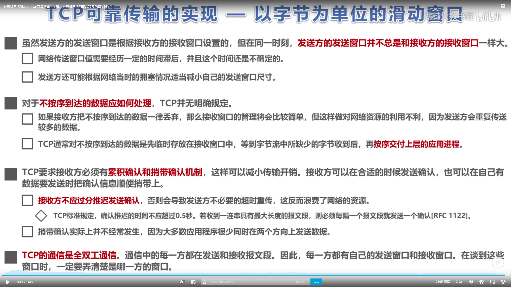
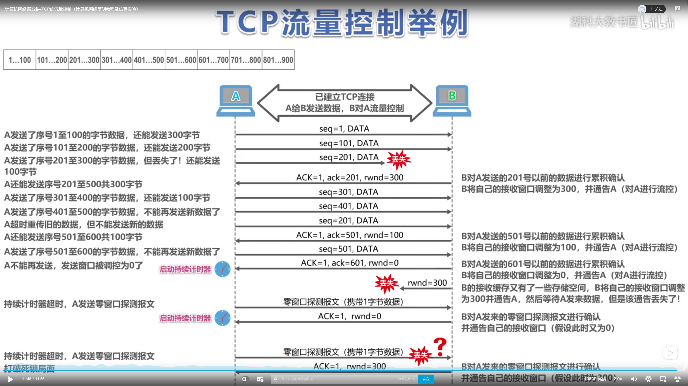
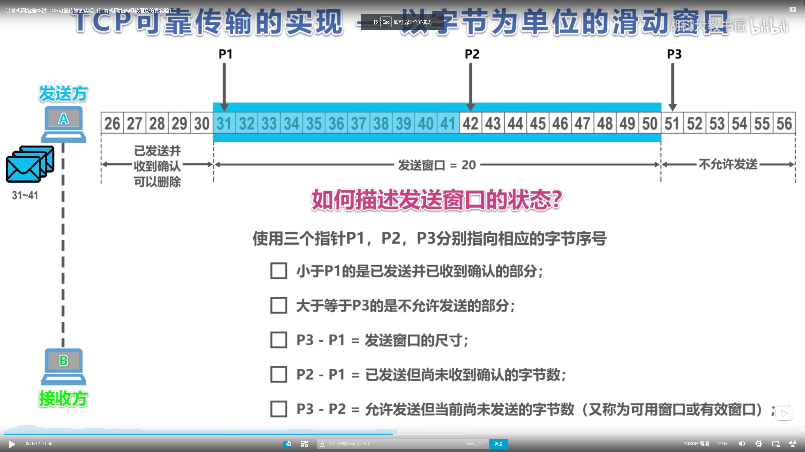
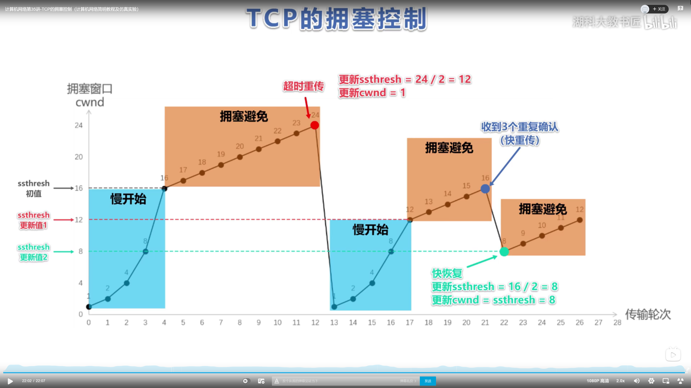

响应:
协议版本 状态码 短消息(如:OK)
其余与请求一样

tcp: 超时重传 拥塞控制 流量控制 滑动窗口

tcp(传输控制协议): 面向连接的,可靠的,基于字节流的传输层通信协议

udp(数据报协议): 

源端口号(16位) 目标端口号(16位)
序列号(32位)
确认应答号(32位)
首部长度(4位) 保留(6位) 六个标志位 窗口大小(16位)
校验和(16位) 紧急指针(16位)
选项
数据

TCP 和 UDP 区别
1.连接
●TCP 是面向连接的传输层协议，传输数据前先要建立连接。
• UDP 是不需要连接，即刻传输数据。
2. 服务对象
● TCP 是一对一的两点服务，即一条连接只有两个端点。
• UDP 支持一对一、一对多、多对多的交互通信
3.可靠性
· TCP 是可靠交付数据的，数据可以无差错、不丢失、不重复、按需到达。
·UDP是尽最大努力交付，不保证可靠交付数据。
4.拥塞控制、流量控制
● TCP 有拥塞控制和流量控制机制，保证数据传输的安全性。
• UDP 则没有，即使网络非常拥堵了，也不会影响 UDP 的发送速率。
5.首部开销
·TCP 首部长度较长，会有一定的开销，首部在没有使用「选项」字段时是20个字节，如果使用了「选项」字段则会变长的。
· UDP 首部只有 8 个字节，并且是固定不变的，开销较小。

tcp: 常用于 FTP HTTP
udp: 常用于 DNS(53)

拥塞控制:
拥塞控制算法主要包含三个部分: 慢启动, 拥塞避免, 快速恢复

术语: 
swnd = min(cwnd, rwnd)
swnd: 发送窗口 cwnd: 拥塞窗口 rwnd: 接收窗口

超时重传:

术语:
sack 选择性确认

流量控制:
发送窗口 接收窗口

- 流量控制: 控制发送方的窗口大小，让接收方来得及接收
    - tcp通过滑动窗口实现流量控制,接收方需要维护3个指针分别为后沿、前沿和下一个seq数据包.发送方需要维护接收窗口CWND,同理发送方也需要维护3个指针
    - TCP是全双工的, 在接收方发送给发送方的TCP头部中窗口大小位置存放接收窗口大小.
    - 当接收方发送RWND=0时, 发送方会开启持续计时器
        1. 当计时器超时时,发送方仍未接到新的RWND报文,则会主动发送一字节大小的零报文探测报文, 发送方接收到探测报文后会返回现在的RWND报文, 如果仍是零则重置计时器
        2. 当接再次收到RWND=0时, 重置计时器
        3. 此方法可避免接收方发送窗口报文丢失导致的死锁
    - 接收方在返回ACK报文时, 是累积返回. ACK=seq+数据包长度+1

- 超时重传: 加权平均往返时间RTTs

- 拥塞控制: 避免给整体的网络造成较大的堵塞
    - 影响因素: 设备缓存 传输容量上限
    - CWND / RTT = 速率(字节/秒)
    - 原则: 只要网络没有拥塞,窗口就变大;只要网络出现拥塞,窗口就变小
    - 四个步骤: 慢开始 拥塞避免 快重传 快恢复
        - 当CWND < ssthresh时, 使用慢开始
        - 当CWND > ssthresh时, 使用拥塞避免
        - 当 = 时, 都可以
    - 慢开始: CWND从1开始, 如果没有拥塞则不断以指数为2的速度递增直至到达阈值
    - 拥塞避免: 当CWND到达阈值后, CWND每次加1
    - 当出现拥塞时, ssthresh阈值变为此时CWND的一半(ssthresh = CWND/2), CWND进入慢开始算法从1重新开始
    - 快重传: 个别报文丢失时, 接收方会重复三次该丢失报文的ACK, 发送方随即将该报文重新发送
    - 快恢复: 当发生快重传时, 将会进入快恢复算法阶段.将ssthresh阈值和CWND都变成当前CWND的一半, 进入拥塞避免阶段

   

