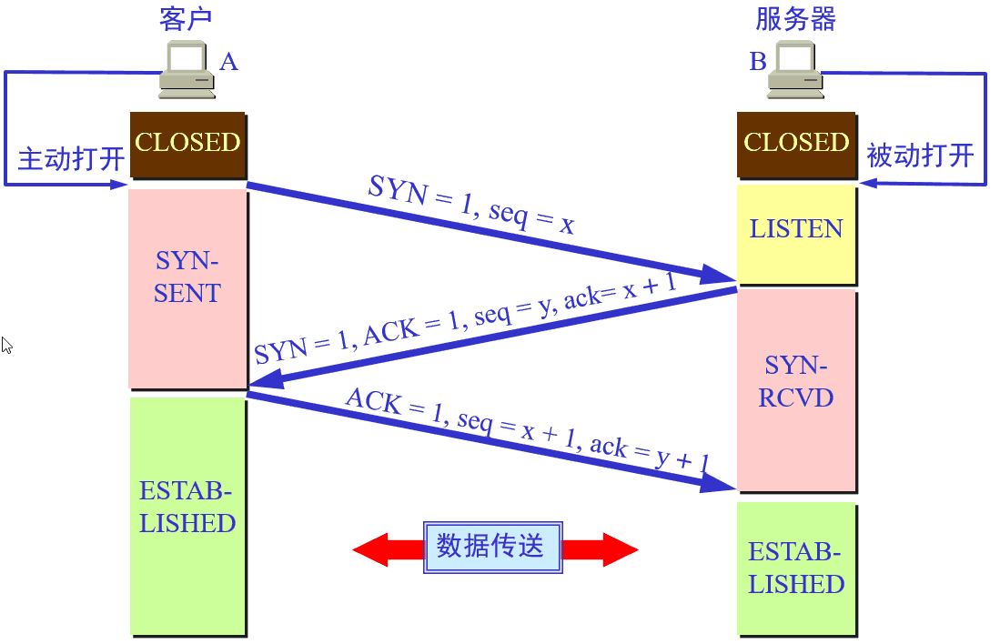
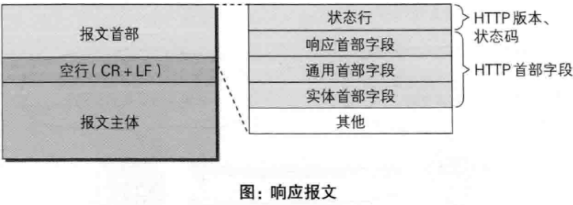
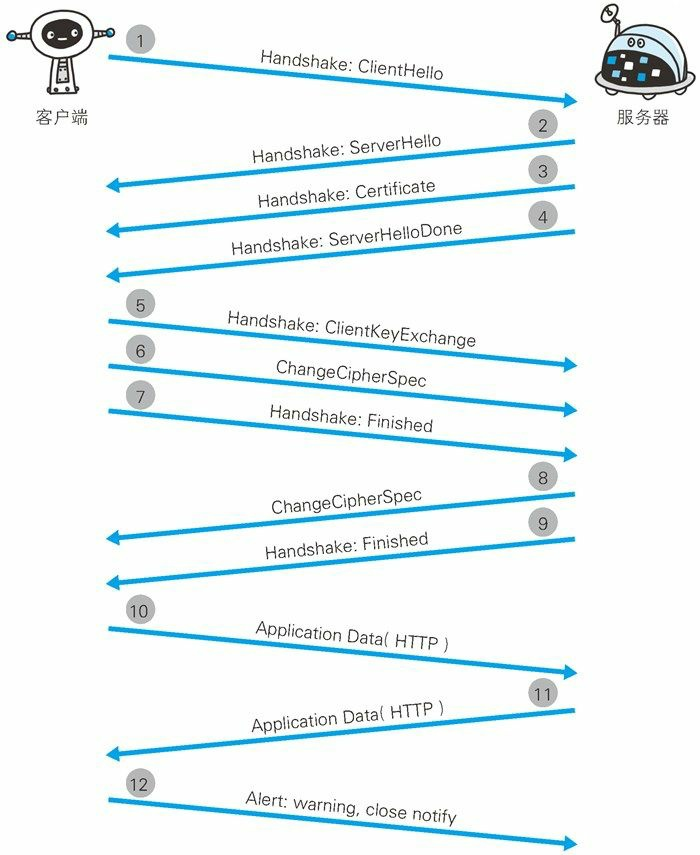

湖科大教书匠: https://space.bilibili.com/360996402
湖科大mooc: http://mooc1.hnust.edu.cn/course/204353963.html


# 网络协议

## 1. OSI七层协议
- 优点: 概念清楚 理论完整
- 缺点: 既复杂又不实用


应用层（Application）、表示层（Presentation）、会话层（Session）、运输层（Transport）、网络层（Network）、数据链路层（Data Link）、物理层（Physical）

## 2. TCP/IP四层体系
- 优点: 非常广泛的应用
- 缺点: TCP/IP只有上三层, 网络接口层并无具体内容

应用层、运输层、网际层和网络接口层

## 3. 五层协议(上两个体系中和产物)


应用层、运输层、网络层，数据链路层和物理层
# 网络通信过程


- ip地址：32位，一般用表示成4个8位的10进制数字，便于人类阅读。包括网络部分和主机部分。可以类比座机的电话号码理解。网络部分：北京的电话号码都是以010-开头的。主机部分：010-xxxxxxxxx，每台电话010之后部分的号码在北京地区是唯一的。公网ip为统一规划，全球唯一。
- 子网掩码：数据包在internet中传输，首先需要知道下一跳要发到路由到哪个子网。子网掩码和ip地址进行and位运算得到的结果就是这个ip地址的所在子网网络号。例如图中客户端所在的子网中的设备的子网掩码255.0.0.0与其中所有设备的ip地址做位运算的结果都是13.0.0.0。
- 网关：一个特殊的路由器，子网内的数据如果想发送到其他的子网，首先要递交给网关。网关的ip地址一般配置成这个子网中的第一个主机号，例如图中客户端所在子网的网关的ip地址为15.0.0.1。同时网络中的每个设置都知道所在子网的网关的ip地址。
- MAC地址: 网卡出厂时自带，全球唯一。

下面介绍客户端(15.0.0.2)请求网络端(13.0.0.2)上的数据的一个过程：
1. 客户端输入部署在服务端的网站的域名 www.example.com
2. 由于客户端配置了DNS的ip(先不考虑本地的hosts配置)，会先给DNS发送一个请求，DNS将www.examp.com解析成ip地址13.0.0.2返回给客户端
3. 客户端可以把源和目标ip地址写入数据包： `Data``源IP``目标IP`
4. 由于数据是发给另外一个子网的，所以数据要先发送给交换机，所以写入自身和网关的MAC地址封装成数据帧：
`Data` `源IP` `目标IP` `源MAC地址` `目标MAC地址`
5. 交换机(交换机只看MAC地址)会把数据先发给网关。然后通过路由算法(根据目标IP决定下一跳发到哪)，经过路由器的不断转发去到目标子网。这个过程中，每个路由器收到数据帧后，会重新封装数据帧，把目标MAC地址改写成自身的MAC，把目标MAC地址改写成下一跳的MAC。
6. 数据到达目标字段的交换机之后，解析出目标ip，交换机知道目标ip对应设备的mac地址，所以最终数据就可以到达ip为13.0.0.2的这台服务器。

https://blog.csdn.net/u011563903/article/details/90116368


# ARQ协议
ARQ协议是可靠传输的实现机制, 在其他各层级都有相关实现

TCP协议通过使用连续ARQ协议和滑动窗口协议，来保证数据传输的正确性，从而提供可靠的传输。
## 停止等待协议
发送方每发送一报文段数据便暂停发送,等待接收方的确认.只有成功确认后发送方才会发送下一个分报文段.

异常措施:
1. 发送方发送过程中发生丢失或错误, 接收方将不通知发送方. 发送方等待超时后(超时计时器)进行超时重传
2. 接收方发送确认发生丢失或延迟, 发送方在超时后会进行超市重传, 接受方接收到后丢弃该数据并且重新发送确认信息

缺点: 信道利用率太低


## 回退N帧协议
发送方不等待接收方确认, 连续发送数据包, 接收方采用累积确认的方式.

累积确认: 不对接收到的数据包逐个进行发送确认, 只对按序到达的最后一个报文段发送确认. 发送方如果收到这个确认信息, 则表示到这个报文段为止的所有报文段都已经正确收到

- 优点: 累积确认的优点是容易实现，即使确认丢失也不必重传
- 缺点: 不能正确的向发送方反映出接收方已经正确收到的所以报文段的信息。比如发送方发送了前5个报文段，而中间的第3个报文段丢失了，这时候接收方只能对前2个发出确认。而不知道后面3个报文段的下落，因此只能把后面的3个报文段都重传一次，这种机制叫Go-back-N（回退N），表示需要再退回来重传已发送过的N个报文段。


## 选择重传协议
为了进一步提高性能，可设法只重传出现误码的数据分组。因此，接收窗口的大小不应再等于1（而应大于1），以便接收方先收下失序到达但无误码并且序号落在接收窗口内的那些数据分组，等到所缺分组收齐后再一并送交上层。这就是选择重传协议。

注意: 选择重传协议不支持累积确认, 需要对每个正确接收到的数据分组进行逐一确认


# 以太网
在以太网链路上的数据包称作以太帧。以太帧起始部分由前导码和帧开始符组成。后面紧跟着一个以太网报头，以MAC地址说明目的地址和源地址。帧的中部是该帧负载的包含其他协议报头的数据包(例如IP协议)。以太帧由一个32位冗余校验码结尾。它用于检验数据传输是否出现损坏。


如图可以看出，每一层数据是由上一层数据+本层首部信息组成的，其中每一层的数据 ，称为本层的协议数据单元，即PDU.
- 应用层数据在传输层添加TCP报头后得到的PDU被称为 `Segment(数据段 )`，图示为`TCP段`
- 传输层的数据（TCP段）传给网络层,网络层添加IP报头得到的PDU被称为`Packet(数据包)`; 图示为`IP数据包`
- 网络层数据报（IP数据包）被传递到数据链路层,封装数据链路层报头得到的PDU被称为`Frame(数据帧)`，图示为以`太网帧`。
- 最后,帧被转换为比特,通过网络介质传输。这种协议栈逐层向下传递数据,并添加报头和报尾的过程称为封装。
## 帧格式


上图以Ethernet II帧格式作为示例

- 64b前导码: 7字节的前同步码 + 1字节的帧开始定界符
- 48b目的地址: 指网卡的硬件地址(MAC)
- 48b源地址: 指网卡的硬件地址(MAC)
- 16b类型:
- 数据: 以太网帧中的数据长度规定最小46字节, 最大1500字节(MTU), ARP和RARP数据包长度不够46字节, 要在后面补位
    - MTU: 指数据帧中有效载荷的最大长度, 不包括帧首部的长度
- 48bFCS: 冗余校验码


MTU: 以太网最大传输单元 1500字节
# ip
IP地址中的每一个字节都为1的IP地址（“255．255．255．255”）是当前子网的广播地址

每一个字节都为0的地址（“0.0.0.0”）对应于当前主机

- A类 10.0.0.0–10.255.255.255
- B类 172.16.0.0–172.31.255.255
- C类 192.168.0.0–192.168.255.255

- 为什么 TCP/IP 地址是介于 0 到 255 之间的 4 组数字
    1. TCP/IP 使用 32 个比特来编址。一个计算机字节是 8 比特。所以 TCP/IP 使用了 4 个字节。
    2. 一个计算机字节可以包含 256 个不同的值(00000000, 00000001, ..., 11111111)

- IP6
    - IPv6 地址的 128 位（16 个字节）写成 8 个 16 位的无符号整数，每个整数用 4 个十六进制位表示，这些数之间用冒号（:）分开
## 首部


4位版本: 版本号为4, 所以称为IPv4

4位首部长度
- 首部长度指的是首部占32bit字的数目，包括任何选项。由于它是一个4比特字段，因此首部长度最长为60个字节。

8b服务类型（TOS）：
- 服务类型字段包括一个3bit的优先权字段（现在已经被忽略），4bit的TOS子字段和1bit未用位必须置0。4bit的TOS分别代表：最小时延，最大吞吐量，最高可靠性和最小费用。4bit中只能置其中1比特。如果所有4bit均为0，那么就意味着是一般服务。

16b总长度：
- 总长度字段是指整个IP数据报的长度，以字节为单位。利用首部长度和总长度字段，就可以知道IP数据报中数据内容的起始位置和长度。由于该字段长16bit，所以IP数据报最长可达65535字节。当数据报被分片时，该字段的值也随着变化。

16b标识:
- 标识字段唯一地标识主机发送的每一份数据报。通常每发送一份报文它的值就会加1。

3b标识：只有2位有意义
- MF=1 表示后面有分片数据
- MF=0 表示已是最后的数据
- DF=1 表示不能分片
- DF=0 表示可以分片

13b片偏移: 代表某个分片在原始数据中的位置

8b生存时间：
- TTL（time-to-live）生存时间字段设置了数据报可以经过的最多路由器数。它指定了数据报的生存时间。TTL的初始值由源主机设置（通常为32或64），一旦经过一个处理它的路由器，它的值就减去1。当该字段的值为0时，数据报就被丢弃，并发送 ICMP 报文通知源主机。

8b协议:指该封包所使用的网络协议类型,如ICMP､DNS等｡占8位｡
- 常见协议号:
    - 00: IP
    - 01: ICMP
    - 06: TCP
    - 17: UDP

16b首部检验和：
- 首部检验和字段是根据IP首部计算的检验和码。它不对首部后面的数据进行计算。ICMP、IGMP、UDP和TCP在它们各自的首部中均含有同时覆盖首部和数据检验和码。

32b源ip地址和32b目的ip地址

## 常见问题
1. ip层没有超时和重传机制, 没有连接握手协议, 所以不是可靠连接协议
2. ip每经过一个路由器, TTL数就会减1, 如果TTL为0仍未到目的地, 这个ip包就会被丢弃
3. ip首部总长度只有16b, 所以ip包最大为65535字节
4. 数据链路层规定MTU最大传输单元为1500字节, 当ip包大于1500, 对ip包进行分片处理. 在tcp中因为存在mss字段, 规定了一个tcp包最大可传输字节为1460字节(一般为1500-20(ip首部)-20(tcp首部)),即可避免分片问题;UDP协议分片操作是交给IP完成

## 子网掩码
用来指明一个IP地址的哪些位标识的是主机所在的子网，以及哪些位标识的是主机的位掩码, 其必须结合IP地址使用

子网掩码是一个32位的2进制数， 其对应网络地址的所有位都置为1，对应于主机地址的所有位置都为0
- 全为1时表示该网络广播地址，全为0时表示该网络的网络号
- 广播地址只有UDP有
- 使用"与"(AND)运算,计算出网段ip地址 如：192.168.10.11 AND 255.255.255.0，结果为192.168.10.0

广播地址:是在网络地址的基础上，将网络号右边的表示IP地址的主机部分的二进制全部填上1，再将得到的二进制转化为十进制就可以得到广播地址
- 常见的有 192.168.1.255等


# TCP/IP协议簇
||UDP|TCP|
|-|-|-|
|是否连接|无连接|面向连接|
|是否可靠|不可靠传输，不使用流量控制和拥塞控制|可靠传输，使用流量控制和拥塞控制|
|连接对象个数|支持一对一，一对多，多对一和多对多交互通信|只能是一对一通信|
|传输方式|面向报文|面向字节流|
|首部开销|首部开销小，仅8字节|首部最小20字节，最大60字节|
|场景|适用于实时应用（IP电话、视频会议、直播等）|适用于要求可靠传输的应用，例如文件传输|
## ICMP 控制报文协议
用于在IP主机、路由器之间传递控制消息。
- 控制消息是指网络通不通、主机是否可达、路由是否可用等网络本身的消息
## ARP 地址解析协议
根据IP地址获取物理地址的一个TCP/IP协议

- 主机发送信息时将包含目标IP地址的ARP请求广播到局域网络上的所有主机，并接收返回消息，以此确定目标的物理地址；
- 收到返回消息后将该IP地址和物理地址存入本机ARP缓存中并保留一定时间，下次请求时直接查询ARP缓存以节约资源

### 工作过程
1. 根据主机A上的路由表内容，IP确定用于访问主机B的转发IP地址是192.168.1.2。然后A主机在自己的本地ARP缓存中检查主机B的匹配MAC地址。
2. 如果主机A在ARP缓存中没有找到映射，它将询问192.168.1.2的硬件地址，从而将ARP请求帧广播到本地网络上的所有主机。源主机A的IP地址和MAC地址都包括在ARP请求中。本地网络上的每台主机都接收到ARP请求并且检查是否与自己的IP地址匹配。如果主机发现请求的IP地址与自己的IP地址不匹配，它将丢弃ARP请求。
3. 主机B确定ARP请求中的IP地址与自己的IP地址匹配，则将主机A的IP地址和MAC地址映射添加到本地ARP缓存中。
4. 主机B将包含其MAC地址的ARP回复消息直接发送回主机A。
5. 当主机A收到从主机B发来的ARP回复消息时，会用主机B的IP和MAC地址映射更新ARP缓存。本机缓存是有生存期的，生存期结束后，将再次重复上面的过程。主机B的MAC地址一旦确定，主机A就能向主机B发送IP通信了。

### 命令
- arp -a 或者 arp -g: 查看缓存中所有数据

## tcp(传输控制协议)
tcp(传输控制协议): 面向连接的,可靠的,基于字节流的传输层通信协议

MSS: tcp的最大分段大小 1500-20(ip首部)-20(tcp首部)=1460
### 报文段首部
最小20字节, 最大60字节


1. 源端口号: 16位
2. 目标端口号: 16位
3. 序号：seq序号，占32位，用来标识从TCP源端向目的端发送的字节流，发起方发送数据时对此进行标记。
4. 确认序号：ack序号，占32位，只有ACK标志位，确认序号字段才有效，ack=seq+1。
5. 标志位：共6个，即URG、ACK、PSH、RST、SYN、FIN等，具体含义如下：
6. 首部长度: 占4位(0-15), 单位32bit. 例如值为5时, 表示长度为 5*32bit=160bit=20字节. 若字段为空则默认为5(20字节)
7. 标志位
- ACK：确认序号有效。
- FIN：释放一个连接。
- PSH：接收方应该尽快将这个报文交给应用层。
- RST：重置连接。
- SYN：发起一个新连接。
- URG：紧急指针（urgent pointer）有效。
8. 接收窗口: 用于流量控制, 占16位
9. 校验和: 占16位
10. 紧急指针: 占16位, 仅当URG标志位时有效
11. 选项: 常见可选字段是最长报文大小(MSS)

### 实现可靠传输的措施
1. 校验和 
2. 确认应答+序列号 
3. ARQ协议
4. 超时重传
5. 流量控制
6. 拥塞控制
7. 应用数据分割
#### 校验和
tcp校验和是一个端到端的校验和,由发送端计算,然后由接收端验证.

用于发现TCP首部和数据在发送端到接收端之间发生的任何改动。如果接收方检测到校验和有差错，则TCP段会被直接丢弃。

计算方法:
1. 首先，把伪首部、TCP报头、TCP数据分为16位的字，如果总长度为奇数个字节，则在最后增添一个位都为0的字节。把TCP报头中的校验和字段置为0（否则就陷入鸡生蛋还是蛋生鸡的问题）。
2. 其次，用反码相加法累加所有的16位字（进位也要累加）。
3. 最后，对计算结果取反，作为TCP的校验和。

#### 确认应答+序列号
发送方会在每一个数据包的伪首部中设置seq值

接收方也会发送确认值ack给发送方. ack = seq值+数据包字节数

#### 超时重传
超时重传时间应该设置为略大于往返时间(RTT)的值

RTT时间需要多次取样后, 计算加权平均得到 加权平均往返时间RTTs

注意：

超时以500ms（0.5秒）为一个单位进行控制，每次判定超时重发的超时时间都是500ms的整数倍。重发一次后，仍未响应，那么等待2500ms的时间后，再次重传。等待4500ms的时间继续重传。以一个指数的形式增长。累计到一定的重传次数，TCP就认为网络或者对端出现异常，强制关闭连接。

#### 流量控制&滑动窗口
tcp利用滑动窗口协议来实现流量控制,控制发送方的窗口大小，让接收方来得及接收

滑动窗口协议在在发送方和接收方之间各自维持一个滑动窗口，发送方是发送窗口，接收方是接收窗口，而且这个窗口是随着时间变化可以向前滑动的, 以字节为单位

##### 滑动窗口


发送窗口四个概念:
1. 已发送并收到确认
2. 已发送但未收到确认
3. 允许发送但尚未发送
4. 不允许发送

接收窗口四个概念:
1. 已交付并确认
2. 未按序收到
3. 允许接收
4. 不允许接收

- tcp通过滑动窗口实现流量控制,接收方需要维护3个指针分别为后沿、前沿和下一个seq数据包.发送方需要维护接收窗口CWND,同理发送方也需要维护3个指针
- TCP是全双工的, 在接收方发送给发送方的TCP头部中窗口大小位置存放接收窗口大小.

##### 流量控制


- 当接收方发送RWND=0时, 发送方会开启持续计时器
    1. 当计时器超时时,发送方仍未接到新的RWND报文,则会主动发送一字节大小的`零报文探测报文`, 发送方接收到探测报文后会返回现在的RWND报文, 如果仍是零则重置计时器
    2. 当接再次收到RWND=0时, 重置计时器
    3. 此方法可避免接收方发送窗口报文丢失导致的死锁
- 接收方在返回ACK报文时, 是累积返回. ACK=seq+数据包长度+1


规则:
1. 已发送过的数据, 在未收到确认之前, 都必须暂时保留, 以便超时重用
2. 只有发送方接收到确认报文, 发送方窗口才可以向前滑动
3. 发送方超时(超时计时器)未接收确认报文, 就会使用回退N帧ARQ协议, 进行超时重传
4. 发送窗口并不总是和接收窗口一样大
5. 不按序到达的数据, 通常是先临时存放在接收窗口中, 等待缺少的字节收到后, 再按序交付上层应用进程
6. 接收方必须有累积确认和捎带确认机制, 便于减少传输开销. 但是接收方也不应过于推迟发送确认(应不超过0.5秒)

#### 拥塞控制
拥塞控制: 避免给整体的网络造成较大的堵塞
- 影响因素: 设备缓存 传输容量上限
- 拥塞控制目的：为了防止过多的数据注入到网络中，避免网络中的路由器、链路过载
- CWND / RTT = 速率(字节/秒)
- 原则: 只要网络没有拥塞,窗口就变大;只要网络出现拥塞,窗口就变小
- 四个步骤: 慢开始 拥塞避免 快重传 快恢复
    - 当CWND < ssthresh时, 使用慢开始
    - 当CWND > ssthresh时, 使用拥塞避免
    - 当 = 时, 都可以

   

拥塞控制过程：TCP维护一个拥塞窗口，该窗口随着网络拥塞程度动态变化，通过慢开始、拥塞避免等算法减少网络拥塞的发生。
- 慢开始: CWND从1开始, 如果没有拥塞则将CWND不断以指数为2的速度递增直至到达阈值(ssthresh)
- 拥塞避免: 当CWND到达阈值(ssthresh)后, CWND每次加1
- 当超时重传时, ssthresh阈值变为此时CWND的一半(ssthresh = CWND/2), CWND进入慢开始算法从1重新开始
- 快重传: 个别报文丢失时, 接收方会重复三次该丢失报文的ACK, 发送方随即将该报文重新发送
- 快恢复: 当发生快重传时, 发送方将执行快恢复算法.
    - 将ssthresh和CWND都变成当前CWND的一半, 进入拥塞避免阶段

tip: 满开始和拥塞避免是TCP Tahoe版本 在后面的 Reno版本新增了 快重传和快恢复

##### 快重传


作用: 快重传算法可以让发送方尽早知道发生了个别报文段的丢失, 尽早进行重传而不是等超时重传计时器超时再重传
步骤: 
1. 接收方在快重传时应该立即发送确认报文, 即使收到了失序的报文段也要立即发出对已收到的报文段的重复确认
2. 发送方收到三个连续重复确认报文, 就将相应报文段立即重传, 而不等该报文段的超时重传计时器超时再重传,避免进行超时重传

### 长连接&短连接
#### 短连接
短连接一般只会在 client/server 间传递一次读写操作

操作步骤：建立连接 -> 单次数据传输 -> 关闭连接

- 优点：管理起来比较简单，存在的连接都是有用的连接，不需要额外的控制手段。
- 缺点：但如果客户请求频繁，将在TCP的建立和关闭操作上浪费时间和带宽。
#### 长连接
长连接会在 client/server 间持续保持存活(KeepAlive) 可以传递多次读写操作

操作步骤：建立连接 -> 多次数据传输(保持连接) -> 关闭连接

- 优点：长连接可以省去较多的TCP建立和关闭的操作，减少浪费，节约时间。
- 缺点：在长连接的应用场景下，client端一般不会主动关闭它们之间的连接，client与server之间的连接如果一直不关闭的话，会存在一个问题，随着客户端连接越来越多，server早晚有扛不住的时候，这时候server端需要采取一些策略，如关闭一些长时间没有读写事件发生的连接，这样可以避免一些恶意连接导致server端服务受损；如果条件再允许就可以以客户端机器为颗粒度，限制每个客户端的最大长连接数。

### 粘包&拆包
粘包和拆包问题再数据链路层 网络层以及传输层都有可能发生. 在传输层中由于UDP有消息保护边界, 不会发生粘包现象, 因此该问题只会发生在TCP协议中

粘包: 
原因:
- 应用程序写入的数据大于套接字缓冲区大小，这将会发生拆包。
- 应用程序写入数据小于套接字缓冲区大小，网卡将应用多次写入的数据发送到网络上，这将会发生粘包。
- 进行MSS（最大报文长度）大小的TCP分段，当TCP报文长度-TCP头部长度>MSS的时候将发生拆包。
- 接收方法不及时读取套接字缓冲区数据，这将发生粘包。

解决方法:
- 发送端给每个数据包添加包首部，首部中应该至少包含数据包的长度，这样接收端在接收到数据后，通过读取包首部的长度字段，便知道每一个数据包的实际长度了。
- 发送端将每个数据包封装为固定长度（不够的可以通过补0填充），这样接收端每次从接收缓冲区中读取固定长度的数据就自然而然的把每个数据包拆分开来。
- 可以在数据包之间设置边界，如添加特殊符号，这样，接收端通过这个边界就可以将不同的数据包拆分开。

## udp(用户数据报协议)


0. 伪首部: 源ip地址 目的ip地址 0 17 UDP长度
    - 伪首部仅用于计算校验和时用到, 实际传输时将会去除伪首部
    - 发送与接收双方在校验和时, 根据IP报文首部获取一共8字节的源ip地址和目的ip地址, 一共2字节的"0"和"17"(udp协议代号), 2字节的UDP长度. 生成伪首部
1. 源端口：源端口号。在需要对方回信时选用。不需要时可用全0。
2. 目的端口：目的端口号。在终点交付报文时使用。
3. 长度：UDP用户数据报的长度，其最小值是8字节(仅有首部), 最大20字节
4. 检验和：检测UDP用户数据报在传输中是否有错。有错就丢弃。

DNS获取便是使用UDP作为传输层协议, 其端口为 53 

## 三次握手&四次挥手


https://blog.csdn.net/ThinkWon/article/details/104903925

### 1. 三次握手
目的: 三次握手的本质是确认通信双方收发数据的能力


1. 第一次握手：客户端要向服务端发起连接请求，首先客户端随机生成一个起始序列号ISN(比如是100)，那客户端向服务端发送的报文段包含SYN标志位(也就是SYN=1)，序列号seq=100。
2. 第二次握手：服务端收到客户端发过来的报文后，发现SYN=1，知道这是一个连接请求，于是将客户端的起始序列号100存起来，并且随机生成一个服务端的起始序列号(比如是300)。然后给客户端回复一段报文，回复报文包含SYN和ACK标志(也就是SYN=1,ACK=1)、序列号seq=300、确认号ack=101(客户端发过来的序列号+1)。
3. 第三次握手：客户端收到服务端的回复后发现ACK=1并且ack=101,于是知道服务端已经收到了序列号为100的那段报文；同时发现SYN=1，知道了服务端同意了这次连接，于是就将服务端的序列号300给存下来。然后客户端再回复一段报文给服务端，报文包含ACK标志位(ACK=1)、ack=301(服务端序列号+1)、seq=101(第一次握手时发送报文是占据一个序列号的，所以这次seq就从101开始，需要注意的是不携带数据的ACK报文是不占据序列号的，所以后面第一次正式发送数据时seq还是101)。当服务端收到报文后发现ACK=1并且ack=301，就知道客户端收到序列号为300的报文了，就这样客户端和服务端通过TCP建立了连接。


### 2. 四次挥手
目的: 四次挥手的目的是关闭一个连接


比如客户端初始化的序列号ISA=100，服务端初始化的序列号ISA=300。TCP连接成功后客户端总共发送了1000个字节的数据，服务端在客户端发FIN报文前总共回复了2000个字节的数据。

1. 第一次挥手：当客户端的数据都传输完成后，客户端向服务端发出连接释放报文(当然数据没发完时也可以发送连接释放报文并停止发送数据)，释放连接报文包含FIN标志位(FIN=1)、序列号seq=1101(100+1+1000，其中的1是建立连接时占的一个序列号)。需要注意的是客户端发出FIN报文段后只是不能发数据了，但是还可以正常收数据；另外FIN报文段即使不携带数据也要占据一个序列号。
2. 第二次挥手：服务端收到客户端发的FIN报文后给客户端回复确认报文，确认报文包含ACK标志位(ACK=1)、确认号ack=1102(客户端FIN报文序列号1101+1)、序列号seq=2300(300+2000)。此时服务端处于关闭等待状态，而不是立马给客户端发FIN报文，这个状态还要持续一段时间，因为服务端可能还有数据没发完。
3. 第三次挥手：服务端将最后数据(比如50个字节)发送完毕后就向客户端发出连接释放报文，报文包含FIN和ACK标志位(FIN=1,ACK=1)、确认号和第二次挥手一样ack=1102、序列号seq=2350(2300+50)。
4. 第四次挥手：客户端收到服务端发的FIN报文后，向服务端发出确认报文，确认报文包含ACK标志位(ACK=1)、确认号ack=2351、序列号seq=1102。注意客户端发出确认报文后不是立马释放TCP连接，而是要经过2MSL(最长报文段寿命的2倍时长)后才释放TCP连接。而服务端一旦收到客户端发出的确认报文就会立马释放TCP连接，所以服务端结束TCP连接的时间要比客户端早一些。

### 3. 常见面试题
#### 1. 为什么TCP连接的时候是3次？2次不可以吗？
问题一: 主要是为了建立可靠的通信信道，保证客户端与服务端同时具备发送、接收数据的能力
1. 用于同步seq, 客户端有自己的seq需要服务端ack确认, 服务端也有自己的seq需要客户端ack确认;而服务端确认客户端seq与服务端发送自己的seq合并到第二次握手一起执行
2. 防止失效报文延迟到达引起的错误

因为需要考虑连接时丢包的问题，如果只握手2次，第二次握手时如果服务端发给客户端的确认报文段丢失，此时服务端已经准备好了收发数(可以理解服务端已经连接成功)据，而客户端一直没收到服务端的确认报文，所以客户端就不知道服务端是否已经准备好了(可以理解为客户端未连接成功)，这种情况下客户端不会给服务端发数据，也会忽略服务端发过来的数据。

如果是三次握手，即便发生丢包也不会有问题，比如如果第三次握手客户端发的确认ack报文丢失，服务端在一段时间内没有收到确认ack报文的话就会重新进行第二次握手，也就是服务端会重发SYN报文段，客户端收到重发的报文段后会再次给服务端发送确认ack报文。

问题二:
1. 防止已失效的请求报文又传送到了服务端，建立了多余的链接，浪费资源
2. 两次握手只能保证单向连接是畅通的。（为了实现可靠数据传输， TCP 协议的通信双方， 都必须维 护一个序列号， 以标识发送出去的数据包中， 哪些是已经被对方收到的。三次握手的过程即是通信双方 相互告知序列号起始值， 并确认对方已经收到了序列号起始值的必经步骤；如果只是两次握手， 至多只有连接发起方的起始序列号能被确认， 另一方选择的序列号则得不到确认）

#### 2. 为什么TCP连接的时候是3次，关闭的时候却是4次？
因为只有在客户端和服务端都没有数据要发送的时候才能断开TCP。而客户端发出FIN报文时只能保证客户端没有数据发了，服务端还有没有数据发客户端是不知道的。而服务端收到客户端的FIN报文后只能先回复客户端一个确认报文来告诉客户端我服务端已经收到你的FIN报文了，但我服务端还有一些数据没发完，等这些数据发完了服务端才能给客户端发FIN报文(所以不能一次性将确认报文和FIN报文发给客户端，就是这里多出来了一次)。

#### 3. 为什么客户端发出第四次挥手的确认报文后要等2MSL的时间才能释放TCP连接？
这里同样是要考虑丢包的问题，如果第四次挥手的报文丢失，服务端没收到确认ack报文就会重发第三次挥手的报文，这样报文一去一回最长时间就是2MSL，所以需要等这么长时间来确认服务端确实已经收到了。

#### 4. 如果已经建立了连接，但是客户端突然出现故障了怎么办？
TCP设有一个保活计时器，客户端如果出现故障，服务器不能一直等下去，白白浪费资源。服务器每收到一次客户端的请求后都会重新复位这个计时器，时间通常是设置为2小时，若两小时还没有收到客户端的任何数据，服务器就会发送一个探测报文段，以后每隔75秒钟发送一次。若一连发送10个探测报文仍然没反应，服务器就认为客户端出了故障，接着就关闭连接。

#### 5. 为什么会TIME-WAIT过多？解决方法是怎样的？

可能原因：高并发短连接的TCP服务器上，当服务器处理完请求后立刻按照主动正常关闭连接

解决：负载均衡服务器；Web服务器首先关闭来自负载均衡服务器的连接


# DNS 域名系统
## 域名服务器


域名服务器可以划分为一下四种不同类型
1. 根域名服务器
2. 顶级域名服务器
3. 权限域名服务器
4. 本地域名服务器

例如:
访问域名为`www.abc.xyz.com`的网址时, 本地域名服务器最多需要解析4次,最少0次(当有缓存时)
1. 根域名服务器
2. 顶级域名服务器(.com)
3. 权限域名服务器(xyz.com)
4. 权限域名服务器(abc.xyz.com)
## 查询方式

1. 递归查询: 不同级别域名服务器间采用接力的方式不断查询, 最后一级一级将结果返回到主机
2. 迭代查询: 由本地域名服务器不断从高往低查询
## 查询步骤
1. 浏览器缓存
2. 操作系统缓存
3. hosts
4. ISP网络提供服务商
- 本地DNS服务商
- 根DNS服务商
- 顶级域服务商
- 区域DNS服务商
- 自由DNS服务商

目前常见查询方式为 递归查询+迭代查询的结合. 主机到本地域名服务器采用递归查询, 如果还需继续向上级查询则由本地域名服务器进行迭代查询

# http
## HTTP1.0
服务器处理完成后立即断开TCP连接（无连接），服务器不跟踪每个客户端也不记录过去的请求（无状态）

## HTTP1.1
KeepAlived长连接避免了连接建立和释放的开销；通过Content-Length来判断当前请求数据是否已经全部接受（有状态）

## HTTP2.0
引入二进制数据帧和流的概念，其中帧对数据进行顺序标识；因为有了序列，服务器可以并行的传输数据。

## http3
HTTP2协议虽然大幅提升了HTTP/1.1的性能，然而，基于TCP实现的HTTP2遗留下3个问题：

- 有序字节流引出的队头阻塞（Head-of-line blocking），使得HTTP2的多路复用能力大打折扣；
- TCP与TLS叠加了握手时延，建链时长还有1倍的下降空间；
- 基于TCP四元组确定一个连接，这种诞生于有线网络的设计，并不适合移动状态下的无线网络，这意味着IP地址的频繁变动会导致TCP连接、TLS会话反复握手，成本高昂。


## 请求报文和响应报文

```http
GET / HTTP/1.1\r\n
Host: localhost:8000\r\n
User-Agent: curl/7.47.0\r\n
Accept: */*\r\n
Content-Length: 16\r\n
Content-Type: application/x-www-form-urlencoed\r\n\r\n
name=123w4234234
```
- 请求报文包括三部分:


1. 请求行:包含请求方法,URI,HTTP版本协议
2. 请求首部字段
3. 请求内容实体
4. 空行(\r\n)

- 响应报文包含三部分:



1. 状态行:包含HTTP版本,状态码,状态码原因短语
2. HTTP首部字段(消息报头)
3. 空行(\r\n)
4. 响应内容实体


- 通用首部字段（请求报文与响应报文都会使用的首部字段）
    - Date：创建报文时间
    - Connection：连接的管理
    - Cache-Control：缓存的控制
    - Transfer-Encoding：报文主体的传输编码方式

- 请求首部字段（请求报文会使用的首部字段）
    - Host：请求资源所在服务器
    - Accept：可处理的媒体类型
    - Accept-Charset：可接收的字符集
    - Accept-Encoding：可接受的内容编码
    - Accept-Language：可接受的自然语言

- 响应首部字段（响应报文会使用的首部字段）
    - Accept-Ranges：可接受的字节范围
    - Location：令客户端重新定向到的URI
    - Server：HTTP服务器的安装信息

- 实体首部字段（请求报文与响应报文的的实体部分使用的首部字段）
    - Allow：资源可支持的HTTP方法
    - Content-Type：实体主类的类型
    - Content-Encoding：实体主体适用的编码方式
    - Content-Language：实体主体的自然语言
    - Content-Length：实体主体的的字节数
    - Content-Range：实体主体的位置范围，一般用于发出部分请求时使用

### http报文解析过程

1. 从可读的socket中获取用户发送的请求内容，保存到buf中


```http
GET / HTTP/1.1\r\n
Host: localhost:8000\r\n
User-Agent: curl/7.47.0\r\n
Accept: */*\r\n
Content-Length: 16\r\n
Content-Type: application/x-www-form-urlencoed\r\n\r\n
name=123w4234234
```
- 第一行是request-line
- 最后一行是request-body
- 其余的是request-headers
2. 根据第一个\r\n，buf的内容可以分为两个部分:1. line 2. rbuf
3. 要判断line的长度是否超过了gunicorn配置的limit_request_line参数，超出的话，报错(如果有)
4. line中是否包含了代理协议
    - 如果包含了，说明真正的request-line包含在rbuf中，如果对rbuf(把rbuf看成buf，进行上述的处理)进行分割
5. line就是合法的request-line，可以解析出：协议、请求的路径、版本号等
6. 可以解析出各个request header， 作为一个list返回即可
    - [('Host','localhost:8000'),('User-Agent','curl/7.47.0'),等]

## 请求方式(method)

- GET:用于请求访问已经被URI(统一资源标识符)识别的资源,可以通过URL传参给服务器
- POST:用于传输信息给服务器,主要功能与GET方法类似,但一般推荐使用POST方式
- PUT:传输文件,报文主体中包含文件内容,保存到对应URI位置
- HEAD:获得报文首部,与GET方法类似,只是不返回报文主体,一般用于验证URI是否有效
- DELETE:删除文件,与PUT方法相反,删除对应URI位置的文件
- OPTIONS:查询响应URI支持的HTTP方法

## http1.0和http1.1的主要区别如下

1. 缓存处理：1.1添加更多的缓存控制策略（如：Entity tag，If-Match）
2. 网络连接的优化：1.1支持断点续传
3. 错误状态码的增多：1.1新增了24个错误状态响应码，丰富的错误码更加明确各个状态
4. Host头处理：支持Host头域，不在以IP为请求方标志
5. 长连接：减少了建立和关闭连接的消耗和延迟。
- 减少了建立和关闭连接的消耗和延迟，在HTTP1.1中默认开启Connection： keep-alive，一定程度上弥补了HTTP1.0每次请求都要创建连接的缺点。

## http1.1和http2.0的主要区别

1. 新的传输格式：2.0使用二进制格式，1.0依然使用基于文本格式
- HTTP1.x的解析是基于文本。基于文本协议的格式解析存在天然缺陷，文本的表现形式有多样性，要做到健壮性考虑的场景必然很多，二进制则不同，只认0和1的组合。基于这种考虑HTTP2.0的协议解析决定采用二进制格式，实现方便且健壮
2. 多路复用：连接共享，不同的request可以使用同一个连接传输（最后根据每个request上的id号组合成正常的请求）
- 即连接共享，即每一个request都是是用作连接共享机制的。一个request对应一个id，这样一个连接上可以有多个request，每个连接的request可以随机的混杂在一起，接收方可以根据request的 id将request再归属到各自不同的服务端请求里面。
- 缘由: 在 HTTP1 中浏览器限制了同一个域名下的请求数量（Chrome 下一般是六个），当在请求很多资源的时候，由于队头阻塞当浏览器达到最大请求数量时，剩余的资源需等待当前的六个请求完成后才能发起请求。
- 原理: HTTP2 中引入了多路复用的技术，这个技术可以只通过一个 TCP 连接就可以传输所有的请求数据。多路复用可以绕过浏览器限制同一个域名下的请求数量的问题，进而提高了网页的性能。
3. header压缩：由于1.X中header带有大量的信息，并且得重复传输，2.0使用encoder来减少需要传输的hearder大小.通讯双方各自cache一份header fields表，既避免了重复header的传输，又减小了需要传输的大小
4. 服务端推送：同google的SPDUY（1.0的一种升级）一样


## http状态

状态码分类：

- 1**: 信息，服务器收到请求，需要请求者继续执行操作
- 2**: 成功，操作被成功接收并处理
- 3**: 重定向，需要进一步的操作以完成请求
- 4**: 客户端错误，请求包含语法错误或无法完成请求
- 5**: 服务器错误，服务器在处理请求的过程中发生了错误

常用状态码：
- 200：请求被正常处理
- 204：请求被受理但没有资源可以返回
- 206：客户端只是请求资源的一部分，服务器只对请求的部分资源执行GET方法，相应报文中通过Content-Range指定范围的资源。
- 301：永久性重定向
- 302：临时重定向
- 303：与302状态码有相似功能，只是它希望客户端在请求一个URI的时候，能通过GET方法重定向到另一个URI上
- 304：发送附带条件的请求时，条件不满足时返回，与重定向无关
- 307：临时重定向，与302类似，只是强制要求使用POST方法
- 400：请求报文语法有误，服务器无法识别
- 401：请求需要认证
- 403：请求的对应资源禁止被访问
- 404：服务器无法找到对应资源
- 500：服务器内部错误
- 503：服务器正忙


## Http与Https优缺点?
1. 通信使用明文不加密,内容可能被窃听,也就是被抓包分析
2. 不验证通信方身份,可能遭到伪装
3. 无法验证报文完整性,可能被篡改

Https就是Http加上加密处理(一般是SSL安全通信线路)+认证+完整性保护

## Http与Https的区别：
1. HTTP 的URL 以http:// 开头，而HTTPS 的URL 以https:// 开头
2. HTTP 是不安全的，而 HTTPS 是安全的
3. HTTP 标准端口是80 ，而 HTTPS 的标准端口是443
4. 在OSI 网络模型中，HTTP工作于应用层，而HTTPS的安全传输机制工作在传输层
5. HTTP 无法加密，而HTTPS 对传输的数据进行加密
6. HTTP无需证书，而HTTPS 需要CA机构wosign的颁发的SSL证书

## Http优化

- 利用负载均衡优化和加速HTTP应用
- 利用HTTP Cache来优化网站

## Http协议有哪些特征?

1. 支持客户/服务器模式
2. 简单快速
3. 灵活
4. 无连接
5. 无状态

## get和post区别


1. get重点在从服务器上获取资源,post重点在向服务器发送数据;
2. get传输数据是通过URL请求(查询字符串),以filed(字段)=value的形式,置于URL后,并用"?"连接,多个请求数据之间用"&"连接,如`http://127.0.0.1/Test/login.action?name=admin&password=admin`，这个过程用户是可见的
3. get传输量小,因为受URL长度限制,但效率较高, 最多2048字节 http协议没有对url长度做限制但是浏览器或服务器会限制;post可以传输大量数据,所以上传文件时只能用post方式
4. get是不安全的,因为URL是可见的,可能会泄露私密信息,如密码等;post较get安全
5. GET产生一个TCP数据包；POST产生两个TCP数据包。
- 对于GET方式的请求，浏览器会把http header和data一并发送出去，服务器响应200（返回数据）；
- 而对于POST，浏览器先发送header，服务器响应100 continue，浏览器再发送data，服务器响应200 ok（返回数据）
6. Get限制Form表单的数据集的值必须为ASCII字符；而Post支持整个ISO10646字符集

## Session、Cookie和Token

HTTP协议本身是无状态的。什么是无状态呢，即服务器无法判断用户身份。

### 1. cookie

cookie是由Web服务器保存在用户浏览器上的小文件（key-value格式），包含用户相关的信息。客户端向服务器发起请求，如果服务器需要记录该用户状态，就使用response向客户端浏览器颁发一个Cookie。客户端浏览器会把Cookie保存起来。当浏览器再请求该网站时，浏览器把请求的网址连同该Cookie一同提交给服务器。服务器检查该Cookie，以此来辨认用户身份。

### 2. session

session是依赖Cookie实现的。session是服务器端对象

session 是浏览器和服务器会话过程中，服务器分配的一块储存空间。服务器默认为浏览器在cookie中设置 sessionid，浏览器在向服务器请求过程中传输 cookie 包含 sessionid ，服务器根据 sessionid 获取出会话中存储的信息，然后确定会话的身份信息。

### 3. cookie与session区别

1. 存储位置与安全性：cookie数据存放在客户端上，安全性较差，session数据放在服务器上，安全性相对更高；
2. 存储空间：单个cookie保存的数据不能超过4K，很多浏览器都限制一个站点最多保存20个cookie，session无此限制
3. 占用服务器资源：session一定时间内保存在服务器上，当访问增多，占用服务器性能，考虑到服务器性能方面，应当使用cookie。

### 4. Token

1. Token的引入：Token是在客户端频繁向服务端请求数据，服务端频繁的去数据库查询用户名和密码并进行对比，判断用户名和密码正确与否，并作出相应提示，在这样的背景下，Token便应运而生。

2. Token的定义：Token是服务端生成的一串字符串，以作客户端进行请求的一个令牌，当第一次登录后，服务器生成一个Token便将此Token返回给客户端，以后客户端只需带上这个Token前来请求数据即可，无需再次带上用户名和密码。

3. 使用Token的目的：Token的目的是为了减轻服务器的压力，减少频繁的查询数据库，使服务器更加健壮。

Token 是在服务端产生的。如果前端使用用户名/密码向服务端请求认证，服务端认证成功，那么在服务端会返回 Token 给前端。前端可以在每次请求的时候带上 Token 证明自己的合法地位

### 5. session与token区别

1. session机制存在服务器压力增大，CSRF跨站伪造请求攻击，扩展性不强等问题；
2. session存储在服务器端，token存储在客户端
3. token提供认证和授权功能，作为身份认证，token安全性比session好；
4. session这种会话存储方式方式只适用于客户端代码和服务端代码运行在同一台服务器上，token适用于项目级的前后端分离（前后端代码运行在不同的服务器下）


# https
## 1. SSL/TLS 握手过程详解
### 1. 参考资料
- 通识介绍: https://www.bilibili.com/read/cv1003133/ 
- 官方文档: https://tools.ietf.org/html/rfc5246#section-8.1
### 2. TLS/SSL协议工作原理
TLS/SSL的功能实现主要依赖于三类基本算法：散列函数 Hash、对称加密和非对称加密
- 利用非对称加密实现身份认证和密钥协商
- 对称加密算法采用协商的密钥对数据加密
- 基于散列函数验证信息的完整性。


- 散列函数Hash

常见的有 MD5、SHA1、SHA256，该类函数特点是函数单向不可逆、对输入非常敏感、输出长度固定，针对数据的任何修改都会改变散列函数的结果，用于防止信息篡改并验证数据的完整性;

在信息传输过程中，散列函数不能单独实现信息防篡改，因为明文传输，中间人可以修改信息之后重新计算信息摘要，因此需要对传输的信息以及信息摘要进行加密;

- 对称加密

常见的有 AES-CBC、DES、3DES、AES-GCM等，相同的密钥可以用于信息的加密和解密，掌握密钥才能获取信息，能够防止信息窃听，通信方式是1对1;

对称加密的优势是信息传输1对1，需要共享相同的密码，密码的安全是保证信息安全的基础，服务器和 N 个客户端通信，需要维持 N 个密码记录，且缺少修改密码的机制;

- 非对称加密

即常见的 RSA 算法，还包括 ECC、DH 等算法，算法特点是，密钥成对出现，一般称为公钥(公开)和私钥(保密)，公钥加密的信息只能私钥解开，私钥加密的信息只能公钥解开。因此掌握公钥的不同客户端之间不能互相解密信息，只能和掌握私钥的服务器进行加密通信，服务器可以实现1对多的通信，客户端也可以用来验证掌握私钥的服务器身份。

非对称加密的特点是信息传输1对多，服务器只需要维持一个私钥就能够和多个客户端进行加密通信，但服务器发出的信息能够被所有的客户端解密，且该算法的计算复杂，加密速度慢。

结合三类算法的特点，TLS的基本工作方式是，客户端使用非对称加密与服务器进行通信，实现身份验证并协商对称加密使用的密钥，然后对称加密算法采用协商密钥对信息以及信息摘要进行加密通信，不同的节点之间采用的对称密钥不同，从而可以保证信息只能通信双方获取。

### 3. CA(Certificate Authority)认证及客户端验证流程
CA负责核实公钥的拥有者的信息，并颁发认证"证书"，同时能够为使用者提供证书验证服务，即PKI体系(PKI基础知识)。

基本的原理为，CA负责审核信息，然后对关键信息利用私钥进行"签名"，公开对应的公钥，客户端可以利用公钥验证签名。CA也可以吊销已经签发的证书.


1. 服务方S向第三方机构CA提交公钥、组织信息、个人信息(域名)等信息并申请认证;
2. CA通过线上、线下等多种手段验证申请者提供信息的真实性，如组织是否存在、企业是否合法，是否拥有域名的所有权等;
3. 如信息审核通过，CA会向申请者签发认证文件-证书。
    - 证书包含以下信息：申请者公钥、申请者的组织信息和个人信息、签发机构 CA的信息、有效时间、证书序列号等信息的明文，同时包含一个签名;
    - 签名的产生算法：首先，使用散列函数计算公开的明文信息的信息摘要，然后，采用 CA的私钥对信息摘要进行加密，密文即签名;
4. 客户端 C 向服务器 S 发出请求时，S 返回证书文件;

5. 完整性校验:客户端 C 读取证书中的相关的明文信息，采用相同的散列函数计算得到信息摘要，然后，利用对应 CA的公钥解密签名数据，对比证书的信息摘要，如果一致，则可以确认证书的合法性，即公钥合法;
6. 客户端然后验证证书相关的域名信息、有效时间等信息;
7. 客户端内置有信任CA的证书信息(包含公钥)，如果CA不被信任，则找不到对应 CA的证书，证书也会被判定非法。

- 在这个过程注意几点：
1. 申请证书不需要提供私钥，确保私钥永远只能服务器掌握;
2. 证书的合法性仍然依赖于非对称加密算法，证书主要是增加了服务器信息以及签名;
3. 内置 CA 对应的证书称为根证书，颁发者和使用者相同，自己为自己签名，即自签名证书（为什么说"部署自签SSL证书非常不安全"）
4. 证书=公钥+申请者与颁发者信息+签名;

### 4. ssl/tls握手过程(RSA加密版)(DH算法略微有点不同)
https://blog.csdn.net/sarafina527/article/details/89333536




1. 第1次握手
- Client Hello: 包含了一个客户端生成的随机数 Random1、客户端支持的加密套件（Support Ciphers）和 SSL Version 等信息
2. 第2次握手
- Server Hello: 消息会从 Client Hello 传过来的 Support Ciphers 里确定一份加密套件，这个套件决定了后续加密和生成摘要时具体使用哪些算法，另外还会生成一份随机数 Random2
- Certificate: 服务端将自己的证书下发给客户端，让客户端验证自己的身份，客户端验证通过后取出证书中的公钥(详细流程看上面)
- Server Hello Done: 通知客户端 Server Hello 过程结束。
3. 第3次握手
- Certificate Verify: 客户端收到服务端传来的证书后，先从 CA 验证该证书的合法性，验证通过后取出证书中的服务端公钥，再生成一个随机数 Random3(PreMaster Key)，再用服务端公钥进行非对称加密 
- Client Key Exchange: 将这个 PreMaster Key 传给服务端
- Change Cipher Spec(client): 该报文提示服务器,在此报文之后的通信会采用 Pre-master secret 密钥加密
- Finished(client): 客户端发送 Finished 报文。该报文包含连接至今全部报文的整体校验值。这次握手协商是否能够成功,要以服务器是否能够正确解密该报文作为判定标准
4. 第4次握手
- Change Cipher Spec(server): 通知客户端后面再发送的消息都会使用加密，也是一条事件消息
- Finished(server): 服务端也会将握手过程的消息生成摘要再用秘钥加密，这是服务端发出的第一条加密消息。客户端接收后会用秘钥解密(PreMaster Key)，能解出来说明协商的秘钥是一致的。
- 之后应用层便用master-secret进行加密,再通过tcp进行可靠传输
#### 4.2 master-secret
TLS 1.0 至 1.2版本适用; 1.3版本已采用新加密方式

master_secret = PRF(pre_master_secret, "master secret", ClientHello.random + ServerHello.random)

48字节
#### 4.3 握手过程优化
如果每次重连都要重新握手还是比较耗时的，所以可以对握手过程进行优化。从下图里我们看到 Client Hello 消息里还附带了上一次的 Session ID，服务端接收到这个 Session ID 后如果能复用就不再进行后续的握手过程。

#### 4.4 中间人攻击
https通信中, 通过CA证书可以确认服务端身份(确认服务端公钥), 因`pre-master secret`使用公钥加密后传至服务端, 中间人也无法破解

### 5. https性能
#### 5.1 HTTPS性能损耗

前文讨论了HTTPS原理与优势：身份验证、信息加密与完整性校验等，且未对TCP和HTTP协议做任何修改。但通过增加新协议以实现更安全的通信必然需要付出代价，HTTPS协议的性能损耗主要体现如下：

1. 增加延时

分析前面的握手过程，一次完整的握手至少需要两端依次来回两次通信，至少增加延时2* RTT，利用会话缓存从而复用连接，延时也至少1* RTT*。

2. 消耗较多的CPU资源

除数据传输之外，HTTPS通信主要包括对对称加解密、非对称加解密(服务器主要采用私钥解密数据);压测 TS8 机型的单核 CPU：对称加密算法AES-CBC-256 吞吐量 600Mbps，非对称 RSA 私钥解密200次/s。不考虑其它软件层面的开销，10G 网卡为对称加密需要消耗 CPU 约17核，24核CPU最多接入 HTTPS 连接 4800;

静态节点当前10G 网卡的 TS8 机型的 HTTP 单机接入能力约为10w/s，如果将所有的HTTP连接变为HTTPS连接，则明显RSA的解密最先成为瓶颈。因此，RSA的解密能力是当前困扰HTTPS接入的主要难题。

#### 5.2 HTTPS接入优化

1. CDN接入

HTTPS 增加的延时主要是传输延时 RTT，RTT 的特点是节点越近延时越小，CDN 天然离用户最近，因此选择使用 CDN 作为 HTTPS 接入的入口，将能够极大减少接入延时。CDN 节点通过和业务服务器维持长连接、会话复用和链路质量优化等可控方法，极大减少 HTTPS 带来的延时。

2. 会话缓存

虽然前文提到 HTTPS 即使采用会话缓存也要至少1*RTT的延时，但是至少延时已经减少为原来的一半，明显的延时优化;同时，基于会话缓存建立的 HTTPS 连接不需要服务器使用RSA私钥解密获取 Pre-master 信息，可以省去CPU 的消耗。如果业务访问连接集中，缓存命中率高，则HTTPS的接入能力讲明显提升。当前TRP平台的缓存命中率高峰时期大于30%，10k/s的接入资源实际可以承载13k/的接入，收效非常可观。

3. 硬件加速

为接入服务器安装专用的SSL硬件加速卡，作用类似 GPU，释放 CPU，能够具有更高的 HTTPS 接入能力且不影响业务程序的。测试某硬件加速卡单卡可以提供35k的解密能力，相当于175核 CPU，至少相当于7台24核的服务器，考虑到接入服务器其它程序的开销，一张硬件卡可以实现接近10台服务器的接入能力。

4. 远程解密

本地接入消耗过多的 CPU 资源，浪费了网卡和硬盘等资源，考虑将最消耗 CPU 资源的RSA解密计算任务转移到其它服务器，如此则可以充分发挥服务器的接入能力，充分利用带宽与网卡资源。远程解密服务器可以选择 CPU 负载较低的机器充当，实现机器资源复用，也可以是专门优化的高计算性能的服务器。当前也是 CDN 用于大规模HTTPS接入的解决方案之一。

5. SPDY/HTTP2

前面的方法分别从减少传输延时和单机负载的方法提高 HTTPS 接入性能，但是方法都基于不改变 HTTP 协议的基础上提出的优化方法，SPDY/HTTP2 利用 TLS/SSL 带来的优势，通过修改协议的方法来提升 HTTPS 的性能，提高下载速度等。

### 5. 证书链
服务器证书、中间证书与根证书在一起组合成一条合法的证书链，证书链的验证是自下而上的信任传递的过程。
#### 5.1 二级证书结构存在的优势：

1. 减少根证书结构的管理工作量，可以更高效的进行证书的审核与签发;
2. 根证书一般内置在客户端中，私钥一般离线存储，一旦私钥泄露，则吊销过程非常困难，无法及时补救;
3. 中间证书结构的私钥泄露，则可以快速在线吊销，并重新为用户签发新的证书;
4. 证书链四级以内一般不会对 HTTPS 的性能造成明显影响

#### 5.2 证书验证流程
1. 服务器证书 server.pem 的签发者为中间证书机构 inter，inter 根据证书 inter.pem 验证 server.pem 确实为自己签发的有效证书;
2. 中间证书 inter.pem 的签发 CA 为 root，root 根据证书 root.pem 验证 inter.pem 为自己签发的合法证书;
3. 客户端内置信任 CA 的 root.pem 证书，因此服务器证书 server.pem 的被信任。


# socket 套接字
socket中文叫套接字，就是TCP/IP协议栈中不同主机应用进程之间进行双向通信的端点抽象。一个socket就是网络上进程通信的一端，提供了应用进程利用网络协议交换数据的机制。socket上联应用进程，下联操作系统TCP/IP协议栈。是应用程序通过网络协议进行通信的接口


- 服务端和客户端初始化 socket，得到文件描述符；
- 服务端调用 bind，将绑定在 IP 地址和端口;
- 服务端调用 listen，进行监听；
- 服务端调用 accept，等待客户端连接；
- 客户端调用 connect，向服务器端的地址和端口发起连接请求；
- 服务端 accept 返回用于传输的 socket 的文件描述符；
- 客户端调用 write 写入数据；
- 服务端调用 read 读取数据；
- 客户端断开连接时，会调用 close，那么服务端 read 读取数据的时候，就会读取到了 EOF，待处理完数据后，服务端调用 close，表示连接关闭。

tip: 服务端调用 accept 时，连接成功了会返回一个已完成连接的socket的文件描述符，后续用来传输数据。

所以，监听的 socket 和真正用来传送数据的 socket，是「两个」 socket，一个叫作监听 socket，一个叫作已完成连接 socket

# 浏览器打开页面过程
1. 整个流程步骤:


2. 域名解析过程:


3. 三次握手过程
4. 发起Http请求
5. 响应Http请求并得到HTML代码
6. 浏览器解析HTML代码
7. 浏览器对页面进行渲染呈现给用户

# 单播 广播 组播 任播 多播
# nat
简单的说，你是客户端。当你连接服务器时采用TCP模式。交换机有一个外网端口0。内网端口1/2/3/4
假如你的电脑连到内网端口1，你发送的数据包会有一个目标MAC(MAC_X)、目标IP(IP_X)、目标端口号(Port_X)。
当然你有源MAC(MAC_1)、源IP（IP_1)、源端口号（Port_1). 数据包地址信息为        MAC_X/IP_X/Port_X : MAC_1/IP_1/Port_1.
你把数据包发给路由器后，路由器替换掉源MAC、源IP、源端口。数据包地址信息变为 MAC_X/IP_X/Port_X : MAC_2/IP_2/Port_2.
路由器外网端口MAC地址为全球唯一、IP地址为网络供应商提供的公网IP、端口为路由器自动分配的端口，和原来的源端口没有任何关系。
此时路由器发数据包发送外网端口0.并记录转发信息： 内网端口1、MAC_1/IP_1/Port_1、 Port2。
服务器返回数据后，靠目标MAC（MAC_2)、目标IP(IP_2)数据包就可以到达路由器外网端口0。此时路由器该把这个数据包发往哪个内网端口呢？
返回的数据包有一个目标端口，当然为 Port_2。此时路由器会去查找转发记录表，查到目标端口为Port_2时，应该把数据发送到内网端口1.同时会替换目标MAC、IP、Port。返回的数据包变为： MAC_1/IP_1/Port_1 : MAC_X/IP_X/Port_X.
整个数据包收发完成。
数据包地址变化如下：
目标地址：MAC_X / IP_X / Port_X , 源地址：MAC_1 / IP_ 1 / Port_1 ：内网客户端 - 路由器
目标地址：MAC_X / IP_X / Port_X , 源地址：MAC_2 / IP_ 2 / Port_2 ：路由器 - 服务器
目标地址：MAC_2 / IP_2 / Port_2 , 源地址：MAC_X / IP_ X / Port_X ：服务器 - 路由器
目标地址：MAC_1 / IP_1 / Port_1 , 源地址：MAC_X / IP_ X / Port_X ：路由器 - 内网客户端

在内网看来数据包就如下：
目标地址：MAC_X / IP_X / Port_X , 源地址：MAC_1 / IP_ 1 / Port_1 ：内网客户端 - 路由器
目标地址：MAC_1 / IP_1 / Port_1 , 源地址：MAC_X / IP_ X / Port_X ：路由器 - 内网客户端
相当于你内网端口1的客户端直接和服务器通讯，这个就是路由器的NAT网络地址转换功能。

端口映射表
# 二层设备 三层设备


netstat -an |grep TIME_WAIT|wc -l 查看连接数等待time_wait状态连接数

url&uri
- URI: 统一资源标识符
    - ①访问资源的命名机制
    - ②存放资源的主机名
    - ③资源自身的名称，由路径表示，着重强调于资源。
- URL: 统一资源定位器
    - ①协议(或称为服务方式)
    - ②存有该资源的主机IP地址(有时也包括端口号)
    - ③主机资源的具体地址。如目录和文件名等


socket 四元组: 源ip 源端口 目的ip 目的端口