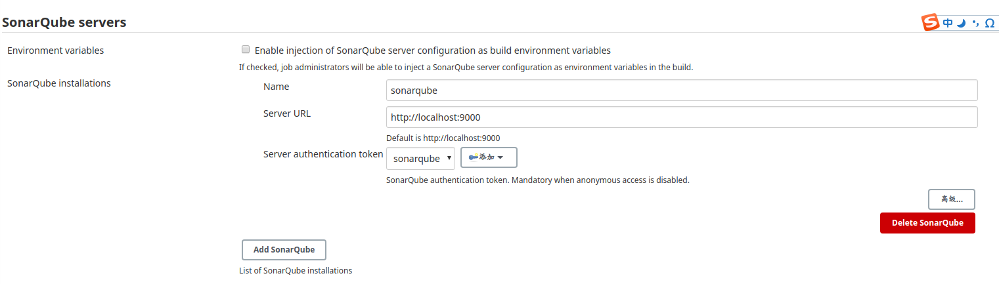
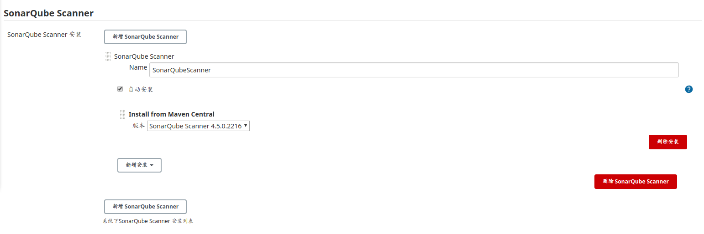

SonarQube是管理代码质量-个开放平台，可以快速的定位代码中潜在的或者明显的错误。

## 1.简介
### 1.sonar是什么
Sonar是一个用于代码质量管理的开源平台，用于管理代码的质量，通过插件形式可以支持工二十几种语言的代码质量检测，通过多个维度的检查了快速定位代码中潜在的或者明显的错误。
### 2.Sonar与SonarQube&SonarScanner
- SonarQube是sonar的服务端，相当于-个web服务器中的tomcat，用来发布应用，在线浏览分析等。
- SonarScanner是sonar的客户端,用于扫描相关的代码
### 3.地址
- 下载地址: https://www.sonarqube.org/downloads/
- 文档: https://docs.sonarqube.org

### 4.命令
- 启动sonar: `sh sonar.sh start` 非容器化部署sonar时,切记不使用root用户启动(es不支持root用户)

### 5.插件
- 汉化插件: Chinese Pack

### 6.初始密码
- admin
- admin

## 2. docker部署sonarqube

**tips**: sonarqube内有es服务 大约需要3G以上内存，将服务放在云服务器等配置较弱的地方将无法使用!

### 1. 启动失败的解决方案:
1. 虚拟内存不足
  - docker logs 提示:
  - `WARN  app[][o.s.a.p.AbstractManagedProcess] Process exited with exit value [es]: 78`
  - `[1]: max virtual memory areas vm.max_map_count [65530] is too low, increase to at least [262144]`
  - 解决方法:
  - 在宿主机: `sysctl -w vm.max_map_count=262144`
2. 物理内存不足,只能增加硬件无解
  - docker logs 提示:
  - `Process exited with exit value [es]: 1`
  


### 2. sonarqube7.9+
sonarqube7.9以上版本可以按以下配置部署 
```yaml
version: "3"

services:
  sonarqube:
    image: sonarqube:latest
    ports:
      - "9000:9000"
    networks:
      - sonarnet
    environment:
      TZ: Asia/Shanghai
      SONARQUBE_JDBC_USERNAME: sonar
      SONARQUBE_JDBC_PASSWORD: sonar
      SONARQUBE_JDBC_URL: jdbc:postgresql://db:5432/sonar
      
    volumes:
      - sonarqube_conf:/opt/sonarqube/conf
      - sonarqube_data:/opt/sonarqube/data
      - sonarqube_extensions:/opt/sonarqube/extensions
      - sonarqube_bundled-plugins:/opt/sonarqube/lib/bundled-plugins
      - sonarqube_log:/opt/sonarqube/log
    
    depends_on:
      - db

  db:
    image: postgres:11.1
    networks:
      - sonarnet
    environment:
      POSTGRES_USER: sonar
      POSTGRES_PASSWORD: sonar
      TZ: Asia/Shanghai
      POSTGRES_DB: sonar
    volumes:
      - postgresql_data:/var/lib/postgresql/data


networks:
  sonarnet:
    driver: bridge
  

volumes:
  sonarqube_conf:
  sonarqube_data:
  sonarqube_extensions:
  sonarqube_bundled-plugins:
  postgresql_data:
  sonarqube_log:
```

### 3. sonarqube7.9-
sonarqube7.9以上不再支持mysql，故以下配置仅限于7.9版以下
```yaml
version: "3"

services:
  sonarqube:
    image: sonarqube:7.8-community
    ports:
      - "9000:9000"
    networks:
      - sonarnet
    environment:
      - SONARQUBE_JDBC_URL=jdbc:mysql://mysql:3306/sonarqube?useUnicode=true&characterEncoding=utf8&rewriteBatchedStatements=true&useConfigs=maxPerformance
      - SONARQUBE_JDBC_USERNAME=root
      - SONARQUBE_JDBC_PASSWORD=sonar
    volumes:
      - sonarqube_conf:/opt/sonarqube/conf
      - sonarqube_data:/opt/sonarqube/data
      - sonarqube_extensions:/opt/sonarqube/extensions
      - sonarqube_bundled-plugins:/opt/sonarqube/lib/bundled-plugins
      - sonarqube_log:/opt/sonarqube/log
    depends_on:
      - db

  db:
    image: mysql:5.7.16
    networks:
      - sonarnet
    environment:
      - MYSQL_ROOT_PASSWORD=sonar
      - MYSQL_DATABASE=sonarqube
      - TZ=Asia/Shanghai
    volumes:
      - mysql_data:/var/lib/mysql
      - mysql_conf:/etc/mysql/conf.d
    command:
      - --character-set-server=utf8mb4 
      - --collation-server=utf8mb4_unicode_ci

networks:
  sonarnet:
    driver: bridge

volumes:
  sonarqube_conf:
  sonarqube_data:
  sonarqube_extensions:
  sonarqube_bundled-plugins:
  sonarqube_log:
  mysql_data:
  mysql_conf:
```

## 3. SonarScanner

#### 1. docker部署SonarScanner(不推荐)
tips: 采用docker部署SonarScanner 将不便于之后与jenkins进行集成,此处只做学习记录,不推荐采用此方法使用.
- 原因:sonarscanner并非服务只是一个工具,使用完后容器便结束.之后需要继续使用时又需重启甚是不方便
```docker
docker run \
    -e SONAR_HOST_URL="http://{sonarqube的地址及端口}" \
    -v "{源码地址}:/usr/src" \
    sonarsource/sonar-scanner-cli \
    {此处输入使用scanner时的命令行}
```

#### 2. 其他形式部署
1. 下载对应系统安装包解压并配置环境变量 https://docs.sonarqube.org/latest/analysis/scan/sonarscanner/
2. 使用jenkins自动安装(具体方式看下文)

#### 3. 运行
1. 采用配置的方式运行

```conf
#项目的key
sonar.projectKey=itil:change   
#项目的名字(可以随便写，这个名字在sonar显示的)
sonar.projectName=sell
#项目的版本
sonar.projectVersion=1.0
#需要分析的源码的目录
sonar.sources=src/
#这是target(如果没编译可以不写)
sonar.java.binaries=target/classes
#java语言
sonar.language=java
#编码格式
#sonar.sourceEncoding=UTF-8
```
此时直接执行文件即可`sonar/bin/sonar-scanner`

2. 采用命令行的方式运行(可结合jenkins运行)
```shell
sonar-scanner \
  -Dsonar.projectKey=apiautotest \
  -Dsonar.sources=. \
  -Dsonar.host.url=http://sonarqube:9000 \
  -Dsonar.login=0e2b47bf616b617a4403a632a06d4c2b58bb882f
```


## 4. jenkins集成

### 1. jenkins配置sonar
tips:在配置之前需要在jenkins安装
- `SonarQube Scanner for Jenkins`插件
- `Sonar Quality Gates Plugin`插件

1. SonarQube的Token获取
- 配置-权限-用户-token(令牌)-创建

2. Jenkins_上配置SonarQube服务端

- 系统管理->系统设置->sonarQube
  1. Name可以随意填写(需要记住之后搭建pipeline时需要使用)
  2. URL添加SonarQube的地址(若在localhost:9000则不用填**注意此处必须填写正确否则后续请求sonarQualityGate将会报错**)
  3. Server authentication token添加一个Secret text填写之前安装SonarQube的Token(若不会添加凭证请看jenkins章节)


3. Jenkins上配置Sonar-Scanner工具路径

- 系统管理->全局工具配置
  1. Name可以随意填写(需要记住之后搭建pipeline时需要使用)
  2. 选择自动安装的版本即可


### 2. jenkins pipeline集成sonar
- 声明式pipeline(推荐使用)

tips: `withCredentials`是用于取jenkins内保存的凭证,避免明文显示
```groovy
pipeline{
    agent any
    environment{
        sonarqubeScannerHome = tool 'SonarQubeScanner'
    }
    stages{
        stage('SonarQube analysis') {
            steps{
                withSonarQubeEnv('sonarqube') { //进入sonarqube环境
                    withCredentials([string(credentialsId: 'sonarqube', variable: 'token')]) { //使用凭证
                        sh "${sonarqubeScannerHome}/bin/sonar-scanner -Dsonar.projectKey=jenkins -Dsonar.sources=${WORKSPACE}/code/  -Dsonar.host.url=http://172.16.16.84:9000  -Dsonar.login=${token}"
                    }
                }
            }
        }
        stage("Quality Gate") {            
            steps{                  
                timeout(time: 1, unit: 'HOURS') {// 超时时间1小时                 
                    waitForQualityGate abortPipeline: true  // 等待 SonarQube 返回的分析结果。当 abortPipeline=true，表示质量不合格，将 pipeline 状态设置为 UNSTABLE。                
                }            
            }    
        }
    }
}
```

- 脚本式pipeline

```groovy
node {
  stage('SonarQube analysis') {
      def sonarqubeScannerHome = tool name: 'SonarQubeScanner'
      withSonarQubeEnv(credentialsId: 'sonarqube') {
          sh "${sonarqubeScannerHome}/bin/sonar-scanner -Dsonar.projectKey=jenkins -Dsonar.sources=${WORKSPACE}/code/  -Dsonar.host.url=http://172.16.16.84:9000  -Dsonar.login=97b6dc2a453a6afc8b53131def414af7d5a67e9e"
      }
  }
  stage("Quality Gate"){
    timeout(time: 1, unit: 'HOURS') { // Just in case something goes wrong, pipeline will be killed after a timeout
      def qg = waitForQualityGate() // Reuse taskId previously collected by withSonarQubeEnv
      if (qg.status != 'OK') {
        error "Pipeline aborted due to quality gate failure: ${qg.status}"
      }
    }
  }
}
```

### 3. sonarqube-webhook
1. sonarqube-webhook会在扫描完代码后发出,可以集成钉钉,微信等机器人进行实时结果通知
2. 与jenkins集成,building job 将结果通知jenkins 通过sonar结果决定job的状态
   1. 进入sonarqube服务端
   2. 进入相关项目
   3. 项目配置  
   4. webhook(网络调用)
   5. URL:`http://jenkins的地址:port/sonarqube-webhook/`(path不可改变)

以下为webhook发出模板
```json
{
  "serverUrl": "http://localhost:9000",
  "taskId": "AXUmf-Ff8rinFbYa7XUZ",
  "status": "SUCCESS",
  "analysedAt": "2020-10-14T17:45:10+0800",
  "changedAt": "2020-10-14T17:45:10+0800",
  "project": {
    "key": "jenkins",
    "name": "jenkins",
    "url": "http://localhost:9000/dashboard?id=jenkins"
  },
  "branch": {
    "name": "master",
    "type": "BRANCH",
    "isMain": true,
    "url": "http://localhost:9000/dashboard?id=jenkins"
  },
  "qualityGate": {
    "name": "Sonar way",
    "status": "OK",
    "conditions": [
      {
        "metric": "new_reliability_rating",
        "operator": "GREATER_THAN",
        "value": "1",
        "status": "OK",
        "errorThreshold": "1"
      },
      {
        "metric": "new_security_rating",
        "operator": "GREATER_THAN",
        "value": "1",
        "status": "OK",
        "errorThreshold": "1"
      },
      {
        "metric": "new_maintainability_rating",
        "operator": "GREATER_THAN",
        "value": "1",
        "status": "OK",
        "errorThreshold": "1"
      },
      {
        "metric": "new_coverage",
        "operator": "LESS_THAN",
        "value": "0.0",
        "status": "OK",
        "errorThreshold": "80"
      },
      {
        "metric": "new_duplicated_lines_density",
        "operator": "GREATER_THAN",
        "value": "0.0",
        "status": "OK",
        "errorThreshold": "3"
      },
      {
        "metric": "new_security_hotspots_reviewed",
        "operator": "LESS_THAN",
        "status": "NO_VALUE",
        "errorThreshold": "100"
      }
    ]
  },
  "properties": {}
}
```